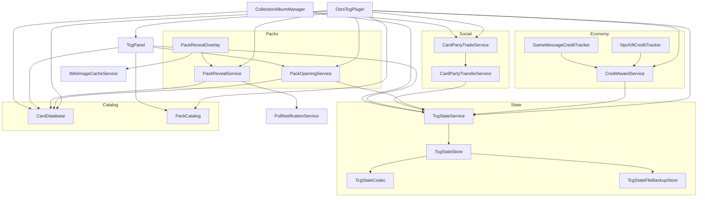
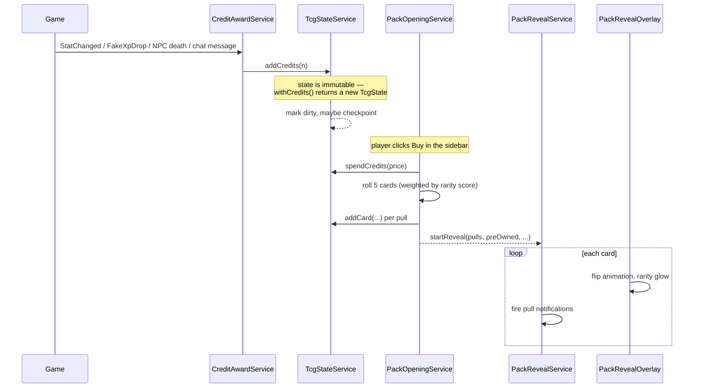

# Architecture Overview

> **Scope:** How the whole plugin fits together — packages, layering, the dependency graph, the threading model, and the two main gameplay loops.
> **Key packages:** all of `com.osrstcg`
> **Related:** [Plugin Lifecycle](02-plugin-lifecycle.md) · [State Model](05-state-model.md) · [Persistence](06-persistence-and-saves.md)

## What this plugin is

OSRS TCG is a RuneLite plugin that layers a trading-card minigame on top of Old School RuneScape. The player earns a soft currency called **credits** by doing ordinary things in game — gaining XP, killing NPCs, completing content that emits recognisable chat messages. Credits buy **booster packs**. Opening a pack runs a weighted random roll against a catalog of 6,376 cards, plays an animated reveal overlay, and adds the results to a persistent **collection**. Players can browse that collection in a detached album window, trade cards peer-to-peer over the RuneLite party system, and optionally publish the collection to a web album.

Nothing about this is server-authoritative. The plugin is entirely client-side: the card catalog ships in the JAR, the rolls happen locally in `java.util.Random`, and the collection is stored in the player's own RuneLite profile config and on their own disk. The only network egress is optional and opt-in — see [External Services](14-external-services.md). This matters for how you reason about trading, which is a trust-based protocol between two clients with no referee.

The codebase is 26,322 lines of Java 11 across 102 main source files, plus 596 lines across 3 test files and a 2.8 MB card catalog resource. It targets the RuneLite Plugin Hub (`build=standard`).

## Layering

The package structure is a clean layered design, and the layers really are respected — dependencies point downward almost everywhere.

```
┌──────────────────────────────────────────────────────────────┐
│ OsrsTcgPlugin · OsrsTcgConfig            entry point + config │
├──────────────────────────────────────────────────────────────┤
│ ui/ · overlay/                    presentation (Swing + AWT)  │
├──────────────────────────────────────────────────────────────┤
│ service/                          game logic + orchestration  │
├──────────────────────────────────────────────────────────────┤
│ persist/ · party/                 I/O boundaries (disk, net)  │
├──────────────────────────────────────────────────────────────┤
│ model/                            immutable domain state      │
├──────────────────────────────────────────────────────────────┤
│ data/ · resources/                static catalog content      │
└──────────────────────────────────────────────────────────────┘
                    util/  ── pure helpers, used by every layer
```

| Package | Files | Role |
|---|---|---|
| *(root)* | 2 | `OsrsTcgPlugin` (lifecycle, events, chat commands) and `OsrsTcgConfig` (the `osrstcg` config group). |
| `data` | 6 | Loads and indexes the static catalog from `Card.json` / `Packs.json`. Read-only after startup. |
| `model` | 15 | Immutable domain types. `TcgState` is the root; everything else hangs off it. No behaviour beyond validation and copy-on-write builders. |
| `persist` | 12 | Serialisation, encoding, hashing, schema migration, and the three-tier save system (profile config, `tcg.save`, snapshots). |
| `service` | 28 | Where the game actually lives — credits, rolling, reveal sequencing, trading, notifications, external sync. |
| `party` | 13 | Wire DTOs for the RuneLite party websocket. Pure data, no logic. |
| `overlay` | 3 | In-game canvas rendering: the pack reveal and the credits infobox. |
| `ui` | 14 | Swing: the sidebar panel, the album window, the trade window, the save picker. |
| `util` | 9 | Stateless helpers — formatting, NPC id sets, clamping, HTML escaping. |

## The dependency graph

Every service is a Guice `@Singleton` using **constructor injection**. RuneLite's Guice module builds them lazily; the plugin class itself uses field injection because RuneLite instantiates `Plugin` subclasses reflectively.



Two structural facts are worth internalising before you change anything:

**`TcgStateService` is the hub.** Seventeen other classes reference it and it depends only on `TcgStateStore`. It is the single mutation point for player progress — credits, collection, tuning, and the save triggers. If you are adding a feature that changes player state, it goes through this class, not around it. See [State Model](05-state-model.md) and [Persistence](06-persistence-and-saves.md).

**Three dependency cycles are broken with `Provider<T>`.** `NpcKillCreditTracker` and `GameMessageCreditTracker` both need `TcgPanel` to trigger a refresh, while `TcgPanel` transitively needs the credit services; likewise `TcgPanel` ↔ `CollectionAlbumManager` and the trade window's back-reference. Rather than restructure, these inject `javax.inject.Provider<TcgPanel>` / `Provider<CollectionAlbumManager>` / `Provider<TradeWindowManager>` and resolve lazily at call time. If you add an injection that Guice rejects with a circular-dependency error, this is the established escape hatch — but prefer moving the shared logic down a layer first.

A third convention worth copying: services that use randomness expose a package-private constructor taking a `Random`, with the `@Inject` public constructor delegating to it with `new Random()`. `PackOpeningService` does this at [PackOpeningService.java:44](../src/main/java/com/osrstcg/service/PackOpeningService.java#L44). That is the seam that makes the roll logic deterministically testable.

## The threading model

This is the single easiest thing to get wrong in this codebase, because four different execution contexts are in play and they are not interchangeable.

| Context | What runs there | How you get onto it |
|---|---|---|
| **Client thread** | All `@Subscribe` event handlers, overlay `render()`, anything touching `Client` or game widgets. | `clientThread.invoke()` / `invokeLater()` |
| **Swing EDT** | Everything in `ui/` — the sidebar, album, trade window, dialogs. | `SwingUtilities.invokeLater()` |
| **Scheduled executor** | Network I/O: collection upload, webhooks, wiki image fetches, the `!tcg` broadcast. | `scheduledExecutorService.execute()` |
| **Websocket thread** | Inbound party message delivery before it is dispatched to the event bus. | RuneLite's `WSClient` |

The rules that follow from this:

- **Never block the client thread on I/O.** Every outbound HTTP call in the plugin is dispatched to the scheduled executor. `OsrsTcgPlugin.submitTcgPublicStatsChatCommand` at [OsrsTcgPlugin.java:960](../src/main/java/com/osrstcg/OsrsTcgPlugin.java#L960) is the canonical example — it hands the broadcast to the executor and calls `chatInput.resume()` in a `finally` so the chat input is never left hung.
- **Never touch Swing from the client thread**, and never touch `Client` from the EDT. The plugin bridges in both directions; `collectionShareService.setStatusListener(() -> SwingUtilities.invokeLater(tcgPanel::updateWebShareLiveIndicator))` at [OsrsTcgPlugin.java:244](../src/main/java/com/osrstcg/OsrsTcgPlugin.java#L244) shows the shape.
- **Render paths must not allocate or block.** `PackRevealOverlay.render()` runs every frame. Image loading is asynchronous with placeholder fallback — see [Pack Reveal & Rendering](09-pack-reveal-and-rendering.md).

## The two gameplay loops

### Loop 1 — earn, buy, open, collect



The important subtlety: **the collection is mutated at roll time, not at reveal time.** By the time the animation starts, the cards are already yours. The reveal is presentation only. That is why closing the client mid-reveal does not lose the pull, and why `preOwned` is snapshotted *before* the roll at [OsrsTcgPlugin.java:724](../src/main/java/com/osrstcg/OsrsTcgPlugin.java#L724) — it is the only way to still know which cards were new once the animation runs.

### Loop 2 — peer-to-peer trading

Trading rides RuneLite's party websocket. Twelve message types are registered at startup ([OsrsTcgPlugin.java:228-239](../src/main/java/com/osrstcg/OsrsTcgPlugin.java#L228)) and unregistered on shutdown. There is no server-side validation of any kind: each client applies its own collection mutation on commit. See [Party & Trading](12-party-and-trading.md) for the handshake, the state machine, and an honest account of the trust model.

## Static content

The catalog is generated from OSRS Wiki data and shipped as resources, not fetched at runtime.

- **`Card.json`** — 2.8 MB, 6,376 entries. Two distinct entry shapes share one array: **items** (carrying `value`, `tradeable`, `equipable`, `equipmentSlot`) and **monsters** (carrying `level`, `maxHit`, `attackStyle`). Every entry has `name`, `category`, `imageUrl`, and `examine`. Note there is **no rarity field** — rarity is *derived* at load time from item value and monster combat level by `RarityMath`. See [Packs & Rarity](08-packs-and-rarity.md).
- **`Packs.json`** — currently a single `standard` pack at 2,500 credits.
- Card art is **not** bundled. `imageUrl` points at the OSRS Wiki and images are fetched and cached on demand by `WikiImageCacheService`.

## Gotchas & invariants

These are the whole-system rules. Each subsystem doc has its own local list.

- **All player state mutates through `TcgStateService`.** Do not reach past it into `TcgStateStore` or mutate a `TcgState` in place — the model types are immutable by design and the service owns the dirty-tracking and save triggers.
- **`TcgState` is immutable; `withX()` returns a new instance.** A common mistake is calling `state.withCredits(n)` and discarding the result. The old instance is unchanged.
- **The catalog must load before state.** `cardDatabase.load()` and `packCatalog.load()` run first in `startUp()` ([OsrsTcgPlugin.java:198](../src/main/java/com/osrstcg/OsrsTcgPlugin.java#L198)) because state deserialisation resolves card names against the catalog.
- **Cards are granted at roll time, not reveal time.** Anything that assumes the reveal is the point of acquisition is wrong.
- **Never do network or disk I/O on the client thread**, and never touch Swing from it. See the threading table above.
- **The `osrstcg` config group holds both user settings and the serialised state blob.** Any `onConfigChanged` handler must filter by key, or every checkpoint write will re-enter it.
- **Debug mode taints a save.** A profile saved with debug logging on is reset on next load ([OsrsTcgPlugin.java:451](../src/main/java/com/osrstcg/OsrsTcgPlugin.java#L451)). This is deliberate, and it surprises people.

## Where to start reading

If you are new to the codebase, this order will save you time:

1. [Plugin Lifecycle](02-plugin-lifecycle.md) — the entry point and event wiring.
2. [State Model](05-state-model.md) — the immutable state types and, importantly, the card identity model.
3. [Persistence](06-persistence-and-saves.md) — how state survives a restart. Read this before touching anything that writes.
4. Then whichever subsystem you are actually here for.

If you are here to add a **card or a pack**, you only need [Card Catalog & Data](04-card-catalog-and-data.md). If you are here to change **drop rates**, you only need [Packs & Rarity](08-packs-and-rarity.md).
