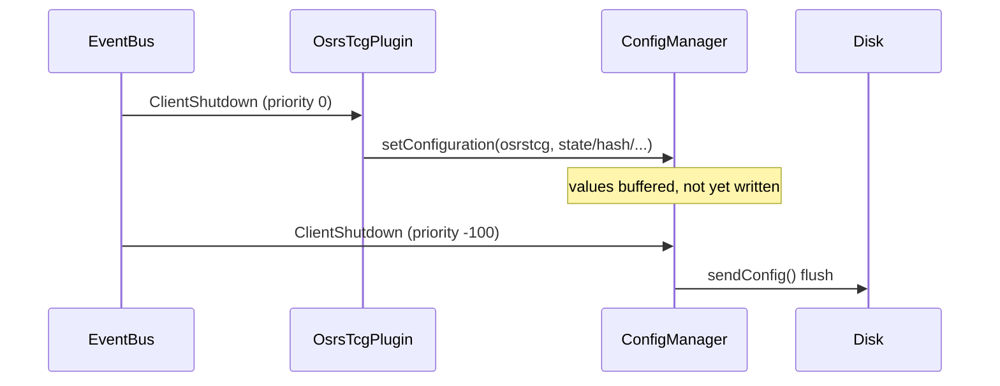

# Plugin Lifecycle

> **Scope:** `OsrsTcgPlugin` — the RuneLite entry point: dependency injection, `startUp()`/`shutDown()` ordering, every `@Subscribe` handler, the `::tcg-*` and `!tcg` chat commands, and profile switching.
> **Key packages:** `com.osrstcg`
> **Related:** [Configuration](03-configuration.md)

## Purpose

`OsrsTcgPlugin` is a thin coordinator. It owns almost no logic of its own: its job is to
build the object graph via Guice, wire RuneLite's framework services (overlays, input
listeners, the party websocket, the chat command manager) to plugin collaborators in a
specific order, and then forward client events to whichever service actually implements
the behaviour. Roughly 300 of its 997 lines are `startUp`/`shutDown`/`@Subscribe` plumbing;
the remaining 700 are the developer chat commands, which live here because they need
cross-cutting access to almost every service at once.

Two things make the lifecycle non-trivial and worth reading carefully. First, **load order
matters**: the card catalog must be in memory before persisted state is deserialised,
because state validation and the debug-taint reset path both inspect card definitions.
Second, **there are three independent save paths** (logout, plugin unload, client
shutdown), and only two of them go through `shutDown()`. The client-shutdown path is a
documented race against RuneLite's own `ConfigManager` and is the single most fragile
ordering constraint in the file.

The plugin is declared with `@PluginDescriptor(name = "OSRS TCG")` at
[OsrsTcgPlugin.java:106-109](../src/main/java/com/osrstcg/OsrsTcgPlugin.java#L106-L109).
Distribution metadata (plugin-hub id, version `0.17.4`, entry class) lives in
[runelite-plugin.properties](../runelite-plugin.properties); the Gradle build targets Java
11 release bytecode against `net.runelite:client:latest.release` as a `compileOnly`
dependency ([build.gradle:22](../build.gradle#L22),
[build.gradle:37](../build.gradle#L37)).

## Class reference

| Class | Lines | Responsibility |
|---|---|---|
| [`OsrsTcgPlugin`](../src/main/java/com/osrstcg/OsrsTcgPlugin.java) | ~997 | Plugin entry point; DI root, event routing, chat commands |
| [`OsrsTcgConfig`](../src/main/java/com/osrstcg/OsrsTcgConfig.java) | ~338 | Config interface bound by `provideConfig` — see [Configuration](03-configuration.md) |
| [`TcgPluginGameMessages`](../src/main/java/com/osrstcg/util/TcgPluginGameMessages.java) | ~237 | Static chat-markup builder; holds the mutable `PREFIX_COLOR` the plugin pushes into it |

## Dependency injection

RuneLite's `Plugin` base class is itself a Guice `Module`, so the plugin participates in
the injector twice: as a consumer (its `@Inject` fields are populated when the plugin
instance is created) and as a provider (`@Provides` methods on the plugin class become
bindings visible to every other class in the plugin's injector).

The single binding this plugin contributes is the config proxy
([OsrsTcgPlugin.java:992-996](../src/main/java/com/osrstcg/OsrsTcgPlugin.java#L992-L996)):

```java
@Provides
OsrsTcgConfig provideConfig(ConfigManager configManager)
{
    return configManager.getConfig(OsrsTcgConfig.class);
}
```

`ConfigManager.getConfig` returns a dynamic proxy over the `OsrsTcgConfig` interface. Every
call to a config getter is a live read against `ConfigManager`, not a cached snapshot —
this is why most of the codebase can simply hold an `OsrsTcgConfig` field and re-read it on
every frame or every event without any invalidation logic. Ten classes take that binding
directly (see the "Consumed by" column in [Configuration](03-configuration.md)).

### The `@Inject` field set

There are 37 injected fields
([OsrsTcgPlugin.java:115-190](../src/main/java/com/osrstcg/OsrsTcgPlugin.java#L115-L190)).
They fall into four groups:

| Group | Fields |
|---|---|
| RuneLite framework | `Client`, `ClientThread`, `ChatMessageManager`, `EventBus`, `OverlayManager`, `MouseManager`, `KeyManager`, `ClientToolbar`, `PartyService`, `WSClient`, `ChatCommandManager`, `ScheduledExecutorService` |
| Config | `OsrsTcgConfig` |
| Data / state | `TcgStateService`, `CardDatabase`, `PackCatalog` |
| Plugin services | `CreditAwardService`, `PackOpeningService`, `PackRevealService`, `PackRevealSoundService`, `NpcKillCreditTracker`, `GameMessageCreditTracker`, `CardPartyTransferService`, `CardPartyTradeService`, `TcgPublicStatsCalculator`, `TcgChatStatsShareService`, `TcgPartyAnnouncer`, `PlayerCombatMonitor`, `PackSafeModeService`, `CollectionShareService`, `OwnedCardNamesApiService` |
| UI / overlay | `TcgPanel`, `CollectionAlbumManager`, `TradeWindowManager`, `SaveRestoreManager`, `PackRevealOverlay`, `CreditsInfoboxOverlay`, `PackRevealInputListener` |

Nothing here is constructed with `new`. Services are `@Singleton` and are instantiated
lazily by Guice when the plugin instance is built, which means **service constructors run
before `startUp()`**. Constructors must therefore not assume the card database is loaded.

Two DI details are worth knowing before you add a dependency:

- **`Provider<T>` is used to break constructor cycles.** `TcgStateService` depends on
  `ShopNotificationService` (to fire "you can afford a pack" chat), and
  `ShopNotificationService` depends back on `TcgStateService` (to read
  `isDebugLogging()` for pack visibility, at
  [ShopNotificationService.java:46](../src/main/java/com/osrstcg/service/ShopNotificationService.java#L46)).
  Guice cannot resolve that eagerly, so `TcgStateService` takes
  `Provider<ShopNotificationService>` and `Provider<OsrsTcgConfig>` instead
  ([TcgStateService.java:42-55](../src/main/java/com/osrstcg/service/TcgStateService.java#L42-L55)).
  If you introduce a cycle, this is the fix that matches the existing style.
- **`@Named("developerMode")` is a RuneLite binding, not a plugin one.**
  `TcgStateService` injects it at
  [TcgStateService.java:52](../src/main/java/com/osrstcg/service/TcgStateService.java#L52)
  and uses it to decide whether a debug-tainted save is preserved or wiped (see
  [Profile switching](#profile-switching-and-the-debug-tainted-save-reset) below).

## `startUp()` ordering

`startUp()` ([OsrsTcgPlugin.java:195-249](../src/main/java/com/osrstcg/OsrsTcgPlugin.java#L195-L249))
is a strict sequence, and several steps are order-dependent. Read it as four phases.

### Phase 1 — data, then state (lines 198-207)

```java
cardDatabase.load();
packCatalog.load();
TcgStateLoadResult loadResult = stateService.load();
applyLoadedProfileState(loadResult);
announceLoadResult(loadResult);
```

`cardDatabase.load()` and `packCatalog.load()` **must** precede `stateService.load()`.
`TcgStateService.load()` ([TcgStateService.java:77-129](../src/main/java/com/osrstcg/service/TcgStateService.java#L77-L129))
does more than deserialise: on the same call it may reset a debug-tainted save
(`resetAll()`, line 89), strip debug-provenance rows from the collection
(`stripDebugProvenanceRowsIfDebugDisabled()`, line 103), apply schema upgrades, and write
the validated result straight back to the RSProfile
(`writeValidatedLoadToConfig()`, line 125). Those mutations are persisted immediately. If
the card catalog were empty at that point, a state-validation pass would be operating
against an empty card universe and the corrective write would persist the damage.

The logging at lines 203-207 is also a useful smoke test: if `cardDefinitions=0` appears in
the client log, the catalog load silently failed and everything downstream will misbehave.

### Phase 2 — UI surfaces (lines 208-219)

The sidebar navigation button is built with a 16×16 icon drawn at runtime by
`buildPanelIcon()` ([OsrsTcgPlugin.java:978-990](../src/main/java/com/osrstcg/OsrsTcgPlugin.java#L978-L990))
rather than loaded from resources, and registered at `priority(5)`. Then two overlays are
added and `PackRevealInputListener` is registered three times — once each with
`MouseManager` as a mouse listener, with `MouseManager` as a mouse-wheel listener, and with
`KeyManager` as a key listener
([OsrsTcgPlugin.java:217-219](../src/main/java/com/osrstcg/OsrsTcgPlugin.java#L217-L219)).
That is not redundancy: the class implements all three interfaces
([PackRevealInputListener.java:15](../src/main/java/com/osrstcg/overlay/PackRevealInputListener.java#L15)),
and each manager keeps its own registry. **All three must be unregistered in `shutDown()`
or the listener leaks.**

### Phase 3 — event and message subscriptions (lines 220-241)

Seven collaborators are registered on the `EventBus` so their own `@Subscribe` methods
start firing:

| Registered service | Events it subscribes to |
|---|---|
| `CreditAwardService` | `GameTick` ([CreditAwardService.java:297](../src/main/java/com/osrstcg/service/CreditAwardService.java#L297)) |
| `NpcKillCreditTracker` | `InteractingChanged`, `HitsplatApplied`, `ActorDeath`, `GameTick` |
| `GameMessageCreditTracker` | `ChatMessage` |
| `CardPartyTransferService` | `GameTick`, `TcgCardGiftPartyMessage`, `TcgCardGiftResponsePartyMessage` |
| `CardPartyTradeService` | `GameTick` + the six `TcgTrade*PartyMessage` types |
| `PlayerCombatMonitor` | `GameTick`, `InteractingChanged`, `HitsplatApplied` |
| `PackSafeModeService` | `InteractingChanged`, `HitsplatApplied`, `GameTick` |

`creditAwardService.onPluginStarted()` is called immediately after its registration
([OsrsTcgPlugin.java:221](../src/main/java/com/osrstcg/OsrsTcgPlugin.java#L221)). This is
required because the plugin can be enabled mid-session: `onPluginStarted()` reads the
current `GameState` and, if the client is sitting on the login screen, arms the
"suppress credit awards until stats settle" latch
([CreditAwardService.java:233-247](../src/main/java/com/osrstcg/service/CreditAwardService.java#L233-L247)).
Without it, the service would never see the `GameStateChanged` that normally sets that up.

Then twelve party message classes are registered with `WSClient`
([OsrsTcgPlugin.java:228-239](../src/main/java/com/osrstcg/OsrsTcgPlugin.java#L228-L239)).
`WSClient.registerMessage` teaches the party websocket how to deserialise a subclass of
RuneLite's party message envelope; **an unregistered type arriving on the wire is dropped,
and a registered type with no `@Subscribe` handler is silently ignored.** The twelve are:

| Message class | Handled by |
|---|---|
| `TcgPullPartyMessage` | `OsrsTcgPlugin.onTcgPullPartyMessage` |
| `TcgCollectionSetCompletePartyMessage` | `OsrsTcgPlugin.onTcgCollectionSetCompletePartyMessage` |
| `TcgCardGiftPartyMessage` | `CardPartyTransferService` |
| `TcgCardGiftResponsePartyMessage` | `CardPartyTransferService` |
| `TcgChatStatsPartyMessage` | `OsrsTcgPlugin.onTcgChatStatsPartyMessage` → `TcgChatStatsShareService` |
| `TcgTradeInvitePartyMessage` | `CardPartyTradeService` |
| `TcgTradeInviteAckPartyMessage` | `CardPartyTradeService` |
| `TcgTradeInviteResponsePartyMessage` | `CardPartyTradeService` |
| `TcgTradeOfferDeltaPartyMessage` | `CardPartyTradeService` |
| `TcgTradeReadyPartyMessage` | `CardPartyTradeService` |
| `TcgTradeCancelPartyMessage` | `CardPartyTradeService` |
| `TcgTradeCommitPartyMessage` | `CardPartyTradeService` |

Note the ordering dependency: the trade/transfer services are `eventBus.register`ed at
lines 224-225, *before* their message types are registered with `WSClient` at lines
230-239. That direction is the safe one — a handler with no messages yet is harmless,
whereas the reverse could in principle deliver a message to nobody.

Finally the public `!tcg` chat command is registered
([OsrsTcgPlugin.java:240-241](../src/main/java/com/osrstcg/OsrsTcgPlugin.java#L240-L241)) —
see [Chat commands](#chat-commands).

### Phase 4 — panel, callbacks, first paint (lines 242-248)

```java
tcgPanel.start();
stateService.setRewardTuningFlushBeforeCredits(tcgPanel::flushRewardTuningDraftToState);
collectionShareService.setStatusListener(() -> SwingUtilities.invokeLater(tcgPanel::updateWebShareLiveIndicator));
collectionShareService.start();
ownedCardNamesApiService.start();
tcgPanel.refresh();
TcgPluginGameMessages.setPrefixColor(config.chatPrefixColor());
```

`tcgPanel.start()` re-runs `cardDatabase.load()`/`packCatalog.load()` defensively and, when
the client is *not* in RuneLite developer mode, force-clears the persisted debug flag
([TcgPanel.java:303-313](../src/main/java/com/osrstcg/ui/TcgPanel.java#L303-L313)).

The `setRewardTuningFlushBeforeCredits` callback is the mechanism that stops in-flight
sidebar edits from being lost: every save path in `TcgStateService`
(`saveMasterOnly`, `saveCheckpoint`, `saveFullCheckpoint`) calls
`flushRewardTuningDraftBeforeLocking()` first, which invokes this callback so the panel's
uncommitted reward-tuning draft is folded into state before serialisation
([TcgStateService.java:329](../src/main/java/com/osrstcg/service/TcgStateService.java#L329),
[TcgStateService.java:342](../src/main/java/com/osrstcg/service/TcgStateService.java#L342),
[TcgStateService.java:356](../src/main/java/com/osrstcg/service/TcgStateService.java#L356)).
It is a hard reference from a singleton service to a Swing panel, which is exactly why
`shutDown()` nulls it back out.

`collectionShareService.start()` schedules a keepalive on the shared
`ScheduledExecutorService` and picks an initial indicator state from `webShareEnabled` /
API-key presence ([CollectionShareService.java:120-149](../src/main/java/com/osrstcg/service/CollectionShareService.java#L120-L149)).
`ownedCardNamesApiService.start()` registers *itself* on the event bus
([OwnedCardNamesApiService.java:48-56](../src/main/java/com/osrstcg/service/OwnedCardNamesApiService.java#L48-L56)) —
it is the one collaborator the plugin does not register directly, so do not add a
duplicate `eventBus.register` for it.

`setPrefixColor` is last because it is a pure static assignment into
`TcgPluginGameMessages.PREFIX_COLOR`
([TcgPluginGameMessages.java:41-44](../src/main/java/com/osrstcg/util/TcgPluginGameMessages.java#L41-L44))
with no dependencies. Note the consequence: **the chat prefix colour is global static
state**, so it is shared by every instance and must be re-pushed on every `startUp()` and
on every relevant `ConfigChanged`.

## `shutDown()`

`shutDown()` ([OsrsTcgPlugin.java:251-301](../src/main/java/com/osrstcg/OsrsTcgPlugin.java#L251-L301))
is the mirror image with one deliberate exception: **persistence happens first, not last.**

```java
creditAwardService.flushSkillBaselineForPersist();
stateService.saveFullCheckpoint(TcgSaveTrigger.PLUGIN_UNLOAD);
```

`flushSkillBaselineForPersist()` snapshots live skill XP and the uncredited-XP pool into
`TcgState` ([CreditAwardService.java:118-122](../src/main/java/com/osrstcg/service/CreditAwardService.java#L118-L122)).
That must run *before* the checkpoint, because the checkpoint serialises whatever is in
`TcgState` at that instant. `saveFullCheckpoint` writes all three destinations — `tcg.save`,
a hash snapshot, and the RSProfile config keys
([TcgStateService.java:351-363](../src/main/java/com/osrstcg/service/TcgStateService.java#L351-L363)).

Only after both writes complete does teardown proceed, in this order: navigation button →
`eventBus.unregister` ×7 → `playerCombatMonitor.reset()` →
`wsClient.unregisterMessage` ×12 → `chatCommandManager.unregisterCommand("!tcg")` →
`npcKillCreditTracker.shutdown()` → overlays → the three input-listener unregistrations →
`packRevealSoundService.hardStop()` → `packRevealService.reset()` → window managers
(`collectionAlbumManager`, `tradeWindowManager`, `saveRestoreManager`) → callback nulling →
share services stopped → `tcgPanel.stop()`.

The callback-nulling pair at
[OsrsTcgPlugin.java:295-296](../src/main/java/com/osrstcg/OsrsTcgPlugin.java#L295-L296)
matters for hot-reload: `TcgStateService` and `CollectionShareService` are singletons that
outlive a plugin restart in some RuneLite setups, and leaving them holding lambdas that
capture the old `TcgPanel` would keep a dead Swing tree alive and fire callbacks against
detached components.

### What is *not* symmetric

| `startUp()` step | `shutDown()` counterpart | Note |
|---|---|---|
| `cardDatabase.load()` / `packCatalog.load()` | *none* | Catalogs stay resident; they are immutable after load |
| `creditAwardService.onPluginStarted()` | `creditAwardService.flushSkillBaselineForPersist()` | Different concerns, not a pair |
| — | `npcKillCreditTracker.shutdown()` | Only `shutDown()` has this; there is no matching startup call |
| — | `playerCombatMonitor.reset()` | Clears combat latch so a re-enable does not inherit stale "in combat" |
| — | `packRevealSoundService.hardStop()` | Audio lines must be closed explicitly or they keep playing after unload |

## Event subscriptions

Every `@Subscribe` on the plugin class, what it does, and where the work actually happens.

| Event | What the plugin does | Delegates to |
|---|---|---|
| `ClientShutdown` [:303](../src/main/java/com/osrstcg/OsrsTcgPlugin.java#L303) | Synchronous full checkpoint with trigger `CLIENT_SHUTDOWN` | `TcgStateService.saveFullCheckpoint` |
| `StatChanged` [:311](../src/main/java/com/osrstcg/OsrsTcgPlugin.java#L311) | Forward, then repaint sidebar | `CreditAwardService.onStatChanged`, `TcgPanel.refresh` |
| `FakeXpDrop` [:318](../src/main/java/com/osrstcg/OsrsTcgPlugin.java#L318) | Forward, then repaint sidebar | `CreditAwardService.onFakeXpDrop`, `TcgPanel.refresh` |
| `GameStateChanged` [:325](../src/main/java/com/osrstcg/OsrsTcgPlugin.java#L325) | Forward; on `LOGIN_SCREEN` clear the once-per-session load guard, full-checkpoint with `LOGOUT`, notify share service; on `LOGGED_IN` kick a web-share sync | `CreditAwardService`, `TcgStateService`, `CollectionShareService` |
| `ConfigChanged` [:347](../src/main/java/com/osrstcg/OsrsTcgPlugin.java#L347) | Filter to group `osrstcg`, then react to exactly three keys | `CollectionShareService.onConfigChanged`, `TcgPanel.updateWebShareLiveIndicator`, `TcgPluginGameMessages.setPrefixColor` |
| `TcgPullPartyMessage` [:365](../src/main/java/com/osrstcg/OsrsTcgPlugin.java#L365) | Gate on `partyAnnounceMythicPulls`, drop own echo, resolve display name + rarity colour, queue chat line | `CardDatabase.chatRarityColorForCardName`, `TcgPluginGameMessages` |
| `TcgCollectionSetCompletePartyMessage` [:399](../src/main/java/com/osrstcg/OsrsTcgPlugin.java#L399) | Same gating, queues `"<who> just finished <collection>!"` | `TcgPluginGameMessages.queuePrefixedGameMessage` |
| `TcgChatStatsPartyMessage` [:428](../src/main/java/com/osrstcg/OsrsTcgPlugin.java#L428) | Null-check and hand off — **no config gate** | `TcgChatStatsShareService.ingestPartyMessage` |
| `RuneScapeProfileChanged` [:438](../src/main/java/com/osrstcg/OsrsTcgPlugin.java#L438) | Reload state for the new profile, apply, announce, resync web share | `TcgStateService.load`, `CollectionShareService` |
| `CommandExecuted` [:519](../src/main/java/com/osrstcg/OsrsTcgPlugin.java#L519) | Dispatch table for the eight `::tcg-*` commands | many; see below |
| `OverlayMenuClicked` [:673](../src/main/java/com/osrstcg/OsrsTcgPlugin.java#L673) | If the click was the credits infobox "Open" entry, match the menu target back to a booster and open it | `PackCatalog.getVisibleBoosters`, `PackOpeningService` |

Both party-pull handlers self-filter using `partyService.getLocalMember()`
([OsrsTcgPlugin.java:381-385](../src/main/java/com/osrstcg/OsrsTcgPlugin.java#L381-L385)):
RuneLite's party service echoes your own broadcasts back to you, so without this check you
would see "You just added…" from the local notification path *and* "<yourname> just
added…" from the party path.

`onOverlayMenuClicked` reverse-maps a menu target string to a booster by comparing against
`CreditsInfoboxOverlay.packMenuTarget(booster)`
([CreditsInfoboxOverlay.java:93](../src/main/java/com/osrstcg/overlay/CreditsInfoboxOverlay.java#L93)),
the same function the overlay used to build the entry at
[CreditsInfoboxOverlay.java:115](../src/main/java/com/osrstcg/overlay/CreditsInfoboxOverlay.java#L115).
The identity check `event.getOverlay() != creditsInfoboxOverlay` at line 676 is what keeps
this from firing on other plugins' overlay menus.

## The `ClientShutdown` priority race

This is the most important ordering constraint in the file, and the comment at
[OsrsTcgPlugin.java:305-309](../src/main/java/com/osrstcg/OsrsTcgPlugin.java#L305-L309)
records why:

```java
@Subscribe
public void onClientShutdown(ClientShutdown event)
{
    // Must write RSProfile keys synchronously before ConfigManager's ClientShutdown
    // handler (priority -100) runs sendConfig(); an async Future finishes too late.
    stateService.saveFullCheckpoint(TcgSaveTrigger.CLIENT_SHUTDOWN);
}
```

The mechanics: RuneLite's `ConfigManager` does not write every `setConfiguration` call
straight to disk. Writes accumulate in a pending map and are flushed by `sendConfig()`.
`ConfigManager` subscribes to `ClientShutdown` at **priority −100** so that its flush runs
after every other subscriber has had a chance to record final values. RuneLite's `EventBus`
dispatches subscribers in descending priority order, so this plugin's handler — at the
default priority of 0 — is guaranteed to run *before* `ConfigManager`'s.

The plugin's write path is `saveFullCheckpoint` → `TcgStateStore` →
`configManager.setConfiguration(GROUP, key, value)`
([TcgStateStore.java:395](../src/main/java/com/osrstcg/persist/TcgStateStore.java#L395)),
targeting the `osrstcg` group keys `state`, `hash`, `stateBackup`, `hashBackup` and
`stateWrittenAt` ([TcgStateStore.java:17-22](../src/main/java/com/osrstcg/persist/TcgStateStore.java#L17-L22)).
Those calls land in the pending map, and `ConfigManager`'s −100 handler then flushes them.

The failure mode the comment guards against: `ClientShutdown` also exposes a
`waitFor(Future)` mechanism for subscribers that need asynchronous work. If this handler
handed the save to an executor and registered a future, the JVM would wait for it — but
`ConfigManager`'s flush is not ordered against that future, only against the *dispatch*.
The flush would already have run against an empty pending map, and the profile keys would
be lost. **Keep this handler synchronous. Do not move `saveFullCheckpoint` onto
`scheduledExecutorService`, and do not add a `@Subscribe(priority = ...)` below −100.**



Note also that `shutDown()` is *not* a substitute. On a normal client exit RuneLite is not
guaranteed to unload plugins before the JVM stops, so `ClientShutdown` is the only reliable
hook. Conversely, disabling the plugin from the settings panel fires `shutDown()` but never
`ClientShutdown`. Both paths are needed, which is why both call `saveFullCheckpoint` with
different `TcgSaveTrigger` values.

## Chat commands

### `::tcg-*` developer commands

RuneLite posts a `CommandExecuted` event for any chat line beginning with `::`. The plugin
filters in two steps at
[OsrsTcgPlugin.java:526-530](../src/main/java/com/osrstcg/OsrsTcgPlugin.java#L526-L530):

```java
if (cmd == null || cmd.length() < 4 || !cmd.regionMatches(true, 0, "tcg", 0, 3))
{
    return;
}
```

The `length() < 4` check means a bare `::tcg` is ignored — every real command has a
`-suffix`. Matching is case-insensitive throughout (`regionMatches(true, …)` plus
`equalsIgnoreCase` on each branch).

Four commands are gated on `stateService.isDebugLogging()`, which is the **Overview tab
debug checkbox persisted in `TcgState`**, not the `debugMessages` config item. The two are
genuinely different switches — see
[TcgStateService.java:424-439](../src/main/java/com/osrstcg/service/TcgStateService.java#L424-L439),
where `isDebugLogging()` reads state and `isDebugChatEnabled()` reads config. Gated
commands reject with `"That command requires Overview debug mode."`.

| Command | Arguments | Debug? | Behaviour |
|---|---|---|---|
| `::tcg-set` [:532](../src/main/java/com/osrstcg/OsrsTcgPlugin.java#L532) | `<amount>` (long, ≥ 0) | yes | Sets credits to an absolute value by diffing against current and calling `addCredits`/`spendCredits` ([:889-897](../src/main/java/com/osrstcg/OsrsTcgPlugin.java#L889-L897)). Arguments are joined with `String.join("")`, so `1 000 000` also parses. Rejects negatives and unparseable input |
| `::tcg-give` [:551](../src/main/java/com/osrstcg/OsrsTcgPlugin.java#L551) | `<card name>` optionally `(foil)` | yes | Joins args with spaces, strips a trailing `(foil)` via `TCG_GIVE_FOIL_SUFFIX` (`(?i)\s*\(foil\)\s*$`, [:113](../src/main/java/com/osrstcg/OsrsTcgPlugin.java#L113)), resolves the name case-insensitively against `CardDatabase`, adds 1 with debug provenance |
| `::tcg-apex` [:564](../src/main/java/com/osrstcg/OsrsTcgPlugin.java#L564) | none | yes | `handleOpenFirstBoosterCommand(true)` → `PackOpeningService.buyAndOpenApexPackForDebug` on the first visible booster |
| `::tcg-complete` [:577](../src/main/java/com/osrstcg/OsrsTcgPlugin.java#L577) | none | yes | Reloads `Card.json`, adds 1× of every catalog card with debug provenance, then diffs owned-before/after through `CollectionSetCompletionUtil.newlyCompletedPrimaryCategories` and party-announces each newly finished set ([:783-791](../src/main/java/com/osrstcg/OsrsTcgPlugin.java#L783-L791)) |
| `::tcg-reset` [:545](../src/main/java/com/osrstcg/OsrsTcgPlugin.java#L545) | none | **no** | `TcgPanel.performCollectionReset()` — wipes state, resets the reveal, rebaselines XP credit, jumps to the Welcome tab ([TcgPanel.java:368-378](../src/main/java/com/osrstcg/ui/TcgPanel.java#L368-L378)) |
| `::tcg-open` [:590](../src/main/java/com/osrstcg/OsrsTcgPlugin.java#L590) | none | **no** | `handleOpenFirstBoosterCommand(false)` — normal paid purchase of the first visible booster |
| `::tcg-load` [:596](../src/main/java/com/osrstcg/OsrsTcgPlugin.java#L596) | none | **no** | Opens the Swing save picker; restore is once-per-session (below) |
| `::tcg-save` [:602](../src/main/java/com/osrstcg/OsrsTcgPlugin.java#L602) | none | **no** | Flushes the reward-tuning draft, then `saveCheckpoint(MANUAL)` (hash snapshot + RSProfile, **no** `tcg.save`) and reports credits/card counts |

`::tcg-reset` being ungated is deliberate — it is the user-facing reset — but it is
destructive and takes no confirmation on this path (the sidebar button version prompts via
`JOptionPane` at [TcgPanel.java:352-357](../src/main/java/com/osrstcg/ui/TcgPanel.java#L352-L357)).

Both pack-opening commands funnel into `openBooster`
([OsrsTcgPlugin.java:710-748](../src/main/java/com/osrstcg/OsrsTcgPlugin.java#L710-L748)),
which refuses to start while a reveal is already active, freezes the sidebar to avoid
spoiling the reveal, snapshots the pre-owned key set so "new card" can be computed, and
shows the scroll-wheel hint only when `openedPacks == 0`
([:725](../src/main/java/com/osrstcg/OsrsTcgPlugin.java#L725)). On failure it must undo the
sidebar freeze — that `clearPackRevealSidebarFreeze()` at line 731 is easy to drop when
adding a new early-return.

### The public `!tcg` command

Registered through `ChatCommandManager.registerCommandAsync` with a lookup and a submit
callback ([OsrsTcgPlugin.java:240-241](../src/main/java/com/osrstcg/OsrsTcgPlugin.java#L240-L241)).
The two halves do different jobs:

**Submit** (`submitTcgPublicStatsChatCommand`,
[:946-976](../src/main/java/com/osrstcg/OsrsTcgPlugin.java#L946-L976)) runs when *you* type
`!tcg`. It computes live stats via `TcgPublicStatsCalculator.computeLive()`, caches them
under your sanitised display name in `TcgChatStatsShareService`, then hands the party
broadcast to `scheduledExecutorService` and returns `true`. The `finally { chatInput.resume(); }`
is mandatory — `registerCommandAsync` holds your chat line until `resume()` is called, so an
uncaught exception without that `finally` would wedge the chatbox.

**Lookup** (`lookupTcgPublicStatsChatCommand`,
[:909-944](../src/main/java/com/osrstcg/OsrsTcgPlugin.java#L909-L944)) runs when *anyone's*
`!tcg` message is rendered. It resolves the author (special-casing `PRIVATECHATOUT`, where
`chatMessage.getName()` is the recipient rather than you), looks up cached stats, and — only
if a cache entry exists — rewrites the message node via `setRuneLiteFormatMessage` +
`client.refreshChat()`. Players whose stats you have never received leave their `!tcg`
unchanged.

The cache is populated from two directions: locally by submit, and remotely by
`onTcgChatStatsPartyMessage` → `TcgChatStatsShareService.ingestPartyMessage`
([:428-436](../src/main/java/com/osrstcg/OsrsTcgPlugin.java#L428-L436)). **You will only see
another player's `!tcg` expand if you share a RuneLite party with them.**

## Profile switching and the debug-tainted-save reset

`onRuneScapeProfileChanged` ([:438-445](../src/main/java/com/osrstcg/OsrsTcgPlugin.java#L438-L445))
runs the same three-step sequence as `startUp()` phase 1, minus the catalog loads:
`stateService.load()` → `applyLoadedProfileState()` → `announceLoadResult()`, then a
web-share resync. RuneLite fires this whenever the active RSProfile changes, including on
login when the profile becomes known — so this is the handler that loads the *right*
account's collection, not `startUp()`.

`applyLoadedProfileState` ([:447-465](../src/main/java/com/osrstcg/OsrsTcgPlugin.java#L447-L465))
always calls `creditAwardService.resetExperienceCreditBaseline()` first. That clears the
in-memory XP tracking and restores the uncredited-XP pool from the newly loaded profile
([CreditAwardService.java:80-95](../src/main/java/com/osrstcg/service/CreditAwardService.java#L80-L95)).
Skipping it would credit the new account for the previous account's XP delta.

The branch that follows handles the **debug-tainted save reset**. The rule lives in
`TcgStateService.shouldResetDebugTaintedSave()`
([TcgStateService.java:843-846](../src/main/java/com/osrstcg/service/TcgStateService.java#L843-L846)):

```java
return state.isDebugLogging() && !runeliteDeveloperMode;
```

A save written while Overview debug mode was on is only trustworthy if the client is
*currently* running with `--developer-mode`. Otherwise `load()` wipes collection and economy
via `resetAll()` and flags `debugResetOnLoad` on the result
([TcgStateService.java:86-96](../src/main/java/com/osrstcg/service/TcgStateService.java#L86-L96)).
The plugin reacts by tearing down any live reveal, unfreezing the sidebar, resyncing the
reward draft, resetting the session UI, and telling the player exactly what happened:
`"This profile was saved with debug mode on; collection and credits were reset."`

There is a softer sibling: even when the save is kept, `stripDebugProvenanceRowsIfDebugDisabled()`
([TcgStateService.java:851-865](../src/main/java/com/osrstcg/service/TcgStateService.java#L851-L865))
removes individual cards tagged with debug provenance whenever debug mode is off, and
persists that mutation immediately with `saveMasterOnly(COLLECTION_CHANGE)`.

`announceLoadResult` ([:467-497](../src/main/java/com/osrstcg/OsrsTcgPlugin.java#L467-L497))
maps `TcgStateLoadResult` onto chat lines. The interesting cases are the fallback chain
implemented in `TcgStateStore.load()`
([TcgStateStore.java:44-80](../src/main/java/com/osrstcg/persist/TcgStateStore.java#L44-L80)):
RSProfile config → `tcg.save` → newest hash snapshot. Each rung has its own message, and
`isAllBackupsFailed()` short-circuits with `"Could not restore progress from any save."`.
The plain success message is suppressed unless the game state is `LOGGED_IN`
([:499-506](../src/main/java/com/osrstcg/OsrsTcgPlugin.java#L499-L506)), so you do not get a
"Collection successfully loaded" line while sitting on the login screen.

## The once-per-session `::tcg-load` guard

`fileBackupLoadUsedThisSession` ([:193](../src/main/java/com/osrstcg/OsrsTcgPlugin.java#L193))
is a plain `boolean` field with exactly three touch points:

| Location | Operation |
|---|---|
| [:332](../src/main/java/com/osrstcg/OsrsTcgPlugin.java#L332) | Cleared on `GameState.LOGIN_SCREEN` — "session" means *login* session, not client session |
| [:628-633](../src/main/java/com/osrstcg/OsrsTcgPlugin.java#L628-L633) | Checked before opening the picker |
| [:642-656](../src/main/java/com/osrstcg/OsrsTcgPlugin.java#L642-L656) | Re-checked *and* set inside the client-thread callback |

The double check is not redundant. `handleLoadDiskSaveCommand` opens a Swing dialog
(`SaveRestoreManager.showPicker` bounces onto the EDT at
[SaveRestoreManager.java:29-31](../src/main/java/com/osrstcg/ui/save/SaveRestoreManager.java#L29-L31)),
so an arbitrary amount of wall-clock time passes between the guard test and the restore.
The player could type `::tcg-load` twice and end up with two open pickers. The second check
runs inside `clientThread.invoke(...)`, which serialises both callbacks onto the client
thread, so only the first one wins.

The flag is set *after* `restoreFromDiskFile` succeeds
([:649-656](../src/main/java/com/osrstcg/OsrsTcgPlugin.java#L649-L656)) — a failed restore
does not burn the session's one attempt.

Restore then does three things in order that you should not reorder:

```java
creditAwardService.rebaseExperienceCreditBaselineToCurrentStats();
stateService.saveCheckpoint(TcgSaveTrigger.LOAD);
packRevealService.reset();
```

The rebase is the subtle one. A disk save carries the *source account's* skill XP
baselines. If those were kept, the delta between them and the current account's live XP
would be paid out as credits on the next `StatChanged`. `applyRestoredDiskState` already
nulls the baseline (`SkillCreditBaseline.absent()` at
[TcgStateService.java:264](../src/main/java/com/osrstcg/service/TcgStateService.java#L264)),
and `rebaseExperienceCreditBaselineToCurrentStats` then snapshots the live stats into it
([CreditAwardService.java:103-115](../src/main/java/com/osrstcg/service/CreditAwardService.java#L103-L115)).

## Data flow

The plugin-enable path, end to end:

```
RuneLite PluginManager
  └─ Guice builds OsrsTcgPlugin
       ├─ provideConfig(ConfigManager) → OsrsTcgConfig proxy
       └─ 37 @Inject fields resolved (singletons constructed here)
  └─ startUp()
       ├─ cardDatabase.load(); packCatalog.load()          ← must be first
       ├─ stateService.load()                              ← may reset / strip / re-persist
       │    └─ TcgStateStore.load(): RSProfile → tcg.save → snapshot
       ├─ applyLoadedProfileState(result)
       │    ├─ creditAwardService.resetExperienceCreditBaseline()
       │    └─ debugResetOnLoad ? [reset reveal + UI + chat warning] : [sync draft + refresh]
       ├─ announceLoadResult(result) → chat lines per load source
       ├─ clientToolbar + 2 overlays + 3 input listener registrations
       ├─ eventBus.register ×7   (+ creditAwardService.onPluginStarted())
       ├─ wsClient.registerMessage ×12
       ├─ chatCommandManager.registerCommandAsync("!tcg", lookup, submit)
       ├─ tcgPanel.start(); wire flush + status callbacks
       ├─ collectionShareService.start(); ownedCardNamesApiService.start()
       └─ TcgPluginGameMessages.setPrefixColor(config.chatPrefixColor())
```

Once running, the plugin is event-driven. `StatChanged`/`FakeXpDrop` drive credits;
`GameStateChanged` drives persistence and web-share lifecycle; party messages drive chat
announcements and trading; `CommandExecuted` drives the developer commands.

## Threading

This file touches four execution contexts and marshals between them explicitly.

| Context | What runs there |
|---|---|
| **Client thread** | All `@Subscribe` handlers. `client.addChatMessage` calls inside command handlers are already on it. `queueGameMessage` ([:508-517](../src/main/java/com/osrstcg/OsrsTcgPlugin.java#L508-L517)) wraps in `clientThread.invokeLater` because it is also reachable from the `startUp()` path. `applyRestoredDiskSave` wraps its whole body in `clientThread.invoke` because it is invoked from a Swing dialog callback |
| **Swing EDT** | `TcgPanel`, `CollectionAlbumManager`, `TradeWindowManager`, `SaveRestoreManager`. The share-service status listener explicitly hops with `SwingUtilities.invokeLater` ([:244](../src/main/java/com/osrstcg/OsrsTcgPlugin.java#L244)) because `CollectionShareService` publishes status from its scheduler |
| **Scheduled executor** | `CollectionShareService` keepalive and sync pipeline; the `!tcg` party broadcast ([:960-974](../src/main/java/com/osrstcg/OsrsTcgPlugin.java#L960-L974)) |
| **Websocket** | Inbound party messages are decoded by `WSClient` and posted to the `EventBus`, which redelivers them on the client thread — so the party `@Subscribe` methods here are client-thread code |

`TcgPanel.refresh()` is safe to call from anywhere: it self-detects and re-queues if it is
not on the EDT ([TcgPanel.java:391-394](../src/main/java/com/osrstcg/ui/TcgPanel.java#L391-L394)).
That is why the plugin sprinkles bare `tcgPanel.refresh()` calls through client-thread
handlers without ceremony.

`TcgStateService` mutating methods are `synchronized` on the service instance, and `state`
is `volatile` ([TcgStateService.java:45](../src/main/java/com/osrstcg/service/TcgStateService.java#L45)),
so reads from the executor threads see a consistent `TcgState` reference — the state object
itself is treated as immutable and replaced wholesale (`state = state.withX(...)`).

## Gotchas & invariants

- **Never make `onClientShutdown` asynchronous.** See
  [the priority race](#the-clientshutdown-priority-race). The whole persistence guarantee
  for a normal client exit rests on that handler being synchronous and at default priority.
- **`onClientShutdown` does *not* flush skill baselines, but `shutDown()` does.** Compare
  [:254-256](../src/main/java/com/osrstcg/OsrsTcgPlugin.java#L254-L256) with
  [:303-309](../src/main/java/com/osrstcg/OsrsTcgPlugin.java#L303-L309). `saveFullCheckpoint`
  flushes the reward-tuning draft internally
  ([TcgStateService.java:356](../src/main/java/com/osrstcg/service/TcgStateService.java#L356))
  but has no equivalent hook for `CreditAwardService`. Baselines are normally written on
  the `LOGIN_SCREEN` transition
  ([CreditAwardService.java:269](../src/main/java/com/osrstcg/service/CreditAwardService.java#L269));
  if you close the client while logged in, no such transition occurs, so the checkpointed
  baseline can be older than the live one.
- **`isDebugLogging()` ≠ `debugMessages()`.** The first is persisted plugin state driving
  the four gated commands, apex packs, and pack visibility; the second is a config item
  driving verbose chat only. `TcgStateService` deliberately exposes both under distinct
  names ([TcgStateService.java:424-439](../src/main/java/com/osrstcg/service/TcgStateService.java#L424-L439)).
- **`ConfigChanged` fires for this plugin's own persistence writes.** `TcgStateStore` writes
  its state blobs into the same `osrstcg` config group
  ([TcgStateStore.java:17-22](../src/main/java/com/osrstcg/persist/TcgStateStore.java#L17-L22)).
  `onConfigChanged` only reacts to three keys, so today that is harmless — but any handler
  that reacts to the *group* rather than a specific key would fire on every save and can
  easily recurse.
- **`TcgPluginGameMessages.PREFIX_COLOR` is mutable global state**
  ([TcgPluginGameMessages.java:20](../src/main/java/com/osrstcg/util/TcgPluginGameMessages.java#L20)).
  It is never reset in `shutDown()`, so a disabled plugin leaves the last colour set.
- **All three `PackRevealInputListener` registrations must be undone.** Missing one leaves a
  listener attached to a live `MouseManager`/`KeyManager` after unload.
- **Registering a new party message type is a four-place change:** `wsClient.registerMessage`
  in `startUp`, `wsClient.unregisterMessage` in `shutDown`, a `@Subscribe` handler somewhere,
  and `eventBus.register` for whatever class owns that handler.
- **`::tcg-give` matches only exact names.** The resolver uses
  `n.trim().equalsIgnoreCase(cardQuery)` ([:836](../src/main/java/com/osrstcg/OsrsTcgPlugin.java#L836)),
  not a prefix or fuzzy match, so any typo yields
  `No card named "<x>" in Card.json.`
- **`::tcg-save` and `shutDown()` write different things.** `saveCheckpoint` writes a hash
  snapshot plus RSProfile; `saveFullCheckpoint` additionally writes `tcg.save`
  ([TcgStateService.java:337-363](../src/main/java/com/osrstcg/service/TcgStateService.java#L337-L363)).
  Do not treat `::tcg-save` as equivalent to a clean shutdown.
- **`TcgPanel` injects `OsrsTcgConfig` but never reads it.** The field is assigned at
  [TcgPanel.java:233](../src/main/java/com/osrstcg/ui/TcgPanel.java#L233) and has no call
  sites; it is dead weight rather than a bug, but do not assume the panel is config-reactive.

### Open questions

- Which thread RuneLite's `PluginManager` uses to invoke `startUp()`/`shutDown()` could not
  be confirmed from this repository (`net.runelite:client` is a `compileOnly` dependency
  and its source is not vendored). The plugin code is defensive either way: `TcgPanel.refresh()`
  self-marshals to the EDT and `queueGameMessage` self-marshals to the client thread. If you
  add work to `startUp()` that touches Swing or the client directly, wrap it rather than
  relying on an assumed context.
