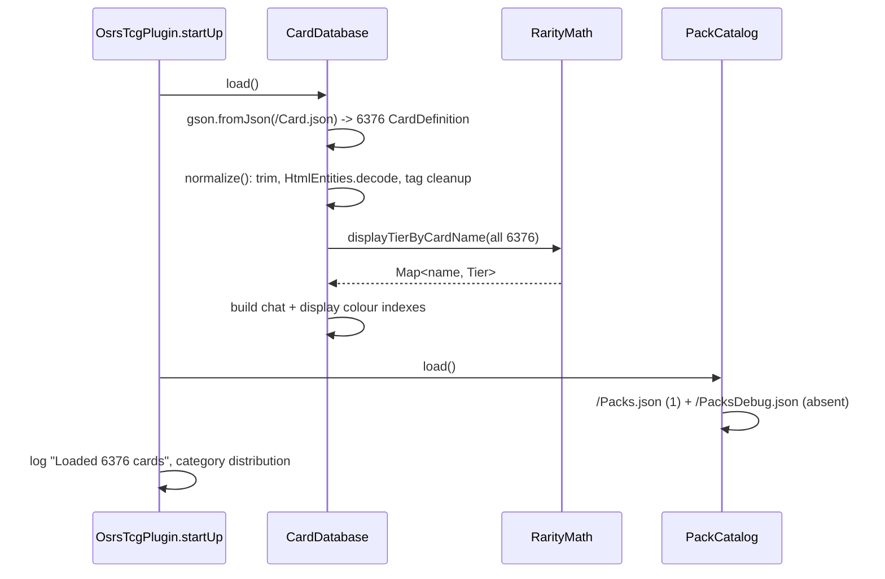

# Card Catalog & Static Data

> **Scope:** the read-only content layer — `Card.json`, `Packs.json`, the classes that parse
> and index them, and the rules a contributor must follow to add a card or a booster pack.
> **Key packages:** `com.osrstcg.data`
> **Related:** [State Model](05-state-model.md)

## Purpose

Everything the plugin can ever award you is defined in two JSON files bundled on the plugin
classpath: `src/main/resources/Card.json` (6,376 card definitions) and
`src/main/resources/Packs.json` (1 booster pack definition). Neither file is downloaded, patched,
or user-editable at runtime — they ship inside the jar, are read once per client session, and are
held immutably for the rest of the session. This makes the catalog the one part of the system with
no concurrency story to worry about after startup, and the one part that changes only via a
release.

Two singletons own that data. [`CardDatabase`](../src/main/java/com/osrstcg/data/CardDatabase.java)
parses `Card.json` into `CardDefinition` objects, normalizes them, and precomputes a name → display
colour index. [`PackCatalog`](../src/main/java/com/osrstcg/data/PackCatalog.java) parses
`Packs.json` (plus an optional `PacksDebug.json`) into `BoosterPackDefinition` objects and gates
which of them the UI is allowed to show. Both are `@Singleton` and both expose an idempotent
`load()` that services call defensively rather than relying on startup ordering.

The thing to internalise before reading further: **rarity is not a field in `Card.json`.** There is
no `"rarity": "Legendary"` anywhere in the data. A card's tier is derived at runtime from its GE
`value`, its combat `level`, and its primary category by
[`RarityMath.displayTierByCardName`](../src/main/java/com/osrstcg/service/RarityMath.java#L272).
That means editing a single card's `value` can shift the tier of *other* cards, because tiers are
assigned by percentile within a category pool. See [Derived rarity](#derived-rarity-there-is-no-rarity-field).

Downstream, the catalog feeds pack rolls
([`PackOpeningService`](../src/main/java/com/osrstcg/service/PackOpeningService.java)), the
collection album, chat colouring, Dink/webhook notifications, and the public `!tcg` stats. The
in-memory record of *what you own* lives in a completely separate object graph documented in
[State Model](05-state-model.md); nothing in `com.osrstcg.data` is mutated by gameplay.

## Class reference

| Class | Lines | Responsibility |
|---|---|---|
| [`CardDefinition`](../src/main/java/com/osrstcg/data/CardDefinition.java) | 43 | Lombok `@Data` POJO for one `Card.json` entry; derives `getPrimaryCategory()` |
| [`CardDatabase`](../src/main/java/com/osrstcg/data/CardDatabase.java) | 259 | Loads/normalizes `Card.json`, name lookup, category counts, precomputed rarity colours |
| [`CategoryTagUtil`](../src/main/java/com/osrstcg/data/CategoryTagUtil.java) | 81 | `&`-compound splitting, case-fold canonical keys, title-cased display labels |
| [`CategoryListTypeAdapter`](../src/main/java/com/osrstcg/data/CategoryListTypeAdapter.java) | 67 | Gson `TypeAdapter` accepting `category` as either a string or an array of strings |
| [`BoosterPackDefinition`](../src/main/java/com/osrstcg/data/BoosterPackDefinition.java) | 98 | Lombok `@Data` POJO for one `Packs.json` entry; owns the card↔pack matching rule |
| [`PackCatalog`](../src/main/java/com/osrstcg/data/PackCatalog.java) | 133 | Loads `Packs.json` + `PacksDebug.json`, applies debug-only visibility gating |

## `Card.json` schema

The file is a top-level JSON array of objects, 2.8 MB, 6,376 entries. It is generated from OSRS
Wiki data outside this repo — there is no generator script in the tree. Gson binds each object to
`CardDefinition`, and **any JSON key without a matching field is silently discarded**. That matters
here, because the real file carries a lot of keys the plugin does not model.

### Fields the plugin reads

| JSON key | Java type | Present in file | Optional? | What it drives |
|---|---|---|---|---|
| `name` | `String` | 6,376 / 6,376 | Required — entry dropped if blank | Primary identity. Every collection key, save row, party trade, and image lookup is keyed on this exact string ([`CardDatabase.normalize`](../src/main/java/com/osrstcg/data/CardDatabase.java#L202)) |
| `category` | `List<String>` via `@JsonAdapter` | 6,376 / 6,376 | Optional — becomes empty list | Element `[0]` becomes the primary category (album grouping + rarity pool); all elements are pack filter tags |
| `imageUrl` | `String` | 6,376 / 6,376 | Optional | Wiki card art, fetched and cached by `WikiImageCacheService` |
| `examine` | `String` | 6,376 / 6,376 | Optional | Flavour text on the card face |
| `value` | `Long` | 5,150 / 6,376 | Optional (`null` for monsters) | `RarityMath.score` base; `0` or `1` force `COMMON` ([`RarityMath.isLowValueTierExempt`](../src/main/java/com/osrstcg/service/RarityMath.java#L151)) |
| `level` | `Integer` | 1,227 / 6,376 | Optional (only monsters) | `level²` (×1.5 for Monster tags) score contribution ([`RarityMath.levelBasedScore`](../src/main/java/com/osrstcg/service/RarityMath.java#L74)) |
| `overrideScore` | `Long` | 15 / 6,376 | Optional | Replaces the level-derived score entirely; final score is `max(value, overrideScore)` ([`RarityMath.score`](../src/main/java/com/osrstcg/service/RarityMath.java#L88)) |
| `questItem` | `Boolean` | 5,151 / 6,376 | Optional | **Read into the POJO but never consulted.** No production code calls `getQuestItem()`. `RollPoolFilter` documents that quest-only rows are excluded at file-build time instead ([`RollPoolFilter.java:6`](../src/main/java/com/osrstcg/service/RollPoolFilter.java#L6)) |

### Fields present in the file but not modelled

These appear in `Card.json` and are dropped on parse. Do not rely on them; equally, do not remove
them from the file expecting a behaviour change.

| JSON key | Entries carrying it | Example |
|---|---|---|
| `tradeable` | 5,149 | `true` |
| `equipable` | 5,149 | `true` |
| `stackable` | 5,149 | `false` |
| `options` | 5,149 | `["Wield", "Drop"]` |
| `noteable` | 5,009 | `true` |
| `equipmentSlot` | 2,208 | `"weapon"` |
| `attackStyle` | 1,126 | `"Ranged, Magic, Stab"` |
| `maxHit` | 1,123 | `"113"` (note: string, not number) |

A representative monster entry:

```json
{
  "name": "JalTok-Jad",
  "level": 900,
  "category": ["Monster"],
  "imageUrl": "https://oldschool.runescape.wiki/images/thumb/JalTok-Jad.png/130px-JalTok-Jad.png",
  "examine": "Large, destructive, enthralling.",
  "attackStyle": "Ranged, Magic, Stab",
  "maxHit": "113"
}
```

A representative item entry, showing the multi-tag category array:

```json
{
  "name": "Abyssal dagger",
  "category": ["Resource", "Weapon", "General", "Wilderness", "Morytania", "Kourend"],
  "imageUrl": "https://oldschool.runescape.wiki/images/thumb/Abyssal_dagger_detail.png/130px-Abyssal_dagger_detail.png",
  "questItem": false,
  "tradeable": true,
  "equipable": true,
  "stackable": false,
  "noteable": true,
  "options": ["Wield", "Drop"],
  "examine": "Something sharp from the body of a defeated Abyssal Sire.",
  "value": 115001,
  "equipmentSlot": "weapon"
}
```

## The real card inventory

Counts below were produced by parsing the shipped `src/main/resources/Card.json` and replaying
`RarityMath.displayTierByCardName` over it. They describe the file as committed; they will drift the
moment the file is regenerated.

### Totals

| Metric | Value |
|---|---|
| Total entries | 6,376 |
| Distinct card names | 6,376 |
| Duplicate names | 0 |
| Blank/unnamed entries (dropped by `normalize`) | 0 |
| Entries with `value` | 5,150 |
| Entries with `level` | 1,227 |
| Entries with `overrideScore` | 15 |
| Entries with `questItem: true` | 0 |
| Entries missing `imageUrl` or `examine` | 0 |
| `value` range | 0 … 15,000,000 |
| `level` range | 0 … 3,000,000 |
| Cards with `value` of 0 or 1 (forced `COMMON`) | 1,020 |

### Breakdown by primary category

`getPrimaryCategory()` reads only `category[0]`. In the shipped file that first element is always
either `Resource` or `Monster`, so despite 36 distinct raw tags there are exactly **two** primary
categories — and therefore exactly two rarity percentile pools.

| Primary category | Cards | Share |
|---|---|---|
| Resource | 5,149 | 80.76% |
| Monster | 1,227 | 19.24% |
| **Total** | **6,376** | |

This is what `CardDatabase.categoryCounts()` returns and what
[`OsrsTcgPlugin.startUp`](../src/main/java/com/osrstcg/OsrsTcgPlugin.java#L207) logs as
"Card category distribution".

### Breakdown by derived rarity tier

| Tier | Cards | Share of catalog | Resource | Monster | Roll chance (`RarityMath.Tier`) |
|---|---|---|---|---|---|
| Common | 2,319 | 36.37% | 2,017 | 302 | 37.34% |
| Uncommon | 1,352 | 21.20% | 1,042 | 310 | 32.00% |
| Rare | 1,361 | 21.35% | 1,054 | 307 | 16.00% |
| Epic | 800 | 12.55% | 616 | 184 | 8.00% |
| Legendary | 234 | 3.67% | 172 | 62 | 4.00% |
| Mythic | 201 | 3.15% | 164 | 37 | 2.00% |
| Godly | 109 | 1.71% | 84 | 25 | 0.66% |

The "roll chance" column is the *marginal tier probability* declared on
[`RarityMath.Tier`](../src/main/java/com/osrstcg/service/RarityMath.java#L17-L23), summing to 100%.
It is deliberately unrelated to the population share: a tier is picked first by that fixed weight,
then a card is picked within the tier. Godly is 1.71% of the catalog but only 0.66% of rolls, so an
individual Godly card is far rarer than its population share suggests.

### Category tag frequency

All 36 distinct raw tags across all positions in the `category` array. Note the case-inconsistent
duplicates (`Asgarnia` / `asgarnia`), which is exactly why `CategoryTagUtil.canonicalKey` exists,
and the two junk tags (`No`, `N/A`) which canonicalise to their literal selves and match no pack.

| Tag | Count | | Tag | Count |
|---|---|---|---|---|
| Resource | 5,149 | | Barrows | 33 |
| Armour | 1,589 | | asgarnia | 22 |
| Monster | 1,227 | | Slayer | 13 |
| Weapon | 619 | | desert | 12 |
| Consumable | 553 | | misthalin | 12 |
| General | 489 | | wilderness | 11 |
| Clue | 482 | | N/A | 11 |
| Morytania | 241 | | morytania | 10 |
| Kourend | 221 | | kandarin | 10 |
| Asgarnia | 208 | | Equipment | 3 |
| Kandarin | 193 | | general | 3 |
| Varlamore | 176 | | kourend | 2 |
| No | 155 | | karamja | 1 |
| Desert | 152 | | fremennik | 1 |
| Misthalin | 151 | | Transmute | 1 |
| Wilderness | 123 | | tirannwn | 1 |
| Fremennik | 119 | | varlamore | 1 |
| Tirannwn | 111 | | | |
| Karamja | 57 | | | |

After `CategoryTagUtil.canonicalKey` folding, those 36 tags collapse to **24 distinct canonical
keys**: `armour`, `asgarnia`, `barrows`, `clue`, `consumable`, `desert`, `equipment`, `fremennik`,
`general`, `kandarin`, `karamja`, `kourend`, `misthalin`, `monster`, `morytania`, `n/a`, `no`,
`resource`, `slayer`, `tirannwn`, `transmute`, `varlamore`, `weapon`, `wilderness`.

Array lengths range from 1 to 13 tags; 2,520 cards carry a single tag, 2,692 carry two, and the
long tail runs out to one card with 13.

## Derived rarity: there is no `rarity` field

Because contributors reliably look for one, it is worth stating the pipeline explicitly.
[`RarityMath.displayTierByCardName`](../src/main/java/com/osrstcg/service/RarityMath.java#L272)
takes the whole card list and:

```
1. group cards by getPrimaryCategory()            -> {Resource: 5149, Monster: 1227}
2. within each group, split out value 0|1 cards   -> forced COMMON, excluded from the pool
3. sort the remainder ascending by score(card)
4. percentile = i / (size - 1); tier = tierForPercentile(percentile)
     >= 0.98 GODLY | >= 0.95 MYTHIC | >= 0.90 LEGENDARY
     >= 0.75 EPIC  | >= 0.50 RARE   | >= 0.25 UNCOMMON | else COMMON
5. unifyTiersForValueAndScoreTies  -> ties on exact `value`, then on round(score), take best tier
6. unifyTiersGloballyByExactCardValue -> across ALL categories, same `value` => best tier seen
7. re-force value 0|1 to COMMON (step 6 can lift them)
```

with

```
score(card)          = overrideScore != null ? max(value, max(0, overrideScore))
                                             : max(value, levelBasedScore(card))
levelBasedScore(card) = level² × (hasTag("monster") ? 1.5 : 1.0)
```

Step 6 is the trap: two cards with the same GE `value` end up on the same tier *even if they are in
different categories*. Adding one high-value Monster can therefore promote an unrelated Resource
that happens to share its exact price.

The 15 `overrideScore` entries are all Slayer masters plus two special cases, used to force a
sensible tier where the wiki `level` is meaningless:

| Card | `level` | `overrideScore` | `value` |
|---|---|---|---|
| Gnome child | 3,000,000 | 3,000,000 | 15,000,000 |
| Duradel / Kuradal | 1,000,000 | 1,000,000 | — |
| Nieve / Steve | 722,500 | 722,500 | — |
| Konar quo Maten | 562,500 | 562,500 | — |
| Cuthbert | 1 | 500,000 | — |
| Chaeldar | 490,000 | 490,000 | — |
| Vannaka | 160,000 | 160,000 | — |
| Mazchna / Achtryn | 40,000 | 40,000 | — |
| Turael / Aya / Spria / Krystilia | 0 | 0 | — |

## `CardDatabase`

### Loading

`load()` is `synchronized` and guarded by a `loaded` flag, so the first caller wins and every later
call is a no-op ([`CardDatabase.java:48`](../src/main/java/com/osrstcg/data/CardDatabase.java#L48)).
That is why `PackOpeningService.buyAndOpenPackInternal`
([line 84](../src/main/java/com/osrstcg/service/PackOpeningService.java#L84)),
`PackRevealService` ([line 226](../src/main/java/com/osrstcg/service/PackRevealService.java#L226))
and `OsrsTcgPlugin.handleCompleteAlbumCommand`
([line 752](../src/main/java/com/osrstcg/OsrsTcgPlugin.java#L752)) can all call `load()` again
without cost — none of them has to trust that `startUp()` already ran.

The resource is read from the classpath as `/Card.json` with an explicit `StandardCharsets.UTF_8`
reader ([line 186](../src/main/java/com/osrstcg/data/CardDatabase.java#L186)). Do not drop that
charset argument: card names contain non-ASCII, and `InputStreamReader`'s default is the platform
encoding, which on a Windows client is not UTF-8.

The injected `Gson` is RuneLite's shared instance, not one this class configures.

### Failure handling

The class never throws to the caller. Three distinct degradations, all ending in an empty catalog:

| Condition | Handling | Location |
|---|---|---|
| `/Card.json` missing from the jar | `log.warn`, return `null` reader, empty list | [line 183](../src/main/java/com/osrstcg/data/CardDatabase.java#L183) |
| `IOException` or `JsonSyntaxException` | `log.warn` with stack trace, empty list | [line 171](../src/main/java/com/osrstcg/data/CardDatabase.java#L171) |
| Gson returns `null` (file is literal `null`) | coerced to empty list | [line 192](../src/main/java/com/osrstcg/data/CardDatabase.java#L192) |

An empty catalog is *not* an error state anywhere downstream — `PackOpeningService` just reports
"No cards in this booster pool." and the album renders empty. If you ship a syntactically broken
`Card.json`, the plugin loads cleanly and silently does nothing. Check the client log for
`Failed reading Card.json from classpath`.

### Per-entry normalization

`normalize()` ([line 195](../src/main/java/com/osrstcg/data/CardDatabase.java#L195)) is the only
place malformed *entries* are handled, as opposed to a malformed *file*:

- `null` objects and blank-`name` objects are **dropped silently** — no log line at all.
- `name` is trimmed then run through
  [`HtmlEntities.decode`](../src/main/java/com/osrstcg/util/HtmlEntities.java), which expands
  `&amp; &lt; &gt; &quot; &apos;` and numeric `&#NN;` / `&#xNN;` references. The shipped file
  contains **zero** HTML entities in `name` or `examine`, so this is purely defensive against a
  future wiki scrape.
- `examine` gets the same trim + decode; `imageUrl` gets a trim only.
- `category` is rebuilt via `normalizeCategoryTags`: `null` becomes an empty `ArrayList`, and
  `null`/blank tags inside the array are stripped. After this, `getCategoryTags()` can never return
  `null`.
- Duplicate names are **counted and logged at `debug` level only** ([line 222](../src/main/java/com/osrstcg/data/CardDatabase.java#L222)) — never deduplicated. Two entries with the same
  `name` both stay in the list, both get rolled, and both collapse onto one `CardCollectionKey` in
  the collection. The shipped file has none; keep it that way.

The list is then wrapped in `Collections.unmodifiableList`, and `getCards()` hands that same
instance out. Callers must not assume they can sort it in place —
[`RarityMath.displayTierByCardName`](../src/main/java/com/osrstcg/service/RarityMath.java#L312) and
`CardDatabase.rebuildChatRarityColorIndex` both defensively copy into a new `ArrayList` first.

### Lookup and indexing

| Method | Cost | Notes |
|---|---|---|
| `getCards()` | O(1) | Returns the shared unmodifiable list |
| `size()` | O(1) | |
| `findByName(String)` | **O(n) linear scan** | Trim + `toLowerCase(Locale.ROOT)` on both sides, per element. There is no name→card map. Do not call this in a render loop |
| `categoryCounts()` | O(n) | `LinkedHashMap` grouping by `getPrimaryCategory()`, blank → `"Unknown"` |
| `chatRarityColorForCardName(String)` | O(1) | Hash lookup on the precomputed index |
| `displayRarityColorsByCardName()` | O(1) | The precomputed map itself |

`findByName` uses `Locale.ROOT` rather than the default locale — that is deliberate and must not be
"simplified" to `toLowerCase()`. Under a Turkish locale, `toLowerCase()` maps `I` to dotless `ı`,
which would break lookups for every card with a capital I on a `tr-TR` client.

### `chatRarityColorForCardName` and the colour index

`rebuildChatRarityColorIndex()` ([line 131](../src/main/java/com/osrstcg/data/CardDatabase.java#L131))
runs once inside `load()` (and again in `setCardsForTesting`). It exists because
`RarityMath.displayTierByCardName` is an O(n log n) pass over all 6,376 cards involving two full
tie-unification sweeps — far too expensive to redo every time chat needs one colour or the album
repaints.

It builds two maps from a single tier computation:

| Map | Key | Value |
|---|---|---|
| `displayRarityColorByCardName` | exact `name` | `tier.getColor()` |
| `chatRarityColorByLowerCaseName` | `name.trim().toLowerCase(ROOT)` | same, **except** `GODLY` → `TcgPluginGameMessages.CHAT_EMPHASIS_GOLD` |

The Godly substitution ([line 152](../src/main/java/com/osrstcg/data/CardDatabase.java#L152)) is
purely cosmetic: `Tier.GODLY`'s own colour is `0xF2C94C`, but in chat a Godly pull should match the
gold of the `OSRS TCG` prefix label rather than sitting a shade off it.

The two maps are keyed differently on purpose. Chat messages arrive with arbitrary user casing, so
that index is case-folded; the album already holds exact `CardDefinition` names, so it uses them
directly and avoids the fold. `chatRarityColorForCardName` returns `Color.WHITE` for a `null`,
blank, or unknown name — it never returns `null`.

## `CategoryTagUtil` and `CategoryListTypeAdapter`

### `CategoryTagUtil`

Three static helpers, no state
([`CategoryTagUtil.java`](../src/main/java/com/osrstcg/data/CategoryTagUtil.java)):

| Method | Behaviour |
|---|---|
| `expandCompoundParts(String)` | Splits on `&`, trims each piece, drops empties. `"Clue & Barrows"` → `["Clue", "Barrows"]` |
| `canonicalKey(String)` | `trim().toLowerCase(Locale.ROOT)`. This is the *only* comparison form — matching is always case-insensitive |
| `toDisplayLabel(String)` | Per whitespace-separated word: upper-case first char, lower-case the rest. `"kebos kourend"` → `"Kebos Kourend"` |

`canonicalKey` is what makes the 36 raw tags behave like 24. The shipped data has `Asgarnia`
(208 cards) and `asgarnia` (22 cards) as separate literal strings; a pack filtering on `"Asgarnia"`
correctly matches all 230 because both sides go through `canonicalKey`.

`expandCompoundParts` gives pack filters an AND: a filter string `"Clue&Barrows"` requires *both*
`clue` and `barrows` among a card's expanded tags. No tag in the shipped `Card.json` contains `&`,
so on the card side the split is currently a no-op — the feature exists for the pack-filter side.

### Why `CategoryListTypeAdapter` exists

This is the question the class name does not answer. Gson maps `List<String>` fine; a custom adapter
is only needed when the JSON is *not consistently* an array.

`CategoryListTypeAdapter.read`
([line 34](../src/main/java/com/osrstcg/data/CategoryListTypeAdapter.java#L34)) handles four token
shapes:

| Incoming token | Result |
|---|---|
| `JsonToken.NULL` | `Collections.emptyList()` |
| `JsonToken.STRING` — `"category": "Monster"` | `Collections.singletonList("Monster")` |
| `JsonToken.BEGIN_ARRAY` — `"category": ["Monster"]` | list of the string elements; **non-string elements inside the array are `skipValue()`d**, not errors |
| anything else (number, object, boolean) | `skipValue()`, `Collections.emptyList()` |

Without the adapter, a bare-string `category` produces
`JsonSyntaxException: Expected BEGIN_ARRAY but was STRING`, which `CardDatabase` catches at
[line 171](../src/main/java/com/osrstcg/data/CardDatabase.java#L171) — dropping the **entire
catalog**, not just the offending card. One hand-edited pack or card entry written as
`"category": "Asgarnia"` would silently empty the whole game. The adapter converts that
whole-file failure into a shrug.

The shape variation is real and lives in git history rather than in the current files. The current
`Packs.json` has one entry with `"category": []`; commit `2af9e70` shipped thirteen regional packs
with single-element arrays such as `"category": ["Asgarnia"]`. Both `CardDefinition.category`
([line 12](../src/main/java/com/osrstcg/data/CardDefinition.java#L12)) and
`BoosterPackDefinition.category`
([line 16](../src/main/java/com/osrstcg/data/BoosterPackDefinition.java#L16)) carry
`@JsonAdapter(CategoryListTypeAdapter.class)`, so both files tolerate either form. Every entry in
the shipped `Card.json` today is an array, so the adapter is currently load-bearing only as
insurance — but that insurance covers a total-failure mode, so leave it.

`write()` always emits an array, so a round-trip normalises a string form to an array form.

## `Packs.json`, `PackCatalog`, `BoosterPackDefinition`

### The file

`src/main/resources/Packs.json` is 149 bytes and defines exactly one pack:

```json
[
  {
    "id": "standard",
    "name": "Standard Pack",
    "category": [],
    "price": 2500,
    "thumbnail": "Pack_Standard_thumbnail.png"
  }
]
```

### `BoosterPackDefinition` fields

| Field | Type | Optional | Drives |
|---|---|---|---|
| `id` | `String` | required in practice | Reveal overlay art path: `/Pack_{TitleCased_id}.png`, e.g. `kebos_kourend` → `Pack_Kebos_Kourend.png`, falling back to `Pack_Standard.png` ([`PackRevealOverlay.java:964`](../src/main/java/com/osrstcg/overlay/PackRevealOverlay.java#L964)). Also carried on `PackOpenResult.boosterPackId` |
| `name` | `String` | optional | Shop button title (falls back to `"Booster"`) and `PackOpenResult.boosterDisplayName` |
| `category` | `List<String>` | optional | Roll-pool filter. **Empty list means universal** — every card matches ([`cardMatchesRegion`](../src/main/java/com/osrstcg/data/BoosterPackDefinition.java#L52)) |
| `price` | `int` (primitive, defaults `0`) | optional in JSON, but `0` is fatal | Credit cost. `PackOpeningService` rejects `price <= 0` with "Invalid pack price." ([line 105](../src/main/java/com/osrstcg/service/PackOpeningService.java#L108)) |
| `thumbnail` | `String` | optional | Classpath resource for the shop tile; falls back to `Pack_Standard_thumbnail.png` ([`TcgPanel.java:1874`](../src/main/java/com/osrstcg/ui/TcgPanel.java#L1876)) |
| `debugOnly` | `boolean` | **never set from JSON** | Visibility gate; set programmatically for every entry loaded from `PacksDebug.json` |

`price` being a primitive `int` rather than `Integer` is the trap: omit it and you get a silent `0`,
and the pack becomes unopenable with a misleading "Invalid pack price." rather than a parse error.

### Pack ↔ card matching

`BoosterPackDefinition.cardMatchesRegion(card, regionFilters)`
([line 45](../src/main/java/com/osrstcg/data/BoosterPackDefinition.java#L45)) is the whole rule:

```
regionFilters empty          -> true (universal pack)
card == null || filters null -> false
otherwise:
  cardPartKeys = { canonicalKey(p) | tag in card.categoryTags, p in expandCompoundParts(tag) }
  match if ANY filter, when expanded on '&', has ALL its canonical parts in cardPartKeys
```

Filters are OR'd against each other; the `&`-parts *within* one filter are AND'd. So
`"category": ["Clue&Barrows", "Wilderness"]` means "(clue AND barrows) OR wilderness".

The current Standard Pack has `"category": []`, so its pool is the entire 6,376-card catalog.

### Loading and the debug gate

`PackCatalog.load()` ([line 35](../src/main/java/com/osrstcg/data/PackCatalog.java#L35)) merges two
classpath resources in order:

1. `/Packs.json` — appended as-is.
2. `/PacksDebug.json` — appended with `setDebugOnly(true)` forced on every entry
   ([line 106](../src/main/java/com/osrstcg/data/PackCatalog.java#L106)).

**`PacksDebug.json` does not exist in this repo.** `src/main/resources/` contains only `Card.json`
and `Packs.json`. `openClasspathReader` deliberately logs a warning only for the missing
`/Packs.json` case ([line 125](../src/main/java/com/osrstcg/data/PackCatalog.java#L125)); a missing
`PacksDebug.json` is silent and expected. So today `getBoosters()` always returns exactly one pack
and no pack is ever `debugOnly`.

`getVisibleBoosters(boolean debugLogging)`
([line 57](../src/main/java/com/osrstcg/data/PackCatalog.java#L57)) filters that merged list:
a pack is visible when `!booster.isDebugOnly() || debugLogging`. The flag it takes is
`stateService.isDebugLogging()` — the **persisted per-profile** debug flag on
[`TcgState`](05-state-model.md#tcgstate-the-immutable-root), not a RuneLite developer-mode flag and
not a log level.

Five call sites pass it, and they must stay consistent or the UI will list a pack the opener
refuses:

| Call site | Purpose |
|---|---|
| [`TcgPanel.java:1809`](../src/main/java/com/osrstcg/ui/TcgPanel.java#L1809) | Which buy buttons to render in the sidebar shop grid |
| [`CollectionAlbumWindow.java:900`](../src/main/java/com/osrstcg/ui/collectionalbum/CollectionAlbumWindow.java#L900) | Pack list inside the album window |
| [`CreditsInfoboxOverlay.java:113`](../src/main/java/com/osrstcg/overlay/CreditsInfoboxOverlay.java#L113) | Right-click "Open" menu entries on the infobox |
| [`ShopNotificationService.java:46`](../src/main/java/com/osrstcg/service/ShopNotificationService.java#L46) | "You can afford a pack" notifications |
| [`OsrsTcgPlugin.java:688`](../src/main/java/com/osrstcg/OsrsTcgPlugin.java#L688), [`:700`](../src/main/java/com/osrstcg/OsrsTcgPlugin.java#L700) | Resolving an overlay menu click, and `::tcg-open` picking `visibleBoosters.get(0)` |

`PackOpeningService` enforces the same gate independently at open time
([line 100](../src/main/java/com/osrstcg/service/PackOpeningService.java#L100)), returning
"Regional packs are only available in debug mode." So the gate is defence-in-depth: hiding the
button is not the security boundary.

Note the ordering consequence — `::tcg-open` opens `visibleBoosters.get(0)`, which is the *first
entry in `Packs.json`*. Reordering that file changes which pack the command opens.

## Data flow



Startup order in [`OsrsTcgPlugin.startUp`](../src/main/java/com/osrstcg/OsrsTcgPlugin.java#L196):
`cardDatabase.load()` → `packCatalog.load()` → `stateService.load()`. The catalog loads *before*
the profile because the saved collection is a list of card **names**; the album needs the catalog
present to resolve them to art, tiers and scores.

At pack-open time
([`PackOpeningService.buyAndOpenPackInternal`](../src/main/java/com/osrstcg/service/PackOpeningService.java#L83)):

1. `cardDatabase.load()` (no-op) → `RollPoolFilter.filterRollPool(cards)`, which currently returns
   the list unchanged ([`RollPoolFilter.java:15`](../src/main/java/com/osrstcg/service/RollPoolFilter.java#L15)).
2. Filter that pool with `BoosterPackDefinition.cardMatchesRegion` against the pack's
   `getCategoryFilters()`.
3. Roll apex: `random.nextInt(3000) == 0` ([line 136](../src/main/java/com/osrstcg/service/PackOpeningService.java#L136)). On a hit, narrow to Legendary/Mythic/Godly and multiply foil chance by `5.0`.
4. Roll `DEFAULT_PACK_SIZE = 5` cards. Tiers come from `displayTierByCardName` over the **full**
   catalog, then a card is picked from the subset of the pack pool in that tier — so a regional
   pack does not re-tier its cards relative to each other.
5. Hand off to `TcgStateService.applyPackOpenTransaction` and return a `PackOpenResult`.

## Threading

| Entry point | Thread | Notes |
|---|---|---|
| `CardDatabase.load()` / `PackCatalog.load()` from `startUp()` | RuneLite client thread | Blocking classpath read + a full `displayTierByCardName` pass over 6,376 cards. Runs once at plugin enable |
| `CardDatabase.load()` from `PackOpeningService` / `PackRevealService` | client thread | No-op after the first call; the `loaded` guard is what keeps this cheap |
| `chatRarityColorForCardName` | client thread (chat message handling) | O(1) hash lookup |
| `displayRarityColorsByCardName()` / `getCards()` | Swing EDT (album, sidebar shop) | Returns shared unmodifiable structures — safe to read, must not be mutated |
| `getVisibleBoosters(...)` | EDT (`TcgPanel`) and client thread (overlay menu, `::tcg-open`) | Genuinely called from both |

Every public method on both singletons is `synchronized` on the instance. The published fields
(`cards`, `boosters`, both colour maps) are only ever *replaced*, never mutated in place, and are
wrapped unmodifiable before publication. Combined with the monitor on every accessor, cross-thread
reads see a consistent snapshot.

The practical rule: **treat everything returned from `com.osrstcg.data` as frozen.** `CardDefinition`
itself is a Lombok `@Data` class with setters, so it is technically mutable — `normalize()` uses
those setters during load. Calling `setName(...)` on a card handed out by `getCards()` after startup
would corrupt the colour indexes, which were built from the old names, with no error.

## How to add a new card

1. Append an object to `src/main/resources/Card.json`. Minimum viable entry:

   ```json
   {
     "name": "Exact card name",
     "category": ["Resource", "Weapon", "Asgarnia"],
     "imageUrl": "https://oldschool.runescape.wiki/images/thumb/Foo_detail.png/130px-Foo_detail.png",
     "examine": "Flavour text.",
     "value": 12345
   }
   ```

2. Make `name` unique and exact. It is the persistence key: it is what lands in a saved profile's
   `cardEntries[].cardName`, what a party trade sends, and what `findByName` matches. Renaming a
   card in a later release orphans every already-owned copy — the save still holds the old string
   and it will no longer resolve to a definition.

3. Choose `category[0]` deliberately. It alone determines `getPrimaryCategory()`, which selects the
   rarity percentile pool. Today only `Resource` and `Monster` appear there; introducing a third
   value creates a **third rarity pool** with its own independent percentile cutoffs, which will
   shift album grouping and set-completion announcements
   ([`CollectionSetCompletionUtil`](../src/main/java/com/osrstcg/service/CollectionSetCompletionUtil.java)).
   Put pack-targeting tags at positions `[1..]`.

4. Set the score inputs:
   - Items: set `value` (GE price). Leave `level` out.
   - Monsters: set `level` and tag `Monster`; `level²×1.5` becomes the score.
   - Neither works (e.g. an NPC with no meaningful level): set `overrideScore`.
   - `value` of `0` or `1` pins the card to `COMMON` and removes it from the percentile pool
     entirely ([`RarityMath.java:151`](../src/main/java/com/osrstcg/service/RarityMath.java#L151)).

5. Understand the blast radius. Tiers are percentiles within a category pool plus a global lift by
   exact `value`, so a new card can retier existing cards — both by shifting percentile positions
   and, via `unifyTiersGloballyByExactCardValue`
   ([line 352](../src/main/java/com/osrstcg/service/RarityMath.java#L352)), by promoting every other
   card that shares its exact `value`. If you are adding a batch, re-check the tier distribution
   table above rather than assuming it held.

6. `imageUrl` should be the wiki `130px-` thumbnail form used by every existing entry (6,374 of
   6,376 follow it). Images are fetched and cached at runtime by `WikiImageCacheService`; a broken
   URL degrades to a placeholder, it does not fail the load.

7. Do **not** add a `rarity` key. It will be discarded.

8. Verify: enable the plugin and check the client log for
   `Loaded <N> cards from Card.json` with `N` incremented, plus the
   `Card category distribution:` line for the expected split.

## How to add a new booster pack

1. Append an object to `src/main/resources/Packs.json`:

   ```json
   {
     "id": "asgarnia",
     "name": "Asgarnia Set",
     "category": ["Asgarnia"],
     "price": 2500,
     "thumbnail": "Pack_Asgarnia_thumbnail.png"
   }
   ```

2. `price` **must** be a positive integer. Omitting it yields `0` and the pack fails to open with
   "Invalid pack price."

3. `category` entries are matched case-insensitively against the card's expanded tag parts, so
   `"Asgarnia"` picks up the 22 lower-case `asgarnia` cards too. Use `&` inside a single filter
   string only when you mean AND. An empty array makes the pack universal.

4. Confirm the pool is non-empty before shipping — a pack whose filters match nothing fails at open
   with "No cards in this booster pool."
   ([`PackOpeningService.java:127`](../src/main/java/com/osrstcg/service/PackOpeningService.java#L129)).
   Cross-check against the tag frequency table above.

5. Add two images to `src/main/resources/`:
   - `Pack_{TitleCased_id}.png` for the reveal overlay — `id` is title-cased per `_` segment, so
     `kebos_kourend` needs `Pack_Kebos_Kourend.png`
     ([`PackRevealOverlay.java:964`](../src/main/java/com/osrstcg/overlay/PackRevealOverlay.java#L964)).
     Missing files fall back to `Pack_Standard.png`.
   - The file named in `thumbnail` for the shop tile. Missing files fall back to
     `Pack_Standard_thumbnail.png`.

6. If the pack should be debug-gated, do **not** hand-set `"debugOnly": true` in `Packs.json` —
   nothing reads it back from there in a meaningful way, since `PackCatalog` only ever *writes*
   the flag. Create `src/main/resources/PacksDebug.json` with the same array format; every entry in
   it is force-marked `debugOnly` at load. It will then appear only when the profile's debug logging
   flag is on, in the shop, the infobox menu, and `PackOpeningService`.

7. Mind the ordering: `::tcg-open` opens the first visible booster, so a new pack inserted at the
   top of `Packs.json` becomes that command's target.

## Gotchas & invariants

- **A malformed `Card.json` empties the game silently.** Every parse failure is caught and turned
  into an empty list; the plugin still enables. Always check the log for
  `Loaded {} cards from Card.json`.
- **Blank-named entries vanish with no log line.** Only *duplicate* names get a message, and only at
  `debug` level.
- **Duplicates are never removed.** Two entries named the same both roll and both collapse onto one
  `CardCollectionKey`, silently doubling that card's pull odds.
- **`category[0]` is load-bearing.** It decides the primary category, hence the rarity pool, hence
  album grouping and set completion. It is not just the first tag.
- **Tier assignment is global and coupled.** Because of `unifyTiersGloballyByExactCardValue`, cards
  in unrelated categories that share an exact `value` share a tier. Changing one `value` can move
  several cards.
- **`Locale.ROOT` is mandatory** on every `toLowerCase` in this package. The default locale breaks
  on Turkish clients.
- **`price` is a primitive `int`.** Omitting it in JSON gives a silent `0`, not a parse error.
- **`questItem` is parsed but unused.** Quest-only filtering happens when `Card.json` is generated,
  not at runtime — `RollPoolFilter.filterRollPool` returns its input unchanged.
- **`getCards()` returns a shared unmodifiable list of mutable `CardDefinition` objects.** The list
  is protected; the elements are not. Never call a setter on one after `load()`.
- **The colour indexes are built once.** Anything that changes a card's name, value, level or
  category after `load()` desynchronises `chatRarityColorByLowerCaseName` and
  `displayRarityColorByCardName` from the catalog, with no detection. `setCardsForTesting` exists
  precisely so tests replace the list *and* rebuild the indexes atomically.
- **The debug gate is checked twice**, in `getVisibleBoosters` and again in `PackOpeningService`.
  If you add a third path to opening a pack, gate it too.

### Open questions

- `Card.json` is clearly generated from an OSRS Wiki dump, but no generator, scraper, or schema is
  present in this repository, and the extra keys (`tradeable`, `equipmentSlot`, `maxHit`, …) suggest
  the generator emits a superset. Where that tool lives, and how `overrideScore` values are chosen
  for the fifteen entries that carry one, is not determinable from this tree.
- `CardDefinition.questItem` is parsed and exposed but has no production reader. Whether it is
  intended for a future runtime filter or is a vestige of an earlier `RollPoolFilter`
  implementation cannot be resolved from the current code.
