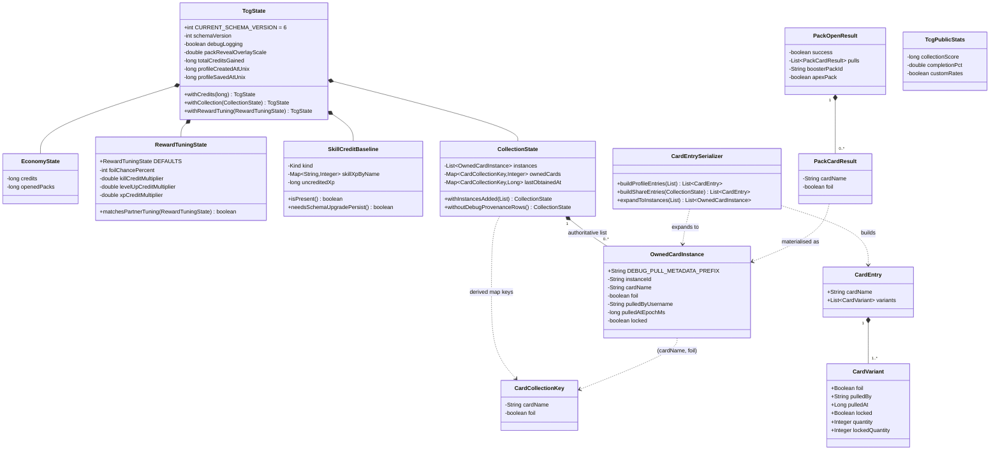

# State Model

> **Scope:** the in-memory domain model — the immutable `TcgState` tree, the four-way card identity
> model, and the transfer objects that move data between services.
> **Key packages:** `com.osrstcg.model`
> **Related:** [Card Catalog & Static Data](04-card-catalog-and-data.md)

## Purpose

`com.osrstcg.model` holds everything the plugin knows about *this player* — credits, owned cards,
tuning knobs, window sizes, XP baselines. It is the mutable counterpart to the frozen catalog in
[`com.osrstcg.data`](04-card-catalog-and-data.md), except that "mutable" is exactly what it is not:
the entire tree is immutable, and change happens by building a replacement.

The design is a persistent (copy-on-write) tree rooted at
[`TcgState`](../src/main/java/com/osrstcg/model/TcgState.java). Every mutation is a `withX()` call
returning a brand-new `TcgState`; the only mutable cell in the whole system is the single
`private TcgState state` field inside
[`TcgStateService`](../src/main/java/com/osrstcg/service/TcgStateService.java), guarded by
`synchronized`. That is what makes it safe for the Swing EDT to read a state snapshot while the
client thread is mid-pack-open: the EDT holds a reference to a value that can never change under it.

The subtle part — and the part most likely to bite you — is card identity. There are **four**
distinct types that all look like "a card", and each carries a different notion of sameness:
`CardCollectionKey`, `OwnedCardInstance`, `CardEntry`, and `CardVariant`. Getting them confused
produces bugs that look like duplicate cards, lost locks, or a collection percentage that will not
move. [The card identity model](#the-card-identity-model) is the longest section here for that
reason.

The rest of the package is small: five leaf value objects, two enums bound to config dropdowns, two
`@Value` transfer objects for pack results, and one static serializer bridging the in-memory form to
the on-disk form.

## Class reference

| Class | Lines | Responsibility |
|---|---|---|
| [`TcgState`](../src/main/java/com/osrstcg/model/TcgState.java) | 210 | Immutable root; twelve fields, eleven `withX()` builders, `CURRENT_SCHEMA_VERSION` |
| [`CollectionState`](../src/main/java/com/osrstcg/model/CollectionState.java) | 228 | Instance list + derived aggregate maps; all collection mutations |
| [`OwnedCardInstance`](../src/main/java/com/osrstcg/model/OwnedCardInstance.java) | 144 | One physical owned copy: UUID, foil, provenance, lock |
| [`CardCollectionKey`](../src/main/java/com/osrstcg/model/CardCollectionKey.java) | 46 | Value key `(cardName, foil)` — the "same card" unit for completion |
| [`CardEntrySerializer`](../src/main/java/com/osrstcg/model/CardEntrySerializer.java) | 146 | Instances ↔ grouped `CardEntry` rows; legacy quantity expansion |
| [`SkillCreditBaseline`](../src/main/java/com/osrstcg/model/SkillCreditBaseline.java) | 145 | Three-state XP snapshot (`MISSING` / `ABSENT` / `PRESENT`) |
| [`RewardTuningState`](../src/main/java/com/osrstcg/model/RewardTuningState.java) | 100 | Foil % + three credit multipliers, with clamping and partner equality |
| [`PullNotifyTier`](../src/main/java/com/osrstcg/model/PullNotifyTier.java) | 38 | Config enum mirroring `RarityMath.Tier` |
| [`PackOpenResult`](../src/main/java/com/osrstcg/model/PackOpenResult.java) | 37 | Outcome of one pack purchase + open |
| [`EconomyState`](../src/main/java/com/osrstcg/model/EconomyState.java) | 28 | `credits` + `openedPacks`, floored at zero |
| [`DinkNotificationTrigger`](../src/main/java/com/osrstcg/model/DinkNotificationTrigger.java) | 20 | Config enum: per-card vs end-of-pack Dink webhooks |
| [`CardVariant`](../src/main/java/com/osrstcg/model/CardVariant.java) | 18 | One owned copy in JSON form; all boxed, all nullable |
| [`TcgPublicStats`](../src/main/java/com/osrstcg/model/TcgPublicStats.java) | 18 | Nine-field snapshot for `!tcg` and web share |
| [`CardEntry`](../src/main/java/com/osrstcg/model/CardEntry.java) | 12 | `cardName` + list of `CardVariant`; the JSON grouping row |
| [`PackCardResult`](../src/main/java/com/osrstcg/model/PackCardResult.java) | 10 | `(cardName, foil)` — one roll, before it becomes an instance |

## `TcgState`: the immutable root

`TcgState` is `final`, all twelve fields are `final`, and there is no setter. The constructor is
public but does defensive coercion on **every** argument
([lines 30-41](../src/main/java/com/osrstcg/model/TcgState.java#L30)), so an invalid state is not
representable:

| Field | Type | Coercion in constructor | Meaning |
|---|---|---|---|
| `schemaVersion` | `int` | `<= 0` → `CURRENT_SCHEMA_VERSION` | Persisted format version; see below |
| `economyState` | `EconomyState` | `null` → `EconomyState.empty()` | Credits + lifetime packs opened |
| `collectionState` | `CollectionState` | `null` → `CollectionState.empty()` | Owned cards |
| `rewardTuning` | `RewardTuningState` | `null` → `RewardTuningState.DEFAULTS` | Foil rate + credit multipliers |
| `debugLogging` | `boolean` | — | Persisted per-profile debug flag; gates debug packs, `::tcg-give`, provenance tagging |
| `packRevealOverlayScale` | `double` | `PackRevealZoomUtil.clamp` → `[0.35, 2.5]`, NaN/Inf → `1.0` | Reveal overlay zoom ([`PackRevealZoomUtil`](../src/main/java/com/osrstcg/util/PackRevealZoomUtil.java)) |
| `albumWindowWidth` | `int` | `Math.max(0, …)` | Remembered album window size; `0` = unset |
| `albumWindowHeight` | `int` | `Math.max(0, …)` | as above |
| `skillCreditBaseline` | `SkillCreditBaseline` | `null` → `SkillCreditBaseline.absent()` | XP snapshot for retroactive credit awards |
| `totalCreditsGained` | `long` | `Math.max(0L, …)` | **Lifetime** credits awarded, never decremented by spending |
| `profileCreatedAtUnix` | `long` | `Math.max(0L, …)` | Epoch seconds of profile creation; `0` = legacy/unknown |
| `profileSavedAtUnix` | `long` | `Math.max(0L, …)` | Epoch seconds of last successful persist; `0` = never saved |

Note `totalCreditsGained` versus `EconomyState.credits`: the former is a monotonic lifetime counter
used for stats, the latter is a spendable balance. They diverge the first time you buy a pack.

### Copy-on-write builders

All eleven `withX()` methods funnel through one `private TcgState copy(...)`
([line 117](../src/main/java/com/osrstcg/model/TcgState.java#L117)) which re-invokes the
constructor. Two consequences worth knowing:

- **`copy` preserves `schemaVersion` but the constructor re-validates everything else.** So
  `state.withCredits(-5).getEconomyState().getCredits()` is `0`, not `-5` — the clamp lives in
  `EconomyState`'s own constructor.
- **`withCredits` and `withOpenedPacks` each construct a fresh `EconomyState`** rather than taking
  one ([lines 136](../src/main/java/com/osrstcg/model/TcgState.java#L136) and
  [143](../src/main/java/com/osrstcg/model/TcgState.java#L143)), each carrying the other field
  across. There is no `withEconomy(EconomyState)`. To change both you chain:
  `state.withCredits(c).withOpenedPacks(p)`, allocating two intermediate `TcgState` objects. Cheap
  — every field is a reference or a primitive, and `CollectionState` is shared by reference, not
  copied.

`withRewardTuning(null)` and `withSkillCreditBaseline(null)` normalise to `DEFAULTS` / `absent()`
rather than propagating null ([lines 157](../src/main/java/com/osrstcg/model/TcgState.java#L157),
[186](../src/main/java/com/osrstcg/model/TcgState.java#L186)).

`TcgState.empty()` ([line 44](../src/main/java/com/osrstcg/model/TcgState.java#L44)) stamps
`profileCreatedAtUnix` to `currentUnixSeconds()` but leaves `profileSavedAtUnix` at `0` — a brand-new
profile is "created now, never saved".

### `CURRENT_SCHEMA_VERSION` and what it actually gates

```java
public static final int CURRENT_SCHEMA_VERSION = 6;
```
([`TcgState.java:7`](../src/main/java/com/osrstcg/model/TcgState.java#L7))

The honest answer is: **at runtime, nothing.** There is no production code that reads
`getSchemaVersion()` — the only callers in the tree are assertions in `TcgStateCodecTest` and
`TcgStateMigrationTest`. There is no `if (version < 5)` branch anywhere.

What the constant actually does is:

1. **Stamp the value written to disk.**
   [`TcgStateCodec.toJson`](../src/main/java/com/osrstcg/persist/TcgStateCodec.java#L141) always
   sets `serialized.schemaVersion = TcgState.CURRENT_SCHEMA_VERSION`, regardless of what was loaded.
2. **Discard the value read from disk.**
   [`TcgStateCodec.parseSerializedState`](../src/main/java/com/osrstcg/persist/TcgStateCodec.java#L91)
   passes `TcgState.CURRENT_SCHEMA_VERSION` — not `stored.schemaVersion` — into the constructor,
   with the comment "Always materialize the current schema (upgrades older profiles)". Load a
   version-3 profile and the in-memory object reports 6.

Migration is therefore driven entirely by **field presence**, not by the version number:

| Legacy signal | Handling | Location |
|---|---|---|
| `cardEntries` absent/empty but `cardInstances` present | Fall back to the flat per-instance legacy array | [`TcgStateCodec.java:107`](../src/main/java/com/osrstcg/persist/TcgStateCodec.java#L107) |
| `CardVariant.quantity` / `lockedQuantity` present | Expand one variant into N instances | [`CardEntrySerializer.java:58`](../src/main/java/com/osrstcg/model/CardEntrySerializer.java#L58) |
| `skillCreditBaseline` object absent | `SkillCreditBaseline.missing()` → forces a rewrite on next save | [`TcgStateCodec.java:166`](../src/main/java/com/osrstcg/persist/TcgStateCodec.java#L166) |
| `foilChancePercent` etc. absent | `RewardTuningState.mergeSerialized` fills per-field defaults | [`RewardTuningState.java:24`](../src/main/java/com/osrstcg/model/RewardTuningState.java#L24) |
| `profileCreatedAtUnix` absent | `0`; caller may stamp "now" on the next persist | [`TcgStateCodec.java:87`](../src/main/java/com/osrstcg/persist/TcgStateCodec.java#L87) |

So bumping `CURRENT_SCHEMA_VERSION` to 7 changes the number in the JSON and nothing else. If you
need a real migration, add a nullable field to `SerializedState` and handle its absence — that is
the pattern every existing migration follows. The version number is documentation for humans and a
tripwire for future code, not an active dispatch key.

## Leaf state objects

### `EconomyState`

Two `long`s, both floored at `0` in the constructor
([`EconomyState.java:10`](../src/main/java/com/osrstcg/model/EconomyState.java#L10)). No `withX`
methods at all — `TcgState` rebuilds it wholesale.

| Field | Meaning |
|---|---|
| `credits` | Spendable balance. Cannot go negative even if a caller passes a negative |
| `openedPacks` | Lifetime packs opened; feeds `TcgPublicStats.openedPacks` and the first-pack scroll-wheel hint ([`OsrsTcgPlugin.java:730`](../src/main/java/com/osrstcg/OsrsTcgPlugin.java#L725)) |

### `RewardTuningState`

The per-profile difficulty knobs. Editable from the sidebar **only while the collection is empty**
— once you own a card the values lock, which is why party transfers can assume both sides agree.

| Field | Type | Default | Clamp |
|---|---|---|---|
| `foilChancePercent` | `int` | `1` | `[0, 100]` ([line 57](../src/main/java/com/osrstcg/model/RewardTuningState.java#L57)) |
| `killCreditMultiplier` | `double` | `1.0` | `[0.0, 100.0]`, NaN/Inf → `1.0` ([line 60](../src/main/java/com/osrstcg/model/RewardTuningState.java#L60)) |
| `levelUpCreditMultiplier` | `double` | `1.0` | as above |
| `xpCreditMultiplier` | `double` | `1.0` | as above |

`DEFAULTS` is a shared static instance ([line 8](../src/main/java/com/osrstcg/model/RewardTuningState.java#L8)).
`mergeSerialized(Integer, Double, Double, Double)` is the load path: each `null` falls back to the
corresponding default, so adding a fifth knob later only requires a new nullable field.

`matchesPartnerTuning(other)` ([line 77](../src/main/java/com/osrstcg/model/RewardTuningState.java#L77))
gates party card transfers: both profiles must have identical tuning or a trade is refused,
otherwise a player could farm cards on a 100× profile and hand them to a vanilla one. The `int`
compares exactly; the doubles compare with `Double.compare(a,b) == 0 || Math.abs(a-b) < 1e-9`
([line 92](../src/main/java/com/osrstcg/model/RewardTuningState.java#L92)) to survive a JSON
round-trip. `isDefault()` is just `matchesPartnerTuning(DEFAULTS)`, and drives
`TcgPublicStats.customRates`.

### `SkillCreditBaseline`

A three-state snapshot of per-skill XP, used to award credits retroactively for XP gained while the
plugin was off. The three states are the whole point, and they are **not** interchangeable:

| Factory | Internal `Kind` | Means | Effect |
|---|---|---|---|
| `missing()` | `MISSING` | The loaded JSON had no `skillCreditBaseline` object at all | `needsSchemaUpgradePersist()` returns `true`, so `TcgStateService.ensureSkillCreditBaselineSchemaField` ([line 285](../src/main/java/com/osrstcg/service/TcgStateService.java#L286)) forces a rewrite to add the field |
| `absent()` | `ABSENT` | The field exists (possibly just written) but holds no settled snapshot | No retroactive awards; no rewrite needed |
| `of(map, uncreditedXp)` | `PRESENT` | A real snapshot from a prior session | `isPresent()` is `true`; `xpFor(Skill)` returns values |

`MISSING` and `ABSENT` are shared singletons ([lines 20-21](../src/main/java/com/osrstcg/model/SkillCreditBaseline.java#L20)).
`of(...)` filters null/empty keys and null values, floors each XP at `0`, and — importantly —
**degrades to `absent()` if the resulting map is empty**
([line 67](../src/main/java/com/osrstcg/model/SkillCreditBaseline.java#L67)). You cannot construct a
`PRESENT` baseline with no skills.

| Field | Type | Meaning |
|---|---|---|
| `kind` | `Kind` (private enum) | `MISSING` / `ABSENT` / `PRESENT` |
| `skillXpByName` | `Map<String, Integer>` | `LinkedHashMap`, keyed by `Skill.getName()`, unmodifiable |
| `uncreditedXp` | `long` | XP observed but not yet converted to credits (rounding carry), floored at `0` |

`fromClientExperiences(int[], long)` ([line 74](../src/main/java/com/osrstcg/model/SkillCreditBaseline.java#L74))
converts RuneLite's positional `client.getSkillExperiences()` array into the name-keyed map, bounded
by `min(experiences.length, Skill.values().length)`. Keying by **name rather than ordinal** is what
makes the save survive Jagex adding a skill — a new enum constant would otherwise shift every
subsequent index.

`xpFor(Skill)` returns `OptionalInt.empty()` for any non-`PRESENT` kind, so callers cannot
accidentally treat a placeholder as a zero baseline and award a full lifetime of XP at once.

### `TcgPublicStats`

A Lombok `@Value` snapshot produced by
[`TcgPublicStatsCalculator`](../src/main/java/com/osrstcg/service/TcgPublicStatsCalculator.java) for
the `!tcg` chat command and the web share payload. Pure data, no behaviour.

| Field | Type | Meaning |
|---|---|---|
| `collectionScore` | `long` | Summed `RarityMath` score of owned cards |
| `completionPct` | `double` | `uniqueOwned / totalCardPool` as a percentage |
| `uniqueOwned` | `int` | Distinct card **names** owned that exist in the roll pool |
| `uniqueFoilOwned` | `int` | Distinct names owned in foil |
| `foilCompletionPct` | `double` | Foil equivalent of `completionPct` |
| `totalCardPool` | `int` | Size of the roll pool (6,376 today) |
| `openedPacks` | `long` | From `EconomyState` |
| `totalCardsOwned` | `int` | Total copies including duplicates |
| `customRates` | `boolean` | `!rewardTuning.isDefault()` — flags a non-vanilla profile |

`computeForShare` runs `collectionState.withoutDebugProvenanceRows()` first
([line 55](../src/main/java/com/osrstcg/service/TcgPublicStatsCalculator.java#L55)) so the published
numbers match the published card list exactly. `computeLive` does not — your own sidebar shows debug
cards.

## The card identity model

Four types, four different answers to "is this the same card?". Read this section before touching
anything that adds, removes, trades, or counts cards.

### The four types at a glance

| Type | Identity is… | Equality | Lives in | Answers |
|---|---|---|---|---|
| `CardCollectionKey` | `(cardName, foil)` | value equality on both fields | aggregate map keys | "Do I own this card, and is my foil copy distinct from my normal one?" |
| `OwnedCardInstance` | `instanceId` (UUID) | **`instanceId` only** | the instance list | "*Which* of my three copies is this one?" |
| `CardEntry` | `cardName` | none (no `equals`) | JSON only | "Group all copies of this name for compact storage" |
| `CardVariant` | none — it is a row | none | JSON only | "One copy, as nullable JSON fields" |

### `CardCollectionKey` — the completion unit

```java
public CardCollectionKey(String cardName, boolean foil)
```
([`CardCollectionKey.java:10`](../src/main/java/com/osrstcg/model/CardCollectionKey.java#L10))

Two fields, proper `equals`/`hashCode` over both
([line 38](../src/main/java/com/osrstcg/model/CardCollectionKey.java#L38)), `null` name coerced to
`""`. This is the *only* type that defines "the same card" for gameplay purposes.

**Foil is part of the key.** `("Abyssal dagger", false)` and `("Abyssal dagger", true)` are two
different keys, occupy two different album slots, and count separately toward completion — which is
why `TcgPublicStats` carries both `uniqueOwned` and `uniqueFoilOwned` and why the foil completion
percentage is tracked independently.

**The name comparison is exact and case-sensitive** — no trimming, no case folding, unlike
`CardDatabase.findByName`. Everything upstream trims before constructing a key
([`CollectionState.java:191`](../src/main/java/com/osrstcg/model/CollectionState.java#L191) builds
keys from already-normalised instance names), so a stray untrimmed name would silently create a
second, permanently-unmatched album entry.

### `OwnedCardInstance` — the physical copy

One row per physical copy you own
([`OwnedCardInstance.java`](../src/main/java/com/osrstcg/model/OwnedCardInstance.java)):

| Field | Type | Coercion | Purpose |
|---|---|---|---|
| `instanceId` | `String` | `null`/empty → `UUID.randomUUID().toString()` | The identity. Album lock toggles, sells, and party transfers all target one specific copy |
| `cardName` | `String` | `null` → `""` | Links to `CardDefinition.name` |
| `foil` | `boolean` | — | Part of the aggregate key |
| `pulledByUsername` | `String` | `null` → `""` | Provenance — see below |
| `pulledAtEpochMs` | `long` | `Math.max(0L, …)` | Epoch **milliseconds** (contrast `TcgState`'s epoch *seconds* fields) |
| `locked` | `boolean` | — | Protects the copy from bulk duplicate-sell |

The critical line:

```java
OwnedCardInstance that = (OwnedCardInstance) o;
return Objects.equals(instanceId, that.instanceId);
```
([`OwnedCardInstance.java:136`](../src/main/java/com/osrstcg/model/OwnedCardInstance.java#L136))

Equality and `hashCode` use **`instanceId` alone**. Two instances of the same card, same foil state,
same puller, same millisecond are *not* equal. That is deliberate: `CollectionState` keeps them in a
`List` and `withInstanceRemoved(id)` must delete exactly one copy, not all matching copies. It also
means you must never put `OwnedCardInstance` in a `Set` expecting deduplication by card.

`withLocked(boolean)` ([line 44](../src/main/java/com/osrstcg/model/OwnedCardInstance.java#L44))
returns `this` unchanged when the flag already matches — an identity-comparison escape hatch that
`CollectionState.withInstanceLockToggled` relies on to avoid pointless reallocation.

`createNew(...)` always mints a fresh UUID, so **round-tripping through JSON assigns new instance
IDs**. The IDs are not stable across a save/load cycle (the legacy `cardInstances` format did carry
an `id`; the current `cardEntries` format does not). Nothing may persist an `instanceId` as a
cross-session reference.

### Provenance and the debug-pull prefix

```java
public static final String DEBUG_PULL_METADATA_PREFIX = "DEBUG_";
```
([`OwnedCardInstance.java:16`](../src/main/java/com/osrstcg/model/OwnedCardInstance.java#L16))

`pulledByUsername` records who pulled the copy, and a `DEBUG_` prefix on it marks the copy as
illegitimately obtained. Three helpers manage it:

| Helper | Behaviour |
|---|---|
| `hasDebugPullMetadata(String)` | `startsWith("DEBUG_")`, null-safe |
| `withDebugPullMetadataPrefix(String)` | Prepends the prefix, **idempotent** — already-prefixed names pass through unchanged ([line 70](../src/main/java/com/osrstcg/model/OwnedCardInstance.java#L70)). `null` returns the bare prefix |
| `formatPulledByForUi(String)` | Rewrites `DEBUG_Zezima` → `Debug_Zezima` for display; storage keeps the upper-case form ([line 91](../src/main/java/com/osrstcg/model/OwnedCardInstance.java#L91)) |

A pull gets tagged when `allowZeroPrice` (free debug packs) **or** the profile's saved debug logging
flag is on:

```java
boolean tagDebugProvenance = allowZeroPrice || state.isDebugLogging();
String by = tagDebugProvenance ? OwnedCardInstance.withDebugPullMetadataPrefix(rawBy) : rawBy;
```
([`TcgStateService.java:722`](../src/main/java/com/osrstcg/service/TcgStateService.java#L722))

Cards from `::tcg-give` are tagged unconditionally
([`OsrsTcgPlugin.java:777`](../src/main/java/com/osrstcg/OsrsTcgPlugin.java#L777) and
[`:851`](../src/main/java/com/osrstcg/OsrsTcgPlugin.java#L851)).

Downstream, the tag has four consequences:

| Consumer | Effect |
|---|---|
| [`CardEntrySerializer.buildShareEntries`](../src/main/java/com/osrstcg/model/CardEntrySerializer.java#L22) | Debug rows excluded from the web share payload |
| [`TcgPublicStatsCalculator.computeForShare`](../src/main/java/com/osrstcg/service/TcgPublicStatsCalculator.java#L55) | Public stats computed without them, so numbers match the published list |
| [`TcgStateService.stripDebugProvenanceRowsIfDebugDisabled`](../src/main/java/com/osrstcg/service/TcgStateService.java#L851) | **Turning debug logging off deletes every debug-tagged copy from the live collection** |
| [`AlbumInstanceTooltip.java:29`](../src/main/java/com/osrstcg/ui/collectionalbum/AlbumInstanceTooltip.java#L29) | Tooltip shows `Debug_<name>` so the copy is visibly marked |

The prefix is stored in the *profile* save (`buildProfileEntries` does not filter), so the tag
survives a restart — which is what makes the strip-on-disable behaviour possible in the first place.
Note the asymmetry deliberately built in: debug cards are real enough to persist and show in your
own album, but never real enough to publish or to survive leaving debug mode.

### `CollectionState`: the list/map duality

`CollectionState` holds **one** authoritative field and **two** derived ones
([lines 15-17](../src/main/java/com/osrstcg/model/CollectionState.java#L15)):

| Field | Type | Authoritative? | Built by |
|---|---|---|---|
| `instances` | `List<OwnedCardInstance>` | **yes** | filtered copy of the constructor argument |
| `ownedCards` | `Map<CardCollectionKey, Integer>` | no — derived | `aggregateQuantities` ([line 186](../src/main/java/com/osrstcg/model/CollectionState.java#L186)) |
| `lastObtainedAt` | `Map<CardCollectionKey, Long>` | no — derived | `maxPulledAt` ([line 197](../src/main/java/com/osrstcg/model/CollectionState.java#L197)) |

The private constructor ([line 19](../src/main/java/com/osrstcg/model/CollectionState.java#L19))
drops any instance that is `null` or has a null/blank `cardName`, wraps the survivors unmodifiable,
then rebuilds **both** maps from scratch. There is no incremental update path — adding one card
recomputes both maps over the whole list.

**Why keep both forms?** They answer different questions and neither can cheaply answer the other's:

- The **list** is needed for anything per-copy: which specific copy is locked, which UUID a trade is
  moving, when *this particular* copy was pulled and by whom, and preserving pull order. Provenance
  is per-copy, so it cannot live in an aggregate.
- The **map** is needed for anything set-shaped: album rendering (one tile per key with a count
  badge), completion percentages, "is this a new card?" checks before a pack reveal
  ([`OsrsTcgPlugin.java:727`](../src/main/java/com/osrstcg/OsrsTcgPlugin.java#L724) snapshots
  `getOwnedCards().keySet()`), and set-completion detection. Computing "do I own X?" from the list
  is an O(n) scan on a collection that can hold tens of thousands of rows; from the map it is O(1).

Because the maps are rebuilt in the constructor and never mutated afterwards, they cannot drift.
The cost is that every single-card addition is O(n). Bulk paths exist for exactly this reason:
`withInstancesAdded(List)` ([line 116](../src/main/java/com/osrstcg/model/CollectionState.java#L116))
does one rebuild for a whole 5-card pack instead of five.

`lastObtainedAt` merges with `Math::max`, so it is the *most recent* pull time for a
`(name, foil)` pair — used for "new" badges and album sorting. `getLastObtainedAt(null)` returns
`0L` rather than throwing.

Mutation API, all returning a new `CollectionState` (or `this` when nothing changed):

| Method | Semantics |
|---|---|
| `withInstanceAdded(OwnedCardInstance)` | Append one; `null` returns `this` |
| `withInstancesAdded(List)` | Append many in one rebuild; empty/null returns `this` |
| `withInstanceRemoved(String instanceId)` | `removeIf` on `instanceId` — removes **exactly the matching copies**, not all of that card |
| `withInstanceLockToggled(String instanceId)` | Flips `locked` on the matching copy; returns `this` if no match |
| `withoutDebugProvenanceRows()` | Drops every `DEBUG_`-prefixed row; returns `this` when the size is unchanged ([line 174](../src/main/java/com/osrstcg/model/CollectionState.java#L174)) |
| `withInstances(List)` | Wholesale replacement |

`CollectionState.equals` compares **only `instances`**
([line 220](../src/main/java/com/osrstcg/model/CollectionState.java#L220)) — correct, since the maps
are pure functions of the list. But because `OwnedCardInstance.equals` is UUID-only, two collections
with identical cards but freshly-minted UUIDs are **not** equal. Do not use `CollectionState.equals`
as a save-dirty check across a load boundary; `TcgStateHash` exists for content comparison.

`findInstanceById` and `instancesForCardName` are both O(n) linear scans
([lines 70](../src/main/java/com/osrstcg/model/CollectionState.java#L70) and
[52](../src/main/java/com/osrstcg/model/CollectionState.java#L52)) — there is no per-ID index. Note
`instancesForCardName` compares with `n.equals(i.getCardName())` after trimming only the *argument*,
so it inherits the same exact-match discipline as `CardCollectionKey`.

### `CardEntry` and `CardVariant`: the wire form

These two exist only to make the JSON smaller and diff-friendly. Neither has behaviour, `equals`,
or invariants — both use bare public fields so Gson binds them directly.

[`CardEntry`](../src/main/java/com/osrstcg/model/CardEntry.java) is `cardName` plus
`List<CardVariant>`: all owned copies of one name, grouped. The card name is written **once** per
name instead of once per copy, which is the entire saving on a large collection.

[`CardVariant`](../src/main/java/com/osrstcg/model/CardVariant.java) is one copy, with every field
boxed and nullable so absent means default:

| Field | Type | Written when | Meaning |
|---|---|---|---|
| `foil` | `Boolean` | only when `true` | Absent/null = normal |
| `pulledBy` | `String` | only when non-empty | Provenance, `DEBUG_`-prefixed if applicable |
| `pulledAt` | `Long` | only when `> 0` | Epoch ms |
| `locked` | `Boolean` | only when `true` **and** profile save | Never written to the web share |
| `quantity` | `Integer` | **never written** — read only | Legacy: N copies collapsed into one row |
| `lockedQuantity` | `Integer` | **never written** — read only | Legacy: how many of those N were locked |

The `null`-means-false convention is why they are boxed. `foil: null` and an omitted `foil` are
identical, which is what keeps a 6,000-card save readable.

### `CardEntrySerializer`

The bridge between the instance list and the entry list
([`CardEntrySerializer.java`](../src/main/java/com/osrstcg/model/CardEntrySerializer.java)). All
static, private constructor, three public methods:

| Method | `includeLocked` | `filterDebugProvenance` | Used by |
|---|---|---|---|
| `buildProfileEntries(List<OwnedCardInstance>)` | `true` | `false` | [`TcgStateCodec.toJson`](../src/main/java/com/osrstcg/persist/TcgStateCodec.java#L144) |
| `buildShareEntries(CollectionState)` | `false` | `true` | [`CollectionShareSnapshotBuilder.java:27`](../src/main/java/com/osrstcg/service/CollectionShareSnapshotBuilder.java#L27) |
| `expandToInstances(List<CardEntry>)` | — | — | [`TcgStateCodec.parseCollectionRows`](../src/main/java/com/osrstcg/persist/TcgStateCodec.java#L111) |

`buildShareEntries` belts and braces: it calls `withoutDebugProvenanceRows()` *and* passes
`filterDebugProvenance = true` ([line 28](../src/main/java/com/osrstcg/model/CardEntrySerializer.java#L28)),
so a debug row cannot leak even if one path is later changed.

**Deterministic ordering is the point of `buildEntries`.** Instances are sorted before grouping
([line 100](../src/main/java/com/osrstcg/model/CardEntrySerializer.java#L100)):

```
cardName        (CASE_INSENSITIVE_ORDER)
  then foil     (false before true)
  then pulledAt (ascending)
  then pulledBy (case-insensitive, nulls first)
```

then grouped into a `LinkedHashMap` so entry order follows that sort, and each entry's variant list
is re-sorted by the same foil/time/puller triple
([line 133](../src/main/java/com/osrstcg/model/CardEntrySerializer.java#L133)). Without this, the
`HashMap`-derived iteration order would reshuffle on every save, producing a different JSON string —
and therefore a different `TcgStateHash` — for an unchanged collection, defeating dirty-checking and
churning the backup files.

`expandToInstances` is the reverse, and carries the legacy-quantity migration
([lines 58-66](../src/main/java/com/osrstcg/model/CardEntrySerializer.java#L58)):

```
quantity        = variant.quantity == null ? 1 : max(0, variant.quantity)
quantity <= 0   -> row skipped entirely
legacyLockedQty = variant.lockedQuantity != null
lockedQty       = legacyLockedQty ? min(quantity, max(0, lockedQuantity))
                                  : (variant.locked == TRUE ? 1 : 0)

for i in 0..quantity-1:
    locked = legacyLockedQty ? (i < lockedQty)          // first lockedQty copies locked
                             : (variant.locked == TRUE) // all copies share the flag
    emit OwnedCardInstance.createNew(cardName, foil, pulledBy, pulledAt).withLocked(locked)
```

Read the two branches carefully — they differ. In the **legacy** shape, one variant row with
`quantity: 5, lockedQuantity: 2` expands to five copies of which the *first two* are locked. In the
**current** shape there is no `quantity`, one row is one copy, and `locked` applies to that copy.
The `legacyLockedQty` flag keys off `lockedQuantity != null`, not off `quantity`, so a hand-written
row with `lockedQuantity: 0` takes the legacy branch and locks nothing regardless of `locked: true`.

Every expanded instance gets a **new UUID** via `createNew`, confirming that instance IDs are
session-scoped.

## Enums

Both are RuneLite config dropdown types, which is why each overrides `toString()` — RuneLite renders
the enum's `toString()` in the combo box.

### `PullNotifyTier`

A one-to-one mirror of `RarityMath.Tier`
([`PullNotifyTier.java:8-14`](../src/main/java/com/osrstcg/model/PullNotifyTier.java#L8)), existing
so `com.osrstcg.model` can be a config type without dragging the service package into the config
interface, and so the plugin can present a "this tier **and higher**" threshold. Declaration order
is ascending, and the threshold test relies on `ordinal()` comparison.

Three config knobs use it, all defaulting to `MYTHIC`:

| Config method | Default | Purpose |
|---|---|---|
| `notifyTier()` ([`OsrsTcgConfig.java:156`](../src/main/java/com/osrstcg/OsrsTcgConfig.java#L156)) | `MYTHIC` | Minimum tier for in-game chat pull notifications |
| `dinkNewCardNotifyTier()` ([`:259`](../src/main/java/com/osrstcg/OsrsTcgConfig.java#L259)) | `MYTHIC` | Minimum tier for a Dink webhook on a *new* card |
| `dinkDuplicateNotifyTier()` ([`:295`](../src/main/java/com/osrstcg/OsrsTcgConfig.java#L295)) | `MYTHIC` | Minimum tier for a Dink webhook on a *duplicate* |

`toRarityTier()` converts back; `displayLabel()` delegates to `Tier.getLabel()`. Adding a tier to
`RarityMath.Tier` without adding it here silently makes that tier unselectable.

### `DinkNotificationTrigger`

Two constants controlling *when* Dink webhooks fire during a pack reveal
([`DinkNotificationTrigger.java`](../src/main/java/com/osrstcg/model/DinkNotificationTrigger.java)):

| Constant | Label | Behaviour |
|---|---|---|
| `EVERY_CARD` | "Every card" | One webhook per qualifying card as it is revealed ([`PullNotificationService.java:91`](../src/main/java/com/osrstcg/service/PullNotificationService.java#L91)) |
| `AT_END` | "At end" | One batched webhook after the reveal completes ([`:134`](../src/main/java/com/osrstcg/service/PullNotificationService.java#L134)) |

Default is `EVERY_CARD` ([`OsrsTcgConfig.java:247`](../src/main/java/com/osrstcg/OsrsTcgConfig.java#L247)),
and `PullNotificationService.dinkTrigger()` re-null-checks it
([line 176](../src/main/java/com/osrstcg/service/PullNotificationService.java#L176)) because a
config value can be absent or unparseable.

## Transfer objects: `PackCardResult` and `PackOpenResult`

Both are Lombok `@Value` (final class, final fields, getters, `equals`/`hashCode`/`toString`). They
carry results out of `PackOpeningService` and are never persisted.

[`PackCardResult`](../src/main/java/com/osrstcg/model/PackCardResult.java) is `(cardName, foil)` —
the output of one roll, before it becomes an owned copy. It is deliberately *not* an
`OwnedCardInstance`: at roll time there is no UUID, no timestamp, and no puller, and the roll may
still be rejected if the credit transaction fails. `PackCardResult` and `CardCollectionKey` carry
identical data but mean different things: the former is "what was just rolled", the latter is "a
slot in my collection". They are not interchangeable and there is no converter.

[`PackOpenResult`](../src/main/java/com/osrstcg/model/PackOpenResult.java) is the full outcome:

| Field | Type | Meaning |
|---|---|---|
| `success` | `boolean` | Whether credits were spent and cards added |
| `message` | `String` | Player-facing text; the failure reason on `!success` |
| `creditsBefore` | `long` | Balance before |
| `creditsAfter` | `long` | Balance after (equals `creditsBefore` on failure) |
| `packPrice` | `int` | Price charged |
| `pulls` | `List<PackCardResult>` | The 5 rolls; empty on failure |
| `boosterDisplayName` | `String` | `Packs.json` `name`; `null` on failure |
| `boosterPackId` | `String` | `Packs.json` `id`; drives reveal art `/Pack_{Title}.png` ([line 17](../src/main/java/com/osrstcg/model/PackOpenResult.java#L17)) |
| `apexPack` | `boolean` | True when the 1-in-3000 apex roll hit (top three tiers, 5× foil) |

Two static factories rather than a public constructor:
`failed(message, creditsBefore, packPrice)` ([line 22](../src/main/java/com/osrstcg/model/PackOpenResult.java#L22))
sets `creditsAfter = creditsBefore`, empty pulls, null booster fields — so a caller cannot construct
a "failed but credits changed" result. `succeeded(...)`
([line 28](../src/main/java/com/osrstcg/model/PackOpenResult.java#L28)) null-guards `pulls` to an
empty list.

Every failure path in `PackOpeningService` returns `failed(...)`; the seven distinct messages are
"No booster pack selected.", the safe-mode block message, "Regional packs are only available in
debug mode.", "Invalid pack price.", "Not enough credits.", "No cards in this booster pool.", and
"Pack transaction failed."

## Data flow

Adding five cards from a pack open, end to end:

1. `PackOpeningService.rollPack` produces `List<PackCardResult>` — names and foil flags only.
2. `TcgStateService.applyPackOpenTransaction(price, pulls, allowZeroPrice, pullerName)`
   ([line 697](../src/main/java/com/osrstcg/service/TcgStateService.java#L697)), `synchronized`,
   rejects `pulls` empty, `price < 0`, `price == 0 && !allowZeroPrice`, or insufficient credits.
3. Provenance is resolved once for the whole pack:
   `tagDebugProvenance = allowZeroPrice || state.isDebugLogging()`
   ([line 722](../src/main/java/com/osrstcg/service/TcgStateService.java#L722)).
4. One `System.currentTimeMillis()` is captured and shared by all five instances, so a pack's copies
   sort together deterministically in `CardEntrySerializer`.
5. Each `PackCardResult` becomes `OwnedCardInstance.createNew(name, foil, by, now)` — new UUID each.
6. The batch goes through `CollectionState.withInstancesAdded(...)`: **one** rebuild of both derived
   maps, not five.
7. `state = state.withCollection(next).withCredits(...).withOpenedPacks(...)` — the single mutable
   reference is reassigned under the service monitor.
8. On save, `TcgStateCodec.toJson` → `CardEntrySerializer.buildProfileEntries` → sorted, grouped
   `CardEntry` rows → Gson.



## Threading

The model classes are immutable value objects with no threading behaviour of their own; the rules
below are about how they are *used*.

| Concern | Rule |
|---|---|
| The single mutable reference | `TcgStateService.state`. Every read and write goes through a `synchronized` method on that service |
| Client thread | Pack opens, chat commands (`::tcg-give`, `::tcg-open`, `::tcg-apex`), XP/kill credit awards, notifications |
| Swing EDT | Sidebar `TcgPanel`, `CollectionAlbumWindow`, and every `withX()` triggered by a UI action |
| Scheduled executor | Periodic saves, the collection share upload |
| Party / websocket | `CardPartyTradeService` / `CardPartyTransferService` apply incoming transfers |

The safety argument is: a caller obtains a `TcgState` reference under the service monitor, and from
that moment the object graph it points at cannot change. Long EDT render passes over
`getOwnedCards()` are therefore safe without holding a lock, at the cost of possibly rendering a
snapshot that is one transaction stale.

Two places take the monitor explicitly to snapshot the aggregate map for before/after comparison —
[`PackOpeningService.java:154`](../src/main/java/com/osrstcg/service/PackOpeningService.java#L155)
and [`:163`](../src/main/java/com/osrstcg/service/PackOpeningService.java#L167) — because
`newlyCompletedPrimaryCategories` needs both sides of a single transaction. Each copies into a
`HashMap` inside the `synchronized` block rather than holding the shared map across the comparison.

The one thing you must not do is treat "immutable object" as "no lock needed for a
read-modify-write". `state = state.withCredits(state.getCredits() + n)` outside a `synchronized`
block is a lost update, and nothing in the model will stop you.

## Gotchas & invariants

- **`OwnedCardInstance.equals` is UUID-only.** Same card, same foil, same everything ≠ equal. Never
  rely on it to detect duplicate cards, and never put instances in a `Set` expecting card-level
  deduplication.
- **Instance IDs are not stable across save/load.** `CardEntrySerializer.expandToInstances` mints a
  fresh UUID for every row. Do not persist an `instanceId` as a cross-session reference.
- **`CollectionState.equals` compares instances, hence UUIDs.** Two collections holding identical
  cards loaded from the same file are not equal. Use `TcgStateHash` for content comparison.
- **Foil is part of the collection key.** Album slots, completion percentages, and duplicate-sell
  all treat normal and foil as different cards.
- **`CardCollectionKey` name matching is exact and case-sensitive**, unlike
  `CardDatabase.findByName`. An untrimmed name creates a silent phantom album entry.
- **Every `CollectionState` mutation is O(n).** Both derived maps are rebuilt from the full list.
  Use `withInstancesAdded(List)` for batches; never loop `withInstanceAdded` over a pack.
- **`CURRENT_SCHEMA_VERSION` gates nothing at runtime.** No production code reads
  `getSchemaVersion()`, and the codec discards the stored value. Migrations are field-presence based;
  bumping the constant alone does nothing.
- **Timestamp units differ.** `OwnedCardInstance.pulledAtEpochMs` and `CardVariant.pulledAt` are
  **milliseconds**; `TcgState.profileCreatedAtUnix` / `profileSavedAtUnix` are **seconds**
  ([`TcgState.currentUnixSeconds`](../src/main/java/com/osrstcg/model/TcgState.java#L52)).
- **`SkillCreditBaseline.missing()` and `absent()` are not interchangeable.** Collapsing them loses
  the "rewrite the JSON on next save" signal that `needsSchemaUpgradePersist()` carries.
- **`SkillCreditBaseline.of(...)` silently returns `absent()` for an empty map.** A `PRESENT`
  baseline with zero skills cannot exist.
- **Turning debug logging off deletes debug-tagged cards.**
  `stripDebugProvenanceRowsIfDebugDisabled` removes them from the live collection — irreversibly
  once saved.
- **`withDebugPullMetadataPrefix` is idempotent but `formatPulledByForUi` is not an inverse.** The
  UI form is `Debug_x`, storage is `DEBUG_x`. Never write the UI form back into the model.
- **`CardVariant.quantity` / `lockedQuantity` are read-only legacy.** Nothing writes them. If you
  hand-edit a save to use them, `lockedQuantity != null` flips `expandToInstances` into the legacy
  branch and `locked` is ignored for that row.
- **`buildEntries` sort order is load-bearing.** Change it and every save produces a different JSON
  string for an unchanged collection, breaking hash-based dirty checks and churning backups.
- **`PackOpenResult.boosterPackId` is only meaningful on success**; `failed(...)` sets it and
  `boosterDisplayName` to `null`.
- **`RewardTuningState` doubles compare with a `1e-9` epsilon.** Exact `==` would reject a partner
  after a JSON round-trip.
