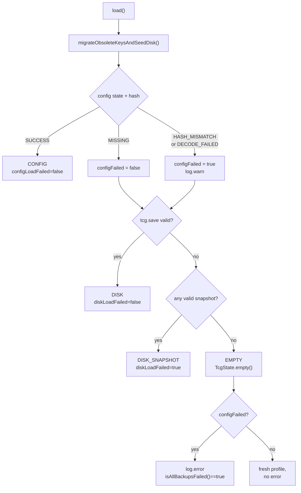
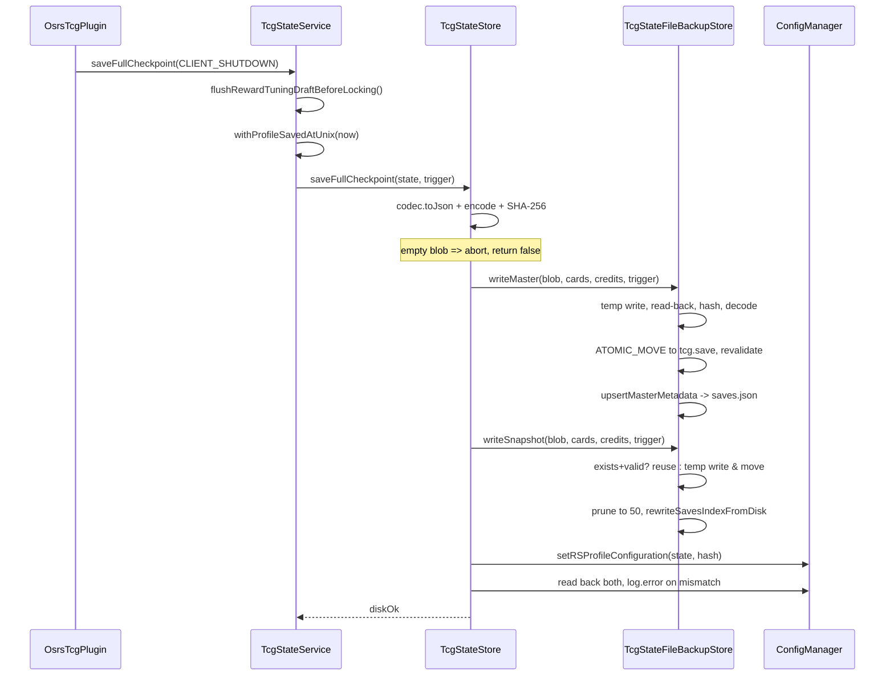

# Persistence and saves

> **Scope:** how OSRS TCG state is serialised, encoded, hashed, written to three
> independent storage tiers, migrated across schema versions, and recovered when
> one of those tiers is corrupt.
> **Key packages:** `com.osrstcg.persist`, `com.osrstcg.service` (`TcgStateService`), `com.osrstcg.ui.save`
> **Related:** [State model](05-state-model.md)

## Purpose

Everything a player earns lives in a single immutable
[`TcgState`](../src/main/java/com/osrstcg/model/TcgState.java) value object:
credits, opened-pack count, every owned card copy, reward tuning, UI
preferences, and skill-XP baselines. This area gets that object onto durable
storage and back again without losing anything. It is the highest-risk code in
the plugin — a bug here silently destroys a collection that took months to
build, and there is no server-side copy to fall back on.

The design answer is redundancy plus verification. The same encoded payload is
written to three places that fail independently: a RuneLite RSProfile config key
(which rides RuneLite's own cloud profile sync), a master file `tcg.save` on
local disk, and a content-addressed snapshot whose filename *is* the SHA-256 of
its contents. Every write is verified by read-back before it is committed, every
read is verified against a hash before it is trusted, and when a tier fails the
loader falls through to the next and tells the player which tier answered.

The second concern is schema evolution. The persisted JSON has been through six
revisions and profiles from old builds must still load. The codec is
*shape-driven rather than version-driven*: it never branches on `schemaVersion`,
it accepts every field shape it has ever written and always emits the current
one. See [Schema versions and migration](#schema-versions-and-migration) before
touching [`TcgStateCodec`](../src/main/java/com/osrstcg/persist/TcgStateCodec.java).

This area also owns two adjacent concerns sharing the same storage: web-share
credentials (a secret write token that must not become a `@ConfigItem`), and the
restore UI that pulls an old save — or a save belonging to a *different*
RuneScape account on the same machine — into the current profile.

## Class reference

| Class | Lines | Responsibility |
|---|---|---|
| [`TcgStateCodec`](../src/main/java/com/osrstcg/persist/TcgStateCodec.java) | 247 | `TcgState` ⇄ JSON. Owns the wire schema and all legacy shape handling. |
| [`TcgStateStorageEncoding`](../src/main/java/com/osrstcg/persist/TcgStateStorageEncoding.java) | 96 | JSON ⇄ `RLTCG_v2:`-prefixed gzip+XOR+Base64 blob. |
| [`TcgStateHash`](../src/main/java/com/osrstcg/persist/TcgStateHash.java) | 32 | SHA-256 hex of a UTF-8 string. One method, three unrelated uses. |
| [`TcgStateStore`](../src/main/java/com/osrstcg/persist/TcgStateStore.java) | 516 | Orchestrates config tier + disk tier. Owns the load cascade and the four save shapes. |
| [`TcgStateFileBackupStore`](../src/main/java/com/osrstcg/persist/TcgStateFileBackupStore.java) | 948 | All disk I/O: layout, atomic writes, validation, rotation, `saves.json`. |
| [`TcgStateLoadResult`](../src/main/java/com/osrstcg/persist/TcgStateLoadResult.java) | 70 | Load outcome + four diagnostic flags consumed by the plugin's chat messages. |
| [`TcgStateLoadSource`](../src/main/java/com/osrstcg/persist/TcgStateLoadSource.java) | 9 | `CONFIG` / `DISK` / `DISK_SNAPSHOT` / `EMPTY`. |
| [`TcgSaveTrigger`](../src/main/java/com/osrstcg/persist/TcgSaveTrigger.java) | 17 | Nine reasons a write happened; recorded in `saves.json`. |
| [`TcgSavesIndex`](../src/main/java/com/osrstcg/persist/TcgSavesIndex.java) | 22 | Root object of `saves.json`. |
| [`TcgSaveMetadataEntry`](../src/main/java/com/osrstcg/persist/TcgSaveMetadataEntry.java) | 108 | One row of `saves.json`; the model behind the restore list. |
| [`TcgBackupProfile`](../src/main/java/com/osrstcg/persist/TcgBackupProfile.java) | 39 | A profile directory under `backups/`, with a UI label. |
| [`CollectionShareCredentialsStore`](../src/main/java/com/osrstcg/persist/CollectionShareCredentialsStore.java) | 65 | Profile-scoped web-share id + secret write token. |
| [`TcgStateService`](../src/main/java/com/osrstcg/service/TcgStateService.java) | 866 | The only mutator of in-memory state; decides which save shape each mutation triggers. |
| [`SaveRestoreManager`](../src/main/java/com/osrstcg/ui/save/SaveRestoreManager.java) | 98 | Singleton owner of the restore dialog; EDT marshalling. |
| [`SaveRestoreDialog`](../src/main/java/com/osrstcg/ui/save/SaveRestoreDialog.java) | 487 | Modal picker: profile dropdown, save list, live stat preview. |

## The three storage tiers

The same string — the encoded blob produced by
[`TcgStateStore.encode`](../src/main/java/com/osrstcg/persist/TcgStateStore.java#L274)
— lands in all three tiers. They differ only in *where* it is put, *how often* it
is refreshed, and *what verifies it*.

**Tier 1 — RSProfile config.** Group `osrstcg`, written via
`ConfigManager.setRSProfileConfiguration`
([TcgStateStore.java:373](../src/main/java/com/osrstcg/persist/TcgStateStore.java#L373)).
RSProfile scope keys the value to the logged-in RuneScape account, so accounts
never collide, and RuneLite syncs it to its cloud profile store. This tier
survives a machine change.

**Tier 2 — `tcg.save`.** One master file per profile directory, overwritten in
place. Survives RuneLite config corruption, a failed cloud sync, or a
`settings.properties` reset.

**Tier 3 — hash snapshots.** Up to
[50](../src/main/java/com/osrstcg/persist/TcgStateFileBackupStore.java#L33)
immutable files per profile directory, each named after the SHA-256 of its own
contents. Survives *logical* corruption — a bad save that overwrote `tcg.save`
with a wiped collection — because snapshots are never mutated, only pruned.

### Config keys in group `osrstcg`

| Key | Scope | Written by | Contents |
|---|---|---|---|
| `state` | RSProfile | [`writeConfigCheckpoint`](../src/main/java/com/osrstcg/persist/TcgStateStore.java#L257) | The `RLTCG_v2:` encoded blob. |
| `hash` | RSProfile | same | Lowercase SHA-256 hex of the `state` string. |
| `webShareId` | RSProfile | [`CollectionShareCredentialsStore.save`](../src/main/java/com/osrstcg/persist/CollectionShareCredentialsStore.java#L40) | Public share id. |
| `webShareWriteToken` | RSProfile | same | Secret write token. |
| `stateBackup` | RSProfile **and** global | *obsolete* | Old second copy; unset on every load. |
| `hashBackup` | RSProfile **and** global | *obsolete* | Hash of `stateBackup`; unset on every load. |
| `stateWrittenAt` | RSProfile **and** global | *obsolete* | Old write timestamp; unset on every load. |

The three obsolete keys are removed on every load by
[`unsetObsoleteKeys`](../src/main/java/com/osrstcg/persist/TcgStateStore.java#L329),
in both scopes. `stateBackup` is still *read* once, but only as a seed source
during migration — see below.

### Which tier is authoritative

Config wins. `load()` tries `state`/`hash` first and returns immediately on
success ([TcgStateStore.java:48-56](../src/main/java/com/osrstcg/persist/TcgStateStore.java#L48)),
even when `tcg.save` is newer — pinned by
[`loadPrefersConfigOverNewerDiskMaster`](../src/test/java/com/osrstcg/persist/TcgStateMigrationTest.java#L213),
which writes a 999-credit master *after* seeding a 777-credit config blob and
asserts the load returns 777 from `CONFIG`.

That ordering is deliberate: config is the only tier RuneLite syncs across
machines, so a desktop's stale local `tcg.save` must not beat what the laptop
synced. The disk tiers are a *recovery* path, not a merge participant — there is
no merge logic anywhere in this package. The corollary is that config must be
kept fresh even when only disk was written, which is why
`TcgStateService.load()` calls
[`writeValidatedLoadToConfig`](../src/main/java/com/osrstcg/service/TcgStateService.java#L134)
after any non-empty load.

## TcgStateCodec: the serialised format

The codec maps `TcgState` onto a private
[`SerializedState`](../src/main/java/com/osrstcg/persist/TcgStateCodec.java#L210)
DTO and lets Gson do the rest. Every optional field is a *boxed* type so that
"absent in JSON" is distinguishable from "zero", and every read applies a
default or a clamp. Writing is unconditional: `toJson` always stamps
`CURRENT_SCHEMA_VERSION` and always emits the modern `cardEntries` shape
([TcgStateCodec.java:141-144](../src/main/java/com/osrstcg/persist/TcgStateCodec.java#L141)).

| JSON field | Java type | On read (missing → …) | Clamp / notes |
|---|---|---|---|
| `schemaVersion` | `int` | defaults to 6 | **Never read for branching.** See below. |
| `credits` | `long` | 0 | Passed straight into `EconomyState`. |
| `openedPacks` | `long` | 0 | Passed straight into `EconomyState`. |
| `cardEntries` | `List<CardEntry>` | falls back to `cardInstances` | Preferred when non-null *and* non-empty ([L109](../src/main/java/com/osrstcg/persist/TcgStateCodec.java#L109)). |
| `cardInstances` | `List<SerializedInstance>` | empty list | Legacy one-row-per-copy shape. Never written. |
| `foilChancePercent` | `Integer` | `1` (`RewardTuningState.DEFAULTS`) | Clamped `0..100`. |
| `killCreditMultiplier` | `Double` | `1.0` | Clamped `0.0..100.0`; NaN/Inf → `1.0`. |
| `levelUpCreditMultiplier` | `Double` | `1.0` | same |
| `xpCreditMultiplier` | `Double` | `1.0` | same |
| `debugLogging` | `Boolean` | `false` | `Boolean.TRUE.equals` — null is false ([L77](../src/main/java/com/osrstcg/persist/TcgStateCodec.java#L77)). |
| `packRevealOverlayScale` | `Double` | `1.0` | Clamped to `[0.35, 2.5]` by [`PackRevealZoomUtil`](../src/main/java/com/osrstcg/util/PackRevealZoomUtil.java#L5). |
| `albumWindowWidth` | `Integer` | `0` | `0` means "never sized"; `Math.max(0, …)`. |
| `albumWindowHeight` | `Integer` | `0` | same |
| `skillCreditBaseline` | object | `SkillCreditBaseline.missing()` | Tri-state; see below. |
| `totalCreditsGained` | `Long` | `0` | `Math.max(0L, …)`. Lifetime earnings, never decremented. |
| `profileCreatedAtUnix` | `Long` | `0` | Epoch **seconds**. `0` = legacy; stamped on next load. |
| `profileSavedAtUnix` | `Long` | `0` | Epoch **seconds**. `0` = never checkpointed. |

Note the unit mismatch that will bite you: `profileCreatedAtUnix` and
`profileSavedAtUnix` are epoch *seconds*
([TcgState.java:52](../src/main/java/com/osrstcg/model/TcgState.java#L52)),
while `pulledAt` inside a card variant and `savedAt` in `saves.json` are epoch
*milliseconds* and an ISO-8601 string respectively.

### `cardEntries` and `CardVariant`

Cards are grouped by name, with one `variants` element per owned copy
([`CardEntrySerializer.buildEntries`](../src/main/java/com/osrstcg/model/CardEntrySerializer.java#L72)).
Every variant field is nullable and is *omitted when it carries no information*,
which is what makes the blob compress well:

| Variant field | Written when | Read as |
|---|---|---|
| `foil` | only when `true` ([L119](../src/main/java/com/osrstcg/model/CardEntrySerializer.java#L119)) | absent/null → normal |
| `pulledBy` | only when non-empty ([L121](../src/main/java/com/osrstcg/model/CardEntrySerializer.java#L121)) | null → `""` |
| `pulledAt` | only when `> 0` ([L123](../src/main/java/com/osrstcg/model/CardEntrySerializer.java#L123)) | null or `<= 0` → `0` |
| `locked` | only when `true` and this is a profile save ([L124](../src/main/java/com/osrstcg/model/CardEntrySerializer.java#L124)) | absent → unlocked |
| `quantity` | **never** | legacy; `null` → 1, else expanded to N rows |
| `lockedQuantity` | **never** | legacy; first `min(quantity, lockedQuantity)` rows locked |

The `quantity`/`lockedQuantity` legacy path is pinned by
[`readsLegacyQuantityInVariants`](../src/test/java/com/osrstcg/persist/TcgStateCodecTest.java#L225):
`{"quantity":2,"lockedQuantity":1}` must expand to two instances of which
exactly one is locked. The branch at
[CardEntrySerializer.java:58-64](../src/main/java/com/osrstcg/model/CardEntrySerializer.java#L58)
keys off `lockedQuantity != null`, so a modern variant with `locked:true` and no
`quantity` produces one locked copy, while a legacy variant applies the
positional `i < lockedQty` rule.

Entries are written in a deterministic order — card name case-insensitive, then
non-foil before foil, then `pulledAt`, then `pulledBy`
([L100-104](../src/main/java/com/osrstcg/model/CardEntrySerializer.java#L100),
[L133-136](../src/main/java/com/osrstcg/model/CardEntrySerializer.java#L133)).
This matters more than it looks: because the snapshot filename is the hash of
the encoded blob, non-deterministic ordering would make every save produce a new
snapshot file and blow through the 50-file budget in a single session.

### `skillCreditBaseline` is tri-state

[`SkillCreditBaseline`](../src/main/java/com/osrstcg/model/SkillCreditBaseline.java)
distinguishes three cases, and the codec encodes the distinction purely through
JSON shape:

| Kind | JSON | Meaning |
|---|---|---|
| `MISSING` | field absent entirely | Pre-schema-5 profile. `needsSchemaUpgradePersist()` is true → trigger a rewrite. |
| `ABSENT` | `{"skillXp":{},"uncreditedXp":0}` | Field exists, no settled capture yet. No retroactive awards. |
| `PRESENT` | `{"skillXp":{"Attack":1000,…},"uncreditedXp":250}` | Real snapshot from a prior session. |

The read side maps an empty or all-invalid `skillXp` map back to `ABSENT`
([TcgStateCodec.java:171-188](../src/main/java/com/osrstcg/persist/TcgStateCodec.java#L171)),
and the write side always emits the empty-map placeholder for both `MISSING` and
`ABSENT` ([L199-202](../src/main/java/com/osrstcg/persist/TcgStateCodec.java#L199))
— that write is the whole point of the upgrade path, because it converts
`MISSING` into `ABSENT` permanently. Keys are RuneLite `Skill` *names*, not
ordinals, so skill-enum reordering upstream cannot corrupt baselines.
`loadsSchema5EmptyBaselineWithoutUpgradeFlag`
([TcgStateCodecTest.java:107](../src/test/java/com/osrstcg/persist/TcgStateCodecTest.java#L107))
pins that the placeholder shape does *not* re-trigger an upgrade write.

### Annotated example

Here is a realistic schema-6 payload for a profile with 1200 credits, three
opened packs, and two copies of one card:

```json
{
  "schemaVersion": 6,               // stamped unconditionally on write, never read on load
  "credits": 1200,                  // spendable balance
  "openedPacks": 3,
  "cardEntries": [{
    "cardName": "Abyssal whip",
    "variants": [
      { "pulledBy": "Zezima", "pulledAt": 1710000000000 },
      // ^ no "foil" key   => normal card
      //   no "locked" key => unlocked
      //   no instance id  => a fresh UUID is minted on every load
      { "foil": true, "pulledBy": "Zezima", "pulledAt": 1710000010000, "locked": true }
    ]
  }],
  "foilChancePercent": 1,           // RewardTuningState.DEFAULTS
  "killCreditMultiplier": 1.0,
  "levelUpCreditMultiplier": 1.0,
  "xpCreditMultiplier": 1.0,
  "debugLogging": false,            // true here would wipe the save on load — see below
  "packRevealOverlayScale": 1.0,    // clamped to [0.35, 2.5]
  "albumWindowWidth": 800,
  "albumWindowHeight": 600,
  "skillCreditBaseline": {          // PRESENT: a settled capture exists
    "skillXp": { "Attack": 1000, "Cooking": 55000 },
    "uncreditedXp": 250
  },
  "totalCreditsGained": 5000,       // lifetime, >= credits
  "profileCreatedAtUnix": 1700000000,   // SECONDS
  "profileSavedAtUnix": 1710000020      // SECONDS
}
```

Run that exact JSON (minified, 605 UTF-8 bytes) through
`TcgStateStorageEncoding.encode` and you get a 481-character blob whose gzip
payload is 352 bytes:

```
RLTCG_v2:TcdcQ0d8b3Nyc6AlKCjjElyqaCGz4lrq0cR567aiXW4Vz8G/v26oeu4a0NwMMo8rNPA5u3D7ThmpjNLy
PVY18EVLn/m04XtWfiMDYWSdGtaKlQJuenDWIV6gPqH1aAj//sS4am8LnQ/7oV84E+Me168peFHFTs81w+SVU2+r
… 250 further Base64 characters …
```

Its SHA-256 — the value stored in the `hash` config key, and the filename of the
corresponding snapshot — is:

```
886377b548cce13ca0caba1c389df21178cd561ea885c3ad6c3e7e01ae5b21c4
```

### Instance IDs are not persisted

Schema 6 has no per-copy identifier.
[`expandToInstances`](../src/main/java/com/osrstcg/model/CardEntrySerializer.java#L65)
calls `OwnedCardInstance.createNew`, which mints a fresh
`UUID.randomUUID()` ([OwnedCardInstance.java:53](../src/main/java/com/osrstcg/model/OwnedCardInstance.java#L53)).
The legacy `cardInstances` shape *did* carry an `id`
([TcgStateCodec.java:129](../src/main/java/com/osrstcg/persist/TcgStateCodec.java#L129)),
and `loadsSchema5From0162AndUpgradesToCurrentOnWrite` asserts it round-trips on
that path ([TcgStateCodecTest.java:81](../src/test/java/com/osrstcg/persist/TcgStateCodecTest.java#L81))
— but once the profile is rewritten as schema 6 the id is gone forever.

Consequence: any `instanceId` you hold across a load boundary is stale.
`toggleCardInstanceLock` and `removeCardInstance`
([TcgStateService.java:670](../src/main/java/com/osrstcg/service/TcgStateService.java#L670),
[L756](../src/main/java/com/osrstcg/service/TcgStateService.java#L756)) take
ids, so any UI or trade flow that caches one must invalidate on profile change.

## TcgStateStorageEncoding

Three transforms, in this order, applied to the UTF-8 bytes of the JSON
([TcgStateStorageEncoding.java:31-45](../src/main/java/com/osrstcg/persist/TcgStateStorageEncoding.java#L31)):

```
encode: utf8 -> gzip -> xor(salt) -> base64 -> "RLTCG_v2:" + body
decode: strip prefix -> base64 -> xor(salt) -> gunzip -> utf8
```

The XOR salt is a 15-byte literal
([L21-25](../src/main/java/com/osrstcg/persist/TcgStateStorageEncoding.java#L21))
that spells `RLTCG|osrs-tcg!` in ASCII, applied cyclically with `data[i] ^=
SALT[i % 15]` ([L89-95](../src/main/java/com/osrstcg/persist/TcgStateStorageEncoding.java#L89)).
XOR is an involution, so the same routine is used in both directions.

Why each step exists. **gzip**: the payload must fit in a RuneLite config value
and be cloud-synced on every change; card JSON is extremely repetitive
(`pulledBy` repeats per copy), so the worked example goes 605 → 352 bytes before
Base64 re-inflates it to 481 characters. **XOR**: obfuscation only — a constant
salt compiled into the plugin is not encryption and is not meant to be; it just
stops `settings.properties` from containing an obviously hand-editable JSON
collection. Treat the save as tamper-*evident* via the hash, not tamper-*proof*.
**Base64**: config values and the disk files are text, gzip output is binary.
**The prefix**: a version marker and a sanity gate — `decode` rejects anything
not starting with it, or no longer than the prefix itself
([L56-59](../src/main/java/com/osrstcg/persist/TcgStateStorageEncoding.java#L56))
— so a future `RLTCG_v3:` is unambiguous.

Both directions are **total**: they never throw. `encode` returns `""` on
`IOException` ([L42](../src/main/java/com/osrstcg/persist/TcgStateStorageEncoding.java#L42)),
`decode` returns `""` on bad Base64, wrong prefix, or a gzip error
([L64-68](../src/main/java/com/osrstcg/persist/TcgStateStorageEncoding.java#L64)).
Callers must treat empty as failure — and they do:
[`TcgStateStore.encode`](../src/main/java/com/osrstcg/persist/TcgStateStore.java#L282)
aborts the entire save rather than writing an empty payload, which is the single
most important guard against a save wiping a collection.

## TcgStateHash

One method:
[`hexOfUtf8`](../src/main/java/com/osrstcg/persist/TcgStateHash.java#L13)
returns the lowercase SHA-256 hex of a string's UTF-8 bytes. `null` hashes as
`""`. `NoSuchAlgorithmException` is rethrown as `IllegalStateException` — SHA-256
is mandatory in every JRE, so this is genuinely unreachable.

It has three unrelated callers, and conflating them is an easy mistake:

**1. Config integrity — not change detection, not dedupe.** `encode` hashes the
**encoded blob**, not the JSON and not the `TcgState`
([TcgStateStore.java:289](../src/main/java/com/osrstcg/persist/TcgStateStore.java#L289)).
That hex goes into the `hash` key alongside `state`. On load,
[`tryLoadConfig`](../src/main/java/com/osrstcg/persist/TcgStateStore.java#L339)
recomputes it and compares case-insensitively
([L351-355](../src/main/java/com/osrstcg/persist/TcgStateStore.java#L351)); a
mismatch yields `HASH_MISMATCH` and the config tier is abandoned for disk. This
catches truncation, encoding damage and hand edits. Nothing is ever *skipped*
because a hash matched.

If `hash` is absent but `state` is present the load still succeeds
(`missingHash` at [L348](../src/main/java/com/osrstcg/persist/TcgStateStore.java#L348))
and logs that the hash will be written next checkpoint — the upgrade path for
profiles written before the key existed. `writeConfigCheckpoint` also verifies
*after* writing, reading both keys back and logging an error on mismatch
([L262-271](../src/main/java/com/osrstcg/persist/TcgStateStore.java#L262)) — it
only logs, it does not retry or report failure upward.

**2. Snapshot filename — integrity *and* dedupe.** A snapshot's name is the hash
of its own contents
([TcgStateFileBackupStore.java:96](../src/main/java/com/osrstcg/persist/TcgStateFileBackupStore.java#L96)),
and `validateSnapshotFile` requires the recomputed hash to equal the filename
([L520](../src/main/java/com/osrstcg/persist/TcgStateFileBackupStore.java#L520)),
so corruption is self-identifying with no external metadata. Because identical
state hashes identically, saving twice unchanged reuses the existing file
([L419-422](../src/main/java/com/osrstcg/persist/TcgStateFileBackupStore.java#L419))
— real dedupe, and what keeps the 50-file budget meaningful.

**3. Profile directory name — isolation.**
[`currentProfileDirName`](../src/main/java/com/osrstcg/persist/TcgStateFileBackupStore.java#L287)
hashes `ConfigManager.getRSProfileKey()` into the backup folder name: a stable,
filesystem-safe, non-reversible id so account names never appear on disk. With
no profile key the folder is the literal `default`
([L36](../src/main/java/com/osrstcg/persist/TcgStateFileBackupStore.java#L36)).

## Schema versions and migration

`CURRENT_SCHEMA_VERSION = 6`
([TcgState.java:7](../src/main/java/com/osrstcg/model/TcgState.java#L7)).

**The codec never branches on `schemaVersion`.** The field is declared on
`SerializedState` ([TcgStateCodec.java:212](../src/main/java/com/osrstcg/persist/TcgStateCodec.java#L212))
and parsed, but `parseSerializedState`
([L66](../src/main/java/com/osrstcg/persist/TcgStateCodec.java#L66)) never reads
it — it inspects field *presence* instead and unconditionally stamps
`CURRENT_SCHEMA_VERSION`
([L92](../src/main/java/com/osrstcg/persist/TcgStateCodec.java#L92)). There is
no migration table, no `if (version < 5)` ladder, no per-version upgrade
function anywhere in the package. The strategy is: *every field ever emitted is
still accepted; every load materialises the current model; every write emits the
current shape.* Upgrading a profile is a side effect of loading and saving it.

### What each version step actually changed

These are the steps the code demonstrably handles, with the tests that pin them.

| Step | Shape change | Handled by | Pinned by |
|---|---|---|---|
| ≤ 4 → 5 | `skillCreditBaseline` added | absent → `MISSING`, rewritten as the empty placeholder on next save ([L164-174](../src/main/java/com/osrstcg/persist/TcgStateCodec.java#L164)) | [`fromJsonUpgradesPre0162MissingSkillBaselineAndProfileMeta`](../src/test/java/com/osrstcg/persist/TcgStateCodecTest.java#L175) (uses `"schemaVersion":3`) |
| ≤ 4 → 5 | `totalCreditsGained` added | `null` → `0` ([L85](../src/main/java/com/osrstcg/persist/TcgStateCodec.java#L85)) | same test, asserts `0` |
| ≤ 4 → 5 | `profileCreatedAtUnix` / `profileSavedAtUnix` added | `null` → `0`, meaning "legacy"; stamped later ([L87-88](../src/main/java/com/osrstcg/persist/TcgStateCodec.java#L87)) | same test, asserts `0`; [`loadsSchema5MissingMetaFields`](../src/test/java/com/osrstcg/persist/TcgStateCodecTest.java#L116) |
| 5 → 6 | `cardInstances` (one row per copy, with `id`) replaced by `cardEntries` (grouped by name, no `id`) | `cardEntries` preferred when present and non-empty, else legacy path ([L107-114](../src/main/java/com/osrstcg/persist/TcgStateCodec.java#L107)) | [`loadsSchema5From0162AndUpgradesToCurrentOnWrite`](../src/test/java/com/osrstcg/persist/TcgStateCodecTest.java#L74) — asserts the rewrite contains `cardEntries` and **not** `cardInstances` |
| within 6 | variant `quantity`/`lockedQuantity` replaced by one variant row per copy with a boolean `locked` | expanded on read, never written ([L53-64](../src/main/java/com/osrstcg/model/CardEntrySerializer.java#L53)) | [`readsLegacyQuantityInVariants`](../src/test/java/com/osrstcg/persist/TcgStateCodecTest.java#L225); [`roundTripsCardEntriesWithVariants`](../src/test/java/com/osrstcg/persist/TcgStateCodecTest.java#L201) asserts `quantity` is absent from output |

`loadsSchema5From0162AndUpgradesToCurrentOnWrite` is the load-bearing test for
the 5 → 6 step: it loads a two-copy `cardInstances` blob, asserts the id, foil
and locked flags survive, re-serialises, asserts `"schemaVersion":6` and the
absence of `cardInstances`, then re-parses to confirm the per-variant counts are
still 1 normal + 1 foil.

### Unknown and future versions

There is no rejection path. A blob claiming `"schemaVersion": 99` parses like
any other — recognised fields read, unrecognised fields dropped by Gson, result
written back as schema 6. `TcgState`'s constructor additionally coerces any
`schemaVersion <= 0` to the current version
([TcgState.java:30](../src/main/java/com/osrstcg/model/TcgState.java#L30)).

That is a real forward-compatibility hazard: if a newer build adds a schema-7
field and an older build loads that profile, the older build strips the field
and rewrites as 6 — and because config is authoritative and rewritten after
every load
([TcgStateService.java:123-126](../src/main/java/com/osrstcg/service/TcgStateService.java#L123)),
the downgrade sticks. Any future schema step must be additive-and-ignorable, or
gated behind a version check that does not exist today.

### Migration performed by `TcgStateStore`

[`migrateObsoleteKeysAndSeedDisk`](../src/main/java/com/osrstcg/persist/TcgStateStore.java#L296)
runs at the very top of every `load()`, before any read attempt. Four steps:

1. **Global → RSProfile promotion.**
   [`moveOldStateIntoProfile`](../src/main/java/com/osrstcg/persist/TcgStateStore.java#L403)
   handles profiles written before the plugin moved to RSProfile scope. It bails
   out immediately if the profile scope already has `state` or `stateBackup`
   ([L405-415](../src/main/java/com/osrstcg/persist/TcgStateStore.java#L405)) so
   it can never clobber newer data with older, and it only unsets the global keys
   after verifying the profile-scoped write read back identically
   ([L427-430](../src/main/java/com/osrstcg/persist/TcgStateStore.java#L427)).
2. **Disk seeding.** If no valid `tcg.save` exists, the primary config blob is
   used to create one — and if the primary is unreadable, the obsolete
   `stateBackup` key is tried instead
   ([L303-306](../src/main/java/com/osrstcg/persist/TcgStateStore.java#L303)).
   Both a master and a snapshot are written with trigger `MIGRATION`
   ([L315-316](../src/main/java/com/osrstcg/persist/TcgStateStore.java#L315)).
3. **Obsolete key removal** in both scopes.
4. **`saves.json` rebuild** from what is actually on disk.

Three migration tests pin this.
[`migratesSchema5ConfigBlobToDiskAndUnsetsObsoleteKeys`](../src/test/java/com/osrstcg/persist/TcgStateMigrationTest.java#L77)
asserts the three obsolete keys are gone, `state`/`hash` survive, and both
`tcg.save` and `saves.json` exist with the master re-serialising to
`cardEntries`.
[`doesNotReseedWhenMasterAlreadyExists`](../src/test/java/com/osrstcg/persist/TcgStateMigrationTest.java#L153)
asserts a pre-existing 1-credit master is **not** overwritten by a 777-credit
config blob — seeding is strictly one-shot, so migration can never destroy a
good disk save.
[`seedsFromStateBackupWhenPrimaryMissing`](../src/test/java/com/osrstcg/persist/TcgStateMigrationTest.java#L137)
covers the case where only the obsolete backup key exists: the data is
recovered, but the returned source is `DISK`, not `CONFIG`, because seeding
writes `tcg.save` without writing the primary `state` key.

## The load pipeline

[`TcgStateStore.load()`](../src/main/java/com/osrstcg/persist/TcgStateStore.java#L44)
is a strict four-step cascade. Each config attempt is classified by a private
`LoadOutcome` ([L459](../src/main/java/com/osrstcg/persist/TcgStateStore.java#L459)):

| `LoadOutcome` | Cause | Counts as failure? |
|---|---|---|
| `SUCCESS` | Blob present, hash matched (or absent), decoded, parsed. | — |
| `MISSING` | `state` key absent or empty. | **No** — a brand-new profile. |
| `HASH_MISMATCH` | Recomputed SHA-256 ≠ stored `hash`. | Yes. |
| `DECODE_FAILED` | `TcgStateStorageEncoding.decode` returned `""`, or Gson produced nothing. | Yes. |

That `MISSING` distinction is why `configFailed` is computed as
`config.outcome != LoadOutcome.MISSING`
([L58](../src/main/java/com/osrstcg/persist/TcgStateStore.java#L58)) rather than
`!= SUCCESS` — a first-time player must not be told their data could not be
loaded.

### The cascade



Step 3 is not "the newest snapshot" but "the newest snapshot **that parses**":
[`loadMostRecentSnapshot`](../src/main/java/com/osrstcg/persist/TcgStateFileBackupStore.java#L131)
sorts all candidates by `savedAt` from `saves.json`, tie-breaking on file mtime,
then walks the sorted list returning the first one that survives full validation
([L145-152](../src/main/java/com/osrstcg/persist/TcgStateFileBackupStore.java#L145)).
A run of corrupt snapshots is skipped over rather than fatal.

### `TcgStateLoadResult` flags

Four booleans, and their combinations are not obvious
([TcgStateLoadResult.java:7-11](../src/main/java/com/osrstcg/persist/TcgStateLoadResult.java#L7)):

| Source | `configLoadFailed` | `diskLoadFailed` | `isAllBackupsFailed()` |
|---|---|---|---|
| `CONFIG` | false | false | false |
| `DISK` | mirrors the config outcome | false | false |
| `DISK_SNAPSHOT` | mirrors the config outcome | **always true** | false |
| `EMPTY`, config was `MISSING` | false | false | **false** |
| `EMPTY`, config was corrupt | true | true | **true** |

`diskLoadFailed` on the `DISK_SNAPSHOT` row means "`tcg.save` failed", not "the
snapshot failed" ([TcgStateStore.java:76](../src/main/java/com/osrstcg/persist/TcgStateStore.java#L76)).

[`isAllBackupsFailed()`](../src/main/java/com/osrstcg/persist/TcgStateLoadResult.java#L61)
is `configLoadFailed && source == EMPTY` — deliberately *not* `source == EMPTY`
alone, because a new profile lands on `EMPTY` too. That drives the chat output in
[`announceLoadResult`](../src/main/java/com/osrstcg/OsrsTcgPlugin.java#L467):
`isConfigLoadFailed` prints "trying disk saves", `isAllBackupsFailed` prints
"Could not restore progress from any save" and returns early, and only a clean
`CONFIG` load prints "Collection successfully loaded".

### `isDebugResetOnLoad`: why a debug-tainted save wipes

The plugin has debug commands (`::tcg-give`, `::tcg-set`, free `::tcg-apex`
packs, `::tcg-complete`) gated on the persisted `debugLogging` flag. Because that
flag is stored *inside the save*, a save written while debug was on may contain
credits and cards that were conjured rather than earned — and that same save
would be shared to the web collection or traded to other players.

The guard is
[`shouldResetDebugTaintedSave`](../src/main/java/com/osrstcg/service/TcgStateService.java#L843):

```java
return state.isDebugLogging() && !runeliteDeveloperMode;
```

If the loaded state has `debugLogging: true` and RuneLite is **not** running in
developer mode, `load()` calls `resetAll()` — which replaces state with
`TcgState.empty()` and immediately writes a full checkpoint with trigger `RESET`
([TcgStateService.java:749-754](../src/main/java/com/osrstcg/service/TcgStateService.java#L749))
— and returns a result with `debugResetOnLoad = true`
([L86-96](../src/main/java/com/osrstcg/service/TcgStateService.java#L86)). The
plugin then clears pack-reveal UI and tells the player what happened
([OsrsTcgPlugin.java:451-459](../src/main/java/com/osrstcg/OsrsTcgPlugin.java#L451)).

Two things to internalise. **This is destructive and persists immediately** — the
wipe is checkpointed to all three tiers before the player can react. And
developer mode is the escape hatch: with `--developer-mode` the collection is
kept and only a log line is emitted
([L98-101](../src/main/java/com/osrstcg/service/TcgStateService.java#L98)). The
identical guard runs on disk restores
([L249-254](../src/main/java/com/osrstcg/service/TcgStateService.java#L249)), so
restoring an old debug-tainted snapshot wipes as well.

A softer variant runs when debug is *off*:
[`stripDebugProvenanceRowsIfDebugDisabled`](../src/main/java/com/osrstcg/service/TcgStateService.java#L851)
drops individual card rows whose `pulledBy` starts with `DEBUG_`
([OwnedCardInstance.java:16](../src/main/java/com/osrstcg/model/OwnedCardInstance.java#L16)),
then forces a `COLLECTION_CHANGE` master write and notifies share listeners.

## The save pipeline

Four write shapes, differing only in which tiers they touch:

| Method | `tcg.save` | snapshot | config `state`/`hash` | Typical caller |
|---|:---:|:---:|:---:|---|
| [`saveMasterOnly`](../src/main/java/com/osrstcg/persist/TcgStateStore.java#L170) | ✔ | ✘ | ✘ | Every collection mutation |
| [`saveCheckpoint`](../src/main/java/com/osrstcg/persist/TcgStateStore.java#L204) | ✘ | ✔ | ✔ | `::tcg-save`, post-restore |
| [`saveFullCheckpoint`](../src/main/java/com/osrstcg/persist/TcgStateStore.java#L183) | ✔ | ✔ | ✔ | Logout, shutdown, unload, reset |
| [`saveConfigOnly`](../src/main/java/com/osrstcg/persist/TcgStateStore.java#L225) | ✘ | ✘ | ✔ | Immediately after a validated load |

The split bounds cost. Adding a card happens dozens of times per pack opening,
and a snapshot write costs a temp file, a read-back, a SHA-256, a gunzip, a JSON
parse, an atomic move, a `saves.json` rewrite and a directory re-scan. So the hot
path writes only the master — durable but not snapshotted — and the expensive
full checkpoint is deferred to session boundaries.

The pair worth memorising: **`saveCheckpoint` deliberately does not touch
`tcg.save`.** It creates an immutable point-in-time snapshot and refreshes
config; `saveFullCheckpoint` also advances the master. In the latter the two
disk writes are combined as
`diskOk = writeMaster(...); diskOk = writeSnapshot(...) && diskOk;`
([L194-195](../src/main/java/com/osrstcg/persist/TcgStateStore.java#L194)) so
both always execute, and the config write at
[L197](../src/main/java/com/osrstcg/persist/TcgStateStore.java#L197) happens
regardless of disk success — a total disk failure still leaves config correct.

Two service-layer wrappers matter. `profileSavedAtUnix` is stamped only by
`saveCheckpoint` and `saveFullCheckpoint`
([TcgStateService.java:347](../src/main/java/com/osrstcg/service/TcgStateService.java#L347),
[L361](../src/main/java/com/osrstcg/service/TcgStateService.java#L361)), never by
`saveMasterOnly`, so a `tcg.save` written on a collection change carries the
*previous* checkpoint's timestamp. And every save path first calls
[`flushRewardTuningDraftBeforeLocking`](../src/main/java/com/osrstcg/service/TcgStateService.java#L834)
to push an unsaved sidebar tuning draft into state while tuning is still
editable.

[`TcgStateService.save()`](../src/main/java/com/osrstcg/service/TcgStateService.java#L382)
is an intentional **no-op**: credits, pack-reveal zoom and album window size call
it and stay in memory until the next real checkpoint. That is why credits earned
in a session are lost on a hard client kill but cards are not.

### `TcgSaveTrigger`

Recorded as a string in each `saves.json` row and surfaced in the restore
dialog. Nine values
([TcgSaveTrigger.java:8-16](../src/main/java/com/osrstcg/persist/TcgSaveTrigger.java#L8)):

| Trigger | Fired by | Save shape |
|---|---|---|
| `COLLECTION_CHANGE` | `addCard`, `addOwnedCardInstance`, `addOneOfEachCatalogCard`, `setCollectionInstances`, `toggleCardInstanceLock`, `removeCardInstance`, `removeCardQuantityFifo`, `applyPackOpenTransaction`, debug-provenance strip | `saveMasterOnly` |
| `RESET` | [`resetAll()`](../src/main/java/com/osrstcg/service/TcgStateService.java#L749) — `::tcg-reset` and the debug-taint wipe | `saveFullCheckpoint` |
| `LOGOUT` | `GameState.LOGIN_SCREEN` ([OsrsTcgPlugin.java:333](../src/main/java/com/osrstcg/OsrsTcgPlugin.java#L333)) | `saveFullCheckpoint` |
| `CLIENT_SHUTDOWN` | `ClientShutdown` event ([L308](../src/main/java/com/osrstcg/OsrsTcgPlugin.java#L308)) | `saveFullCheckpoint` |
| `PLUGIN_UNLOAD` | `shutDown()` ([L256](../src/main/java/com/osrstcg/OsrsTcgPlugin.java#L256)) | `saveFullCheckpoint` |
| `MANUAL` | `::tcg-save` ([L611](../src/main/java/com/osrstcg/OsrsTcgPlugin.java#L611)); schema-upgrade rewrites ([TcgStateService.java:119](../src/main/java/com/osrstcg/service/TcgStateService.java#L119)) | `saveCheckpoint` |
| `MIGRATION` | Disk seeding during `migrateObsoleteKeysAndSeedDisk` ([TcgStateStore.java:315](../src/main/java/com/osrstcg/persist/TcgStateStore.java#L315)) | master + snapshot directly |
| `LOAD` | After a successful disk restore ([TcgStateService.java:266](../src/main/java/com/osrstcg/service/TcgStateService.java#L266), [OsrsTcgPlugin.java:659](../src/main/java/com/osrstcg/OsrsTcgPlugin.java#L659)) | `saveCheckpoint` |
| `UNKNOWN` | Never written by a save path. Substituted by [`rewriteSavesIndexFromDisk`](../src/main/java/com/osrstcg/persist/TcgStateFileBackupStore.java#L684) for files with no prior index row. | — |

`CLIENT_SHUTDOWN` deserves the comment it carries at
[OsrsTcgPlugin.java:306](../src/main/java/com/osrstcg/OsrsTcgPlugin.java#L306):
the write must be **synchronous** on the `ClientShutdown` handler, because
RuneLite's own `ConfigManager` shutdown handler runs at priority −100 and calls
`sendConfig()`. An async write would lose that race and the final config
checkpoint would never be flushed.

## TcgStateFileBackupStore

### Directory layout

Rooted at `RuneLite.RUNELITE_DIR/OSRS-TCG/backups`
([L356-359](../src/main/java/com/osrstcg/persist/TcgStateFileBackupStore.java#L356)),
which on Windows is `%USERPROFILE%\.runelite\OSRS-TCG\backups`:

```
.runelite/OSRS-TCG/backups/
├── default/                                  # no RSProfile key available
│   ├── tcg.save
│   ├── saves.json
│   └── 886377b5…21c4                         # 64 hex chars, no extension
└── 4f3a…<64 hex>/                            # sha256(RSProfileKey) — one per account
    ├── tcg.save                              # master, overwritten in place
    ├── saves.json                            # index, rewritten atomically
    ├── 1a2b…<64 hex>                         # snapshot, immutable
    ├── 9c8d…<64 hex>
    └── …                                     # at most 50 snapshots
```

Two regexes police this
([L37-38](../src/main/java/com/osrstcg/persist/TcgStateFileBackupStore.java#L37)):

```java
HASH_FILENAME    = ^[a-fA-F0-9]{64}$
PROFILE_DIR_NAME = ^(?:default|[a-fA-F0-9]{64})$
```

`resolveProfileDirName` returns `null` for anything that fails
`PROFILE_DIR_NAME` ([L387-390](../src/main/java/com/osrstcg/persist/TcgStateFileBackupStore.java#L387)),
and every caller treats `null` as "do nothing". That is the path-traversal guard
for the profile id that comes back from the restore dialog — a crafted
`../../..` id resolves to `null` and no I/O occurs.

Per-profile isolation is total: `listSaveMetadata`, `loadByFileName` and
`readSavesIndex` all take an optional profile id, so the restore dialog can read
another account's saves. **Writes never do** — `writeValidatedNamedFile` and
`writeSavesIndex`'s write path resolve through `saveDirectory()` with no id
([L415](../src/main/java/com/osrstcg/persist/TcgStateFileBackupStore.java#L415)),
i.e. always the current profile. Restoring from another profile therefore copies
data *in*; it can never write back out.

### Atomic write strategy

[`writeValidatedNamedFile`](../src/main/java/com/osrstcg/persist/TcgStateFileBackupStore.java#L406)
is the only routine that creates save files, and it is paranoid by design:

1. `Files.createDirectories(dir)`.
2. If `requireHashName` (snapshot) and the target already exists and validates,
   **return true without writing** — content-addressed dedupe
   ([L419-422](../src/main/java/com/osrstcg/persist/TcgStateFileBackupStore.java#L419)).
3. `Files.createTempFile(dir, "tcg-save-", ".tmp")` — in the *same directory*, so
   the later move stays on one filesystem and can be atomic.
4. Write the blob as UTF-8.
5. **Read back** and require byte-identical content
   ([L430-435](../src/main/java/com/osrstcg/persist/TcgStateFileBackupStore.java#L430)).
6. Re-hash the read-back and require it to equal the expected hash.
7. **Fully decode it** — gunzip, XOR, JSON parse to a `TcgState`
   ([L444-448](../src/main/java/com/osrstcg/persist/TcgStateFileBackupStore.java#L444)).
   A file that cannot be loaded is never committed.
8. `moveAtomically(temp, target)` — `ATOMIC_MOVE + REPLACE_EXISTING`, falling
   back to a plain replacing move on `AtomicMoveNotSupportedException`
   ([L937-947](../src/main/java/com/osrstcg/persist/TcgStateFileBackupStore.java#L937)).
9. **Validate again after the commit**, and `deleteIfExists` the target if that
   post-commit check fails
   ([L452-466](../src/main/java/com/osrstcg/persist/TcgStateFileBackupStore.java#L452)).
10. `finally` → delete the temp file
    ([L471-474](../src/main/java/com/osrstcg/persist/TcgStateFileBackupStore.java#L471)).

Step 9 is the sharp edge: a master that fails post-commit validation is
**deleted**, not left in place. If the move half-succeeded you lose `tcg.save` —
but snapshots and config are untouched, so the cascade still has two tiers.
Step 3's same-directory temp is a hard requirement; moving it to a system temp
dir would silently degrade every write to a non-atomic cross-device copy.

`saves.json` uses the same temp-plus-atomic-move pattern
([L820-828](../src/main/java/com/osrstcg/persist/TcgStateFileBackupStore.java#L820))
but without read-back verification — it is regenerable metadata.

### Rotation and retention

`MAX_SNAPSHOT_FILES = 50`, enforced in three independent places:

- [`pruneExcessSnapshots`](../src/main/java/com/osrstcg/persist/TcgStateFileBackupStore.java#L609)
  runs after every snapshot write, sorts newest-first and deletes everything from
  index 50 onward.
- [`trimToMasterAndSnapshots`](../src/main/java/com/osrstcg/persist/TcgStateFileBackupStore.java#L738)
  caps the in-memory index list to master + 50 rows.
- [`rewriteSavesIndexFromDisk`](../src/main/java/com/osrstcg/persist/TcgStateFileBackupStore.java#L649)
  stops indexing after 50 valid snapshots
  ([L703](../src/main/java/com/osrstcg/persist/TcgStateFileBackupStore.java#L703)).

`tcg.save` is **never** pruned: `listSnapshotFiles`
([L904](../src/main/java/com/osrstcg/persist/TcgStateFileBackupStore.java#L904))
filters on `HASH_FILENAME`, which `tcg.save` cannot match. Ordering is by
`savedAt` from `saves.json`, tie-broken by file mtime
([L623-626](../src/main/java/com/osrstcg/persist/TcgStateFileBackupStore.java#L623)),
so deleting `saves.json` degrades ordering to mtime rather than breaking it.

Because snapshots are content-addressed, an idle session produces no new files —
the same state hashes the same, step 2 short-circuits, and only the `savedAt`
timestamp in `saves.json` is bumped by
[`upsertSnapshotMetadata`](../src/main/java/com/osrstcg/persist/TcgStateFileBackupStore.java#L593).

### `rewriteSavesIndexFromDisk`

Disk is the source of truth for the index; `saves.json` is a cache. This method
rebuilds the whole file from a directory listing, carrying forward `savedAt`,
`trigger`, `cardCount` and `credits` from the previous rows when the file still
exists ([L664-728](../src/main/java/com/osrstcg/persist/TcgStateFileBackupStore.java#L664)),
falling back to the file's mtime and `UNKNOWN`. `cardCount` and `credits` are
recomputed from the decoded state whenever the file parses, so the numbers in the
restore dialog cannot drift from reality.

It is expensive: every snapshot is read, SHA-256'd, gunzipped and JSON-parsed.
It runs after every snapshot write, at the start of every `load()` via
`migrateObsoleteKeysAndSeedDisk`, and at the start of every `listSaveMetadata`
([L226](../src/main/java/com/osrstcg/persist/TcgStateFileBackupStore.java#L226)).

## `TcgSavesIndex` and `TcgSaveMetadataEntry`

[`TcgSavesIndex`](../src/main/java/com/osrstcg/persist/TcgSavesIndex.java) is a
single-field wrapper so `saves.json` has a JSON object at the root rather than a
bare array — that leaves room to add sibling fields later without breaking
parsers. `setSaves(null)` normalises to an empty list
([L20](../src/main/java/com/osrstcg/persist/TcgSavesIndex.java#L20)).

```json
{
  "saves": [
    {
      "name": "tcg.save",
      "cardCount": 412,
      "credits": 18450,
      "hash": "886377b548cce13ca0caba1c389df21178cd561ea885c3ad6c3e7e01ae5b21c4",
      "savedAt": "2026-07-24T19:02:11.483Z",
      "trigger": "CLIENT_SHUTDOWN"
    },
    {
      "name": "1a2b…<64 hex>",
      "cardCount": 411,
      "credits": 18450,
      "hash": "1a2b…<64 hex>",
      "savedAt": "2026-07-24T18:41:02.117Z",
      "trigger": "MANUAL"
    }
  ]
}
```

`savedAt` is `Instant.now().toString()` — ISO-8601 UTC
([L587](../src/main/java/com/osrstcg/persist/TcgStateFileBackupStore.java#L587))
— parsed back by `parseSavedAtEpochMs`, which returns `0` for anything
unparseable rather than throwing
([L888-902](../src/main/java/com/osrstcg/persist/TcgStateFileBackupStore.java#L888)).
For snapshots, `hash` duplicates `name`; for `tcg.save` it is the only place the
master's content hash is recorded.

[`TcgSaveMetadataEntry`](../src/main/java/com/osrstcg/persist/TcgSaveMetadataEntry.java)
carries a legacy field: older indexes used `file` instead of `name`, so
`getName()` falls back to `file` when `name` is empty
([L44-51](../src/main/java/com/osrstcg/persist/TcgSaveMetadataEntry.java#L44)),
and `setName` nulls `file` out
([L53-57](../src/main/java/com/osrstcg/persist/TcgSaveMetadataEntry.java#L53)) so
the rewrite drops it. `normalizeEntryNames`
([L842](../src/main/java/com/osrstcg/persist/TcgStateFileBackupStore.java#L842))
forces that promotion on both read and write. `credits` is floored at zero in
both the constructor and the setter.

Master and snapshot rows are upserted differently: the master is removed and
re-inserted at **index 0** ([L582](../src/main/java/com/osrstcg/persist/TcgStateFileBackupStore.java#L582)),
snapshots are appended ([L598](../src/main/java/com/osrstcg/persist/TcgStateFileBackupStore.java#L598)).
Final ordering for the UI is imposed by `listSaveMetadata`, which sorts by
`savedAt` descending ([L248](../src/main/java/com/osrstcg/persist/TcgStateFileBackupStore.java#L248))
and returns defensive copies.

## `TcgBackupProfile` and `CollectionShareCredentialsStore`

[`TcgBackupProfile`](../src/main/java/com/osrstcg/persist/TcgBackupProfile.java)
is an id plus an `isCurrent` flag, with a `getDisplayLabel()` that truncates the
64-hex id to 8 characters — `Current profile (4f3a1b2c)` or `Profile 4f3a1b2c`
([L28-32](../src/main/java/com/osrstcg/persist/TcgBackupProfile.java#L28)).
`toString()` delegates to it so the raw value can be dropped straight into a
`JComboBox`. [`listBackupProfiles`](../src/main/java/com/osrstcg/persist/TcgStateFileBackupStore.java#L302)
lists directories matching `PROFILE_DIR_NAME`, deduplicates case-insensitively,
and guarantees the current profile appears — inserting it at index 0 if it has no
directory yet ([L336-345](../src/main/java/com/osrstcg/persist/TcgStateFileBackupStore.java#L336)).

[`CollectionShareCredentialsStore`](../src/main/java/com/osrstcg/persist/CollectionShareCredentialsStore.java)
is unrelated to save data but shares the tier. It keeps `webShareId` and
`webShareWriteToken` in RSProfile scope. The class exists for one reason, stated
in its Javadoc: the write token is a secret and therefore must **not** be a
`@ConfigItem`, because config items are rendered in RuneLite's settings panel.
`hasCredentials()` requires both; `blankToNull` trims and maps empty to `null`
([L56-64](../src/main/java/com/osrstcg/persist/CollectionShareCredentialsStore.java#L56))
so whitespace never counts as a credential. Being RSProfile-scoped means each
account gets its own share target automatically.

## The restore UI flow

Entry point is the `::tcg-load` chat command
([OsrsTcgPlugin.java:596](../src/main/java/com/osrstcg/OsrsTcgPlugin.java#L596)),
which runs
[`handleLoadDiskSaveCommand`](../src/main/java/com/osrstcg/OsrsTcgPlugin.java#L626).

**The once-per-session restriction.** A single boolean field,
`fileBackupLoadUsedThisSession`
([L193](../src/main/java/com/osrstcg/OsrsTcgPlugin.java#L193)), gates the whole
flow. It is checked before opening the picker
([L628](../src/main/java/com/osrstcg/OsrsTcgPlugin.java#L628)), **checked again
inside the client-thread callback** after the user confirms
([L642](../src/main/java/com/osrstcg/OsrsTcgPlugin.java#L642)), set to `true`
only after a successful restore
([L656](../src/main/java/com/osrstcg/OsrsTcgPlugin.java#L656)), and reset to
`false` on `GameState.LOGIN_SCREEN`
([L332](../src/main/java/com/osrstcg/OsrsTcgPlugin.java#L332)) — so "session"
means "since the last logout", not "since the client started".

The double check is not redundant: the dialog is modal on the EDT while game
events keep flowing, so arbitrary time passes between opening the picker and the
callback firing, and without it two dialogs opened in quick succession could both
restore. Because the flag is only set on success, a failed restore does not
consume the allowance.

Why restrict it at all: restoring is a full state replacement that overwrites the
live collection and immediately checkpoints. Allowing it repeatedly would turn
snapshots into a save-scumming mechanism — restore a good pack pull, reroll a bad
one. One restore per login session keeps it a recovery tool.

[`SaveRestoreManager`](../src/main/java/com/osrstcg/ui/save/SaveRestoreManager.java)
marshals everything onto the EDT via `invokeLater`
([L31](../src/main/java/com/osrstcg/ui/save/SaveRestoreManager.java#L31)), shows
an information dialog when
[`hasAnyDiskSaves`](../src/main/java/com/osrstcg/ui/save/SaveRestoreManager.java#L69)
finds nothing across *any* profile, and enforces a single live dialog — an
existing displayable dialog is brought `toFront()` instead of duplicated
([L43-47](../src/main/java/com/osrstcg/ui/save/SaveRestoreManager.java#L43)). The
field is cleared both by the accept callback and by a `windowClosed` listener, and
`dispose()` is called from the plugin's `shutDown`.

[`SaveRestoreDialog`](../src/main/java/com/osrstcg/ui/save/SaveRestoreDialog.java)
is modal ([L72](../src/main/java/com/osrstcg/ui/save/SaveRestoreDialog.java#L72))
with a profile dropdown, a save list, and a live stats panel. Selecting a row
calls
[`peekDiskSave`](../src/main/java/com/osrstcg/service/TcgStateService.java#L232),
which fully loads and decodes the file *without applying it*
([L276](../src/main/java/com/osrstcg/ui/save/SaveRestoreDialog.java#L276)). If
the peek fails the Restore button is **disabled** and only the indexed
`credits`/`cardCount` are shown
([L277-285](../src/main/java/com/osrstcg/ui/save/SaveRestoreDialog.java#L277)) —
you can never restore a file that does not decode. When the peek succeeds it
displays live-computed credits, total cards, foils, packs opened and unique cards
from the decoded state rather than from `saves.json`.

Surfaced metadata: name (`tcg.save (master)` or a `123456789012…abcd` ellipsis
for hashes, [L378](../src/main/java/com/osrstcg/ui/save/SaveRestoreDialog.java#L378)),
saved-at in local time, and the trigger string — which is how a player
distinguishes a `CLIENT_SHUTDOWN` save from a `RESET`. List rows read
`2026-07-24 18:41 - 18,450 credits - 411 cards (1a2b3)`, the parenthesised value
being the first five hex characters of the hash
([L395-422](../src/main/java/com/osrstcg/ui/save/SaveRestoreDialog.java#L395)).

Selecting a *different* profile changes the confirmation wording from "Restore"
to "Migrate this save from another profile into the current one?"
([L230-241](../src/main/java/com/osrstcg/ui/save/SaveRestoreDialog.java#L230)),
and both variants warn that the current collection will be replaced.

On accept,
[`applyRestoredDiskState`](../src/main/java/com/osrstcg/service/TcgStateService.java#L241)
runs the debug-taint check, strips debug provenance rows, **forces the skill
baseline to `absent()`** ([L264](../src/main/java/com/osrstcg/service/TcgStateService.java#L264)),
stamps profile metadata, and writes a `LOAD` checkpoint. Clearing the baseline is
essential when migrating across accounts: keeping another account's XP baselines
would make the credit award service see the entire XP delta as newly earned and
pay out a fortune. `OsrsTcgPlugin` then calls
`rebaseExperienceCreditBaselineToCurrentStats()`
([L658](../src/main/java/com/osrstcg/OsrsTcgPlugin.java#L658)) to re-anchor to
the live account.

## Data flow

### Cold start on login

1. RuneLite fires `RuneScapeProfileChanged`;
   [`onRuneScapeProfileChanged`](../src/main/java/com/osrstcg/OsrsTcgPlugin.java#L439)
   calls `stateService.load()`.
2. [`TcgStateStore.load()`](../src/main/java/com/osrstcg/persist/TcgStateStore.java#L44)
   runs migration, then the cascade in the flowchart above.
3. `TcgStateService.load()` applies the debug-taint check, strips debug rows,
   and upgrades missing schema fields — writing a `COLLECTION_CHANGE` master save
   if rows were stripped, otherwise a `MANUAL` checkpoint
   ([L110-121](../src/main/java/com/osrstcg/service/TcgStateService.java#L110)).
4. If the source was not `EMPTY`, `saveConfigOnly` rewrites `state`/`hash` so the
   config tier matches the validated in-memory state.
5. `applyLoadedProfileState` refreshes the panel; `announceLoadResult` prints one
   chat line describing which tier answered.

### A full checkpoint



## Threading

This code is touched from four different threads and almost none of it is
thread-safe by construction.

| Entry point | Thread | Notes |
|---|---|---|
| `onRuneScapeProfileChanged` → `load()` | Client thread | Full cascade + `rewriteSavesIndexFromDisk`; blocking disk I/O on the game loop. |
| `onGameStateChanged` (LOGIN_SCREEN) → `saveFullCheckpoint` | Client thread | Master + snapshot + config, synchronously. |
| `onClientShutdown` → `saveFullCheckpoint` | Client thread (`ClientShutdown` event) | **Must** stay synchronous — see the priority −100 note above. |
| `shutDown()` | RuneLite plugin-management thread | Writes before teardown. |
| `saveMasterOnly` from card mutations | Client thread (pack opening, kills) or party/websocket callbacks | A file write per collection change. |
| `SaveRestoreManager.showPicker` | Swing EDT via `invokeLater` | `hasAnyDiskSaves` iterates every profile. |
| `SaveRestoreDialog` selection → `peekDiskSave` | Swing EDT | Full decode of a save on every list click. |
| `applyRestoredDiskSave` | Client thread via `clientThread.invoke` | Marshals back off the EDT before mutating state. |

Mutation safety rests on two things: `TcgStateService.state` is `volatile`
([L45](../src/main/java/com/osrstcg/service/TcgStateService.java#L45)) so readers
see a consistent reference, and every mutator is `synchronized` on the service.
Because `TcgState` is immutable, a reader holding the old reference sees the old
snapshot — never a torn one.

Nothing below the service is synchronized. `TcgStateFileBackupStore` has no
locking at all; concurrent writes to one profile directory are prevented only
because every caller funnels through the `synchronized` service. Adding a
background save executor without extending that lock would corrupt `saves.json`.

Two EDT hazards: `SaveRestoreManager.hasAnyDiskSaves` calls `listDiskSaves` per
profile and each call triggers a full `rewriteSavesIndexFromDisk` — up to 50
SHA-256 + gunzip + parse cycles per profile, before the dialog is even shown —
and `updateStats` decodes a save on every list-selection change. A subtler cost:
[`savedAtEpochMsForFile`](../src/main/java/com/osrstcg/persist/TcgStateFileBackupStore.java#L867)
re-reads and re-parses `saves.json` on *every comparison* inside a sort, so
sorting 50 snapshots re-reads the index a few hundred times.

## Failure modes

| Scenario | What happens | Data lost? |
|---|---|---|
| **Corrupt config blob** (bad Base64, truncated gzip) | `decode` returns `""` → `DECODE_FAILED` → cascade falls to `tcg.save` → then snapshots. Chat: "Could not load saved progress from profile; trying disk saves." Config is rewritten from the recovered state. | No, if either disk tier survives. |
| **Config hash mismatch** (hand-edited `state`) | `HASH_MISMATCH` → same fallback. The edit is rejected wholesale, not partially applied. | No. |
| **Corrupt `tcg.save`** | `validateMasterFile` fails on hash or decode → `loadMaster` returns empty → falls through to snapshots. The file is left on disk. | No, if a snapshot survives. |
| **Corrupt snapshot** | `validateSnapshotFile` fails; `loadMostRecentSnapshot` skips it and tries the next-newest. `rewriteSavesIndexFromDisk` drops it from the index but does not delete it. | No — that is what the other 49 are for. |
| **Missing files entirely** | New profile: `MISSING` config + no disk → `EMPTY` with `configLoadFailed = false` and `isAllBackupsFailed() = false`. No error shown. | N/A. |
| **All three tiers fail** | `EMPTY` with `isAllBackupsFailed() = true` → `log.error` + "Could not restore progress from any save." **In-memory state becomes `TcgState.empty()`, and the next checkpoint persists that.** | Yes — and the wipe is then written out. Recovery means restoring an old snapshot before the next save. |
| **Partial write of `tcg.save`** | Impossible to observe: content goes to a temp file, is read back, re-hashed and fully decoded before the atomic move. A crash mid-write leaves a `tcg-save-*.tmp` orphan and the previous `tcg.save` intact. | No. |
| **Partial write of `saves.json`** | Same temp+move pattern; a torn index would in any case be regenerated by `rewriteSavesIndexFromDisk`. | No — metadata only. |
| **Non-atomic filesystem** (network share) | `AtomicMoveNotSupportedException` → plain `REPLACE_EXISTING` move ([L943-946](../src/main/java/com/osrstcg/persist/TcgStateFileBackupStore.java#L943)). A crash inside that window can leave a truncated target, which the post-commit validation deletes. | Possibly `tcg.save` only. |
| **Profile switch mid-write** | The dangerous one. `saveDirectory()` resolves `getRSProfileKey()` **per call**, so a switch between `writeMaster` and `writeSnapshot` inside one `saveFullCheckpoint` sends the two halves to different directories, and the config write lands on whichever RSProfile is current at that instant. | Possible cross-profile contamination. Mitigated in practice because `RuneScapeProfileChanged` and the save paths both run on the client thread. |
| **Disk full / read-only directory** | `IOException` → `log.warn` → `writeValidatedNamedFile` returns `false`. `saveFullCheckpoint` still writes config and returns `false`; `::tcg-save` reports "Failed to save checkpoint", but logout/shutdown callers **ignore the return value**. | Not immediately — config still holds the state. |
| **Encoding produces empty payload** | `TcgStateStore.encode` logs "save aborted: encoding produced an empty payload" and returns `null`; every save method returns `false` **without touching any tier**. | No — the old save survives. |
| **Debug-tainted save loaded** | Deliberate wipe: `resetAll()` + `saveFullCheckpoint(RESET)` across all three tiers. | Yes, by design. Only recoverable from a pre-reset snapshot, and only once per session. |

## Gotchas & invariants

- **Config beats disk, always.** No timestamp comparison, no merge. A stale
  synced config silently supersedes a newer local `tcg.save`.
- **`schemaVersion` is decorative on read.** Do not add a version check expecting
  existing code to honour it, and do not assume an unknown future version is
  rejected — it is silently downgraded to 6.
- **Instance IDs do not survive a save.** Schema 6 omits them; every load mints
  fresh UUIDs. Never cache an `instanceId` across a profile change.
- **`saveMasterOnly` does not stamp `profileSavedAtUnix`**, and
  `TcgStateService.save()` writes nothing at all — credits and UI prefs live in
  memory until a checkpoint.
- **Card ordering must stay deterministic.** `CardEntrySerializer`'s sort is what
  makes identical state hash identically, which is what makes snapshot dedupe
  work. Perturbing it turns every save into a new snapshot file.
- **`encode` returning `""` is the last line of defence** against writing an
  empty collection over a good one. Preserve the abort at
  [TcgStateStore.java:282](../src/main/java/com/osrstcg/persist/TcgStateStore.java#L282).
- **`writeConfigCheckpoint` only logs on verification failure** — no retry, no
  propagation. A silently failing `ConfigManager` produces log lines and nothing
  else.
- **Post-commit validation deletes the master on failure.** Losing `tcg.save`
  entirely is preferred over keeping an unloadable one.
- **Writes always target the current profile directory**, whatever profile id a
  read method was given. Restore-from-another-profile is one-way.
- **`resolveProfileDirName` returning `null` means "silently do nothing."**
  Forgetting that check reintroduces path traversal.
- **`isAllBackupsFailed()` requires `configLoadFailed`**, so an empty result on a
  new profile is correctly not an error. Do not "simplify" it to `source ==
  EMPTY`.
- **The debug-taint wipe persists immediately**, before any UI confirmation, and
  `::tcg-load` is gated by a plugin field rather than the service — anything
  calling `restoreFromDiskFile` directly bypasses the once-per-session limit.
- **No locking below `TcgStateService`**, and `rewriteSavesIndexFromDisk` is
  O(snapshots) with a full decode per file while running on both the client
  thread and the EDT. Do not add call sites or background writers casually.

### Open questions

- **Schema versions 1, 2 and 4 are not distinguishable in code.** The codec is
  shape-driven, and the only versions referenced anywhere are `3` and `5` (in
  test fixtures) and `6` (current). What changed at each intermediate step is not
  recoverable from this source tree; the table above documents the shape
  transitions the code actually handles, not a complete version history.
- **Whether the injected `Gson` pretty-prints is unresolved.** The codec receives
  RuneLite's `Gson` via injection, while the tests construct `new Gson()`.
  [`TcgStateCodecTest`](../src/test/java/com/osrstcg/persist/TcgStateCodecTest.java#L93)
  deliberately accepts both `"schemaVersion":6` and `"schemaVersion": 6`, which
  implies the production instance may differ. This affects blob size and the
  exact hash of a given state, but not correctness — the hash is always computed
  over whatever was actually produced.
- **The album window clamp bounds** are applied by
  `CollectionAlbumWindowSizeUtil.clamp` at the service layer, which was not read
  for this document; the codec itself only floors both dimensions at `0`.
