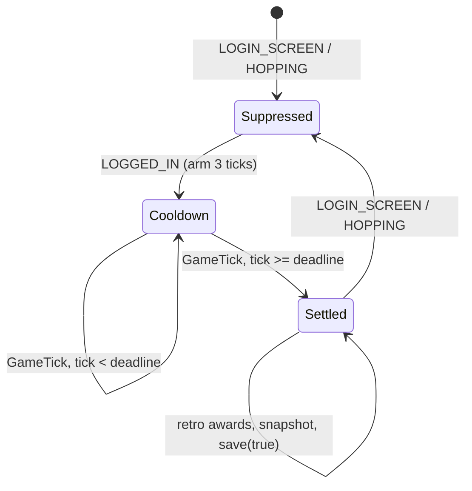

# Credits & the Reward Economy

> **Scope:** how the plugin turns in-game activity into credits, how those credits are tuned, persisted, rate-displayed and protected from abuse.
> **Key packages:** `com.osrstcg.service`, `com.osrstcg.model`, `com.osrstcg.util`, `com.osrstcg.overlay`
> **Related:** [State Model](05-state-model.md)

## Purpose

Credits are the only currency in the plugin. You earn them by playing OSRS normally — gaining
non-combat XP, levelling up, killing NPCs, finishing raids and clue trails — and you spend them on
booster packs (the only pack in `Packs.json` today costs 2,500 credits,
[Packs.json:6](../src/main/resources/Packs.json#L6)). Everything in this document feeds one field:
`EconomyState.credits` ([EconomyState.java:5](../src/main/java/com/osrstcg/model/EconomyState.java#L5)).

The earning side is deliberately split across four collaborators. [`CreditAwardService`](../src/main/java/com/osrstcg/service/CreditAwardService.java)
owns the XP/level maths, the login-settle state machine, and the only two public award entry points
(`awardNpcKillCredits`, `awardFlatCredits`). [`NpcKillCreditTracker`](../src/main/java/com/osrstcg/service/NpcKillCreditTracker.java)
decides *whether a death was yours*. [`GameMessageCreditTracker`](../src/main/java/com/osrstcg/service/GameMessageCreditTracker.java)
handles everything that cannot be attributed from an `ActorDeath` — raid completions, multi-phase
bosses, clue caskets — by matching chat text. `TcgStateService.addCredits` is the single mutation
point: it commits the sidebar's reward-tuning draft, updates state, saves, feeds the rate tracker,
and pings shop notifications ([TcgStateService.java:521](../src/main/java/com/osrstcg/service/TcgStateService.java#L521)).

The hardest problem in this area is not the maths, it is the *baseline*. The client hands you a full
XP table the moment you log in, so a naive "XP went up, pay credits" rule would pay out your entire
account on every login. [`SkillCreditBaseline`](../src/main/java/com/osrstcg/model/SkillCreditBaseline.java)
plus a three-tick settle cooldown exist entirely to solve that, and to make offline XP gains pay out
exactly once. Read that section before you touch anything in `CreditAwardService`.

A second theme is *integrity*. Multipliers are lockable and lock themselves the instant the account
has any value; combat XP pays nothing (kills pay instead, so you cannot double-dip); raid trash is
excluded by NPC id; and Safe-mode refuses to open packs while you are being hit.

## Class reference

| Class | Lines | Responsibility |
|---|---|---|
| [`CreditAwardService`](../src/main/java/com/osrstcg/service/CreditAwardService.java) | 814 | XP→credit conversion, level-up rewards, login/hop settle cooldown, baseline snapshot + retroactive awards, the two award entry points |
| [`NpcKillCreditTracker`](../src/main/java/com/osrstcg/service/NpcKillCreditTracker.java) | 569 | Kill attribution (engagement + interaction window), NPC exclusion rules, health-ratio death inference |
| [`GameMessageCreditTracker`](../src/main/java/com/osrstcg/service/GameMessageCreditTracker.java) | 303 | Flat awards from chat lines (raid completions, boss KC, treasure trails) |
| [`CreditsRateTracker`](../src/main/java/com/osrstcg/service/CreditsRateTracker.java) | 101 | 15-minute sliding-window credits/hour for the overlay |
| [`PlayerCombatMonitor`](../src/main/java/com/osrstcg/service/PlayerCombatMonitor.java) | 91 | Live "am I in combat" flag with a 3-tick incoming-damage grace |
| [`PackSafeModeService`](../src/main/java/com/osrstcg/service/PackSafeModeService.java) | 185 | Blocks pack buys during combat / welcome screen, aborts an in-flight reveal |
| [`PlayerCombatUtil`](../src/main/java/com/osrstcg/util/PlayerCombatUtil.java) | 71 | Stateless combat predicate over the world view |
| [`PetNpcIds`](../src/main/java/com/osrstcg/util/PetNpcIds.java) | 485 | ~440 follower/pet NPC ids so pets never count as combat |
| [`SkillCreditBaseline`](../src/main/java/com/osrstcg/model/SkillCreditBaseline.java) | 145 | Persisted per-skill XP snapshot + leftover XP pool, tri-state (missing/absent/present) |
| [`RewardTuningState`](../src/main/java/com/osrstcg/model/RewardTuningState.java) | 100 | Foil chance + three credit multipliers, clamped and comparable |
| [`EconomyState`](../src/main/java/com/osrstcg/model/EconomyState.java) | 28 | Immutable `{credits, openedPacks}`, both floored at 0 |
| [`CreditsInfoboxOverlay`](../src/main/java/com/osrstcg/overlay/CreditsInfoboxOverlay.java) | 118 | Movable credits/rate overlay with shift+right-click pack menu |

## The earning model

There are exactly five earning paths plus two out-of-band ones. All of them funnel through
`TcgStateService.addCredits`, which is also what makes `totalCreditsGained` monotonic
([TcgStateService.java:532](../src/main/java/com/osrstcg/service/TcgStateService.java#L532)) —
`spendCredits` deliberately does not touch it
([TcgStateService.java:547](../src/main/java/com/osrstcg/service/TcgStateService.java#L547)).

| # | Source | Trigger | Amount |
|---|---|---|---|
| 1 | Non-combat XP | `StatChanged` | 100 credits per 1,000 XP, × `xpCreditMultiplier` |
| 2 | Non-combat XP at 200M | `FakeXpDrop` | same as (1) |
| 3 | Level-ups (all skills, incl. combat) | `StatChanged` | exponential curve, 1,250 → 25,000, × `levelUpCreditMultiplier` |
| 4 | NPC kills | `ActorDeath` / health ratio | `round(combatLevel × killCreditMultiplier)` |
| 5 | Chat-message activities | `ChatMessage` | flat table, **not** multiplied |
| 6 | Selling cards / duplicates | Sidebar & album buttons | `max(10, roundedRarityScore / 200)` per card |
| 7 | `::tcg-set <n>` | Chat command, debug mode only | sets credits absolutely |

Note (5): flat awards bypass every multiplier. `awardFlatCredits` calls `addCredits` directly
([CreditAwardService.java:143](../src/main/java/com/osrstcg/service/CreditAwardService.java#L143)),
so raising `xpCreditMultiplier` to 10 does nothing to a Zuk kill.

## XP-based credits

Non-combat XP is accumulated in a single global pool, not per-skill. `StatChanged` fires for one skill
with its new total XP; `trackXpGainFromStatChanged` diffs it against `previousSkillXp[skill.ordinal()]`
and, if the skill is not a combat skill, hands the delta to `applyXpGain`
([CreditAwardService.java:487](../src/main/java/com/osrstcg/service/CreditAwardService.java#L487)).
The delta lands in `uncreditedXp`, which is then drained in whole 1,000-XP chunks. Whatever does not
fill a chunk stays in the pool and is persisted, so a 999-XP herb run is not thrown away.

```java
// CreditAwardService.java:31-32, 550-573
XP_PER_CREDIT_CHUNK = 1_000
CREDITS_PER_CHUNK   =   100

uncreditedXp += xpGained;                       // applyXpGain, line 544
chunks        = uncreditedXp / XP_PER_CREDIT_CHUNK;   // integer division
credits       = Math.round(chunks * CREDITS_PER_CHUNK * xpCreditMultiplier);
uncreditedXp -= chunks * XP_PER_CREDIT_CHUNK;   // remainder survives
```

At the default `xpCreditMultiplier` of 1.0 that is a flat **1 credit per 10 XP** — 100,000 credits per
1M XP, i.e. 40 booster packs per million XP at 2,500/pack.

There is **no per-skill weighting**. Runecrafting XP and Woodcutting XP are worth the same. The only
skill-dependent behaviour is a hard exclusion: the six combat skills earn nothing from XP at all
([CreditAwardService.java:43-50](../src/main/java/com/osrstcg/service/CreditAwardService.java#L43)) —
`ATTACK, DEFENCE, STRENGTH, HITPOINTS, MAGIC, RANGED`. Their gains are logged and dropped
([CreditAwardService.java:518-523](../src/main/java/com/osrstcg/service/CreditAwardService.java#L518)),
because kills already pay via path (4) and paying both would double-count every monster. `Overall` is
skipped everywhere as a pseudo-skill ([CreditAwardService.java:794](../src/main/java/com/osrstcg/service/CreditAwardService.java#L794)).
Prayer, Construction etc. are non-combat here and *do* pay.

### The FakeXpDrop path

Once a skill hits `Experience.MAX_SKILL_XP` (200,000,000) the client stops increasing the stored XP,
so `StatChanged` goes silent while the player keeps training. RuneLite still emits `FakeXpDrop` for
the visual drop, and that is the only remaining signal. `onFakeXpDrop` therefore accepts a drop **only**
when the skill is already at or above 200M ([CreditAwardService.java:805-813](../src/main/java/com/osrstcg/service/CreditAwardService.java#L805)),
which is what `isGenuineMaxedSkillFakeXpDrop` checks. Everything else is rejected:

- combat skills → ignored outright ([CreditAwardService.java:204-213](../src/main/java/com/osrstcg/service/CreditAwardService.java#L204)); this is what stops the bonus-XP fake drops that fire during normal PvM from paying twice.
- below 200M → ignored, because the real `StatChanged` will pay for it.
- `xp <= 0` or `xp >= FAKE_XP_DROP_SANITY_CAP` (20,000,000) → ignored as a bogus payload ([CreditAwardService.java:40](../src/main/java/com/osrstcg/service/CreditAwardService.java#L40), [line 224](../src/main/java/com/osrstcg/service/CreditAwardService.java#L224)).

Accepted drops go through the same `applyXpGain` pool, so a maxed skill converts at the identical rate.

### Level-up credits

Level-ups are handled separately in `onStatChanged`, after XP tracking, and they apply to **every**
skill including the combat six ([CreditAwardService.java:171-192](../src/main/java/com/osrstcg/service/CreditAwardService.java#L171)).
`levelForXp` uses `Experience.getLevelForXp` and clamps to `Experience.MAX_VIRT_LEVEL` (126), so
virtual levels are real levels for reward purposes ([CreditAwardService.java:758-771](../src/main/java/com/osrstcg/service/CreditAwardService.java#L758)).
A level *decrease* is ignored rather than rebased — a reconnect that transiently reports lower stats
must not later re-pay the same levels ([CreditAwardService.java:185-189](../src/main/java/com/osrstcg/service/CreditAwardService.java#L185)).

Every level crossed in one event is paid individually and rounded individually
([CreditAwardService.java:466-485](../src/main/java/com/osrstcg/service/CreditAwardService.java#L466)):

```java
// CreditAwardService.java:34-38, 740-756
LEVEL_UP_REWARD_FLOOR    =  1_250   // levels 1-2
LEVEL_UP_REWARD_CAP      = 25_000   // level 99 and every virtual level 100-126
LEVEL_UP_PROGRESS_LEVELS =     97
LEVEL_UP_CURVE_STEEPNESS =    2.5

reward(level):
    clamped = clamp(level, 1, 126)
    if clamped <= 2:  return 1_250
    if clamped >= 99: return 25_000          // Experience.MAX_REAL_LEVEL
    progress   = (clamped - 2) / 97.0
    curve      = progress ^ 2.5
    multiplier = (25_000 / 1_250) ^ curve    // == 20 ^ curve
    return round(1_250 * multiplier)

// awardLevelUps, line 475:
for level in (previousLevel+1 .. currentLevel):
    total += round(reward(level) * levelUpCreditMultiplier)
```

The 2.5 exponent makes the curve extremely back-loaded — half the credits of a 1→99 grind sit above
level 90:

| Level | Reward | Level | Reward |
|---|---|---|---|
| 1–2 | 1,250 | 70 | 4,288 |
| 10 | 1,257 | 80 | 7,101 |
| 20 | 1,307 | 90 | 13,087 |
| 30 | 1,429 | 95 | 18,532 |
| 40 | 1,667 | 98 | 23,156 |
| 50 | 2,094 | 99 | 25,000 |
| 60 | 2,862 | 100–126 | 25,000 each |

Totals implied by the formula: **459,687** credits for one skill taken 1→99, and a further 675,000
(27 × 25,000) for virtual 100→126.

## SkillCreditBaseline and the login snapshot problem

When you log in, the client populates the whole XP table at once and RuneLite fires a `StatChanged`
for every skill. To the plugin that looks like a 200-million-XP gain in a single tick. Three mechanisms
together prevent that payout and still let genuine offline gains through.

**1. The settle cooldown.** `GameState.LOGIN_SCREEN` and `HOPPING` both arm
`suppressCreditAwardsUntilStatsSettle`, which starts a cooldown and wipes live tracking
([CreditAwardService.java:262-295](../src/main/java/com/osrstcg/service/CreditAwardService.java#L262)).
The cooldown lasts `CREDIT_AWARD_COOLDOWN_TICKS = 3` ticks past `client.getTickCount()`
([line 42](../src/main/java/com/osrstcg/service/CreditAwardService.java#L42), [line 614](../src/main/java/com/osrstcg/service/CreditAwardService.java#L614)).
`isCreditAwardOnCooldown` has a second guard worth knowing about: if the deadline is *more* than three
ticks in the future the cooldown is treated as expired
([CreditAwardService.java:639-643](../src/main/java/com/osrstcg/service/CreditAwardService.java#L639)),
because the tick counter resets between login screen and world, and the stale deadline would otherwise
suppress awards for hours.

**2. The in-memory baseline.** `previousSkillXp[]` and `lastKnownLevels` are snapshotted from
`client.getSkillExperiences()` once the cooldown ends ([CreditAwardService.java:673-732](../src/main/java/com/osrstcg/service/CreditAwardService.java#L673)).
`snapshotSkillExperiencesIfLoggedIn` will only ever raise an established baseline, never lower it
([lines 694-701](../src/main/java/com/osrstcg/service/CreditAwardService.java#L694)) — the same
anti-reconnect rule as the level check.

**3. The persisted baseline.** `SkillCreditBaseline` stores `{skillName → xp}` plus the leftover
`uncreditedXp` in profile state. It is tri-state on purpose
([SkillCreditBaseline.java:20-51](../src/main/java/com/osrstcg/model/SkillCreditBaseline.java#L20)):

| Kind | Meaning | Effect |
|---|---|---|
| `missing()` | Loaded JSON predates the field | `needsSchemaUpgradePersist()` true; state is rewritten on load |
| `absent()` | Field exists, no settled capture yet | `isPresent()` false → no retroactive awards |
| `of(...)` / `fromClientExperiences(...)` | Settled snapshot from a prior session | Retroactive awards run against it |

`of()` degrades to `absent()` if the map ends up empty ([SkillCreditBaseline.java:67-70](../src/main/java/com/osrstcg/model/SkillCreditBaseline.java#L67)),
and keys are skill *names*, not ordinals, so a future `Skill` enum reorder cannot silently misattribute XP.

### When it is written

`persistSkillBaselineToState(save)` is a no-op until `skillXpInitialized`
([CreditAwardService.java:591-606](../src/main/java/com/osrstcg/service/CreditAwardService.java#L591)),
so an uninitialised baseline can never overwrite a good one with zeros. It is called with
`save = true` (flush to disk) at the login screen, on hop, and at the end of the settle tick; with
`save = false` (memory only) on every XP gain and inside `addCredits`. `flushSkillBaselineForPersist`
([line 118](../src/main/java/com/osrstcg/service/CreditAwardService.java#L118)) is invoked from
`shutDown()` *before* `saveFullCheckpoint`, so the pool survives a plugin unload
([OsrsTcgPlugin.java:255-256](../src/main/java/com/osrstcg/OsrsTcgPlugin.java#L255)).

### Retroactive awards

`applyRetroactiveCreditsFromPersistedBaseline` runs exactly once per settle
([CreditAwardService.java:331](../src/main/java/com/osrstcg/service/CreditAwardService.java#L331)).
It diffs the persisted snapshot against live XP, ignores skills whose current XP is *lower* than the
snapshot (different character, or a rollback), collects non-combat XP and level-up pairs, and — the
critical ordering — **persists the new snapshot to disk before paying anything**
([lines 412-414](../src/main/java/com/osrstcg/service/CreditAwardService.java#L412)). If the client
crashes mid-award you lose one payout; if it were the other way round you could re-farm the same gap
on every login.

### `resetExperienceCreditBaseline` vs `rebaseExperienceCreditBaselineToCurrentStats`

These look similar and do opposite things. Getting them backwards is the single most damaging mistake
available in this file.

| | `resetExperienceCreditBaseline` ([line 80](../src/main/java/com/osrstcg/service/CreditAwardService.java#L80)) | `rebaseExperienceCreditBaselineToCurrentStats` ([line 103](../src/main/java/com/osrstcg/service/CreditAwardService.java#L103)) |
|---|---|---|
| Live tracking | cleared | cleared |
| Persisted `SkillCreditBaseline` | **kept** | **replaced with `absent()`** |
| `uncreditedXp` | restored from the saved baseline if present | cleared |
| Snapshot taken now? | no — waits for the settle tick | yes, immediately if logged in |
| Retro awards afterwards? | **yes** | **no** |
| Called from | `applyLoadedProfileState` on login / profile switch ([OsrsTcgPlugin.java:450](../src/main/java/com/osrstcg/OsrsTcgPlugin.java#L450)), and `TcgPanel.performCollectionReset` ([TcgPanel.java:373](../src/main/java/com/osrstcg/ui/TcgPanel.java#L373)) | `applyRestoredDiskSave` after `::tcg-load` ([OsrsTcgPlugin.java:658](../src/main/java/com/osrstcg/OsrsTcgPlugin.java#L658)) |

The reasoning: on a normal login the saved snapshot *is* this character's, so you want the offline
diff paid out. After restoring a disk save the collection and credits come from the file but the XP
snapshot inside it may belong to a different character or a much older session — paying that diff
would mint millions of credits. `TcgStateService.restoreFromDiskFile` already forces
`SkillCreditBaseline.absent()` on the restored state as a second line of defence
([TcgStateService.java:262-264](../src/main/java/com/osrstcg/service/TcgStateService.java#L262)).

**Failure modes.** A baseline that is too *low* (stale, or another character with less XP) pays the
whole difference as a lump sum on the next settle tick. A baseline that is too *high* pays nothing for
that skill until the player passes it, because `currentXp < previousXp` is skipped
([line 381](../src/main/java/com/osrstcg/service/CreditAwardService.java#L381)). Neither throws; both
are silent. The only visible signal is the `debugAward` trace, gated on the debug-chat config or
Overview debug mode ([CreditAwardService.java:778-792](../src/main/java/com/osrstcg/service/CreditAwardService.java#L778)).

## NPC kill credits

`awardNpcKillCredits(npcName, combatLevel)` is trivially simple — the value of a kill *is* its combat
level ([CreditAwardService.java:124-141](../src/main/java/com/osrstcg/service/CreditAwardService.java#L124)):

```java
// CreditAwardService.java:734-738
creditsPerKill = max(0, round(combatLevel * killCreditMultiplier));
// combatLevel <= 0 -> no award at all (line 126)
```

There is no per-NPC table. A level-2 chicken pays 2 credits, a level-303 Vorkath pays 303. The
`combatLevel <= 0` guard is load-bearing: Chambers of Xeric room monsters are party-scaled and report
no combat level, which is why CoX needs no id exclusion list while ToB and ToA (fixed combat levels) do
([NpcKillCreditTracker.java:316-326](../src/main/java/com/osrstcg/service/NpcKillCreditTracker.java#L316)).

### Attribution

All the real work is deciding whether a death belongs to you. Two signals are tracked per NPC index in
`ConcurrentHashMap`s:

- **`onInteractingChanged`** — you started interacting with an NPC. This sets `wasNpcEngaged` *and* the interaction tick ([NpcKillCreditTracker.java:92-114](../src/main/java/com/osrstcg/service/NpcKillCreditTracker.java#L92)). Targeting counts as engagement so a one-hit kill still qualifies when `ActorDeath` beats `HitsplatApplied`.
- **`onHitsplatApplied`** with `hitsplat.isMine()` — your damage landed ([lines 116-133](../src/main/java/com/osrstcg/service/NpcKillCreditTracker.java#L116)).

On `ActorDeath` the award only fires when `wasNpcEngaged` is true **and** the last interaction was
within `INTERACTION_TIMEOUT_TICKS = 7` ticks ([line 30](../src/main/java/com/osrstcg/service/NpcKillCreditTracker.java#L30),
[line 179](../src/main/java/com/osrstcg/service/NpcKillCreditTracker.java#L179)). `onGameTick` prunes
interaction entries older than the same 7 ticks ([lines 198-199](../src/main/java/com/osrstcg/service/NpcKillCreditTracker.java#L198)),
so walking away from a monster that someone else finishes pays nothing. Names are normalised by
stripping `<...>` colour tags before any comparison ([line 202](../src/main/java/com/osrstcg/service/NpcKillCreditTracker.java#L202)).

### Exclusions and phases

`NPC_EXCLUSIONS` ([lines 38-61](../src/main/java/com/osrstcg/service/NpcKillCreditTracker.java#L38))
is an ordered array of rules matched by exact name, name fragment with one exception, or id set:

| Rule kind | Examples |
|---|---|
| `exactName` | `Alchemical Hydra`, `The Hueycoatl`, `The Nightmare`, `Phosani's Nightmare`, `Abyssal Sire` |
| `nameContains(fragment, except)` | `"nylocas"` except `Nylocas Vasilias` |
| `npcIds(set)` | Hueycoatl (8 ids), Grotesque Guardians (13), Royal Titans (8), Alchemical Hydra phases (4), Amoxliatl unstable ice (13688), Cracked Ice (13026), Great Olm (7550–7555), TzHaar Fight Cave (14 ids), Inferno (17 ids), Theatre of Blood (8338–8389 + 10766–10869), Tombs of Amascut (11697–11799), The Nightmare (19), Phantom Muspah (6), Abyssal Sire (7), The Gauntlet (27), Shellbane Gryphon (14860, 15010) |

Everything excluded here is re-paid as a flat amount by `GameMessageCreditTracker` — the whole point is
that a multi-phase boss or a raid should pay once, not once per phase or once per trash mob. Two
deliberate carve-outs are documented in the source: TzHaar-Ket-Rak's Challenge Jad (6506) is *not*
excluded because it never fires the Jad kill-count message ([lines 281-286](../src/main/java/com/osrstcg/service/NpcKillCreditTracker.java#L281)),
and ToB quest-only variants are left in ([lines 316-326](../src/main/java/com/osrstcg/service/NpcKillCreditTracker.java#L316)).

`FINAL_PHASE_IDS` handles the opposite case: Kalphite Queen keeps per-kill credit but only from id 965,
her second form ([line 33](../src/main/java/com/osrstcg/service/NpcKillCreditTracker.java#L33)).

### Health-ratio deaths

Amoxliatl (13685), Duke Sucellus (12166) and the three Perilous Moons (13011–13013) do not reliably
fire `ActorDeath` ([`HealthTrackedNpcIds`](../src/main/java/com/osrstcg/service/NpcKillCreditTracker.java#L378)).
`SpecialNpcCreditWatch` tracks them from the moment you interact and, on each tick, awards when
`getHealthRatio() <= 1` and the index has not already been logged
([lines 515-547](../src/main/java/com/osrstcg/service/NpcKillCreditTracker.java#L515)). If the ratio
climbs back above zero the index is un-logged and re-tracked, which is how a respawned or re-used index
becomes eligible again; `retrackAfterPlayerHit` does the same when you land a fresh hit
([line 549](../src/main/java/com/osrstcg/service/NpcKillCreditTracker.java#L549)). These NPCs are
skipped in `onActorDeath` so the two paths cannot both pay ([lines 156-160](../src/main/java/com/osrstcg/service/NpcKillCreditTracker.java#L156)).

### Where `PetNpcIds` fits

`PetNpcIds` is **not** used by the kill tracker. It is used by [`PlayerCombatUtil`](../src/main/java/com/osrstcg/util/PlayerCombatUtil.java)
only, to stop your own follower from being counted as combat: `isCombatTarget` returns false for pet
NPCs ([PlayerCombatUtil.java:59-70](../src/main/java/com/osrstcg/util/PlayerCombatUtil.java#L59)), and
the "is anything targeting me" scan skips pets ([line 41](../src/main/java/com/osrstcg/util/PlayerCombatUtil.java#L41)).
Without it a pet following you would permanently pin Safe-mode into "in combat" and lock pack opening.
The set is built from RuneLite `NpcID` gameval constants (the same list PetInfoPlugin uses) plus a
hand-added tail of non-`NpcID` followers: the Varrock stray dog (2902) and the Varlamore dogs
([PetNpcIds.java:464-482](../src/main/java/com/osrstcg/util/PetNpcIds.java#L464)).

## Chat-message credits

`GameMessageCreditTracker` subscribes to `ChatMessage`, accepts only `GAMEMESSAGE` and `SPAM`
([line 102](../src/main/java/com/osrstcg/service/GameMessageCreditTracker.java#L102)) — `SPAM` matters
because the in-game "Filter out boss kill-count with spam-filter" setting reroutes KC lines there —
strips tags with `Text.removeTags`, and takes the **first** matching rule
([lines 223-253](../src/main/java/com/osrstcg/service/GameMessageCreditTracker.java#L223)). Rules are
either a `startsWith` prefix or a full-match `Pattern`.

| Message prefix / pattern | Credits | Line |
|---|---|---|
| `Your completed Chambers of Xeric Challenge Mode count is:` | 18,500 | [23](../src/main/java/com/osrstcg/service/GameMessageCreditTracker.java#L23) |
| `Your completed Chambers of Xeric count is:` | 12,500 | [27](../src/main/java/com/osrstcg/service/GameMessageCreditTracker.java#L27) |
| `Your completed Theatre of Blood: Hard Mode count is:` | 18,500 | [30](../src/main/java/com/osrstcg/service/GameMessageCreditTracker.java#L30) |
| `Your completed Theatre of Blood: Entry Mode count is:` | 3,500 | [34](../src/main/java/com/osrstcg/service/GameMessageCreditTracker.java#L34) |
| `Your completed Theatre of Blood count is:` | 12,500 | [38](../src/main/java/com/osrstcg/service/GameMessageCreditTracker.java#L38) |
| `Your completed Tombs of Amascut: Expert Mode count is:` | 18,500 | [41](../src/main/java/com/osrstcg/service/GameMessageCreditTracker.java#L41) |
| `Your completed Tombs of Amascut: Entry Mode count is:` | 3,500 | [45](../src/main/java/com/osrstcg/service/GameMessageCreditTracker.java#L45) |
| `Your completed Tombs of Amascut count is:` | 12,500 | [49](../src/main/java/com/osrstcg/service/GameMessageCreditTracker.java#L49) |
| `Your Gauntlet completion count is:` | 1,750 | [52](../src/main/java/com/osrstcg/service/GameMessageCreditTracker.java#L52) |
| `Your Corrupted Gauntlet completion count is:` | 4,500 | [55](../src/main/java/com/osrstcg/service/GameMessageCreditTracker.java#L55) |
| `Your TzKal-Zuk kill count is:` | 25,000 | [58](../src/main/java/com/osrstcg/service/GameMessageCreditTracker.java#L58) |
| `Your TzTok-Jad kill count is:` | 10,000 | [61](../src/main/java/com/osrstcg/service/GameMessageCreditTracker.java#L61) |
| `Your Alchemical Hydra kill count is:` | 426 | [64](../src/main/java/com/osrstcg/service/GameMessageCreditTracker.java#L64) |
| `Your Grotesque Guardians kill count is:` | 476 | [67](../src/main/java/com/osrstcg/service/GameMessageCreditTracker.java#L67) |
| `Your Hueycoatl kill count is:` | 642 | [70](../src/main/java/com/osrstcg/service/GameMessageCreditTracker.java#L70) |
| `Your Royal Titans kill count is:` | 525 | [73](../src/main/java/com/osrstcg/service/GameMessageCreditTracker.java#L73) |
| `Your Nightmare kill count is:` | 814 | [76](../src/main/java/com/osrstcg/service/GameMessageCreditTracker.java#L76) |
| `Your Phosani's Nightmare kill count is:` | 1,024 | [79](../src/main/java/com/osrstcg/service/GameMessageCreditTracker.java#L79) |
| `Your Phantom Muspah kill count is:` | 741 | [82](../src/main/java/com/osrstcg/service/GameMessageCreditTracker.java#L82) |
| `Your Abyssal Sire kill count is:` | 350 | [85](../src/main/java/com/osrstcg/service/GameMessageCreditTracker.java#L85) |
| `Your Shellbane Gryphon kill count is:` | 235 | [88](../src/main/java/com/osrstcg/service/GameMessageCreditTracker.java#L88) |

The boss values are roughly the boss's combat level, so a message-paid boss earns about what the
per-kill path would have paid: Alchemical Hydra is combat level 426, Grotesque Guardians 476, and so on.

Clue caskets are the one regex family ([lines 204-211](../src/main/java/com/osrstcg/service/GameMessageCreditTracker.java#L204)):

```java
Pattern.compile("^You have completed \\d+ " + Pattern.quote(difficulty) + " Treasure Trails?\\.$")
// difficulty is lowercase: beginner | easy | medium | hard | elite | master
```

| Trail | Credits |
|---|---|
| Beginner | 500 |
| Easy | 1,000 |
| Medium | 2,000 |
| Hard | 3,000 |
| Elite | 4,000 |
| Master | 5,000 |

Two things this class does **not** do, despite being the obvious place for them: there is no pet-drop
rule (`You have a funny feeling…` / `You feel something weird sneaking into your backpack`) and no
collection-log rule (`New item added to your collection log:`). Neither string appears anywhere in the
source. Pets are only modelled as NPC ids for combat detection.

Ordering is first-match-wins, but no prefix in the table is a prefix of another (the mode-specific raid
lines insert `:` or ` Challenge Mode` exactly where the base rule expects ` count is:`), so the list
order is defensive rather than required. That is still worth preserving if you add rules — a new
`Your Nightmare` variant *could* collide.

## RewardTuningState and the draft/commit cycle

`RewardTuningState` is an immutable four-field record of per-profile knobs. Everything is clamped in the
constructor, so an out-of-range value from disk or from a hand-edited config cannot escape
([RewardTuningState.java:15-22](../src/main/java/com/osrstcg/model/RewardTuningState.java#L15)).

| Field | Default | Clamp | Effect |
|---|---|---|---|
| `foilChancePercent` | 1 | `[0, 100]` integer ([line 55](../src/main/java/com/osrstcg/model/RewardTuningState.java#L55)) | Chance a pulled card is foil; not a credit knob |
| `killCreditMultiplier` | 1.0 | `[0.0, 100.0]`, NaN/Inf → 1.0 ([line 60](../src/main/java/com/osrstcg/model/RewardTuningState.java#L60)) | Scales `combatLevel` per kill |
| `levelUpCreditMultiplier` | 1.0 | same | Scales each level-up reward |
| `xpCreditMultiplier` | 1.0 | same | Scales the 100-credits-per-chunk payout |

`DEFAULTS` is `(1, 1.0, 1.0, 1.0)` ([line 8](../src/main/java/com/osrstcg/model/RewardTuningState.java#L8)).
`mergeSerialized` fills nulls from `DEFAULTS`, so adding a field to the JSON schema does not break old
saves ([line 24](../src/main/java/com/osrstcg/model/RewardTuningState.java#L24)). `matchesPartnerTuning`
compares doubles with a 1e-9 epsilon and is used to refuse card transfers between profiles whose
economies were tuned differently ([line 77](../src/main/java/com/osrstcg/model/RewardTuningState.java#L77)).

Note the clamp range (`≤ 100.0`) is wider than the sidebar spinner range (`0.0–10.0`,
[TcgPanel.java:1298-1300](../src/main/java/com/osrstcg/ui/TcgPanel.java#L1298)). A value between 10 and
100 can only arrive from an edited save, and it will be honoured.

### Why the sidebar keeps a draft

Tuning is locked the moment the account has any value: non-zero credits, any opened pack, or any owned
card ([TcgStateService.java:485-497](../src/main/java/com/osrstcg/service/TcgStateService.java#L485)).
`tryUpdateRewardTuning` returns false and changes nothing once locked
([line 500](../src/main/java/com/osrstcg/service/TcgStateService.java#L500)). That is what stops a
player from grinding at 1× and then retroactively deciding the economy was 10×.

The sidebar spinners therefore cannot write straight through. Their change listeners only mutate four
plain fields on the panel — `rewardDraftFoil/Kill/Level/Xp`
([TcgPanel.java:203-206](../src/main/java/com/osrstcg/ui/TcgPanel.java#L203), listeners at
[1306-1325](../src/main/java/com/osrstcg/ui/TcgPanel.java#L1306)). Without a commit hook the sequence
"open sidebar → set XP multiplier to 3 → kill a chicken" would lock the profile at the *old* values and
throw the draft away forever, because the first credit gain flips `isRewardTuningLocked()` to true.

The hook closes that window. `startUp` registers it
([OsrsTcgPlugin.java:243](../src/main/java/com/osrstcg/OsrsTcgPlugin.java#L243)) and `shutDown` clears
it ([line 295](../src/main/java/com/osrstcg/OsrsTcgPlugin.java#L295)):

```java
stateService.setRewardTuningFlushBeforeCredits(tcgPanel::flushRewardTuningDraftToState);
```

`TcgStateService.addCredits` and the pack-purchase path both call
`flushRewardTuningDraftBeforeLocking()` *before* mutating credits, and it only runs while still unlocked
([TcgStateService.java:834-841](../src/main/java/com/osrstcg/service/TcgStateService.java#L834),
[line 528](../src/main/java/com/osrstcg/service/TcgStateService.java#L528),
[line 713](../src/main/java/com/osrstcg/service/TcgStateService.java#L713)). The draft is committed with
the old (unlocked) state, then the credits land and the profile locks. The reverse direction —
`syncRewardDraftFromPersistent` — reloads the draft from state on panel start, on profile load, on disk
restore and after a collection reset ([TcgPanel.java:329](../src/main/java/com/osrstcg/ui/TcgPanel.java#L329)).
`::tcg-save` flushes the draft explicitly for the same reason
([OsrsTcgPlugin.java:610](../src/main/java/com/osrstcg/OsrsTcgPlugin.java#L610)).

## Anti-abuse and integrity

The plugin cannot verify anything server-side, so the defences are all about not paying twice and not
paying for nothing:

- **Settle cooldown.** Every award entry point — `awardNpcKillCredits`, `awardFlatCredits`, `onStatChanged`, `onFakeXpDrop` — bails on `isCreditAwardOnCooldown()`. Nothing pays out during the first three ticks after login or a hop.
- **Monotonic baselines.** XP and level baselines are never lowered by a client snapshot ([lines 500-508](../src/main/java/com/osrstcg/service/CreditAwardService.java#L500), [694-701](../src/main/java/com/osrstcg/service/CreditAwardService.java#L694)), so a disconnect cannot manufacture a fresh "gain".
- **No combat-XP double-dip.** Combat XP pays nothing; kills pay instead.
- **Phase/trash exclusions.** Raids and multi-phase bosses pay once via chat message.
- **Zero combat level → zero credits**, which covers party-scaled raid monsters.
- **Tuning lock** once the account has credits, packs or cards.
- **Debug taint.** A save written with Overview debug mode on is wiped on load unless RuneLite developer mode is active ([TcgStateService.java:843-846](../src/main/java/com/osrstcg/service/TcgStateService.java#L843)), and `::tcg-set` / `::tcg-give` / `::tcg-apex` / `::tcg-complete` all require debug mode ([OsrsTcgPlugin.java:532-590](../src/main/java/com/osrstcg/OsrsTcgPlugin.java#L532)).

There is **no rate limit and no cap** on credits earned per unit time. `CreditsRateTracker` is display
only. The only ceiling anywhere in the economy is the multiplier clamp.

### Safe-mode

`PlayerCombatMonitor` maintains one `volatile boolean`
([PlayerCombatMonitor.java:21](../src/main/java/com/osrstcg/service/PlayerCombatMonitor.java#L21)).
Each `GameTick` it recomputes from `PlayerCombatUtil.isLocalPlayerInCombat` — are you interacting with a
non-pet actor, or is any non-pet NPC or other player interacting with you
([PlayerCombatUtil.java:18-57](../src/main/java/com/osrstcg/util/PlayerCombatUtil.java#L18)). Two events
force it true out-of-band: starting an interaction with a combat target, and taking a hitsplat that is
not yours. The latter also arms `INCOMING_DAMAGE_GRACE_TICKS = 3`
([PlayerCombatMonitor.java:18](../src/main/java/com/osrstcg/service/PlayerCombatMonitor.java#L18),
[line 81](../src/main/java/com/osrstcg/service/PlayerCombatMonitor.java#L81)) so that ranged/magic
attackers who are not "interacting" with you still hold you in combat for three ticks after each hit.

`PackSafeModeService` turns that into a block. `isPackOpeningBlocked()` is the OR of two conditions
([PackSafeModeService.java:64](../src/main/java/com/osrstcg/service/PackSafeModeService.java#L64)):

| Condition | Requires config? | Message |
|---|---|---|
| Welcome screen widget visible | no — always blocks | `Cannot open packs on the welcome screen.` |
| In combat | yes, `safeMode()` (default **false**, [OsrsTcgConfig.java:107-116](../src/main/java/com/osrstcg/OsrsTcgConfig.java#L107)) | `Cannot open packs while in combat (Safe-mode).` |

`PackOpeningService` checks it before charging anything
([PackOpeningService.java:91-98](../src/main/java/com/osrstcg/service/PackOpeningService.java#L91)) and
`TcgPanel` disables the buy buttons and surfaces the message as a tooltip
([TcgPanel.java:1840-1852](../src/main/java/com/osrstcg/ui/TcgPanel.java#L1840)). If combat starts
*during* a reveal, `maybeCloseRevealForCombat` aborts it — the cards are already in the collection, so
`abortActiveReveal` returns them and each one is announced in chat instead
([PackSafeModeService.java:144-184](../src/main/java/com/osrstcg/service/PackSafeModeService.java#L144)).
Note the abort is checked on `InteractingChanged`, `HitsplatApplied` *and* `GameTick`, so a reveal cannot
survive a tick of combat.

## CreditsRateTracker

A deliberately small sliding-window estimator ([CreditsRateTracker.java](../src/main/java/com/osrstcg/service/CreditsRateTracker.java)):

```java
WINDOW_MS        = 15 * 60 * 1000   // 15 minutes   (line 13)
MIN_DROPS_TO_SHOW = 3                             // (line 14)

recordCreditGain(amount):            // line 20
    drops.addLast({now, amount})
    prune(now)                       // drop entries older than now - WINDOW_MS
    if drops.size() < 3: cachedCreditsPerHour = null; return
    total    = sum(drop.amount for drop in drops)
    oldestMs = drops.first().timeMs
    elapsed  = max(1, now - oldestMs)
    cachedCreditsPerHour = round(total * 3_600_000.0 / elapsed)   // line 78
```

Two details matter. First, the divisor is *time since the oldest in-window drop*, not the full 15
minutes — so three drops five seconds apart extrapolate to an enormous, technically-correct rate. That
is why `MIN_DROPS_TO_SHOW` exists at all, and it is still spiky early on. Second, the rate is only
recomputed inside `recordCreditGain`; the reader never recomputes. `creditsPerHourOrNull` only
invalidates: if the newest drop is at least 15 minutes old it nulls the cache and prunes
([lines 44-51](../src/main/java/com/osrstcg/service/CreditsRateTracker.java#L44)), so an idle player
sees the last rate for up to 15 minutes and then nothing.

Every method is `synchronized` because writes come from both the client thread and the Swing EDT while
the read happens during overlay render. `clear()` exists ([line 56](../src/main/java/com/osrstcg/service/CreditsRateTracker.java#L56))
but **has no callers** — the window is not reset on logout, profile switch or collection reset.

## CreditsInfoboxOverlay

An `OverlayPanel` showing a 21×16 credits icon plus the formatted credit total, and optionally the
credits/hour line ([CreditsInfoboxOverlay.java:57-90](../src/main/java/com/osrstcg/overlay/CreditsInfoboxOverlay.java#L57)).
It is registered unconditionally in `startUp` ([OsrsTcgPlugin.java:216](../src/main/java/com/osrstcg/OsrsTcgPlugin.java#L216))
and gates itself on `config.creditsInfobox()` (default **false**,
[OsrsTcgConfig.java:22-31](../src/main/java/com/osrstcg/OsrsTcgConfig.java#L22)) by clearing its menu
entries and returning `null` — returning null is what keeps it out of layout entirely. The rate line is
governed by `creditsPerHour()` (default **true**, [OsrsTcgConfig.java:34-43](../src/main/java/com/osrstcg/OsrsTcgConfig.java#L34))
and is simply omitted while the tracker returns null.

**Positioning.** The constructor calls `setPosition(OverlayPosition.TOP_LEFT)`
([line 54](../src/main/java/com/osrstcg/overlay/CreditsInfoboxOverlay.java#L54)). In runelite-client
1.12.33 `Overlay.setPosition` sets `movable = true` and `snappable = true` for every position except
`DYNAMIC`/`DETACHED`, which is the entire mechanism behind alt-drag: holding RuneLite's overlay-management
hotkey (Alt by default) puts the renderer in managing mode, and any movable overlay can then be dragged
and snapped to a corner. The plugin writes no positioning code of its own — RuneLite persists the
preferred location.

**Shift+right-click menu.** `refreshPackMenuEntries()` runs on *every* render frame: it clears the entry
list and re-adds one `RUNELITE_OVERLAY` entry per visible booster, with option `"Open"` and the booster's
display name as the target ([lines 110-117](../src/main/java/com/osrstcg/overlay/CreditsInfoboxOverlay.java#L110)).
`packMenuTarget` falls back name → id → `"Pack"` ([line 92](../src/main/java/com/osrstcg/overlay/CreditsInfoboxOverlay.java#L92)),
and it is a `public static` helper precisely so the click handler can round-trip the target back to a
booster. RuneLite only surfaces overlay menu entries when shift is held during the right-click, which is
where the documented gesture comes from. `OsrsTcgPlugin.onOverlayMenuClicked` filters on overlay identity
and the `"Open"` option, then linear-scans visible boosters for a matching target and calls
`openBooster(booster, false)` ([OsrsTcgPlugin.java:674-697](../src/main/java/com/osrstcg/OsrsTcgPlugin.java#L674)).
Rebuilding entries each frame means the list follows debug-visibility changes immediately; the cost is a
small allocation per frame.

## Credit source reference

| Source | Value | Multiplier | Defined at |
|---|---|---|---|
| Non-combat XP | `round((xp / 1000) * 100 * mult)`, remainder pooled | `xpCreditMultiplier` | [CreditAwardService.java:550](../src/main/java/com/osrstcg/service/CreditAwardService.java#L550) |
| Fake XP drop (≥200M skill, non-combat) | same as above | `xpCreditMultiplier` | [CreditAwardService.java:195](../src/main/java/com/osrstcg/service/CreditAwardService.java#L195) |
| Level up (levels 1–2) | 1,250 | `levelUpCreditMultiplier` | [CreditAwardService.java:34](../src/main/java/com/osrstcg/service/CreditAwardService.java#L34) |
| Level up (3–98) | `round(1250 * 20^(((L-2)/97)^2.5))` | `levelUpCreditMultiplier` | [CreditAwardService.java:740](../src/main/java/com/osrstcg/service/CreditAwardService.java#L740) |
| Level up (99–126) | 25,000 | `levelUpCreditMultiplier` | [CreditAwardService.java:36](../src/main/java/com/osrstcg/service/CreditAwardService.java#L36) |
| NPC kill | `round(combatLevel * mult)` | `killCreditMultiplier` | [CreditAwardService.java:734](../src/main/java/com/osrstcg/service/CreditAwardService.java#L734) |
| Health-ratio boss kill | same | `killCreditMultiplier` | [NpcKillCreditTracker.java:528](../src/main/java/com/osrstcg/service/NpcKillCreditTracker.java#L528) |
| CoX / CoX CM | 12,500 / 18,500 | none | [GameMessageCreditTracker.java:23](../src/main/java/com/osrstcg/service/GameMessageCreditTracker.java#L23) |
| ToB entry / normal / HM | 3,500 / 12,500 / 18,500 | none | [GameMessageCreditTracker.java:30](../src/main/java/com/osrstcg/service/GameMessageCreditTracker.java#L30) |
| ToA entry / normal / expert | 3,500 / 12,500 / 18,500 | none | [GameMessageCreditTracker.java:41](../src/main/java/com/osrstcg/service/GameMessageCreditTracker.java#L41) |
| Gauntlet / Corrupted | 1,750 / 4,500 | none | [GameMessageCreditTracker.java:52](../src/main/java/com/osrstcg/service/GameMessageCreditTracker.java#L52) |
| TzKal-Zuk / TzTok-Jad | 25,000 / 10,000 | none | [GameMessageCreditTracker.java:58](../src/main/java/com/osrstcg/service/GameMessageCreditTracker.java#L58) |
| Message-paid bosses | 235–1,024 (see table above) | none | [GameMessageCreditTracker.java:64](../src/main/java/com/osrstcg/service/GameMessageCreditTracker.java#L64) |
| Treasure trails | 500 / 1,000 / 2,000 / 3,000 / 4,000 / 5,000 | none | [GameMessageCreditTracker.java:91](../src/main/java/com/osrstcg/service/GameMessageCreditTracker.java#L91) |
| Selling a card | `max(10, roundedScore / 200)` | none | [DuplicateSellCredits.java:15](../src/main/java/com/osrstcg/service/DuplicateSellCredits.java#L15) |
| `::tcg-set <n>` (debug) | absolute set via add/spend delta | none | [OsrsTcgPlugin.java:888](../src/main/java/com/osrstcg/OsrsTcgPlugin.java#L888) |

Sinks: booster packs at `booster.getPrice()` — 2,500 for the only shipped pack — charged in
`TcgStateService` before the pull ([TcgStateService.java:713-719](../src/main/java/com/osrstcg/service/TcgStateService.java#L713)).

## Data flow

The XP path, end to end:

```
RuneLite client thread
  └─ StatChanged(skill, xp)
       └─ OsrsTcgPlugin.onStatChanged                     (plugin:312)
            └─ CreditAwardService.onStatChanged           (service:155)
                 ├─ trackXpGainFromStatChanged            (service:487)
                 │    ├─ xp < baseline?  -> log, keep baseline, return
                 │    ├─ combat skill?   -> log, drop
                 │    └─ applyXpGain(delta)               (service:532)
                 │         ├─ uncreditedXp += delta
                 │         ├─ awardCreditsFromUncreditedXp -> addCredits  (service:550)
                 │         └─ persistSkillBaselineToState(false)
                 └─ level check -> awardLevelUps -> addCredits            (service:454)

CreditAwardService.addCredits                             (service:575)
  ├─ persistSkillBaselineToState(false)   // baseline written BEFORE credits
  └─ TcgStateService.addCredits                           (state:521)
       ├─ flushRewardTuningDraftBeforeLocking()   // commit sidebar draft while unlocked
       ├─ state = state.withCredits(...).withTotalCreditsGained(...)
       ├─ save()
       ├─ CreditsRateTracker.recordCreditGain(amount)
       └─ ShopNotificationService.onCreditsIncreased(before, after)
```

The login settle state machine:



## Threading

Everything in this area except the sidebar is on the RuneLite **client thread**.

| Entry point | Thread | Notes |
|---|---|---|
| `CreditAwardService.onGameTick` | client | The only `@Subscribe` in the class ([line 297](../src/main/java/com/osrstcg/service/CreditAwardService.java#L297)); registered by `eventBus.register(creditAwardService)` |
| `onStatChanged` / `onFakeXpDrop` / `onGameStateChanged` | client | Not subscribed directly — forwarded from `OsrsTcgPlugin` ([plugin:312-345](../src/main/java/com/osrstcg/OsrsTcgPlugin.java#L312)) |
| `NpcKillCreditTracker` events | client | `onActorDeath` defers the award via `clientThread.invokeLater` ([line 175](../src/main/java/com/osrstcg/service/NpcKillCreditTracker.java#L175)) so it runs after the death tick settles |
| `SpecialNpcCreditWatch.updateTrackedNpcs` | client | Called from `onGameTick` but wrapped in `clientThread.invokeLater` again; maps are `ConcurrentHashMap` because `shutdown()` can arrive from the plugin-manager thread |
| `GameMessageCreditTracker.onChatMessage` | client | Pure prefix/regex work, no deferral |
| `PlayerCombatMonitor` | client | `localPlayerInCombat` is `volatile`; `PackSafeModeService` and `TcgPanel` read it from other threads |
| `PackSafeModeService.onGameTick` | client | `welcomeScreenVisible` is `volatile` for the same reason; calls `tcgPanel.refresh()` which hops to the EDT itself |
| `CreditsRateTracker` | client (write + read) and **EDT** (write) | Sell-duplicates runs on the EDT ([TcgPanel.java:2112](../src/main/java/com/osrstcg/ui/TcgPanel.java#L2112)); hence `synchronized` |
| `CreditsInfoboxOverlay.render` | client | Overlay rendering; reads `stateService.getCredits()` and the rate cache |
| Reward-tuning spinners | **EDT** | Mutate the draft fields; the commit hook then runs them on whatever thread called `addCredits` |
| `TcgPanel.refresh()` | any | Self-marshals to the EDT ([TcgPanel.java:391-395](../src/main/java/com/osrstcg/ui/TcgPanel.java#L391)) |

`TcgStateService.addCredits` and `spendCredits` are `synchronized` on the service; `state` is a
`volatile` immutable snapshot, so readers like the overlay never see a torn value.

## Gotchas & invariants

- **Order inside `addCredits`.** `CreditAwardService.addCredits` persists the skill baseline to state *before* delegating to `TcgStateService` ([line 582](../src/main/java/com/osrstcg/service/CreditAwardService.java#L582)). Same reasoning as the retro path: state that could pay again must be written before the payment. Do not "clean this up" by moving it after.
- **`persistSkillBaselineToState` silently no-ops** until `skillXpInitialized`. If you add a new persist call before the first snapshot it will do nothing and you will get no warning.
- **A zero multiplier still consumes XP.** With `xpCreditMultiplier = 0`, `awardCreditsFromUncreditedXp` computes `credits == 0`, subtracts the chunked XP anyway and returns false ([lines 561-565](../src/main/java/com/osrstcg/service/CreditAwardService.java#L561)). The XP is gone, not banked.
- **Level-up credits ignore the combat exclusion.** Only XP is filtered by `COMBAT_SKILLS`; an Attack level-up pays full price, including in the retroactive path where `pendingLevelUps` has no combat filter ([lines 404-409](../src/main/java/com/osrstcg/service/CreditAwardService.java#L404)).
- **The draft fields are not volatile.** `rewardDraftFoil/Kill/Level/Xp` are written on the EDT and read from the client thread when the flush hook fires. In practice the window is tiny and the values are ints/doubles, but it is a genuine race; do not assume the committed value is the last one you typed.
- **The flush hook is a hard dependency between plugin and panel.** If `setRewardTuningFlushBeforeCredits` is not registered (or is cleared early in `shutDown`), draft edits are silently discarded on the first credit gain. It is registered *after* `tcgPanel.start()` ([OsrsTcgPlugin.java:242-243](../src/main/java/com/osrstcg/OsrsTcgPlugin.java#L242)) and cleared in `shutDown` before `tcgPanel.stop()`.
- **`CreditsRateTracker` is never cleared.** No caller invokes `clear()`, so the credits/hour figure carries across logouts, world hops, profile switches and `::tcg-reset` until the 15-minute window expires naturally.
- **Adding an NPC id exclusion is a two-sided edit.** Excluding a boss from `NpcKillCreditTracker` without adding the matching kill-count prefix to `GameMessageCreditTracker` makes that boss pay nothing at all. Every existing exclusion's Javadoc names its replacement path.
- **NPC names are compared after tag stripping and case-insensitively**, but the treasure-trail regexes are **case-sensitive** and anchored with `^`/`$` — a message with a trailing space or a colour tag that `Text.removeTags` misses will not match.
- **`Overall` must stay excluded.** It is filtered by *name*, not by enum constant ([line 794](../src/main/java/com/osrstcg/service/CreditAwardService.java#L794)); including it would double every XP gain.
- **The welcome-screen block ignores Safe-mode config.** `isPackOpeningBlockedByWelcomeScreen` is unconditional ([PackSafeModeService.java:74](../src/main/java/com/osrstcg/service/PackSafeModeService.java#L74)) — turning Safe-mode off does not re-enable pack opening there.
- **`EconomyState` floors at zero** ([EconomyState.java:10-11](../src/main/java/com/osrstcg/model/EconomyState.java#L10)), so a negative credit balance is unrepresentable; `spendCredits` returns false rather than going negative.

### Open questions

- The message-paid boss values (426, 476, 642, 525, 814, 1,024, 741, 350, 235) match those bosses' in-game combat levels closely enough that they were clearly chosen to mirror the per-kill formula, but nothing in the source states the rule, so a future combat-level rebalance would not update them.
- `NpcKillCreditTracker.isExcludedNpcName` (the name-only variant used by the health-ratio watcher) cannot match id-based rules. For the five health-tracked NPCs none of the id rules apply today, so this is currently harmless, but it is not enforced anywhere.
