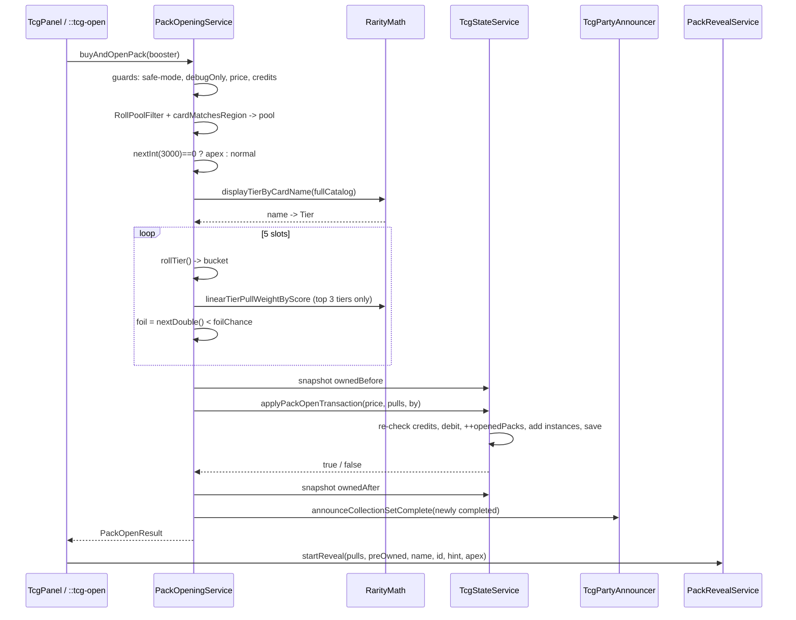

# Packs & Rarity

> **Scope:** the probability engine — how a booster pack purchase is turned into five card pulls, how rarity tiers are derived from card data, and how duplicates, set completion and public stats are computed from the result.
> **Key packages:** `com.osrstcg.service`, `com.osrstcg.data`, `com.osrstcg.model`
> **Related:** [State Model](05-state-model.md)

## Purpose

Everything a player can obtain in this plugin comes out of one method:
[`PackOpeningService.buyAndOpenPackInternal`](../src/main/java/com/osrstcg/service/PackOpeningService.java#L82).
It validates the purchase, builds the eligible card pool, rolls five cards, hands the
whole batch to `TcgStateService` as a single transaction, and returns an immutable
[`PackOpenResult`](../src/main/java/com/osrstcg/model/PackOpenResult.java) that the
sidebar and the reveal overlay render. No other code path generates pack pulls.

Rarity is not stored in `Card.json`. There is no `rarity` field on
[`CardDefinition`](../src/main/java/com/osrstcg/data/CardDefinition.java). Instead
[`RarityMath`](../src/main/java/com/osrstcg/service/RarityMath.java) *derives* a tier
for every card at runtime from its Grand Exchange `value`, its combat `level`, and an
optional `overrideScore`, by ranking cards into percentile bands **within their primary
category**. That derivation runs over the full loaded catalog and is used identically by
the collection album, the chat colour index, the pack reveal overlay, and the pack roll —
so a card's colour in the album is guaranteed to match the tier the roller used.

The two halves are deliberately separate. `RarityMath` answers *"how rare is this card?"*
and is a pure static utility with no state. `PackOpeningService` answers *"what did you
pull?"* and owns the RNG. That split is why the tier ladder can be reused for display
without accidentally coupling display code to the roller.

This document reproduces the real constants and works the real arithmetic against the
shipped `Card.json` (6,376 cards) and `Packs.json` (one pack). If you change a weight,
recompute the tables here.

## Class reference

| Class | Lines | Responsibility |
|---|---|---|
| [`PackOpeningService`](../src/main/java/com/osrstcg/service/PackOpeningService.java) | 438 | The whole buy-and-open transaction: validation, pool build, tier rolls, foil rolls, apex packs, state handoff |
| [`RarityMath`](../src/main/java/com/osrstcg/service/RarityMath.java) | 415 | Tier enum + weights, card score, percentile tiering, tie unification, pull-weight curve, reveal denominators |
| [`RollPoolFilter`](../src/main/java/com/osrstcg/service/RollPoolFilter.java) | 23 | Currently an identity pass-through over the catalog (see below) |
| [`DuplicateSellPlanner`](../src/main/java/com/osrstcg/service/DuplicateSellPlanner.java) | 163 | Decides which duplicate copies to sell and what they pay, honouring per-instance locks |
| [`DuplicateSellCredits`](../src/main/java/com/osrstcg/service/DuplicateSellCredits.java) | 36 | The score → credits conversion for sell-back |
| [`CollectionSetCompletionUtil`](../src/main/java/com/osrstcg/service/CollectionSetCompletionUtil.java) | 97 | Detects newly-completed primary-category "sets" by diffing owned-before / owned-after |
| [`TcgPublicStatsCalculator`](../src/main/java/com/osrstcg/service/TcgPublicStatsCalculator.java) | 167 | Builds the `!tcg` stat line numbers from the owned map |
| [`BoosterPackDefinition`](../src/main/java/com/osrstcg/data/BoosterPackDefinition.java) | 98 | A `Packs.json` row + the card→pack category matcher |
| [`PackCatalog`](../src/main/java/com/osrstcg/data/PackCatalog.java) | 133 | Loads and merges `Packs.json` and `PacksDebug.json` |
| [`PackOpenResult`](../src/main/java/com/osrstcg/model/PackOpenResult.java) | 37 | Immutable success/failure result of one open |
| [`PackCardResult`](../src/main/java/com/osrstcg/model/PackCardResult.java) | 10 | One pull: card name + foil flag |

## The buy-and-open transaction

[`buyAndOpenPackInternal`](../src/main/java/com/osrstcg/service/PackOpeningService.java#L82)
runs a fixed sequence. The ordering matters: **every rejection happens before any state is
touched**, and the only mutation is a single call into a `synchronized` state method.

1. [`cardDatabase.load()`](../src/main/java/com/osrstcg/service/PackOpeningService.java#L84) —
   idempotent; `CardDatabase.load` returns immediately if already loaded
   ([CardDatabase.java:48](../src/main/java/com/osrstcg/data/CardDatabase.java#L48)).
2. [`creditsBefore = stateService.getCredits()`](../src/main/java/com/osrstcg/service/PackOpeningService.java#L85) —
   captured up front so every `PackOpenResult.failed` can report a balance.
3. **Null booster** → fail ([L86](../src/main/java/com/osrstcg/service/PackOpeningService.java#L86)).
4. **Safe-mode / welcome-screen block** ([L91](../src/main/java/com/osrstcg/service/PackOpeningService.java#L91)) —
   delegates to `PackSafeModeService.isPackOpeningBlocked()`, which is true on the welcome
   screen unconditionally, and true in combat when `config.safeMode()` is on.
5. **Debug-only pack guard** ([L100](../src/main/java/com/osrstcg/service/PackOpeningService.java#L100)) —
   a `debugOnly` booster is refused unless Overview debug logging is enabled.
6. **Price sanity** ([L106](../src/main/java/com/osrstcg/service/PackOpeningService.java#L106)) —
   `price <= 0` is rejected here, which is why free packs need the `allowZeroPrice`
   overload of `applyPackOpenTransaction` and are unreachable through this method.
7. **Affordability** ([L111](../src/main/java/com/osrstcg/service/PackOpeningService.java#L111)) —
   compared against the snapshot from step 2, i.e. *outside* the state lock.
8. **Pool build** ([L116-L125](../src/main/java/com/osrstcg/service/PackOpeningService.java#L116)) —
   `RollPoolFilter.filterRollPool(catalog)` then a `cardMatchesRegion` filter per booster.
   Empty pool → fail ([L127](../src/main/java/com/osrstcg/service/PackOpeningService.java#L127)).
9. **Apex roll** ([L136](../src/main/java/com/osrstcg/service/PackOpeningService.java#L136)) — see below.
10. **Roll five cards** ([L153](../src/main/java/com/osrstcg/service/PackOpeningService.java#L153)) —
    pure computation, still no state change.
11. **Snapshot `ownedBefore`** under `synchronized (stateService)`
    ([L154-L158](../src/main/java/com/osrstcg/service/PackOpeningService.java#L154)).
12. **Commit** ([L159](../src/main/java/com/osrstcg/service/PackOpeningService.java#L159)) —
    `stateService.applyPackOpenTransaction(packPrice, pulls, pullerName)`.
13. **Set-completion announcements** ([L164-L175](../src/main/java/com/osrstcg/service/PackOpeningService.java#L164)).
14. **Re-read credits** ([L177](../src/main/java/com/osrstcg/service/PackOpeningService.java#L177))
    and build the success result ([L179](../src/main/java/com/osrstcg/service/PackOpeningService.java#L179)).

### Is it atomic?

Mostly, and deliberately so. The single mutation point is
[`TcgStateService.applyPackOpenTransaction`](../src/main/java/com/osrstcg/service/TcgStateService.java#L697),
which is `synchronized` and does all three effects in one assignment:

```java
CollectionState nextColl = state.getCollectionState().withInstancesAdded(pulled);
state = state
    .withCredits(currentCredits - packPrice)
    .withOpenedPacks(state.getEconomyState().getOpenedPacks() + 1L)
    .withCollection(nextColl);
saveMasterOnly(TcgSaveTrigger.COLLECTION_CHANGE);
```
[TcgStateService.java:739-744](../src/main/java/com/osrstcg/service/TcgStateService.java#L739)

Because `TcgState` is replaced by a single reference assignment, there is no window in
which credits are debited but cards are missing. Concretely:

- **Credit check is re-done under the lock.** Step 7 above is a lock-free snapshot, but
  [TcgStateService.java:715-719](../src/main/java/com/osrstcg/service/TcgStateService.java#L715)
  re-reads `state.getEconomyState().getCredits()` inside the `synchronized` method and
  returns `false` if it is now short. The TOCTOU race between step 7 and step 12 therefore
  cannot overdraft; it can only turn into a `"Pack transaction failed."` result
  ([L161](../src/main/java/com/osrstcg/service/PackOpeningService.java#L161)) with **no**
  credits lost and **no** cards granted.
- **Rolling happens before the debit.** If the roll produced nothing usable, the guards at
  [TcgStateService.java:700-737](../src/main/java/com/osrstcg/service/TcgStateService.java#L700)
  (`pulls` empty, every pull name blank) return `false` before any mutation.
- **Persistence is inside the lock but its failure is swallowed.** `saveMasterOnly` returns
  a boolean that `applyPackOpenTransaction` ignores. If the store fails to write, the
  in-memory state still reflects the open and the method still returns `true`. The pack is
  not rolled back — the save is simply retried on the next state change or shutdown.
- **The steps *after* the commit are not part of the transaction.** Party announcements
  ([L171](../src/main/java/com/osrstcg/service/PackOpeningService.java#L171)) and the
  `creditsAfter` re-read ([L177](../src/main/java/com/osrstcg/service/PackOpeningService.java#L177))
  happen outside any lock. If a credit award lands between the commit and L177,
  `creditsAfter` will not equal `creditsBefore - packPrice`. Nothing depends on that
  identity, but do not assert it.
- **The reveal is not part of the transaction either.** Callers start the overlay only
  after `buyAndOpenPack` returns
  ([OsrsTcgPlugin.java:745](../src/main/java/com/osrstcg/OsrsTcgPlugin.java#L745),
  [TcgPanel.java:1961](../src/main/java/com/osrstcg/ui/TcgPanel.java#L1961)). Cards are
  already owned before the first card flips — which is exactly why
  `PackSafeModeService.closeRevealForCombat` can abort a reveal and still truthfully say
  "your cards are in your collection"
  ([PackSafeModeService.java:161](../src/main/java/com/osrstcg/service/PackSafeModeService.java#L161)).

## The roll pool

[`RollPoolFilter.filterRollPool`](../src/main/java/com/osrstcg/service/RollPoolFilter.java#L15)
is, today, an **identity function**: it returns the input list unchanged, mapping only
`null`/empty to `List.of()`.

```java
public static List<CardDefinition> filterRollPool(List<CardDefinition> cards)
{
    if (cards == null || cards.isEmpty())
    {
        return List.of();
    }
    return cards;
}
```

The class javadoc explains why the class still exists: *"quest-only item rows are omitted at
`Card.json` build time"* — the exclusion was moved upstream into whatever generates
`Card.json`, and the shipped file confirms it (zero rows with `"questItem": true`). So
**no catalog card is unobtainable from packs by way of this filter**. Every one of the
6,376 shipped cards is reachable.

Keep the indirection rather than inlining `cardDatabase.getCards()`. It is the designated
seam, and three other call sites already depend on the *same* notion of "roll pool" for
their denominators — pack rolls
([PackOpeningService.java:116](../src/main/java/com/osrstcg/service/PackOpeningService.java#L116)),
public stats
([TcgPublicStatsCalculator.java:73](../src/main/java/com/osrstcg/service/TcgPublicStatsCalculator.java#L73)),
and the reveal overlay's pool size
([PackRevealService.java:632](../src/main/java/com/osrstcg/service/PackRevealService.java#L632)).
If they diverge, completion percentages stop summing to 100%.

### Pack category filters

A booster narrows the pool via
[`BoosterPackDefinition.cardMatchesRegion`](../src/main/java/com/osrstcg/data/BoosterPackDefinition.java#L45).
An **empty** `category` array means universal — every roll-eligible card matches
([L51](../src/main/java/com/osrstcg/data/BoosterPackDefinition.java#L51)). Otherwise the
filters are OR'd, and each filter may be an `&`-compound whose parts must *all* appear
among the card's tags ([L77](../src/main/java/com/osrstcg/data/BoosterPackDefinition.java#L77)).

The shipped `Packs.json` has exactly one entry:

```json
[
  {
    "id": "standard",
    "name": "Standard Pack",
    "category": [],
    "price": 2500,
    "thumbnail": "Pack_Standard_thumbnail.png"
  }
]
```

So in the shipped build the pack pool *is* the whole catalog. `PackCatalog.load` also tries
to merge `/PacksDebug.json` and mark those entries `debugOnly`
([PackCatalog.java:43-44](../src/main/java/com/osrstcg/data/PackCatalog.java#L43)); that
resource does not exist in this repository, so the merge contributes zero rows and
`getVisibleBoosters(true)` returns the same single pack.

## RarityMath: score

Everything starts with a scalar `score` per card
([RarityMath.java:88](../src/main/java/com/osrstcg/service/RarityMath.java#L88)):

```java
score(card) = max(valueScore, levelPart)

valueScore = card.value       (0 if null)
levelPart  = max(0, card.overrideScore)                  if overrideScore != null
           = levelBasedScore(card)                        otherwise

levelBasedScore(card) = 0                                 if card.level == null
                      = level² × 1.5                      if any category tag equals "monster"
                      = level²                            otherwise
```

The monster multiplier is `MONSTER_LEVEL_SCORE_MULT = 1.5d`
([L56](../src/main/java/com/osrstcg/service/RarityMath.java#L56)); the level term is
[`levelBasedScore`](../src/main/java/com/osrstcg/service/RarityMath.java#L74).

The `max` is the interesting part: it lets one data model cover two very different card
types. In the shipped `Card.json`, 1,227 cards are Monsters — they carry `level` and no
`value`, so their score is `level² × 1.5`. The other 5,149 are Resources with a GE `value`
and no `level`, so their score is the raw GE price. `overrideScore` is set on only 15 cards
and exists to hand-place items whose GE price does not reflect their desirability
([CardDefinition.java:17-18](../src/main/java/com/osrstcg/data/CardDefinition.java#L17)).

The foil variant applies a gentle superlinear bump
([L106](../src/main/java/com/osrstcg/service/RarityMath.java#L106)):

```java
foilAdjustedScoreRounded(card) = round(score(card) ^ 1.1)     // 0 when score <= 0
```

At score 1,000 that is 1,995 (≈2×); at 7,000,000 it is 33,853,833 (≈4.8×). The exponent
means foils are worth relatively more the rarer the card is.

## RarityMath: the display tier ladder

[`displayTierByCardName`](../src/main/java/com/osrstcg/service/RarityMath.java#L272) maps
every card name to a `Tier`. This is the single source of truth for album colours, chat
colours, reveal colours, apex eligibility, and pack tier partitioning. The algorithm:

1. **Group by primary category.** `getPrimaryCategory` is the first category tag,
   `&`-expanded, lower-cased, then title-cased
   ([CardDefinition.java:28](../src/main/java/com/osrstcg/data/CardDefinition.java#L28)).
   The shipped catalog has exactly **two** categories: `Resource` (5,149) and
   `Monster` (1,227).
2. **Pull out the low-value exemptions.** Cards with GE value exactly `0` or `1` are forced
   to `COMMON` *and removed from the percentile pool*
   ([`isLowValueTierExempt`](../src/main/java/com/osrstcg/service/RarityMath.java#L151),
   applied at [L297](../src/main/java/com/osrstcg/service/RarityMath.java#L297)). 1,020 shipped
   cards hit this. Removing rather than merely capping them is the point — otherwise a
   thousand worthless items would shove the real cutoffs upward.
3. **Sort ascending by score and assign a percentile**
   ([L313-L321](../src/main/java/com/osrstcg/service/RarityMath.java#L313)):
   ```java
   percentile = (size == 1) ? 1.0 : (double) i / (double) (size - 1);
   ```
   Note this is an *index* percentile over distinct rows, and the lowest-scoring card gets
   exactly `0.0` while the highest gets exactly `1.0`.
4. **Map percentile → tier** ([`tierForPercentile`](../src/main/java/com/osrstcg/service/RarityMath.java#L156)).
5. **Unify ties** ([`unifyTiersForValueAndScoreTies`](../src/main/java/com/osrstcg/service/RarityMath.java#L192)):
   first every card sharing the same non-null GE `value` is lifted to the best tier seen at
   that value; then every run of equal *rounded* score is lifted to the best tier in the
   run (this covers null-`value` monsters). Without this, two identical 100k items landing
   either side of a cutoff would show different colours.
6. **Global value lift** ([`unifyTiersGloballyByExactCardValue`](../src/main/java/com/osrstcg/service/RarityMath.java#L352),
   called at [L331](../src/main/java/com/osrstcg/service/RarityMath.java#L331)) — the same
   value lift again, but across *all* categories. A 1M-value Resource and a 1M-value
   Monster end up in the same tier.
7. **Re-stamp the exemptions to COMMON** ([L333-L343](../src/main/java/com/osrstcg/service/RarityMath.java#L333)),
   because step 6 could otherwise have lifted a value-1 card.

### Percentile cutoffs

| Percentile ≥ | Tier | Nominal band width |
|---|---|---|
| 0.98 | Godly | 2% |
| 0.95 | Mythic | 3% |
| 0.90 | Legendary | 5% |
| 0.75 | Epic | 15% |
| 0.50 | Rare | 25% |
| 0.25 | Uncommon | 25% |
| — | Common | 25% |

[RarityMath.java:157-182](../src/main/java/com/osrstcg/service/RarityMath.java#L157)

### What the shipped catalog actually produces

Running the algorithm above over the 6,376 shipped cards:

| Tier | Cards | % of catalog | Nominal band |
|---|---:|---:|---:|
| Common | 2,319 | 36.37% | 25% |
| Uncommon | 1,352 | 21.20% | 25% |
| Rare | 1,361 | 21.35% | 25% |
| Epic | 800 | 12.55% | 15% |
| Legendary | 234 | 3.67% | 5% |
| Mythic | 201 | 3.15% | 3% |
| Godly | 109 | 1.71% | 2% |

The bands do not land on their nominal widths, and that is expected: the 1,020 exempt cards
all pile into Common, and the two tie-unification passes drag cards *upward* only. **The
tier populations are an output of the data, not a design target** — they will shift the
moment `Card.json` changes.

## The tier roll

Pack rolls do **not** use the tier populations. They use a fixed marginal weight table.
The authoritative numbers live twice, and they must agree:

```java
// RarityMath.Tier — the declared marginal chance, used for reveal "1 in N"
COMMON    ("Common",    0xFFFFFF, 37.34d)
UNCOMMON  ("Uncommon",  0x2ECC71, 32.00d)
RARE      ("Rare",      0x3498DB, 16.00d)
EPIC      ("Epic",      0x9B59B6,  8.00d)
LEGENDARY ("Legendary", 0xE74C3C,  4.00d)
MYTHIC    ("Mythic",    0xFF6EC7,  2.00d)
GODLY     ("Godly",     0xF2C94C,  0.66d)
```
[RarityMath.java:17-23](../src/main/java/com/osrstcg/service/RarityMath.java#L17)

```java
// PackOpeningService.rollTier() — the actual sampler, cumulative thresholds on [0,100)
double roll = random.nextDouble() * 100.0d;
if (roll <  0.66d) return GODLY;
if (roll <  2.66d) return MYTHIC;
if (roll <  6.66d) return LEGENDARY;
if (roll < 14.66d) return EPIC;
if (roll < 30.66d) return RARE;
if (roll < 62.66d) return UNCOMMON;
return COMMON;
```
[PackOpeningService.java:382-410](../src/main/java/com/osrstcg/service/PackOpeningService.java#L382)

A "weight" here is already a percentage — there is no normalisation step. The sampler's
band width is the difference of consecutive thresholds, and it reproduces the enum table
exactly:

| Tier | Threshold | Band = weight | Probability per card slot | 1 in N slots |
|---|---:|---:|---:|---:|
| Godly | `< 0.66` | 0.66 − 0.00 = **0.66** | 0.66% | 151.5 |
| Mythic | `< 2.66` | 2.66 − 0.66 = **2.00** | 2.00% | 50.0 |
| Legendary | `< 6.66` | 6.66 − 2.66 = **4.00** | 4.00% | 25.0 |
| Epic | `< 14.66` | 14.66 − 6.66 = **8.00** | 8.00% | 12.5 |
| Rare | `< 30.66` | 30.66 − 14.66 = **16.00** | 16.00% | 6.25 |
| Uncommon | `< 62.66` | 62.66 − 30.66 = **32.00** | 32.00% | 3.125 |
| Common | else | 100.00 − 62.66 = **37.34** | 37.34% | 2.678 |
| | | **sum 100.00** | **100.00%** | |

The ladder is a clean doubling from Godly up to Uncommon (0.66 is Mythic/3), with Common
absorbing the remainder. If you retune, keep both tables in sync — nothing in the code
asserts they match, and a mismatch silently produces reveal text that lies about the odds.

### Picking a card inside the tier

[`pickByTierChance`](../src/main/java/com/osrstcg/service/PackOpeningService.java#L289)
rolls a tier, then looks up that tier's bucket in a pre-built
`EnumMap<Tier, List<CardDefinition>>`
([`partitionRegionalByGlobalTier`](../src/main/java/com/osrstcg/service/PackOpeningService.java#L272)).
If the bucket is **empty for this booster's pool**, it rerolls — up to 8 attempts
([L297](../src/main/java/com/osrstcg/service/PackOpeningService.java#L297)) — and then falls
back to a uniform draw over the entire regional pool
([L307](../src/main/java/com/osrstcg/service/PackOpeningService.java#L307)).

This retry loop is the one place where advertised odds and real odds can diverge. For the
shipped Standard Pack every tier is populated, so it never fires. For a hypothetical narrow
regional pack with, say, no Godly cards, the 0.66% Godly mass is redistributed across the
other tiers on reroll, and the residual `(missing mass)^8` lands on the uniform fallback —
which ignores tiers entirely.

Within a populated bucket, selection depends on the tier
([`tierUsesScoreWeightedPull`](../src/main/java/com/osrstcg/service/PackOpeningService.java#L310)):

- **Common / Uncommon / Rare / Epic** — uniform:
  `tierCards.get(random.nextInt(tierCards.size()))`
  ([L325](../src/main/java/com/osrstcg/service/PackOpeningService.java#L325)).
- **Legendary / Mythic / Godly** — score-weighted, so that the flashiest card in a tier is
  meaningfully harder to hit than the least flashy one.

The weight curve is
[`RarityMath.linearTierPullWeightByScore`](../src/main/java/com/osrstcg/service/RarityMath.java#L123):

```java
invR = 1 / rarityRatio                     // rarityRatio clamped to >= 1
t    = clamp01((score - minScore) / (maxScore - minScore))
w    = 1 - (1 - invR) * t                  // 1.0 at minScore, invR at maxScore
                                           // returns 1.0 when maxScore <= minScore
```

with `rarityRatio = TOP_TIER_SCORE_PULL_RARITY_RATIO = 3.0d`
([PackOpeningService.java:30](../src/main/java/com/osrstcg/service/PackOpeningService.java#L30)).
So the *lowest*-scoring card in the tier gets weight 1.0 and the highest gets 1/3 — the top
card is exactly 3× rarer than the bottom card, linear in score in between. Selection is a
standard cumulative walk over the weights
([L366-L376](../src/main/java/com/osrstcg/service/PackOpeningService.java#L366)) with a
last-element fallback for floating-point drift.

Against the shipped catalog:

| Tier | Cards | min score | max score | Σ weights | Chance of the *cheapest* card, in-tier | Chance of the *priciest* card, in-tier |
|---|---:|---:|---:|---:|---:|---:|
| Legendary | 234 | 120,000 | 450,000 | 193.687 | 0.5163% | 0.1721% |
| Mythic | 201 | 216,600 | 2,250,000 | 162.860 | 0.6140% | 0.2047% |
| Godly | 109 | 788,438 | 15,000,000 | 99.522 | 1.0048% | 0.3349% |

Multiplying by the tier weight gives the true per-slot chance of a specific card:

| Tier | Cards | Per-card chance per slot | 1 in N slots |
|---|---:|---:|---:|
| Common | 2,319 | 37.34% / 2,319 = 0.016102% | 6,210 |
| Uncommon | 1,352 | 32.00% / 1,352 = 0.023669% | 4,225 |
| Rare | 1,361 | 16.00% / 1,361 = 0.011756% | 8,506 |
| Epic | 800 | 8.00% / 800 = 0.010000% | 10,000 |
| Legendary (cheapest) | 234 | 0.020652% | 4,842 |
| Legendary (priciest) | 234 | 0.006884% | 14,527 |
| Mythic (cheapest) | 201 | 0.012280% | 8,143 |
| Mythic (priciest) | 201 | 0.004093% | 24,429 |
| Godly (cheapest — `Zulrah`) | 109 | 0.006632% | 15,079 |
| Godly (priciest — `Gnome child`) | 109 | 0.002211% | 45,237 |

Note the inversion: **Uncommon is a more likely per-card draw than Common** (0.0237% vs
0.0161%), because Common holds 2,319 cards to Uncommon's 1,352. Tier weight is a *tier*
budget, not a per-card one.

### Reveal-time "1 in N"

The reveal overlay shows an approximate rarity per card from
[`denominatorForTierCard`](../src/main/java/com/osrstcg/service/RarityMath.java#L409):

```java
denominator = max(1, round(max(1, cardsInTier) / max(0.0001, tierChancePercent / 100)))
```

`cardsInTier` is the population over the **whole catalog**, not the pack's pool
([PackRevealService.java:646-654](../src/main/java/com/osrstcg/service/PackRevealService.java#L646)),
and it assumes uniform selection inside the tier. For the four uniform tiers it is exact
(6,210 / 4,225 / 8,506 / 10,000 — matching the table above). For the three weighted tiers it
is an average: it prints 1 in 5,850 for Legendary, 1 in 10,050 for Mythic, 1 in 16,515 for
Godly, where the real range is 4,842–14,527 / 8,143–24,429 / 15,079–45,237.

## Foil rolls

Foil is an independent Bernoulli trial per slot, decided *after* the card is chosen
([PackOpeningService.java:200](../src/main/java/com/osrstcg/service/PackOpeningService.java#L200)):

```java
int foilPercent = stateService.getState().getRewardTuning().getFoilChancePercent();
double foilChance = Math.min(1.0,
    Math.max(0.0, Math.min(100, foilPercent)) / 100.0 * Math.max(0.0, foilChanceMultiplier));
...
boolean foil = random.nextDouble() < foilChance;
```
[PackOpeningService.java:191-200](../src/main/java/com/osrstcg/service/PackOpeningService.java#L191)

`foilChancePercent` defaults to **1** (i.e. 1%) —
`RewardTuningState.DEFAULTS = new RewardTuningState(1, 1.0, 1.0, 1.0)`
([RewardTuningState.java:8](../src/main/java/com/osrstcg/model/RewardTuningState.java#L8)) —
and is clamped to `[0, 100]` on construction
([L55](../src/main/java/com/osrstcg/model/RewardTuningState.java#L55)). It is editable from
the sidebar only while the collection is empty, and any non-default tuning flags the public
stat line as `(custom rates)`.

The double clamp is belt-and-braces: `Math.min(100, foilPercent)` handles a corrupt saved
value, and the outer `Math.min(1.0, …)` handles the apex multiplier pushing past 100%.

Foil does not affect which card you got, only its variant. Foil and non-foil copies of the
same name are distinct keys in the owned map
([`CardCollectionKey`](../src/main/java/com/osrstcg/model/CardCollectionKey.java) is
`(cardName, foil)`), but count as the same card for collection completion.

## Apex packs

An "apex pack" is a rare whole-pack upgrade: **all five slots** are restricted to the top
three display tiers, foil odds are multiplied by 5, and at least one foil is guaranteed.

```java
private static final int    APEX_PACK_CHANCE_DENOMINATOR   = 3000;
private static final double APEX_PACK_FOIL_CHANCE_MULTIPLIER = 5.0d;
```
[PackOpeningService.java:33,36](../src/main/java/com/osrstcg/service/PackOpeningService.java#L33)

```java
boolean rollApex = forceApexPack || random.nextInt(APEX_PACK_CHANCE_DENOMINATOR) == 0;
```
[PackOpeningService.java:136](../src/main/java/com/osrstcg/service/PackOpeningService.java#L136)

`random.nextInt(3000) == 0` is a flat **1 in 3,000** per pack (0.0333%). At the shipped
2,500-credit price that is 7,500,000 credits of expected spend per apex pack.

When the roll hits, the pool is narrowed by
[`topThreeDisplayTierSubset`](../src/main/java/com/osrstcg/service/PackOpeningService.java#L233)
to cards whose *global* display tier is Legendary, Mythic or Godly — 544 of the 6,376
shipped cards. Tiers are then sampled by
[`rollTierApexPackOnly`](../src/main/java/com/osrstcg/service/PackOpeningService.java#L416),
which reuses the top segment of the normal ladder rescaled to its own total:

```java
double roll = random.nextDouble() * 6.66d;
if (roll < 0.66d) return GODLY;
if (roll < 2.66d) return MYTHIC;
return LEGENDARY;
```

| Tier | Band | Share of an apex slot |
|---|---:|---:|
| Godly | 0.66 / 6.66 | 9.910% |
| Mythic | 2.00 / 6.66 | 30.030% |
| Legendary | 4.00 / 6.66 | 60.060% |

Relative odds inside the top three are preserved exactly; only the total is renormalised
from 6.66% to 100%. Within a tier the same 3:1 score weighting applies, since all three
apex tiers are score-weighted.

Foil chance becomes `1% × 5 = 5%` per slot, and after the five slots are rolled,
[`ensureAtLeastOneFoil`](../src/main/java/com/osrstcg/service/PackOpeningService.java#L211)
runs — if no slot came up foil, one random slot is rewritten as foil. So an apex pack has
`P(foil) = 5%` per slot *plus* a guaranteed minimum of one:

```
E[foils] = 5 x 0.05 + P(zero foils) x 1
         = 0.25 + 0.95^5
         = 0.25 + 0.77378
         = 1.024
```

### The debug apex path

[`buyAndOpenApexPackForDebug`](../src/main/java/com/osrstcg/service/PackOpeningService.java#L77)
is reachable from the `::tcg-apex` chat command, which itself requires Overview debug mode
([OsrsTcgPlugin.java:564-575](../src/main/java/com/osrstcg/OsrsTcgPlugin.java#L564)) and
opens the *first visible booster*
([OsrsTcgPlugin.java:698-708](../src/main/java/com/osrstcg/OsrsTcgPlugin.java#L698)).

It differs from a normal open in exactly two ways:

1. `forceApexPack = true` short-circuits the `1/3000` roll
   ([L136](../src/main/java/com/osrstcg/service/PackOpeningService.java#L136)).
2. If the booster's pool contains **no** Legendary/Mythic/Godly cards, the open **fails**
   with `"No Legendary, Mythic, or Godly cards in this booster for an apex pack."`
   ([L146-L150](../src/main/java/com/osrstcg/service/PackOpeningService.java#L146)) instead
   of silently degrading. A *natural* apex roll in that situation degrades: `apexPool` is
   empty, `forceApexPack` is false, so the `else if` is skipped and the pack proceeds as an
   ordinary open. The player never learns they burned a 1/3000 roll.

Everything else is identical — and note that **the debug path still charges full price** and
still writes to the real collection. The only marker is that
`applyPackOpenTransaction` tags the provenance with `DEBUG_` whenever debug logging is on
([TcgStateService.java:722-723](../src/main/java/com/osrstcg/service/TcgStateService.java#L722)),
which is what lets `TcgPublicStatsCalculator.computeForShare` strip those rows from public
uploads.

## Pity / bad-luck protection

**There is none.** Every slot is an independent draw from the same distribution; nothing in
`PackOpeningService` reads a counter, a streak, or any prior-open state. The only two
mechanisms that *look* like pity are not:

- [`ensureAtLeastOneFoil`](../src/main/java/com/osrstcg/service/PackOpeningService.java#L211)
  applies **only** to apex packs, and only within the current pack.
- The 8-attempt reroll in
  [`pickByTierChance`](../src/main/java/com/osrstcg/service/PackOpeningService.java#L297) is
  pool-coverage handling, not luck compensation — it fires only when a tier bucket is empty
  for the booster's category filter.

If you add pity, the state must live in `TcgState` (so it survives a restart and is covered
by the save codec) and be read and written inside `applyPackOpenTransaction`, not in the
roller — otherwise a failed transaction would consume pity progress.

## Worked example: one Standard Pack

Setup: `Standard Pack`, `price 2500`, `category []`, default reward tuning (`foil 1%`),
shipped catalog. `RollPoolFilter` is identity and the category filter is universal, so the
pool is all 6,376 cards and all seven tier buckets are non-empty.

The pack costs 2,500 credits. Balance is checked twice — once optimistically at
[L111](../src/main/java/com/osrstcg/service/PackOpeningService.java#L111), once under the
lock at [TcgStateService.java:716](../src/main/java/com/osrstcg/service/TcgStateService.java#L716).

`random.nextInt(3000) == 0` fails 2999/3000 of the time; assume it does. `apexTopThreeTierOnly`
stays `false` and `foilChanceMultiplier` stays `1.0`, so `foilChance = 0.01`.

Then five identical, independent iterations of the loop at
[L197-L202](../src/main/java/com/osrstcg/service/PackOpeningService.java#L197):

```
slot i:
  tier   <- rollTier()                      # 100-wide cumulative bands
  card   <- pickFromTierList(bucket[tier], tier)
              uniform            if tier in {COMMON, UNCOMMON, RARE, EPIC}
              3:1 score-weighted if tier in {LEGENDARY, MYTHIC, GODLY}
  foil   <- random.nextDouble() < 0.01
  pulls += PackCardResult(card.name, foil)
```

Expected distribution over the 5 slots:

| Tier | P(slot) | Expected count in a 5-card pack | P(at least one in pack) = 1 − (1−p)⁵ |
|---|---:|---:|---:|
| Common | 37.34% | 1.867 | 90.28% |
| Uncommon | 32.00% | 1.600 | 85.44% |
| Rare | 16.00% | 0.800 | 57.85% |
| Epic | 8.00% | 0.400 | 34.09% |
| Legendary | 4.00% | 0.200 | 18.46% |
| Mythic | 2.00% | 0.100 | 9.61% |
| Godly | 0.66% | 0.033 | 3.26% |

Derived pack-level numbers:

```
P(at least one Legendary-or-better) = 1 - (1 - 0.0666)^5 = 1 - 0.93340^5 = 29.150%
P(at least one Godly)               = 1 - (1 - 0.0066)^5 = 1 - 0.99340^5 =  3.257%
P(at least one foil)                = 1 - 0.99^5                          =  4.901%
Expected foils per pack             = 5 x 0.01                            =  0.05
P(pack is apex)                     = 1 / 3000                            =  0.0333%
```

A concrete outcome, say `[Common, Uncommon, Uncommon, Rare, Mythic]` with slot 4 foil, becomes
five `PackCardResult` rows. `applyPackOpenTransaction` converts them to five
`OwnedCardInstance` rows via `OwnedCardInstance.createNew(name, foil, by, now)`
([TcgStateService.java:732](../src/main/java/com/osrstcg/service/TcgStateService.java#L732)) —
**duplicates are kept as separate instances**, they are not collapsed into a quantity — then
debits 2,500, increments `openedPacks`, and swaps in the new state.

For comparison, the same five slots inside an apex pack:

| Tier | P(apex slot) | Expected count |
|---|---:|---:|
| Legendary | 60.060% | 3.003 |
| Mythic | 30.030% | 1.502 |
| Godly | 9.910% | 0.496 |

with `P(at least one Godly) = 1 − (1 − 0.09910)⁵ = 1 − 0.59345 = 40.65%`, foil chance 5% per
slot, and at least one foil guaranteed.

## Duplicate handling

Sell-back is entirely **user-initiated**. Nothing in the pack path calls the planner; opening
a pack that produces a duplicate simply stores another instance.

### The credit formula

[`DuplicateSellCredits`](../src/main/java/com/osrstcg/service/DuplicateSellCredits.java):

```java
public static final long SCORE_DIVISOR = 200L;
public static final long MIN_CREDITS   = 10L;

creditsForRoundedScore(score) = max(10, score / 200)          // integer division

creditsForCard(card, foil) = 10                               if card == null
                           = creditsForRoundedScore(round(RarityMath.score(card)))        if !foil
                           = creditsForRoundedScore(RarityMath.foilAdjustedScoreRounded(card))  if foil
```
[DuplicateSellCredits.java:8-35](../src/main/java/com/osrstcg/service/DuplicateSellCredits.java#L8)

There is **no rarity-tier branch** — tier never enters the formula. Payout is a pure function
of score, and since tier is itself a percentile of score, the rate rises smoothly with rarity
rather than stepping. The foil bonus is the `^1.1` curve, which is why it widens with score:

| Card score | Normal payout | Foil score (`round(s^1.1)`) | Foil payout | Foil multiple |
|---:|---:|---:|---:|---:|
| 1 (e.g. `10th birthday cape`) | 10 (floor) | 1 | 10 (floor) | 1.0× |
| 1,000 | 10 (floor) | 1,995 | 10 (floor) | 1.0× |
| 2,000 | 10 (floor) | 4,277 | 21 | 2.1× |
| 5,000 | 25 | 11,718 | 58 | 2.3× |
| 100,000 | 500 | 316,228 | 1,581 | 3.2× |
| 1,000,000 | 5,000 | 3,981,072 | 19,905 | 4.0× |
| 7,000,000 (`Twisted bow`) | 35,000 | 33,853,833 | 169,269 | 4.8× |
| 15,000,000 (`Gnome child`) | 75,000 | 78,288,935 | 391,444 | 5.2× |

The `MIN_CREDITS = 10` floor swallows everything under score 2,000, which is most of the
Common tier. Note also the integer division: score 399 and score 0 both pay 10.

### What the planner computes

[`DuplicateSellPlanner.plan`](../src/main/java/com/osrstcg/service/DuplicateSellPlanner.java#L53)
takes the flat list of owned instances plus a name→`CardDefinition` lookup and returns a
`Result` of `(kept, creditsToAdd, cardsSold)`. It does **not** mutate anything — it is a pure
planner, and the caller applies it. Per card name:

1. Only one copy? Keep it, skip ([L78](../src/main/java/com/osrstcg/service/DuplicateSellPlanner.java#L78)).
2. **Locked instances are always kept** and never counted as sellable
   ([L92-L101](../src/main/java/com/osrstcg/service/DuplicateSellPlanner.java#L92)). They do
   not act as the "keeper" for the unlocked pool either — that pool picks its own.
3. Split the unlocked copies into foils and normals.
4. If **any** copy of this name is foil (locked or not,
   [L117](../src/main/java/com/osrstcg/service/DuplicateSellPlanner.java#L117)):
   - Keep the **newest** unlocked foil (by `pulledAtEpochMs`,
     [`newest`](../src/main/java/com/osrstcg/service/DuplicateSellPlanner.java#L157)); sell
     every other unlocked foil at the foil rate.
   - Sell **every** unlocked normal at the normal rate — no normal keeper is retained,
     because a foil already covers the album slot.
5. Otherwise (no foil anywhere): keep the newest unlocked normal, sell the rest.

[`hasSellableDuplicates`](../src/main/java/com/osrstcg/service/DuplicateSellPlanner.java#L48)
is the same computation with a null card lookup — every card resolves to `MIN_CREDITS`, but
the `cardsSold` count is unaffected, so it is a cheap "is the button enabled" probe.

### Where it is invoked

- **Sidebar "Sell duplicates"** —
  [`TcgPanel.promptAndSellDuplicates`](../src/main/java/com/osrstcg/ui/TcgPanel.java#L2078)
  runs the plan, shows a `JOptionPane` confirmation naming the exact card count and credit
  total ([L2098](../src/main/java/com/osrstcg/ui/TcgPanel.java#L2098)), and only on *Yes*
  calls `setCollectionInstances(plan.getKept())` followed by `addCredits(creditsToAdd)`
  ([L2109-L2113](../src/main/java/com/osrstcg/ui/TcgPanel.java#L2109)). The button's enabled
  state comes from `hasSellableDuplicates`
  ([L2070](../src/main/java/com/osrstcg/ui/TcgPanel.java#L2070)).
- **Album single-card sell** —
  [`CollectionAlbumWindow.sellCreditsForChosenInstance`](../src/main/java/com/osrstcg/ui/collectionalbum/CollectionAlbumWindow.java#L1942)
  uses `DuplicateSellCredits.creditsForCard` directly for the selected instance, bypassing
  the planner entirely. Same formula, no keeper logic.

Note that the two-step apply in `promptAndSellDuplicates` is **not** atomic: it is a
`setCollectionInstances` followed by a separate `addCredits`, each `synchronized` on its own.
A crash between them loses the credits but keeps the cards removed.

## Set completion

[`CollectionSetCompletionUtil`](../src/main/java/com/osrstcg/service/CollectionSetCompletionUtil.java)
answers "did this pack finish a set?" by diffing two owned-map snapshots. A **set** is a
*primary category* — the same grouping `RarityMath` uses for tiering. In the shipped catalog
that means there are exactly **two** sets, `Resource` (5,149 cards) and `Monster` (1,227),
so in practice completion fires approximately never.

```java
collectedNamesFromOwned(owned)      // names whose foil + non-foil quantities sum to > 0
completedPrimaryCategoryNames(...)  // categories where EVERY rollPool card of that category is collected
newlyCompletedPrimaryCategories(before, after, rollPool) = after \ before
```
[CollectionSetCompletionUtil.java:24,55,89](../src/main/java/com/osrstcg/service/CollectionSetCompletionUtil.java#L24)

Two details matter. First, foil and non-foil are **merged** before the `> 0` test
([L39](../src/main/java/com/osrstcg/service/CollectionSetCompletionUtil.java#L39)) — you do
not need a foil of every card. Second, membership is `rollPool`, not the raw catalog, so a
card excluded from rolls would also be excluded from the completion requirement. Since
`RollPoolFilter` is identity today, those are the same list.

`PackOpeningService` snapshots `ownedBefore` *before* the transaction
([L154-L158](../src/main/java/com/osrstcg/service/PackOpeningService.java#L154)) and
`ownedAfter` immediately after ([L166-L170](../src/main/java/com/osrstcg/service/PackOpeningService.java#L166)),
both under `synchronized (stateService)`, then announces each newly-completed category to the
party ([L171-L174](../src/main/java/com/osrstcg/service/PackOpeningService.java#L171)).
`TcgPartyAnnouncer.announceCollectionSetComplete` no-ops if announcements are disabled or the
player is not in a party
([TcgPartyAnnouncer.java:27-40](../src/main/java/com/osrstcg/service/TcgPartyAnnouncer.java#L27)).

The `ownedAfter` snapshot is taken in a *separate* lock acquisition from the transaction, so
another thread's collection change can slip between them. That can only produce an extra
announcement, never a missed one, and the whole announcer block is skipped when
`partyAnnouncer == null` ([L164](../src/main/java/com/osrstcg/service/PackOpeningService.java#L164)).

## Public `!tcg` stats

[`TcgPublicStatsCalculator.compute`](../src/main/java/com/osrstcg/service/TcgPublicStatsCalculator.java#L70)
produces a [`TcgPublicStats`](../src/main/java/com/osrstcg/model/TcgPublicStats.java) from an
owned map, an opened-pack count and a custom-rates flag. Every number is filtered through
`rollPoolNames` so cards outside the roll pool cannot inflate a percentage:

| Field | Computation | Source |
|---|---|---|
| `totalCardPool` | `rollPool.size()` (6,376 shipped) | [L101](../src/main/java/com/osrstcg/service/TcgPublicStatsCalculator.java#L101) |
| `uniqueOwned` | distinct names with summed qty > 0, intersected with roll pool | [L84](../src/main/java/com/osrstcg/service/TcgPublicStatsCalculator.java#L84) |
| `totalCardsOwned` | sum of all quantities for roll-pool names (counts duplicates) | [L87](../src/main/java/com/osrstcg/service/TcgPublicStatsCalculator.java#L87) |
| `uniqueFoilOwned` | count of `(name, foil=true)` keys with qty > 0 in the roll pool | [L91](../src/main/java/com/osrstcg/service/TcgPublicStatsCalculator.java#L91) |
| `completionPct` | `100 × uniqueOwned / totalCardPool` (0 when pool empty) | [L102](../src/main/java/com/osrstcg/service/TcgPublicStatsCalculator.java#L102) |
| `foilCompletionPct` | `100 × uniqueFoilOwned / totalCardPool` | [L103](../src/main/java/com/osrstcg/service/TcgPublicStatsCalculator.java#L103) |
| `collectionScore` | per owned name: `foilAdjustedScoreRounded` if any foil copy owned, else `round(score)` | [L114-L128](../src/main/java/com/osrstcg/service/TcgPublicStatsCalculator.java#L114) |
| `openedPacks` | `economyState.getOpenedPacks()` | [L43](../src/main/java/com/osrstcg/service/TcgPublicStatsCalculator.java#L43) |
| `customRates` | `!rewardTuning.isDefault()` | [L44](../src/main/java/com/osrstcg/service/TcgPublicStatsCalculator.java#L44) |

`collectionScore` counts each *name* once, not each copy — a second copy adds nothing, and
owning any foil upgrades the whole name to the foil-adjusted score. The definition lookup is
case-insensitive (`defByLower`, [L106-L113](../src/main/java/com/osrstcg/service/TcgPublicStatsCalculator.java#L106))
even though the owned-map filter above it is case-*sensitive*; a name whose case drifted would
be counted in `uniqueOwned` but could still resolve for score, or vice versa.

Two entry points:
[`computeLive()`](../src/main/java/com/osrstcg/service/TcgPublicStatsCalculator.java#L34) reads
the current state, while
[`computeForShare(CollectionState)`](../src/main/java/com/osrstcg/service/TcgPublicStatsCalculator.java#L53)
first calls `withoutDebugProvenanceRows()` so the numbers match the card array actually
uploaded — i.e. `::tcg-give` / `::tcg-complete` / debug-mode pulls do not appear in shared
stats, but *do* appear in the local sidebar.

The rendered line is built by
[`TcgChatStatsShareService.buildFormattedLine`](../src/main/java/com/osrstcg/service/TcgChatStatsShareService.java#L113)
in coloured and plain variants, percentages at one decimal:

```
Collection score: 12,345 (1.2%), Unique cards: 78 / 6,376 (1.2%),
Unique foil cards: 3 / 6,376 (0.0%), Opened packs: 40, Total cards: 200
```

`(custom rates)` is appended when the tuning is non-default
([L160](../src/main/java/com/osrstcg/service/TcgChatStatsShareService.java#L160)). Stats for
*other* players come from a 15-minute TTL cache keyed by sanitized RSN
([L23](../src/main/java/com/osrstcg/service/TcgChatStatsShareService.java#L23)), populated
from party broadcasts — there is no HTTP lookup.

One quirk worth knowing: the `Unique cards` group prints `pct` (the *card* completion
percentage) both before and after itself
([L127-L140](../src/main/java/com/osrstcg/service/TcgChatStatsShareService.java#L127)), so the
score parenthetical and the unique-cards parenthetical always show the same number.

## Randomness source

`PackOpeningService` holds a single `java.util.Random` field, created **unseeded** by the
injected constructor:

```java
@Inject
public PackOpeningService(CardDatabase cardDatabase, TcgStateService stateService, Client client,
    TcgPartyAnnouncer partyAnnouncer, PackSafeModeService packSafeModeService)
{
    this(cardDatabase, stateService, client, partyAnnouncer, packSafeModeService, new Random());
}
```
[PackOpeningService.java:45-50](../src/main/java/com/osrstcg/service/PackOpeningService.java#L45)

A package-private overload accepts an injected `Random`
([L52-L61](../src/main/java/com/osrstcg/service/PackOpeningService.java#L52)) — the seam exists
precisely so a test can pass `new Random(seed)` and assert exact pulls. **No test currently
uses it**: `src/test` contains only `OsrsTcgPluginTest` (a `loadBuiltin` smoke test),
`TcgStateCodecTest` and `TcgStateMigrationTest`. The probability engine is untested.

Testability implications if you do write those tests:

- The service is `@Singleton`, so one `Random` instance is shared across the whole session
  and consumed in a strict order: apex roll → (per slot) tier roll → in-tier weighted draw →
  foil roll → possibly `ensureAtLeastOneFoil`'s index. Insert or remove any `random.*` call
  and every seeded expectation downstream shifts.
- `java.util.Random` is **not** thread-safe. It is not synchronized here and, as noted under
  Threading, it is reachable from two different threads. `Random`'s internal `AtomicLong`
  seed means this cannot corrupt the generator, but it does make two concurrent opens
  non-deterministic even under a fixed seed.
- `PackRevealService` uses a *different* source — `ThreadLocalRandom.current()` — to shuffle
  reveal order ([PackRevealService.java:262](../src/main/java/com/osrstcg/service/PackRevealService.java#L262)).
  Seeding the service's `Random` does not make the on-screen ordering deterministic, only the
  contents.
- `CardDatabase` and `PackCatalog` both expose `setCardsForTesting` / `setBoostersForTesting`
  ([CardDatabase.java:101](../src/main/java/com/osrstcg/data/CardDatabase.java#L101),
  [PackCatalog.java:78](../src/main/java/com/osrstcg/data/PackCatalog.java#L78)), so a test can
  install a tiny synthetic catalog with predictable scores rather than fighting the 6,376-card
  real one.

## Data flow



## Threading

| Entry point | Thread | Notes |
|---|---|---|
| `TcgPanel` booster buy button | **Swing EDT** | `ActionListener` calls `buyAndOpenPack` inline ([TcgPanel.java:1954](../src/main/java/com/osrstcg/ui/TcgPanel.java#L1954)) |
| `::tcg-open`, `::tcg-apex` | **client thread** | `@Subscribe onCommandExecuted` → `handleOpenFirstBoosterCommand` ([OsrsTcgPlugin.java:698](../src/main/java/com/osrstcg/OsrsTcgPlugin.java#L698)) |
| Credits infobox "Open" menu entry | **client thread** | `@Subscribe onOverlayMenuClicked` → `openBooster` ([OsrsTcgPlugin.java:673-695](../src/main/java/com/osrstcg/OsrsTcgPlugin.java#L673)) |
| `PackSafeModeService` combat checks | **client thread** | `onGameTick` / `onHitsplatApplied` / `onInteractingChanged` |
| "Sell duplicates" | **Swing EDT** | planner + `JOptionPane` + apply, all on the EDT |
| `TcgPublicStatsCalculator` | either | reads state under `synchronized (stateService)` |

So `buyAndOpenPackInternal` genuinely runs on **two different threads** depending on how the
player bought the pack. Consequences:

- **`localPullerDisplayName()` touches the client API off the client thread.**
  [L430-L437](../src/main/java/com/osrstcg/service/PackOpeningService.java#L430) calls
  `client.getLocalPlayer().getName()`; on the sidebar path that happens on the EDT. It is
  null-guarded, so the worst case is a stale or empty provenance name rather than a crash.
- **The shared `Random` is unsynchronized** (see above).
- **`stateService.getCredits()` is not synchronized**
  ([TcgStateService.java:511](../src/main/java/com/osrstcg/service/TcgStateService.java#L511)) —
  it reads the `state` field without the monitor. Both `creditsBefore` and `creditsAfter` are
  therefore possibly-stale reads. The authoritative check is the one inside
  `applyPackOpenTransaction`.
- `applyPackOpenTransaction`, `setCollectionInstances` and `addCredits` are all
  `synchronized` on `TcgStateService`, and `PackOpeningService` uses
  `synchronized (stateService)` for its two owned-map snapshots — the same monitor, so those
  snapshots are consistent point-in-time views.

## Gotchas & invariants

- **The two weight tables must stay in sync.** `RarityMath.Tier.chancePercent` and the
  cumulative thresholds in `rollTier()` encode the same distribution in two places with no
  cross-check. The enum drives the reveal's "1 in N"; the thresholds drive reality.
- **Tiers are per-category percentiles, so score ranges overlap globally.** Mythic reaches
  2,250,000 while Godly starts at 788,438. A higher-scoring card can sit in a lower tier.
  Do not assume tier order implies score order.
- **Tier populations are data, not design.** Common holds 2,319 cards versus Uncommon's 1,352
  because 1,020 value-0/1 cards are force-dumped there. That makes a *specific* Uncommon
  card more likely per slot than a *specific* Common one.
- **`buildGlobalTierByCard` uses an `IdentityHashMap`**
  ([L254](../src/main/java/com/osrstcg/service/PackOpeningService.java#L254)) keyed on
  `CardDefinition` object identity. It only works because `cardDatabase.getCards()` returns
  the same immutable list instances every call. If anything starts copying `CardDefinition`
  objects between the pool build and the partition, every card silently defaults to
  `Tier.COMMON` at [L267](../src/main/java/com/osrstcg/service/PackOpeningService.java#L267)
  and [L283](../src/main/java/com/osrstcg/service/PackOpeningService.java#L283).
- **`displayTierByCardName` is recomputed per open** — `buildGlobalTierByCard` calls it at
  [L260](../src/main/java/com/osrstcg/service/PackOpeningService.java#L260), and
  `topThreeDisplayTierSubset` calls `buildGlobalTierByCard` again on the apex path, so an apex
  open re-tiers all 6,376 cards **twice**. `CardDatabase` already caches colours from the same
  computation ([CardDatabase.java:140](../src/main/java/com/osrstcg/data/CardDatabase.java#L140));
  the tier map itself is not cached.
- **`pickByTierChance` can return `null`** when `fallbackPool` is empty
  ([L292-L295](../src/main/java/com/osrstcg/service/PackOpeningService.java#L292)), and
  `rollPack` immediately dereferences it at
  [L201](../src/main/java/com/osrstcg/service/PackOpeningService.java#L201). Unreachable today
  because [L127](../src/main/java/com/osrstcg/service/PackOpeningService.java#L127) rejects an
  empty pool first — but that guard is the only thing preventing an NPE.
- **The 8-attempt reroll silently distorts odds for narrow packs.** Any pack whose category
  filter empties a tier bucket redistributes that tier's probability mass, and after 8 misses
  falls back to a *uniform* draw that ignores tiers entirely. The reveal overlay will still
  quote the undistorted "1 in N".
- **`ensureAtLeastOneFoil` rebuilds the `PackCardResult`** rather than mutating it
  ([L227](../src/main/java/com/osrstcg/service/PackOpeningService.java#L227)) —
  `PackCardResult` is a Lombok `@Value`, i.e. immutable. Keep it that way; the reveal overlay
  holds references to these objects across ticks.
- **A natural apex roll on a pool with no top-tier cards degrades silently** to a normal pack
  (see the debug apex section). Only the forced/debug path surfaces the error.
- **Duplicates are stored as separate instances**, never collapsed into a count. The
  `Map<CardCollectionKey, Integer>` owned map is derived; `List<OwnedCardInstance>` is the
  truth, which is what makes per-copy locking and per-copy sell possible.
- **Locked instances never count toward "sellable"**, and a locked copy does not satisfy the
  planner's keeper requirement — if you lock your only foil and own three more unlocked foils,
  the planner keeps a *second* one ([L120-L123](../src/main/java/com/osrstcg/service/DuplicateSellPlanner.java#L120)).
- **Sell-back has no tier component.** If you want a tier-based payout, change
  `DuplicateSellCredits`, not the planner — the planner just multiplies counts by the two
  rates it is handed.
- **`MIN_CREDITS = 10` plus integer division** means every card scoring under 2,000 pays
  exactly 10, foil or not. Selling low-tier duplicates is nearly flat-rate.
- **A "set" is a primary category, of which there are two.** `newlyCompletedPrimaryCategories`
  is effectively dormant against the shipped catalog. Anyone adding finer-grained sets must
  change `getPrimaryCategory`, which would simultaneously re-tier the entire album.
- **`computeForShare` strips `DEBUG_` provenance but `computeLive` does not.** Local sidebar
  numbers and shared `!tcg` numbers legitimately disagree after any debug command.
- **Debug pack opens still charge credits and still write to the real collection.** `::tcg-apex`
  is not a free preview.

### Open questions

- `PacksDebug.json` is referenced by `PackCatalog.appendPackResource`
  ([PackCatalog.java:44](../src/main/java/com/osrstcg/data/PackCatalog.java#L44)) and gated by
  `BoosterPackDefinition.debugOnly`, but the resource is absent from this repository. Whether
  it is generated at build time, supplied out-of-band by developers, or simply vestigial could
  not be determined from the source. All regional-pack behaviour documented above
  (`cardMatchesRegion` with non-empty filters, the 8-attempt tier reroll, the apex-pool-empty
  branch) is therefore unexercised by the shipped configuration.
- `RollPoolFilter`'s javadoc states quest-only rows are removed "at `Card.json` build time",
  but the generator that produces `Card.json` is not in this repository, so the exclusion rule
  itself could not be verified beyond confirming zero `questItem: true` rows survive.
