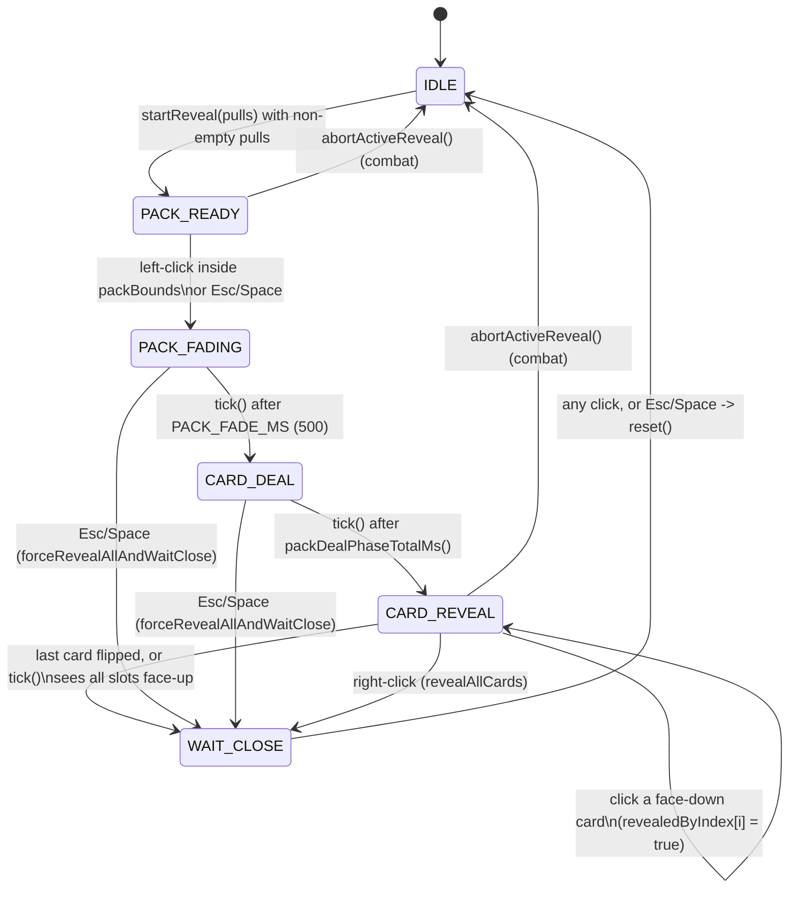

# Pack Reveal & Card Rendering

> **Scope:** the full-screen pack-opening overlay — its state machine, per-frame layout and animation maths, input capture, zoom, the shared card compositing pipeline, wiki artwork caching, and reveal audio.
> **Key packages:** `com.osrstcg.overlay`, `com.osrstcg.service`, `com.osrstcg.ui`, `com.osrstcg.util`
> **Related:** [Packs & Rarity](08-packs-and-rarity.md) · [Collection Album](11-collection-album.md) · [State Model](05-state-model.md)

## Purpose

Opening a booster pack takes over the whole game canvas. A dimmed black layer is drawn over
the client, a sealed pack sprite appears in the middle, and clicking it fades the pack out,
deals five card backs into a 2+3 grid, and then lets you click each one to flip it face up.
While that is happening, the plugin swallows every mouse and key event so a click meant for a
card never reaches the game world.

The work is split three ways. [`PackRevealService`](../src/main/java/com/osrstcg/service/PackRevealService.java)
owns the state machine and the card list; it knows nothing about pixels. [`PackRevealOverlay`](../src/main/java/com/osrstcg/overlay/PackRevealOverlay.java)
is a RuneLite `Overlay` that turns that state into geometry, draws it, and owns all the hover/zoom
animation state. [`PackRevealInputListener`](../src/main/java/com/osrstcg/overlay/PackRevealInputListener.java)
bridges AWT input into the service, asking the overlay for the current hit rectangles.

Card pixels are not drawn by the overlay itself. [`SharedCardRenderer`](../src/main/java/com/osrstcg/ui/SharedCardRenderer.java)
is a stateless static utility that composites one card face or back into an arbitrary `Rectangle`,
and it is the *same* code used by the collection album and the trade window. Artwork comes from the
OSRS Wiki through [`WikiImageCacheService`](../src/main/java/com/osrstcg/service/WikiImageCacheService.java),
which never blocks a paint call. The hot path runs on the RuneLite client thread at overlay frame
rate while input arrives on the AWT event thread and images arrive on a dedicated loader pool —
read [Threading](#threading) before changing any field.

## Class reference

| Class | Lines | Responsibility |
|---|---|---|
| [`PackRevealService`](../src/main/java/com/osrstcg/service/PackRevealService.java) | ~758 | Reveal state machine, card resolution, per-paint snapshots, party/Dink notification hooks |
| [`PackRevealOverlay`](../src/main/java/com/osrstcg/overlay/PackRevealOverlay.java) | ~1109 | Viewport fitting, card/pack layout, deal animation, glow, hover dynamics, zoom, pack sprite loading |
| [`PackRevealInputListener`](../src/main/java/com/osrstcg/overlay/PackRevealInputListener.java) | ~207 | Mouse/wheel/key capture and consumption while a reveal is active |
| [`SharedCardRenderer`](../src/main/java/com/osrstcg/ui/SharedCardRenderer.java) | ~816 | Card face/back compositing: frame, bands, art, foil sheen + sparkles, text fitting |
| [`WikiImageCacheService`](../src/main/java/com/osrstcg/service/WikiImageCacheService.java) | ~763 | Wiki image fetch, disk + memory cache, async loading, failure memoisation |
| [`PackRevealSoundService`](../src/main/java/com/osrstcg/service/PackRevealSoundService.java) | ~190 | Six one-shot WAVs, per-reveal latching, open-failure suppression |
| [`PackRevealZoomUtil`](../src/main/java/com/osrstcg/util/PackRevealZoomUtil.java) | ~20 | Single clamp for the persisted overlay zoom multiplier |
| [`GameWidgetUtil`](../src/main/java/com/osrstcg/util/GameWidgetUtil.java) | ~31 | Welcome-screen widget probe (used by pack safe-mode, not by the overlay) |

## The reveal state machine

`PackRevealService.Phase` has six values ([PackRevealService.java:29-38](../src/main/java/com/osrstcg/service/PackRevealService.java#L29)).
Every transition happens inside a `synchronized` method on the service, and the phase is only
ever changed together with `phaseStartedAt`, which is the wall-clock (`System.currentTimeMillis()`)
timestamp the phase began. Time-based transitions are evaluated lazily in `tick()`
([PackRevealService.java:403](../src/main/java/com/osrstcg/service/PackRevealService.java#L403)),
which is itself called at the top of `capturePaintFrame()`
([PackRevealService.java:442](../src/main/java/com/osrstcg/service/PackRevealService.java#L442)).
There is no game-tick or timer driver: **the overlay's own paint call is what advances time.**
If the overlay is never painted, the reveal never progresses.

The fields that together *are* the state:

| Field | Meaning |
|---|---|
| `phase` | Current `Phase`; `IDLE` means no session |
| `cards` | Immutable `List<RevealCard>`, shuffled at start ([:262](../src/main/java/com/osrstcg/service/PackRevealService.java#L262)) |
| `revealedByIndex` | `boolean[]` parallel to `cards`; the authoritative face-up flags |
| `revealedCount` | Redundant counter kept in sync with the array |
| `phaseStartedAt` | Epoch ms the current phase started; `0` means "not timed yet" |
| `dinkEndNotificationsSent` | Latch so the end-of-pack Dink payload fires exactly once |
| `apexPackOpen` | Enables the apex sealed-pack glow and hover sound |
| `scrollWheelHintUntilMs` | Epoch ms the first-pack hint stops drawing; `0` = off |
| `boosterPackId` / `boosterDisplayName` | Chooses the pack sprite and labels chat |

`isActive()` is `phase != IDLE && !cards.isEmpty()`
([:434](../src/main/java/com/osrstcg/service/PackRevealService.java#L434)) — an empty card list
is treated as inactive even if the phase somehow says otherwise.



### Entry: `startReveal`

Five overloads funnel into the six-argument form
([PackRevealService.java:215](../src/main/java/com/osrstcg/service/PackRevealService.java#L215)),
where the order of operations matters:

1. Empty/null `pulls` short-circuits to `reset()` — you cannot enter `PACK_READY` with no cards.
2. `packRevealSoundService.hardStop()` clears the previous session's audio latches *first*, so a
   back-to-back reveal can play the hum again.
3. `cardDatabase.load()` then `rebuildRarityTierIndex()`. Tier labels come from
   `RarityMath.displayTierByCardName` over the **full catalog**, deliberately not the roll pool, so
   a card shows the same tier here as in the album ([:193-197](../src/main/java/com/osrstcg/service/PackRevealService.java#L193)).
4. Each `PackCardResult` resolves to a `CardDefinition`; a missing definition gets a synthetic
   fallback with "No examine text." rather than being dropped ([:247-254](../src/main/java/com/osrstcg/service/PackRevealService.java#L247)).
5. `isNew` is computed against the `preOwnedCards` set captured *before* the pack was opened, keyed
   `lowercase(name)|0|1` ([:666](../src/main/java/com/osrstcg/service/PackRevealService.java#L666)).
6. `Collections.shuffle` — reveal order is not roll order, so slot position leaks nothing.
7. `imageCacheService.preload(...)` starts artwork fetches for all five cards.

Both call sites ([OsrsTcgPlugin.java:745](../src/main/java/com/osrstcg/OsrsTcgPlugin.java#L745),
[TcgPanel.java:1961](../src/main/java/com/osrstcg/ui/TcgPanel.java#L1961)) pass
`showScrollWheelHint = (openedPacks == 0)` — the hint is a genuine first-pack-ever affordance.

### Reveal, skip and close

`handleClick` ([:274](../src/main/java/com/osrstcg/service/PackRevealService.java#L274)) is
phase-dispatched, with one ordering trap at [:297](../src/main/java/com/osrstcg/service/PackRevealService.java#L297):
the "everything is face up → any click closes" check runs *before* the per-card flip check, and
also fires when `revealedCount >= cards.size()` even if `phase` is still `CARD_REVEAL`. That is a
deliberate desync escape hatch — if count and phase disagree, a click still closes the overlay
rather than trapping the player. Flipping a card sets the flag, plays `flip.wav`, plays the premium
chime if the card qualifies, and calls `pullNotificationService.notifyPull(...)`
([:308-323](../src/main/java/com/osrstcg/service/PackRevealService.java#L308)); the last flip also
runs `notifyDinkAtEndOnce()` and moves to `WAIT_CLOSE`.

The two skip paths differ deliberately. `revealAllCards()` (right-click,
[:336](../src/main/java/com/osrstcg/service/PackRevealService.java#L336)) refuses in `PACK_READY`,
`PACK_FADING`, `CARD_DEAL` and `WAIT_CLOSE` — you can skip the click-to-flip stage but not the deal
animation. `advanceFromKeyboard()` (Esc/Space,
[:355](../src/main/java/com/osrstcg/service/PackRevealService.java#L355)) is permissive: it opens
the pack, force-reveals from any mid-phase, and otherwise closes, returning `true` only on the
close. Both converge on `forceRevealAllAndWaitClose()`
([:385](../src/main/java/com/osrstcg/service/PackRevealService.java#L385)), which plays *one* flip
sound rather than five, announces party highlights for every still-face-down slot, plays one reveal
chime if any was premium, then sets every flag.

`abortActiveReveal()` ([:570](../src/main/java/com/osrstcg/service/PackRevealService.java#L570)) is
the combat interrupt used by `PackSafeModeService.closeRevealForCombat()`
([PackSafeModeService.java:152](../src/main/java/com/osrstcg/service/PackSafeModeService.java#L152)).
It announces unrevealed pulls, snapshots the list for the chat dump, hard-stops audio and resets.
Pack opening committed the cards to the collection long before the overlay appeared, so aborting
loses nothing but the animation.

### The paint snapshot

`capturePaintFrame()` returns an `Optional<RevealPaintSnapshot>` holding a phase, a
`List.copyOf(cards)`, an `Arrays.copyOf(revealedByIndex)`, elapsed ms, fade progress, pack id, hint
visibility and the apex flag ([:442-462](../src/main/java/com/osrstcg/service/PackRevealService.java#L442)).
The class javadoc explains why ([:51-55](../src/main/java/com/osrstcg/service/PackRevealService.java#L51)):
if the overlay held a card list from one moment and called live `isCardRevealed(i)` from another, a
concurrent `reset()` would leave it painting the old five cards with all-false flags — one frame of
every card flipping back over. The snapshot makes the pair atomic.

The overlay does not fully honour this. `updateHoverDynamics`
([PackRevealOverlay.java:505](../src/main/java/com/osrstcg/overlay/PackRevealOverlay.java#L505)) and
`withCardHoverVisualScale` ([:549](../src/main/java/com/osrstcg/overlay/PackRevealOverlay.java#L549))
call the live `revealService.isCardRevealed(i)` while the draw loop uses `snap.isCardRevealed(i)`
([:290](../src/main/java/com/osrstcg/overlay/PackRevealOverlay.java#L290)). The mismatch affects
hover scale and hit-testing only, never what is painted — but it is a real inconsistency.

## Per-frame rendering

`render(Graphics2D)` ([PackRevealOverlay.java:134](../src/main/java/com/osrstcg/overlay/PackRevealOverlay.java#L134))
is registered `OverlayPosition.DYNAMIC`, `OverlayLayer.ABOVE_WIDGETS`, `PRIORITY_HIGH`
([:114-116](../src/main/java/com/osrstcg/overlay/PackRevealOverlay.java#L114)) and always returns
`null` — it draws in absolute canvas coordinates rather than reporting a size. When
`capturePaintFrame()` is empty the overlay is idle, and that branch is not a plain early return: it
hard-stops sound (on `ForkJoinPool.commonPool()`, so audio-line teardown cannot stall the client
thread), persists the session zoom and resets hover state — but only on the active→inactive *edge*,
guarded by `packRevealSoundActiveLastFrame`
([:140-157](../src/main/java/com/osrstcg/overlay/PackRevealOverlay.java#L140)). Without that flag
you would schedule a `hardStop` task every single idle frame.

### Viewport fitting

Everything is sized from one scalar, computed by `computeViewportLayout`
([:713](../src/main/java/com/osrstcg/overlay/PackRevealOverlay.java#L713)) from base geometry at
[:40-56](../src/main/java/com/osrstcg/overlay/PackRevealOverlay.java#L40):

```
CARD_SIZE_SCALE = 0.805 * 1.25 = 1.00625
BASE_CARD_W = round(180 * 1.00625) = 181     BASE_CARD_H = round(260 * 1.00625) = 262
BASE_PACK_W = 396   BASE_PACK_H = 545        BASE_CARD_GAP = 24   VIEWPORT_MARGIN = 40

availW = max(80, canvasW - 2*40)
availH = max(80, canvasH - 2*40)
needW  = max(BASE_PACK_W, naturalGridWidth(n))
needH  = max(BASE_PACK_H, naturalGridHeight(n))
maxS   = min(availW/needW, availH/needH)
fitS   = max(MIN_OVERLAY_SCALE, min(1.0, maxS))     // MIN_OVERLAY_SCALE = 0.28
s      = max(MIN_OVERLAY_SCALE, min(maxS, fitS * zoomMultiplier))
```

`fitS` is capped at `1.0` so the pack never upscales past its native art on a huge canvas, but the
user's zoom multiplier is applied on top and re-clamped against `maxS` — so zooming in can still be
limited by canvas size. Pack and cards scale by the *same* `s`, which is why the pack and the grid
never drift relative to each other when you resize the client.

The grid is fixed at "two on top, the rest on the bottom"
([`naturalGridWidth`](../src/main/java/com/osrstcg/overlay/PackRevealOverlay.java#L686),
[`layoutCardSlots`](../src/main/java/com/osrstcg/overlay/PackRevealOverlay.java#L734)):
`topCount = min(2, n)`, `bottomCount = n - topCount`. Each row is centred independently inside the
wider row's width, and the whole block is centred in the canvas. For the usual five-card pack that
is 2 + 3. A pack with a different card count still lays out, just less symmetrically — six cards
would be 2 + 4.

### Phase-specific drawing

Every frame starts with `drawDim` — a full-canvas black fill at `AlphaComposite` 0.55, with the
composite explicitly restored to 1.0 afterwards ([:347](../src/main/java/com/osrstcg/overlay/PackRevealOverlay.java#L347)).
Then the phase decides:

- **`PACK_READY`** ([:176-204](../src/main/java/com/osrstcg/overlay/PackRevealOverlay.java#L176)) —
  draws the pack sprite at full alpha, scaled by the hover lift. Apex packs additionally get a
  Godly-coloured glow.
- **`PACK_FADING`** ([:206](../src/main/java/com/osrstcg/overlay/PackRevealOverlay.java#L206)) —
  `packAlpha = 1 - packFadeProgress`, linear over `PACK_FADE_MS = 500`
  ([PackRevealService.java:144](../src/main/java/com/osrstcg/service/PackRevealService.java#L144)),
  skipped entirely below 0.01. Note the pack is drawn at `layout.packRect(canvas)` here, *not*
  `packDrawRect` — the hover scale is dropped the instant you click, so the pack visibly snaps back
  to base size on the first fade frame.
- **`CARD_DEAL`** ([:802](../src/main/java/com/osrstcg/overlay/PackRevealOverlay.java#L802)) — see below.
- **`CARD_REVEAL` / `WAIT_CLOSE`** ([:226-282](../src/main/java/com/osrstcg/overlay/PackRevealOverlay.java#L226)) —
  two passes over the cards.

The reveal pass sorts indices by `cardHoverLift` ascending
([:232](../src/main/java/com/osrstcg/overlay/PackRevealOverlay.java#L232)) so the card you are
hovering is drawn last and its enlarged bounds overlap its neighbours instead of being clipped by
them. The first pass draws glow + card; the second pass draws the `NEW!` badge and the rarity
label, so no card body can ever cover another card's label.

### The deal animation

This is the only genuine motion interpolation in the reveal. Constants live on the service so the
overlay and the sound service agree on timing
([PackRevealService.java:148-150](../src/main/java/com/osrstcg/service/PackRevealService.java#L148)):

```
PACK_DEAL_STAGGER_MS = 115      // gap between successive cards launching
PACK_DEAL_FLIGHT_MS  = 260      // one card's flight duration
packDealPhaseTotalMs(n) = (n - 1) * 115 + 260      // 5 cards -> 720 ms
```

For card `i` ([`dealPhaseCardRect`](../src/main/java/com/osrstcg/overlay/PackRevealOverlay.java#L866)),
with `t0 = i * 115`, `t1 = t0 + 260`:

```
elapsed >= t1        -> rect = slots[i]                       (landed)
elapsed <  t0        -> rect = pile + rank * DEAL_STACK_STEP  (waiting, 5 px per step)
otherwise            -> u = (elapsed - t0) / 260
                        t = u*u*(3 - 2*u)                     // smoothstep
                        rect = lerp(pileCenterRect, slots[i], t)
```

`lerp` interpolates x, y, width and height independently
([:793](../src/main/java/com/osrstcg/overlay/PackRevealOverlay.java#L793)), but pile and slot rects
are the same size, so in practice only position moves. The pile centre is the centre of the union
of all slot rectangles ([:839-842](../src/main/java/com/osrstcg/overlay/PackRevealOverlay.java#L839)),
i.e. the middle of the finished grid — cards fan out from where the grid will be, not from where
the pack was.

Draw order is by layer, `landed(0) < waiting(1) < in-flight(2)`
([`dealDrawLayer`](../src/main/java/com/osrstcg/overlay/PackRevealOverlay.java#L851)), so a moving
card always passes over both the stack it left and the cards already placed.

### Flip animation

There is none, in the sense of an interpolated rotation. Clicking a face-down card sets
`revealedByIndex[i] = true` and the very next frame draws `SharedCardRenderer.drawCardFace` instead
of `drawCardBack` at the same rectangle ([:248-262](../src/main/java/com/osrstcg/overlay/PackRevealOverlay.java#L248)).
The perceived "flip" is three things landing together: the `flip.wav` one-shot, the hover lift
collapsing (`revealCardVisual` forces `lift = 0` the moment `faceUp` is true,
[:291](../src/main/java/com/osrstcg/overlay/PackRevealOverlay.java#L291)), and the glow switching
from lift-scaled to constant. Adding a real flip tween is new code — no duration constant exists
for it. The curves that *do* exist are the linear pack fade (500 ms), the smoothstep deal flight
(260 ms), and the exponential hover lerp below.

### Hover dynamics

`packHoverLift` and `cardHoverLift[]` are 0→1 envelopes stepped every frame toward a target of 1
(hovered) or 0 (not) ([`updateHoverDynamics`](../src/main/java/com/osrstcg/overlay/PackRevealOverlay.java#L462)).
Only face-down cards can lift — a revealed card's target is always 0.

The step factor is frame-rate independent
([`advanceHoverLerpFactor`](../src/main/java/com/osrstcg/overlay/PackRevealOverlay.java#L519)):

```
dt     = clamp(nanosSinceLastFrame / 1e9, 0, HOVER_LERP_MAX_DT_SEC = 0.05)
factor = 1 - (1 - HOVER_LERP)^(dt * HOVER_LERP_REFERENCE_HZ)
       = 1 - 0.78^(dt * 60)
```

At exactly 60 FPS this reduces to `HOVER_LERP = 0.22`, matching the original per-frame constant, so
the feel is unchanged; at 20 FPS the hover no longer crawls. The `dt` clamp stops a stalled client
(alt-tab, GC pause) from snapping hovers instantly on the resume frame.

The lift drives geometry: sealed pack scales to `PACK_IMAGE_HOVER_MAX_SCALE = 1.085`, cards to
`HOVER_CARD_SCALE = 1.072`, both centred via `scaleRectCentered`
([:621](../src/main/java/com/osrstcg/overlay/PackRevealOverlay.java#L621)).

### Glow, rarity highlight and the rarity label

`drawGlow` ([:649](../src/main/java/com/osrstcg/overlay/PackRevealOverlay.java#L649)) fakes a blur
by stacking 18 concentric round-rects outward to `maxExpand = 26 px`, arc `20 + expand`:

```
for i = layers..1:
    t          = i / layers                  // 1 near the card, 0 far
    expand     = max(1, round((1 - t) * 26))
    layerAlpha = alpha * t * t * 0.34        // quadratic falloff
```

It returns before creating a `Graphics2D` when the clamped alpha is ≤ 0.01, which makes the
zero-alpha call in the deal phase ([:822](../src/main/java/com/osrstcg/overlay/PackRevealOverlay.java#L822))
draw nothing at all. Alpha selection ([:240-245](../src/main/java/com/osrstcg/overlay/PackRevealOverlay.java#L240)):

```
glowAlpha = faceUp ? 0.17 : 0.17 * lift          // HOVER_RARITY_GLOW_ALPHA = 0.17
draw when  config.packRarityHighlight() || (faceUp && !config.packRarityHighlight())
```

That condition simplifies to "always draw when face-up; draw face-down glow only when the config is
on", which is the whole point of `packRarityHighlight`
([OsrsTcgConfig.java:82](../src/main/java/com/osrstcg/OsrsTcgConfig.java#L82)) — hovering an
unflipped card leaks its rarity, so it is opt-out. `packRarityText`
([OsrsTcgConfig.java:94](../src/main/java/com/osrstcg/OsrsTcgConfig.java#L94)) adds the tier name
above a hovered face-down slot ([`drawRarityLabel`](../src/main/java/com/osrstcg/overlay/PackRevealOverlay.java#L1079)),
fading with the same lift; its config description names the reason, which is that colour-blind users
cannot read the glow hue. Label and `NEW!` badge both sit at `max(14, cardBounds.y - 8)` so they
never leave the top of the canvas.

### The apex treatment

`apexPackOpen` propagates from `PackOpeningService` through `startReveal` into the snapshot, and
does two things in `PACK_READY` ([:180-200](../src/main/java/com/osrstcg/overlay/PackRevealOverlay.java#L180)).
It plays `apex.wav` on the *rising edge* of the pointer entering the pack rect, tracked by
`apexPackPointerWasInside` and cleared whenever the phase is not `PACK_READY`
([:169-172](../src/main/java/com/osrstcg/overlay/PackRevealOverlay.java#L169)) so re-entry after a
fade cannot retrigger it. And it draws a Godly-tier glow (`0xF2C94C`,
[RarityMath.java:23](../src/main/java/com/osrstcg/service/RarityMath.java#L23)) at
`max(0.22, packHoverLift) * 0.17` alpha — note the floor, so an apex pack glows faintly even
un-hovered. The glow rect is the *letterboxed art rect* (`packImageDrawRect`, which reproduces the
aspect-fit of `drawImageFit`) inset by `PACK_SEALED_GLOW_INSET = 2`, not the layout rect, or the
halo would hug the empty letterbox bars instead of the sprite.

### Pack sprite resolution

`packArtForPackId` ([:957](../src/main/java/com/osrstcg/overlay/PackRevealOverlay.java#L957))
memoises into a static `ConcurrentHashMap<String, BufferedImage>` keyed by pack id (empty string for
unknown). Resolution is by convention: id segments split on `_`, each title-cased, prefixed `Pack_`
and suffixed `.png` — `kebos_kourend` → `/Pack_Kebos_Kourend.png`, falling back to
`/Pack_Standard.png` ([:967-988](../src/main/java/com/osrstcg/overlay/PackRevealOverlay.java#L967)).
`ImageUtil.loadImageResource` throws `IllegalArgumentException` for a missing resource and
`tryLoadImageResource` swallows it, so a missing per-pack PNG is silent; if `Pack_Standard.png` is
missing too, `drawPackImage` falls back to a white-accented card back
([:952](../src/main/java/com/osrstcg/overlay/PackRevealOverlay.java#L952)). Only
`Pack_Standard.png` ships today; `Pack_Standard_thumbnail.png` is a separate, smaller asset for the
sidebar shop buttons ([TcgPanel.java:1872](../src/main/java/com/osrstcg/ui/TcgPanel.java#L1872)),
not for this overlay.

### The first-pack hint

`drawScrollWheelHint` ([:364](../src/main/java/com/osrstcg/overlay/PackRevealOverlay.java#L364))
paints `"Use scrollwheel to adjust the overlay"` in RuneScape bold, horizontally centred at
`max(32, VIEWPORT_MARGIN) + ascent` from the top, cream `0xFFF5DC` over a 2 px black drop shadow.
`paintScrollHintOnTop` runs at the end of *every* phase branch, including the early-return ones, so
it is always the topmost element.

Visibility is service-side: `scrollWheelHintUntilMs = now + SCROLL_WHEEL_HINT_DURATION_MS`
(10 000 ms, [PackRevealService.java:145](../src/main/java/com/osrstcg/service/PackRevealService.java#L145)),
set only when `startReveal` is told to, evaluated per snapshot as `now < scrollWheelHintUntilMs`
([:452](../src/main/java/com/osrstcg/service/PackRevealService.java#L452)). It is a wall-clock
deadline, not a phase timer — the hint expires 10 s after the pack opened even if you are still
staring at the sealed pack.

## Input handling

`PackRevealInputListener` implements all three RuneLite listener interfaces and is registered
against `MouseManager`, the mouse-wheel manager and `KeyManager` in `startUp()`
([OsrsTcgPlugin.java:217-219](../src/main/java/com/osrstcg/OsrsTcgPlugin.java#L217)), unregistered
in `shutDown()` ([:287-289](../src/main/java/com/osrstcg/OsrsTcgPlugin.java#L287)).

### The consumption rule

Every handler follows the same shape, and getting it wrong is how you break the game client:

```java
if (!revealBlocksGameInput() || event == null) return event;   // pass through untouched
...do work...
event.consume();
return event;
```

`revealBlocksGameInput()` is exactly `revealService.isActive()`
([PackRevealInputListener.java:29](../src/main/java/com/osrstcg/overlay/PackRevealInputListener.java#L29)).
So the contract is: **while a reveal session exists, this listener eats every mouse and key event;
otherwise it is completely transparent.** RuneLite's managers treat a consumed event as handled and
stop propagating it to the game canvas.

Four handlers deviate slightly, and the deviation is the interesting part. `mousePressed`,
`mouseDragged`, `mouseMoved` and `mouseWheelMoved` call `syncRevealHoverCanvasFromEvent(e)` *before*
the active check ([:66](../src/main/java/com/osrstcg/overlay/PackRevealInputListener.java#L66),
[:131](../src/main/java/com/osrstcg/overlay/PackRevealInputListener.java#L131),
[:147](../src/main/java/com/osrstcg/overlay/PackRevealInputListener.java#L147),
[:163](../src/main/java/com/osrstcg/overlay/PackRevealInputListener.java#L163)). The event is still
returned unconsumed when no reveal is running; the call only pushes `null` into
`overlay.setRevealHoverCanvasPoint`, clearing the listener-sourced pointer so the overlay reverts to
`client.getMouseCanvasPosition()`.

That second pointer source exists because `Client.getMouseCanvasPosition()` can disagree with
`MouseEvent.getPoint()` while this listener is consuming events
([PackRevealOverlay.java:87-94](../src/main/java/com/osrstcg/overlay/PackRevealOverlay.java#L87)).
Click hit-testing uses `getPoint()`, so hover hit-testing must use the same space or the card you
appear to be hovering is not the card that flips. `revealPointer()`
([:424](../src/main/java/com/osrstcg/overlay/PackRevealOverlay.java#L424)) prefers the listener
value whenever `revealHoverFromListener` is set.

### Per-event behaviour

| Event | Behaviour while active |
|---|---|
| `mousePressed` BUTTON1 | `handleClick(point, overlay.currentPackBounds(), overlay.currentCardBounds())`, then `tcgPanel.refreshAfterPackRevealClose()`; consumed |
| `mousePressed` BUTTON3 | `revealAllCards()`; refreshes the panel only if it returned `true`; consumed |
| `mousePressed` other buttons | consumed, no action |
| `mouseClicked`, `mouseReleased`, `mouseEntered`, `mouseExited`, `mouseDragged` | consumed, no action (drag also syncs hover) |
| `mouseMoved` | syncs hover point; consumed |
| `mouseWheelMoved` | `overlay.nudgeSessionPackZoom(rotation)`; consumed |
| `keyPressed` Esc / Space | `advanceFromKeyboard()` + panel refresh; consumed |
| `keyPressed` any other key | consumed, no action |
| `keyTyped`, `keyReleased` | consumed, no action |

All the clicking logic lives on the *press*, not the click or release. `mouseClicked` is consumed
purely so the synthetic click that AWT generates after press+release cannot leak through.
Consuming `keyTyped` and `keyReleased` as well matters: if you consumed only `keyPressed`, the
client would still see the release and could act on a half-observed key.

`currentPackBounds()` and `currentCardBounds()` are called from the input thread and both take
`synchronized (revealService)` ([PackRevealOverlay.java:317](../src/main/java/com/osrstcg/overlay/PackRevealOverlay.java#L317),
[:332](../src/main/java/com/osrstcg/overlay/PackRevealOverlay.java#L332)) so the geometry they
compute cannot straddle a phase change. `currentCardBounds()` returns `List.of()` in
`PACK_READY`, `PACK_FADING` and `CARD_DEAL` — cards are unclickable until they have landed.

## Zoom

`PackRevealZoomUtil` is deliberately tiny ([PackRevealZoomUtil.java](../src/main/java/com/osrstcg/util/PackRevealZoomUtil.java)):

```
MIN = 0.35   MAX = 2.5
clamp(v) = NaN or Infinite ? 1.0 : max(MIN, min(MAX, v))
```

It is a separate class because three places must agree on the range: the overlay, the `TcgState`
constructor ([TcgState.java:35](../src/main/java/com/osrstcg/model/TcgState.java#L35)) and
`TcgStateService.setPackRevealOverlayScale` ([TcgStateService.java:462](../src/main/java/com/osrstcg/service/TcgStateService.java#L462)).
Clamping inside the `TcgState` constructor means a corrupt or hand-edited save can never produce an
unusable overlay scale.

One wheel notch multiplies by `WHEEL_ZOOM_STEP_RATIO^(-rotation)`, ratio 1.08
([PackRevealOverlay.java:583-595](../src/main/java/com/osrstcg/overlay/PackRevealOverlay.java#L583));
`getWheelRotation()` is negative for scroll-up, so scrolling up multiplies by 1.08 — zoom in.
`sessionPackZoomMultiplier` starts as `Double.NaN` meaning "not touched this session", and while NaN
`zoomMultiplierForLayout()` re-reads the persisted value every frame
([:561-573](../src/main/java/com/osrstcg/overlay/PackRevealOverlay.java#L561)). The first notch
seeds it from the persisted value; it stays authoritative until `resetHoverAnimations()` sets it
back to NaN on the idle edge.

Persistence happens twice — per notch in `nudgeSessionPackZoom`, and again on the idle edge via
`persistSessionPackZoomIfNeeded()` as a flush. Neither is expensive, because
`TcgStateService.save()` is currently a documented no-op
([TcgStateService.java:382](../src/main/java/com/osrstcg/service/TcgStateService.java#L382)): the
value lands in the in-memory `TcgState` and reaches disk with the next real checkpoint.

The interaction with layout is multiplicative and re-clamped: `s = max(0.28, min(maxS, fitS * zoom))`.
Two consequences. On a small canvas `maxS` is already below 1, so zooming past the fit is capped and
the wheel appears to stop responding. And because `fitS` is itself capped at 1.0, a 2.5× multiplier
on a large canvas gives 2.5× *native art size*, not 2.5× the fitted size.

## SharedCardRenderer

`SharedCardRenderer` is a final class with a private constructor and only static methods — no
instance state, no injection. Every entry point takes a `Graphics2D` and a target `Rectangle` and
does its work on a `g.create()` copy disposed in a `finally`, so it never leaks a transform,
composite, clip or font back to the caller.

### The compositing pipeline

`drawCardFace` ([SharedCardRenderer.java:119](../src/main/java/com/osrstcg/ui/SharedCardRenderer.java#L119))
builds a card in this order:

1. **Quality hints** — antialiasing, text antialiasing, render quality ([:651](../src/main/java/com/osrstcg/ui/SharedCardRenderer.java#L651)).
2. **Frame** — `drawFrame` fills a rounded rect in gold `0xD4AF37` for foil or black otherwise,
   then strokes `frameThickness` concentric rounded rects; foil gets an extra `rgba(255,255,255,28)`
   inner hairline ([:427-448](../src/main/java/com/osrstcg/ui/SharedCardRenderer.java#L427)).
3. **Card body** — the frame rect inset by `ft + 1`, filled black.
4. **Five horizontal bands**, as fractions of the inner height
   ([:140-155](../src/main/java/com/osrstcg/ui/SharedCardRenderer.java#L140)):

   | Band | Height | Content |
   |---|---|---|
   | Title | 10% | Card name, ellipsised, 2 px side padding |
   | Image | 40% | Wiki art, aspect-fit, inset 4 px |
   | Tier | 10% | Rarity label |
   | Examine | 30% | Word-wrapped examine text |
   | Stats | remainder | `"Score: N"` |

   `statsH` is the leftover rather than a fixed percentage, so rounding error never leaves a gap.
5. **Band fills** — `PANEL_DARK 0x222222` and `PANEL_MID 0x2F2F2F` blended toward the rarity colour
   at 32% and 20% ([:157-163](../src/main/java/com/osrstcg/ui/SharedCardRenderer.java#L157)), each
   painted as a vertical `GradientPaint` from `base.brighter()` to `base`
   ([`fillSection`](../src/main/java/com/osrstcg/ui/SharedCardRenderer.java#L450)). That is why a
   Godly card reads gold-tinted throughout, not just at the frame.
6. **Foil overlays** — sheen then sparkles, only when `foil && drawFoilOverlays`.

Both `frameThicknessFor` and `outerFrameArc` scale from the 180×260 reference
([:401](../src/main/java/com/osrstcg/ui/SharedCardRenderer.java#L401),
[:415](../src/main/java/com/osrstcg/ui/SharedCardRenderer.java#L415)) with floors of 2 px and 3 px
and caps at a quarter and a half of the short edge, so a 40 px album thumbnail still looks like the
same card rather than a solid blob of frame.

The rarity *label* is not passed in — it is reverse-engineered from the accent colour by exact RGB
match against the seven tier colours ([`rarityName`](../src/main/java/com/osrstcg/ui/SharedCardRenderer.java#L670)),
defaulting to "Common". Pass a colour that is not exactly a `RarityMath.Tier` colour and the card
silently says Common.

### Foil: sheen

`drawFoilSheen` ([:265](../src/main/java/com/osrstcg/ui/SharedCardRenderer.java#L265)) is not a
`GradientPaint` shader — it is a hard-edged translucent band swept across a clipped, rotated
context. The technique:

```
cycle    = 575 (sweep) + 5000 (cooldown) = 5575 ms
cyclePos = System.currentTimeMillis() % 5575
if cyclePos >= 575: draw nothing          // idle 90% of the time
u        = cyclePos / 575                 // 0 -> 1 linear

clip to RoundRectangle2D(cardBounds, arc)
sheenW   = max(10, min(w, h) * 0.15)
span     = ceil(hypot(w, h)) + sheenW + 8
theta    = PI/4
halfBandH= 0.5 * (|sheenW*sin(theta)| + |span*cos(theta)|)
travel   = lerp(-h/2 - halfBandH - extra,  +h/2 + halfBandH + extra,  u)

translate(centerX, centerY + travel); rotate(PI/4)
composite = SrcOver @ 0.40
fillRect(-sheenW/2, -span/2, sheenW, span)   in the rotated frame
```

Three details matter. The band is `span` long — the card diagonal plus slack — so a 45° band still
covers corner to corner. `halfBandH` is the *screen-space* half-height of the rotated band, and the
travel range is padded by it so the sweep starts and ends fully off-card; without it the band would
pop in and out mid-card. And the round-rect clip is what makes a straight rectangle appear to follow
the card's rounded corners. Time comes from `System.currentTimeMillis()` with no per-card phase
offset, so every foil card on screen sheens in lockstep; `isFoilSheenAnimating()`
([:234](../src/main/java/com/osrstcg/ui/SharedCardRenderer.java#L234)) exposes the same predicate so
Swing callers can skip repaints during the idle window.

### Foil: sparkles

`drawFoilSparkles` ([:320](../src/main/java/com/osrstcg/ui/SharedCardRenderer.java#L320)) draws
6–11 four-pointed stars, all derived from a seed built from the card *name*
(`hashCode ^ (length << 32) ^ 0xC0FFEE8BADF00D`, [:329](../src/main/java/com/osrstcg/ui/SharedCardRenderer.java#L329))
run through a splitmix64-style finaliser in `sparkleU01` ([:220](../src/main/java/com/osrstcg/ui/SharedCardRenderer.java#L220)).
No `Random` instance, no stored state: the same card always sparkles the same way, in every window,
allocating nothing. Per star `i`:

```
period    = 1100 + u01(seed,i,6) * 2400 ms
phase     = u01(seed,i,7) * period
tWave     = now + phase
cycleIndex= tWave / period
posSeed   = seed ^ (cycleIndex * 0x9E3779B97) ^ (i << 21)
px, py    = uniform inside posArea, from posSeed
u         = (tWave % period) / period
scaleEnv  = sin(PI * u)                    // 0 -> 1 -> 0, one pulse per period
skip if scaleEnv < 0.012
alpha     = 0.75 * scaleEnv                // FOIL_TWINKLE_PEAK_ALPHA
```

Folding `cycleIndex` into `posSeed` is what makes each star reappear somewhere new every pulse
while staying deterministic. The star itself is a `Path2D` of four quadratic curves with control
points pulled toward the centre by `FOIL_TWINKLE_CONCAVE_K = 0.11` — lower means sharper tips — and
is taller than wide (`halfH = arm * 1.12`, `halfW = arm * 0.86`). Paths are cached by packed
`(halfW, halfH)` float bits in a static `ConcurrentHashMap`
([`foilTwinklePath`](../src/main/java/com/osrstcg/ui/SharedCardRenderer.java#L244)), so only the
per-frame `AffineTransform` and transformed shape are allocated.

Sparkles are clipped to the card interior (frame thickness + 1) and *positioned* inside a further
`tipPad` inset, so a full-size star's tips never cross the border. If that inner area collapses on
a tiny card, positioning falls back to the un-padded area.

### Text fitting

`ellipsizeToWidth` ([:743](../src/main/java/com/osrstcg/ui/SharedCardRenderer.java#L743)) appends
characters until `width(prefix + ch) + width("...") > maxWidth`, calling `fm.stringWidth` on a
freshly concatenated string per character — O(n²) in string operations, acceptable only because card
names are short. If the ellipsis alone does not fit it returns `""`.

`drawWrappedCentered` ([:474](../src/main/java/com/osrstcg/ui/SharedCardRenderer.java#L474)) is
greedy word wrap with an overflow rule: when the line count exceeds `maxLines`, it keeps the first
`maxLines - 1` lines, joins *all* remaining lines into one, and ellipsises that. The examine band's
cap comes from real font metrics ([:173-178](../src/main/java/com/osrstcg/ui/SharedCardRenderer.java#L173)):

```
maxExamineLines = max(1, (examineR.height - 6) / fontMetrics.getHeight())
```

The comment there records a fixed bug — it used to be `Math.max(6, ...)`, forcing at least six lines
and overflowing the band on small cards. The block is also clipped to `rect` before drawing, so even
a wrong count cannot bleed into the neighbouring band.

### Card back and lock badge

`drawCardBack` ([:58](../src/main/java/com/osrstcg/ui/SharedCardRenderer.java#L58)) draws
`/Cardback.png` with `drawCoverCentered` — `ratio = max(w/sw, h/sh)`, i.e. *cover* not *fit*, so the
art fills the rectangle and overflow is clipped. `foil` and `rarityColor` are ignored on this path;
they matter only in the fallback branch (procedural frame + "OSRS TCG" text) used when the resource
is missing, which is why a foil card's back looks identical to a common card's back.

`drawLockBadge` ([:789](../src/main/java/com/osrstcg/ui/SharedCardRenderer.java#L789)) places
`/lock.png` in the top-right of the image band at a quarter of the band's short edge. It recomputes
the band geometry through `cardImageAreaBounds`, which duplicates the 10%/40% split from
`drawCardFace` — **change one and you must change the other**, or the badge drifts off the art.

### Shared with album and trade

The same static methods are called from
[`CollectionAlbumGridPanel`](../src/main/java/com/osrstcg/ui/collectionalbum/CollectionAlbumGridPanel.java#L354),
[`CollectionAlbumVariantsPanel`](../src/main/java/com/osrstcg/ui/collectionalbum/CollectionAlbumVariantsPanel.java#L397)
and [`TradeWindow`](../src/main/java/com/osrstcg/ui/trade/TradeWindow.java#L495). What that
coupling implies:

- **Two different threads paint the same code.** The overlay calls it on the client thread; the
  album and trade windows call it from Swing `paintComponent` on the EDT. Any mutable static you
  add here is immediately a cross-thread bug. The existing statics are either immutable
  (`CARD_BACK_IMAGE`, `LOCK_BADGE_IMAGE`, colours) or a `ConcurrentHashMap`.
- **Animation timing is global.** Both Swing windows drive repaints with a
  `Timer(SharedCardRenderer.FOIL_SPARKLE_FRAME_MS, …)` at 60 FPS
  ([TradeWindow.java:139](../src/main/java/com/osrstcg/ui/trade/TradeWindow.java#L139),
  [CollectionAlbumWindow.java:524](../src/main/java/com/osrstcg/ui/collectionalbum/CollectionAlbumWindow.java#L524)).
  Changing `FOIL_SPARKLE_FPS` changes their timer interval too.
- **`drawFoilOverlays` exists for the album's raster cache.** The album pre-renders card faces
  off-EDT with `drawFoilOverlays = false`, then blits the animated sheen/sparkles over the cached
  raster each frame ([CollectionAlbumGridPanel.java:354](../src/main/java/com/osrstcg/ui/collectionalbum/CollectionAlbumGridPanel.java#L354)
  and [:464](../src/main/java/com/osrstcg/ui/collectionalbum/CollectionAlbumGridPanel.java#L464)).
  The reveal overlay does not use that split — it always passes the default `true`.
- **Score basis differs by caller.** The last two booleans of the 9-arg overload control whether the
  stats line uses `RarityMath.foilAdjustedScoreRounded` or the plain rounded score. The overlay
  passes `useFoilAdjustedScoreForLabel = card.getPull().isFoil()`
  ([PackRevealOverlay.java:256](../src/main/java/com/osrstcg/overlay/PackRevealOverlay.java#L256));
  the album grid passes `foilScoreLabel` explicitly. Changing the default changes displayed scores
  in three windows at once.

## WikiImageCacheService

### URL construction

Everything is keyed on a *normalised* URL ([:737](../src/main/java/com/osrstcg/service/WikiImageCacheService.java#L737)):
absolute URLs pass through, `//host/…` gains `https:`, `/path` and bare paths get
`https://oldschool.runescape.wiki` prefixed. `Card.json` stores MediaWiki thumb URLs, so the
normalised form is usually already the 130 px thumb.

`buildCandidateUrls` ([:583](../src/main/java/com/osrstcg/service/WikiImageCacheService.java#L583))
produces an ordered fallback chain, tried in sequence until one decodes:

1. The normalised URL itself (the thumb, preferred — it is small).
2. If it is a `/images/thumb/<Filename>/…` path, the extracted `<Filename>` yields:
   potion-dose thumb variants, then the direct `/images/<Filename>`, then potion-dose direct variants.
3. Otherwise, if the last path segment is a filename and not itself a `NNNpx-` thumb segment
   ([`looksLikeThumbSizeSegment`](../src/main/java/com/osrstcg/service/WikiImageCacheService.java#L694)),
   try the 130 px thumb then the direct image.

```
thumb:  https://oldschool.runescape.wiki/images/thumb/<File>/130px-<File>
direct: https://oldschool.runescape.wiki/images/<File>
```

Parentheses are percent-encoded in both builders ([:624](../src/main/java/com/osrstcg/service/WikiImageCacheService.java#L624),
[:689](../src/main/java/com/osrstcg/service/WikiImageCacheService.java#L689)). The potion-dose
fallbacks exist because the wiki files most items' potion art under a dose-specific name:
`Foo_potion_detail.png` → `Foo_potion(4)_detail.png`, and `Foo_mix_detail.png` →
`Foo_mix(2)_detail.png` ([:648-667](../src/main/java/com/osrstcg/service/WikiImageCacheService.java#L648)).

`publicImageUrl` ([:232](../src/main/java/com/osrstcg/service/WikiImageCacheService.java#L232)) is a
separate accessor that always resolves to the *direct* full-size URL — Discord cannot embed a
thumb path reliably, so Dink notifications use this instead of the cache key.

### Politeness

The `User-Agent` is `osrs-tcg (https://github.com/Azderi/osrs-tcg)`
([:55-56](../src/main/java/com/osrstcg/service/WikiImageCacheService.java#L55)). The comment records
why it is not a browser string: fake browser UAs get challenged by Cloudflare, whereas a descriptive
client string is allowed on `/images/`. Do not "fix" this to look like a browser.

Beyond identification, the politeness measures are structural rather than rate-limit-timer based:

- `MAX_IN_FLIGHT_LOADS = 4` ([:65](../src/main/java/com/osrstcg/service/WikiImageCacheService.java#L65))
  enforced twice — the executor is a fixed pool of 4, and a `Semaphore(4)` is acquired around each
  `loadImage` call. Belt and braces, but it also means the permit covers the disk-hit path.
- `loadingFutures` deduplicates concurrent requests for the same URL, so N cards sharing art fetch once.
- `failedUrls` memoises failures permanently for the session, so a 404 is requested once and never
  retried — a repeatedly-painted broken card generates exactly one HTTP request per client run.
- Thumbs are preferred over full images, so the common case transfers ~130 px assets.
- The disk cache survives restarts, so a fully-explored collection eventually stops hitting the wiki.

There is no explicit inter-request delay and no `Retry-After` handling. A non-2xx response is logged
at debug and the next candidate is tried ([:388-391](../src/main/java/com/osrstcg/service/WikiImageCacheService.java#L388)).

### Caching

**Disk.** `${RUNELITE_DIR}/OSRS-TCG/images-v2/<sha256(normalizedUrl)>.png`
([:451-460](../src/main/java/com/osrstcg/service/WikiImageCacheService.java#L451)). Always re-encoded
to PNG regardless of source format. Writes go to `<name>.png.tmp` and are then moved with
`ATOMIC_MOVE`, falling back to a plain `REPLACE_EXISTING` move on
`AtomicMoveNotSupportedException` ([:540-547](../src/main/java/com/osrstcg/service/WikiImageCacheService.java#L540)),
so a crash mid-write cannot leave a truncated PNG that later decodes to garbage. The `-v2` suffix is
the cache-busting mechanism: bump it to invalidate everyone's disk cache.

**Memory.** An access-ordered `LinkedHashMap` wrapped in `Collections.synchronizedMap`, capped at
`MEMORY_CACHE_MAX_ENTRIES = 256` with `removeEldestEntry`
([:79-87](../src/main/java/com/osrstcg/service/WikiImageCacheService.java#L79)) — a true LRU, since
`accessOrder = true`. Evicted entries stay on disk, so eviction costs a decode, not a fetch.

Heap copies are downscaled to `MAX_MEMORY_IMAGE_EDGE_PX = 130` on the longest edge
([:423](../src/main/java/com/osrstcg/service/WikiImageCacheService.java#L423)) with bilinear
interpolation. `tryLoadFromDisk` goes further and uses `ImageReadParam.setSourceSubsampling` to
decode at reduced resolution in the first place ([:487-498](../src/main/java/com/osrstcg/service/WikiImageCacheService.java#L487)):

```
subsample = 1
while subsample < 32 && maxEdge / subsample > 260:   // 2 * MAX_MEMORY_IMAGE_EDGE_PX
    subsample *= 2
```

The doubled threshold means the subsampled result lands between 130 and 260 px and the bilinear
downscale finishes the job — decoding a full 1000 px wiki detail PNG just to throw 90% of it away is
what caused the GC pauses this guards against. Note also the deliberate round-trip in `loadImage`
([:395-407](../src/main/java/com/osrstcg/service/WikiImageCacheService.java#L395)): after a
successful network decode it writes to disk and then **re-reads from disk**, preferring the
subsampled disk decode over the full-resolution raster it already holds.

### Async loading and placeholders

`getCached(url)` ([:281](../src/main/java/com/osrstcg/service/WikiImageCacheService.java#L281)) is
the paint-path entry point: it reads the memory map and, on a miss that is not already known-failed,
calls `ensureLoad` and returns `null` immediately. It never blocks, never touches disk, and never
writes the cache on the calling thread. `null` is not an error state for the renderer —
`drawImageSection` ([SharedCardRenderer.java:628](../src/main/java/com/osrstcg/ui/SharedCardRenderer.java#L628))
draws `"Loading artwork..."` when the card *has* an image URL and `"No artwork"` when it does not, so
mid-load and no-art cards are visually distinguishable when debugging.

`ensureLoad` ([:307](../src/main/java/com/osrstcg/service/WikiImageCacheService.java#L307)) is the
only place that mutates the caches, and its `whenComplete` ordering is load-bearing (and commented
as such): **populate `memoryCache` or `failedUrls` *before* removing the entry from
`loadingFutures`.** Reversed, a paint thread could observe "not loading" and "not cached"
simultaneously and start a duplicate fetch. A successful load also removes the URL from
`failedUrls`, so a transient failure is recoverable if something re-triggers the load.

The other accessors are all non-blocking: `getIfPresent` (pure peek, never starts a load),
`isInMemory`, `isSettled`, `needsLoad`. `preloadAndAwait(urls, timeoutMs)`
([:155](../src/main/java/com/osrstcg/service/WikiImageCacheService.java#L155)) is the one blocking
API — used by the album before applying a page — and swallows `TimeoutException` at debug level so a
slow wiki degrades to placeholders rather than hanging the caller. Completion listeners registered
via `addLoadListener` fire on the loader thread after each URL settles, each wrapped in try/catch so
one bad listener cannot poison the pool ([:349-362](../src/main/java/com/osrstcg/service/WikiImageCacheService.java#L349)).

## PackRevealSoundService

Six WAVs in `src/main/resources`, played through RuneLite's `AudioPlayer`. Every method is
`synchronized` and follows the same pattern: check the config gate, check a per-sound
`…OpenFailed` latch, play, and set the latch if playback throws
([PackRevealSoundService.java:161-179](../src/main/java/com/osrstcg/service/PackRevealSoundService.java#L161)).
Once a sound fails to open — no audio device, missing resource — it is never attempted again,
which prevents an exception storm at 60 FPS.

| File | Trigger | Gate | Gain |
|---|---|---|---|
| `hum.wav` | Once per reveal, from `PACK_FADING` onward, while any premium card is still face-down | `enableSounds` | 0 dB |
| `reveal.wav` | A premium card is flipped, or force-reveal uncovers one | `enableSounds` | 0 dB |
| `flip.wav` | Any face-down card is clicked; also once for force-reveal | `enableSounds` | 0 dB |
| `card.wav` | Once per card as its deal flight starts | `enableSounds` | 0 dB |
| `apex.wav` | Pointer enters the sealed apex pack (rising edge) | `enableSounds` | −7.4 dB (0.425 linear) |
| `transfer.wav` | A party card transfer completes | `enableTransferSound` | −6.0 dB (0.5 linear) |

"Premium" means Godly tier, or a foil whose tier is Legendary or above
([PackRevealService.java:707-722](../src/main/java/com/osrstcg/service/PackRevealService.java#L707)).
Volume is a linear 0–1 value converted by `linearGainToDb`
([:181](../src/main/java/com/osrstcg/service/PackRevealSoundService.java#L181)) as `20 * log10(v)`,
with anything below 0.0005 floored to −80 dB. There is no per-sound volume control; the two config
booleans are the only user-facing switches, and `enableTransferSound` is separate because trade
sounds fire outside a reveal.

Two pieces of latching state make the audio behave:

- `humPlayedThisReveal` — the hum is atmosphere, not a cue. The overlay calls
  `tryPlayMythicHum(humWanted)` **every frame** ([PackRevealOverlay.java:443](../src/main/java/com/osrstcg/overlay/PackRevealOverlay.java#L443));
  the latch is what turns 60 calls a second into one playback.
- `dealMotionSoundUpToIndex` — the greatest card index whose deal sound has played. `tickDealMotionSounds`
  ([:125](../src/main/java/com/osrstcg/service/PackRevealSoundService.java#L125)) is also called
  every frame and walks forward while `elapsedMs >= next * staggerMs`, using the *same* formula as
  `dealPhaseCardRect` so the click lands exactly when the card starts moving. The `while` loop
  matters: at low frame rates several cards can launch between two paints, and all their sounds
  still fire.

`hardStop()` ([:155](../src/main/java/com/osrstcg/service/PackRevealSoundService.java#L155)) does
**not** stop playing audio — it only resets `humPlayedThisReveal` and `dealMotionSoundUpToIndex`.
It is the "new reveal may play these again" reset, called from `startReveal`
([PackRevealService.java:224](../src/main/java/com/osrstcg/service/PackRevealService.java#L224)),
`abortActiveReveal` ([:578](../src/main/java/com/osrstcg/service/PackRevealService.java#L578)),
plugin `shutDown` ([OsrsTcgPlugin.java:290](../src/main/java/com/osrstcg/OsrsTcgPlugin.java#L290)),
and the overlay's idle edge. It deliberately does not clear the `…OpenFailed` latches, so a broken
audio device stays suppressed for the client session.

## Data flow

One complete reveal, from button to close:

```
[EDT] TcgPanel shop button / [client] ::pack chat command
  -> capture preOwned card keys, showScrollWheelHint = (openedPacks == 0)
  -> PackOpeningService.buyAndOpenPack(booster)         // cards already committed here
  -> PackRevealService.startReveal(pulls, preOwned, title, packId, hint, apex)
       soundService.hardStop(); cardDatabase.load(); rebuildRarityTierIndex()
       resolve definitions -> tiers -> isNew; shuffle
       imageCacheService.preload(imageUrls)             // -> loader pool, 4 at a time
       phase = PACK_READY

[client thread, every overlay frame]
  PackRevealOverlay.render(g)
    -> revealService.capturePaintFrame()                // tick() runs here; snapshot taken
    -> drawDim(0.55) -> computeViewportLayout -> updateHoverDynamics
    -> tryPlayMythicHum / tickDealMotionSounds
    -> per-phase draw -> paintScrollHintOnTop

[AWT event thread] PackRevealInputListener.mousePressed(BUTTON1)
    -> overlay.currentPackBounds() / currentCardBounds()   // synchronized(revealService)
    -> revealService.handleClick(point, packBounds, cardBounds)
         PACK_READY  -> phase = PACK_FADING, phaseStartedAt = now
         CARD_REVEAL -> revealedByIndex[i] = true, flip.wav, notifyPull
         all face up -> reset()
    -> tcgPanel.refreshAfterPackRevealClose()

[client thread] tick() inside the next capturePaintFrame()
    PACK_FADING + 500 ms   -> CARD_DEAL
    CARD_DEAL  + 720 ms    -> CARD_REVEAL
    all face up            -> notifyDinkAtEndOnce(); WAIT_CLOSE

[client thread] first frame after reset()
    capturePaintFrame() empty -> ForkJoinPool: soundService.hardStop()
                              -> persistSessionPackZoomIfNeeded()
                              -> resetHoverAnimations()
```

## Threading

Four threads touch this area. The **client thread** runs `PackRevealOverlay.render` and everything
under it — layout, hover dynamics, glow, `SharedCardRenderer`, `imageCacheService.getCached` and,
via `capturePaintFrame`, `PackRevealService.tick()`. (`pointerScratch`,
[:98](../src/main/java/com/osrstcg/overlay/PackRevealOverlay.java#L98), is a reused `int[2]` that is
safe *only* because `revealPointer` is reached exclusively from this thread; adding an off-thread
caller silently corrupts hit-testing.) The **AWT event thread** runs every
`PackRevealInputListener` callback and therefore `nudgeSessionPackZoom`, `currentPackBounds`,
`currentCardBounds`, `handleClick`, `revealAllCards` and `advanceFromKeyboard`. The **wiki image
pool** is four daemon threads named `osrs-tcg-wiki-image-N`
([WikiImageCacheService.java:67-72](../src/main/java/com/osrstcg/service/WikiImageCacheService.java#L67))
running HTTP, `ImageIO` decode, disk I/O and load listeners. Finally the **Swing EDT** and
**`ForkJoinPool.commonPool()`** handle panel refresh — `refreshAfterPackRevealClose()` marshals to
the EDT then offloads heavy stat computation to the common pool
([TcgPanel.java:404](../src/main/java/com/osrstcg/ui/TcgPanel.java#L404)) — and the overlay uses the
common pool for the idle-edge `hardStop()`.

Field-by-field, what crosses a thread boundary and how it is guarded:

| Field | Written by | Read by | Guard |
|---|---|---|---|
| `PackRevealService.phase`, `cards`, `revealedByIndex`, `revealedCount`, `phaseStartedAt`, `apexPackOpen`, `scrollWheelHintUntilMs` | EDT (input) and client thread (`tick`) | both | Every method is `synchronized` on the service; the paint side additionally takes a copy via `RevealPaintSnapshot` |
| `PackRevealOverlay.sessionPackZoomMultiplier` | EDT (`nudgeSessionPackZoom`) | client thread (`computeViewportLayout`) | `volatile` |
| `revealHoverFromListener`, `revealHoverCanvasX/Y` | EDT (`setRevealHoverCanvasPoint`) | client thread (`revealPointer`) | `volatile` per field — **the x/y pair is not atomic**, so a frame can read x from one motion event and y from the next |
| `cardHoverLift[]` | client thread (`updateHoverDynamics`) | EDT (`withCardHoverVisualScale` via `currentCardBounds`) | **Effectively unguarded.** The EDT reader holds the `revealService` monitor, but the client-thread writer does not, so there is no happens-before between them |
| `packHoverLift`, `apexPackPointerWasInside`, `packRevealSoundActiveLastFrame`, `lastHoverDynamicsNanos` | client thread | client thread | Single-threaded by construction |
| `PACK_ART_BY_ID` | any (lazily, `computeIfAbsent`) | any | `ConcurrentHashMap` |
| `WikiImageCacheService.memoryCache` | loader pool | any | `Collections.synchronizedMap`; iteration would need external locking |
| `loadingFutures`, `failedUrls`, `loadListeners` | loader pool + callers | any | `ConcurrentHashMap` / `newKeySet` / `CopyOnWriteArrayList` |
| `PackRevealSoundService` latches | client thread + EDT | both | Every public method is `synchronized` |
| `SharedCardRenderer.FOIL_TWINKLE_PATH_CACHE` | client thread + EDT | both | `ConcurrentHashMap`; values are shared immutable-by-convention `Path2D` (never mutated after construction) |

The `cardHoverLift` row is the one real hazard. The practical effect is bounded — the EDT may read a
stale hover scale when hit-testing a click, meaning a click near the edge of a hovered card could
miss by a few pixels — but it is not formally safe, and array element writes of `double` are not
guaranteed atomic.

## Gotchas & invariants

**The overlay drives the clock.** `tick()` only runs from `capturePaintFrame()`. Remove the overlay
from `OverlayManager` and a reveal stuck in `PACK_FADING` never reaches `CARD_DEAL`. Never add a
transition that assumes an independent timer.

**Never mix snapshot data with live service reads in the draw loop.** The `RevealPaintSnapshot`
javadoc spells out the failure: a `reset()` between the two reads paints every card face-down for
one frame. The hover path already violates this and gets away with it only because it affects
geometry, not face-up/face-down.

**Input consumption is all-or-nothing.** Consuming `keyPressed` but leaking `keyTyped`/`keyReleased`
lets the client observe half a keystroke; `mouseClicked` must be consumed even though it does
nothing, or AWT's synthetic click reaches the game after press and release are swallowed. And
consumption is gated purely on `isActive()` — if a reveal could ever linger in a non-`IDLE` phase
with an empty card list, input would pass through while the overlay is still drawing.

**`packRevealSoundActiveLastFrame` must stay an edge detector.** Making the idle branch call
`hardStop()` unconditionally schedules a `ForkJoinPool` task every idle frame, forever.

**`revealAllCards` deliberately refuses during `CARD_DEAL`** ([PackRevealService.java:342](../src/main/java/com/osrstcg/service/PackRevealService.java#L342))
while `advanceFromKeyboard` does not. Do not "fix" the asymmetry without checking both.

**Two known cosmetic/dead spots.** `PACK_FADING` draws at `layout.packRect` rather than
`packDrawRect`, so the pack snaps back 8.5% on the first fade frame; and
`drawGlow(..., 0f)` in the deal phase ([PackRevealOverlay.java:822](../src/main/java/com/osrstcg/overlay/PackRevealOverlay.java#L822))
draws nothing at all thanks to the ≤ 0.01 alpha early-out.

**Rarity labels are colour lookups.** `SharedCardRenderer.rarityName` matches the accent colour
against exact tier RGB values; pass a tinted or interpolated colour and the card silently says
"Common".

**`cardImageAreaBounds` duplicates the band split.** The 10%/40% constants appear in both
`drawCardFace` and `cardImageAreaBounds`; the lock badge silently misplaces if they diverge.

**`failedUrls` never expires.** A wiki blip at startup leaves those cards showing
"Loading artwork..." for the rest of the client session — there is no retry timer, and `getCached`
skips known-failed URLs, so nothing can clear the entry.

**`images-v2` is the disk-cache invalidation lever.** Changing the memory-cache size or the
subsampling threshold does *not* invalidate on-disk PNGs; only renaming the directory does.

## Performance notes

**Per-frame allocation in `render`.** Each frame allocates a canvas `Rectangle`, a `ViewportLayout`,
an `ArrayList<Rectangle>` of slots (fresh `Rectangle` each), an `ArrayList<Integer>` draw order plus
a comparator lambda, and — because the reveal path loops twice over the cards
([:233](../src/main/java/com/osrstcg/overlay/PackRevealOverlay.java#L233) and
[:264](../src/main/java/com/osrstcg/overlay/PackRevealOverlay.java#L264) both call
`revealCardVisual`) — **two** `RevealCardVisual` objects and up to two scaled rects per card.
`updateHoverDynamics` builds the slot list a third time. Tens of short-lived objects per frame for
five cards; computing the visuals once and reusing them across both passes is the obvious first fix.

**`dealPhaseCardRect` is O(n²) in allocations.** For each still-waiting card it builds and sorts a
fresh `ArrayList<Integer>` of all waiting indices purely to find that card's rank in the pile
([:878-891](../src/main/java/com/osrstcg/overlay/PackRevealOverlay.java#L878)). The rank is
derivable arithmetically. Invisible at five cards; not at fifty.

**`drawGlow` is the most expensive thing on screen** — 18 antialiased `fillRoundRect` calls plus 18
`Color` allocations per glowing card per frame, so ~90 rounded rects a frame with five cards lit.
The ≤ 0.01 alpha early-out is what keeps non-hovered cards off that path.

**`drawFoilSparkles` has no idle gate.** `drawFoilSheen` returns immediately during its 5 s
cooldown, but sparkles always iterate 6–11 stars with a `sin`, a hash and an `AffineTransform` each,
every frame, for every foil card.

**Three scaling caches exist, and one deliberately does not.** `PACK_ART_BY_ID` caches the decoded
pack sprite (not the scaled version — `drawImageFit` rescales every frame, the price of smooth
zoom), `FOIL_TWINKLE_PATH_CACHE` caches star geometry by size, and the wiki memory cache holds
pre-downscaled ~130 px rasters so `drawFitCentered` only ever scales a small source. There is **no**
card-face raster cache on the reveal path: every card is re-composited from scratch each frame
(frame, five gradient bands, four text layouts, art blit) because hover and zoom change its size
continuously. The album solves the same problem with an off-EDT raster cache plus `drawFoilOverlays`;
if reveal frame times ever matter, caching non-hovered faces at the current layout scale is the
highest-value change available.

**Zoom persistence per wheel notch is currently free** only because `TcgStateService.save()` is a
documented no-op. If it ever writes, `nudgeSessionPackZoom` becomes a disk write per notch on the
AWT event thread — debounce it then, or rely solely on the idle-edge
`persistSessionPackZoomIfNeeded()` flush.
