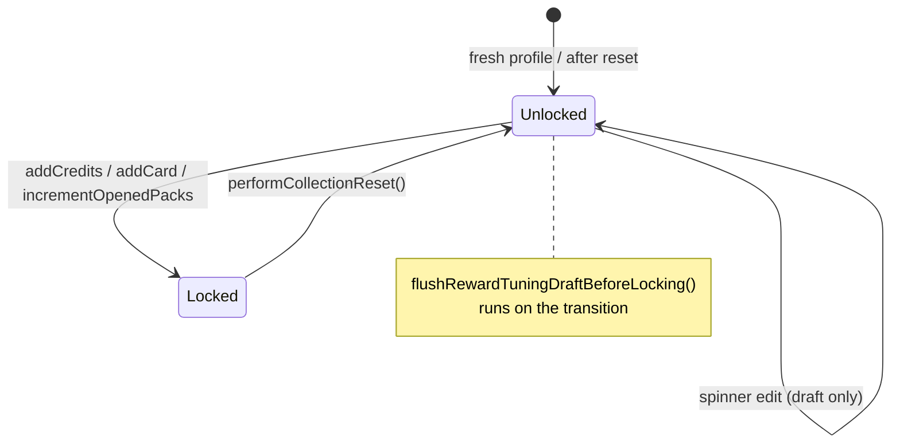

# Sidebar Panel (`TcgPanel`)

> **Scope:** the RuneLite sidebar panel — its three tabs, every control on them, the refresh
> model, the pack-reveal spoiler freeze, the reward-tuning draft lifecycle, debug mode, and the
> Swing threading rules the class does (and does not) obey.
> **Key packages:** `com.osrstcg.ui`, `com.osrstcg.util`, `com.osrstcg.model`
> **Related:** [State Model](05-state-model.md)

## Purpose

`TcgPanel` is the plugin's front door. It extends `net.runelite.client.ui.PluginPanel` and is
handed to a `NavigationButton` at
[OsrsTcgPlugin.java:208-214](../src/main/java/com/osrstcg/OsrsTcgPlugin.java#L208), so it lives
behind the OSRS TCG icon in the RuneLite sidebar at toolbar priority 5. Everything the player
can do without opening a separate window happens here: reading their credit balance, buying
booster packs, selling duplicates, checking collection completion, editing the reward
multipliers before their collection is locked, opening the album, and resetting the profile.

It is also the largest class in the plugin at 2266 lines, and almost all of that is Swing
construction code. There is no view model and no component reuse: every call to `refresh()`
tears the selected tab down with `removeAll()` and rebuilds every label, panel, and button from
scratch ([TcgPanel.java:926-943](../src/main/java/com/osrstcg/ui/TcgPanel.java#L926)). Two
consequences follow from that one decision and they explain most of the rest of the class.
First, no UI component can own state, because it will not survive the next refresh — which is
why the reward-tuning spinner values are mirrored into four plain fields (`rewardDraftFoil`,
`rewardDraftKill`, `rewardDraftLevel`, `rewardDraftXp`,
[L203-206](../src/main/java/com/osrstcg/ui/TcgPanel.java#L203)). Second, a refresh is expensive,
and since `refresh()` is wired into per-XP-drop game events it needs guards to avoid rebuilding
the world constantly — see [The refresh model](#the-refresh-model).

`TcgPanel` is a `@Singleton` injected into a surprising number of services. Because several of
those services are themselves injected into `TcgPanel`'s constructor, the cycle is broken with
`Provider<TcgPanel>` in `PackSafeModeService`
([L34](../src/main/java/com/osrstcg/service/PackSafeModeService.java#L34)) and
`CollectionAlbumManager`
([L27](../src/main/java/com/osrstcg/ui/collectionalbum/CollectionAlbumManager.java#L27)); expect
to need the same trick. Note also `super(false)`
([L225](../src/main/java/com/osrstcg/ui/TcgPanel.java#L225)), which disables RuneLite's automatic
scroll-pane wrapper — the panel owns its own scrolling, and only for two of the three tabs.

## Class reference

| Class | Lines | Responsibility |
|---|---|---|
| [`ui/TcgPanel`](../src/main/java/com/osrstcg/ui/TcgPanel.java) | 2266 | The whole sidebar: tabs, rendering, refresh scheduling, reveal freeze, reward draft, reset |
| [`service/ShopNotificationService`](../src/main/java/com/osrstcg/service/ShopNotificationService.java) | 83 | Edge-triggered "you can now afford pack X" chat message |
| [`util/NumberFormatting`](../src/main/java/com/osrstcg/util/NumberFormatting.java) | 42 | Space-grouped thousands (`1 234 567`) used across every numeric label |
| [`util/HtmlEntities`](../src/main/java/com/osrstcg/util/HtmlEntities.java) | 50 | Decodes HTML character references in catalog strings (used by `CardDatabase`, not the panel) |
| [`model/RewardTuningState`](../src/main/java/com/osrstcg/model/RewardTuningState.java) | 100 | Immutable foil-rate + credit-multiplier tuple with clamping and partner-equality |
| [`ui/collectionalbum/CollectionAlbumManager`](../src/main/java/com/osrstcg/ui/collectionalbum/CollectionAlbumManager.java) | 129 | Lazily creates / fronts the album window; calls back into `panel.refresh()` |
| [`ui/trade/TradeWindowManager`](../src/main/java/com/osrstcg/ui/trade/TradeWindowManager.java) | 87 | Same pattern for the trade window (not opened from the sidebar) |
| [`ui/save/SaveRestoreManager`](../src/main/java/com/osrstcg/ui/save/SaveRestoreManager.java) | 98 | Save-restore picker dialog (not opened from the sidebar) |

Nested private types inside `TcgPanel` worth knowing by name: `Tab`
([L139](../src/main/java/com/osrstcg/ui/TcgPanel.java#L139)), `PackCloseSnapshot`
([L1131](../src/main/java/com/osrstcg/ui/TcgPanel.java#L1131)), `OverviewMetrics`
([L1145](../src/main/java/com/osrstcg/ui/TcgPanel.java#L1145)), `BoosterShopRow`
([L1115](../src/main/java/com/osrstcg/ui/TcgPanel.java#L1115)), and `ShopPackProgressBar`
([L1990](../src/main/java/com/osrstcg/ui/TcgPanel.java#L1990)).

## Layout skeleton

The root is a `BorderLayout` holding `mainPanel`, which itself is a `BorderLayout(0, 8)` with a
6px inset border ([L241-267](../src/main/java/com/osrstcg/ui/TcgPanel.java#L241)):

```
mainPanel (BorderLayout)
├── NORTH  titlePanel      — "OSRS TCG" + web-share dot + the three tab buttons
├── CENTER content         — CardLayout over the three tab panels
│   ├── "WELCOME"  welcomeScrollPane  -> welcomeContent  (BorderLayout)
│   ├── "OVERVIEW" overviewContent    (BoxLayout Y — NO scroll pane)
│   └── "SHOP"     shopScrollPane     -> packsContent    (BoxLayout Y)
└── SOUTH  footerPanel     — Patreon / Open collection album / Reset collection
```

Welcome and Shop are wrapped in `JScrollPane`s; **Overview is added to the `CardLayout`
directly** ([L253-255](../src/main/java/com/osrstcg/ui/TcgPanel.java#L253)), so Overview content
that exceeds the sidebar height is simply clipped. That is why Overview is a fixed set of nine
stat rows plus the multiplier block and nothing more — add rows there and you push the
multiplier section off-screen with no way to reach it.

`configureTabScrollPane` ([L1523](../src/main/java/com/osrstcg/ui/TcgPanel.java#L1523)) styles
the two scroll panes: horizontal scrolling off, vertical as-needed, unit increment 16, and a
FlatLaf-styled 6px rounded scrollbar. A `HierarchyListener` re-runs
`SwingUtilities.updateComponentTreeUI(vbar)` whenever the pane becomes showing, because the
FlatLaf style client property is not always picked up on first display.

Content width comes from `liveSidebarContentWidth()`
([L1505](../src/main/java/com/osrstcg/ui/TcgPanel.java#L1505)), which prefers the *actual*
laid-out viewport width of whichever scroll pane has one, minus `TAB_SCROLLBAR_GAP` (10px). It
falls back to the `PluginPanel.PANEL_WIDTH`-derived estimate in `sidebarInnerWidth()`
([L1494](../src/main/java/com/osrstcg/ui/TcgPanel.java#L1494)) only before the panes have ever
been shown; that estimate reserves `TAB_SCROLLBAR_WIDTH + TAB_SCROLLBAR_GAP` = 16px
([L1489-1491](../src/main/java/com/osrstcg/ui/TcgPanel.java#L1489)) and floors at 160px.

## Section-by-section tour

### Title row and tab strip

`buildTitlePanel()` ([L652](../src/main/java/com/osrstcg/ui/TcgPanel.java#L652)) builds a
`BorderLayout` row: an empty 8×8 spacer WEST purely to optically centre the "OSRS TCG" label,
the label CENTER, and the web-share indicator EAST in a matching 8×8 slot. Below it,
`GridLayout(1, 3)` holds the Welcome / Overview / Shop buttons.

Tab buttons are configured by `configureTabButton`
([L833](../src/main/java/com/osrstcg/ui/TcgPanel.java#L833)). Clicking one sets `selectedTab`,
calls `updateTabStyles()`, then `refresh()`. The active tab is `ColorScheme.BRAND_ORANGE` with a
`LIGHT_GRAY_COLOR` border; inactive tabs are white with `DARKER_GRAY_HOVER_COLOR`
([`tabBorder`, L2187](../src/main/java/com/osrstcg/ui/TcgPanel.java#L2187)).

The initial tab is chosen exactly once by `applyDefaultTabSelectionOnce()`
([L555](../src/main/java/com/osrstcg/ui/TcgPanel.java#L555)): Welcome if `openedPacks == 0`,
otherwise Overview. The `defaultTabSelectionInitialized` flag makes this a one-shot, so after
the first in-world refresh the tab is purely user-driven. `performCollectionReset()` forces
`selectedTab = Tab.WELCOME` but does *not* clear the flag
([L375](../src/main/java/com/osrstcg/ui/TcgPanel.java#L375)).

### Web share live indicator

`createWebShareLiveIndicator()` ([L709](../src/main/java/com/osrstcg/ui/TcgPanel.java#L709))
returns an anonymous `JComponent` that paints a single antialiased filled circle. Its colour
lives in a client property rather than a field:

| Client property | Value |
|---|---|
| `webShareLiveGreen` | `#2EC45A` |
| `webShareErrorRed` | `#E04B4B` |
| `webShareIndicatorColor` | the colour actually painted |

It starts invisible, uses a hand cursor, and its `MouseAdapter` opens
`collectionShareService.getPublicUrl()` via `LinkBrowser.browse` on left click
([L769-784](../src/main/java/com/osrstcg/ui/TcgPanel.java#L769)).

`updateWebShareLiveIndicator()` ([L788](../src/main/java/com/osrstcg/ui/TcgPanel.java#L788))
reads `CollectionShareService.getIndicatorState()`
([CollectionShareService.java:293](../src/main/java/com/osrstcg/service/CollectionShareService.java#L293)),
a three-state enum:

| State | Dot | Tooltip |
|---|---|---|
| `HIDDEN` | not visible | (unchanged) |
| `LIVE` | green | `Web album live — click to open <url>` |
| `ERROR` | red | `Web album: <statusText>` |

`getIndicatorState()` short-circuits to `HIDDEN` whenever `config.webShareEnabled()` is false,
so the dot disappears the moment sharing is turned off regardless of the stored state. Note the
method only *sets* a colour for `LIVE` and `ERROR`; on a `HIDDEN` transition the last colour
stays in the client property, which is harmless because the component is also hidden.

Three call sites drive it: `start()`
([L314](../src/main/java/com/osrstcg/ui/TcgPanel.java#L314)), every `refreshNow()`
([L522](../src/main/java/com/osrstcg/ui/TcgPanel.java#L522)), and two plugin hooks — the status
listener registered at
[OsrsTcgPlugin.java:244](../src/main/java/com/osrstcg/OsrsTcgPlugin.java#L244) (which correctly
wraps the call in `SwingUtilities.invokeLater`) and `onConfigChanged` at
[OsrsTcgPlugin.java:357](../src/main/java/com/osrstcg/OsrsTcgPlugin.java#L357) (which does not —
see [Threading](#threading)).

### Welcome tab

`renderWelcomeTab` ([L976](../src/main/java/com/osrstcg/ui/TcgPanel.java#L976)) adds a single
`buildTcgWelcomeBlurb(liveSidebarContentWidth())` block
([L1435](../src/main/java/com/osrstcg/ui/TcgPanel.java#L1435)) — pure static text from the
constants at [L102-135](../src/main/java/com/osrstcg/ui/TcgPanel.java#L102), plus one button, in
order: heading, `TCG_WELCOME_BODY`, the Discord button, the `!tcg` / card-values / beta blurbs,
`TCG_WELCOME_COLLECTION_RESET_BODY` in `Color.YELLOW`
([L1465](../src/main/java/com/osrstcg/ui/TcgPanel.java#L1465)), then the disclaimer heading and
body.

`createDiscordButton` ([L2237](../src/main/java/com/osrstcg/ui/TcgPanel.java#L2237)) opens
`https://discord.gg/P4pPu6RnCj` and is built from `/Discord-Logo-White.png` scaled into a 36px
button minus 8px vertical padding. It **returns `null` if the image resource is missing**; the
caller null-checks and omits the button.

This tab is also what the player sees when logged out — see
[Logged-out mode](#logged-out-mode). It reads no game state at all, which is why it is safe there.

### Overview tab

`renderOverviewTab` ([L982](../src/main/java/com/osrstcg/ui/TcgPanel.java#L982)) captures a
display snapshot, filters the card database through `RollPoolFilter.filterRollPool`, computes
`OverviewMetrics`, then hands off to `renderOverviewTabFromMetrics`
([L1092](../src/main/java/com/osrstcg/ui/TcgPanel.java#L1092)), which lays out nine rows with
6px gaps:

| Row | Value | Source |
|---|---|---|
| Credits (with `/credits.png` icon) | `snap.credits` | `EconomyState` |
| Opened packs | `snap.openedPacks` | `EconomyState` |
| Unique cards | `m.uniqueOwned / m.totalCardPool` | `OverviewMetrics` |
| Unique foil cards | `m.uniqueFoilOwned / m.totalCardPool` | `OverviewMetrics` |
| Total cards | `m.totalCardsOwned` | `OverviewMetrics` |
| Foil cards | `m.foilOwned` | `OverviewMetrics` |
| Collection % | `%.1f%%` of `m.completionPct` | `OverviewMetrics` |
| Collection Foil % | `%.1f%%` of `m.foilCompletionPct` | `OverviewMetrics` |
| Collection score | `m.collectionScore` | `OverviewMetrics` |

There are no buttons on this tab; it is read-only except for the multiplier block appended by
`addRewardTuningOverviewSection` at the end.

`OverviewMetrics.compute` ([L1169](../src/main/java/com/osrstcg/ui/TcgPanel.java#L1169)) is the
only real arithmetic in the class. Everything is scoped to the **roll pool**, not the full
catalog — cards outside the roll pool are ignored for every count and percentage:

```
rollPoolNames  = { c.name | c in rollPool, c.name != null }
uniqueOwned    = |{ name in collectedNames(owned) : name in rollPoolNames }|
totalCardsOwned= Σ qty over owned entries whose cardName is in rollPoolNames
foilOwned      = Σ qty over owned entries where key.isFoil() and name in rollPoolNames
uniqueFoilOwned= |{ key : key.isFoil(), name in rollPoolNames, qty > 0 }|
totalCardPool  = rollPool.size()

completionPct     = totalCardPool <= 0 ? 0 : 100 * uniqueOwned     / totalCardPool
foilCompletionPct = totalCardPool <= 0 ? 0 : 100 * uniqueFoilOwned / totalCardPool
```

Collection score sums a per-card value, using the foil-adjusted score if **any** foil copy of
that name is owned ([L1218-1232](../src/main/java/com/osrstcg/ui/TcgPanel.java#L1218)):

```
collectionScore = Σ over distinct collected names in rollPoolNames:
    hasFoilOwned ? RarityMath.foilAdjustedScoreRounded(def)   // round(score^1.1)
                 : round(RarityMath.score(def))
```

`foilAdjustedScoreRounded` is `Math.round(Math.pow(score, 1.1))`, returning 0 for
non-positive scores
([RarityMath.java:106-114](../src/main/java/com/osrstcg/service/RarityMath.java#L106)).
Card definitions are matched case-insensitively via a lower-cased lookup map built fresh on
every compute ([L1210-1217](../src/main/java/com/osrstcg/ui/TcgPanel.java#L1210)).

`collectedNamesFromOwned` ([L1612](../src/main/java/com/osrstcg/ui/TcgPanel.java#L1612)) merges
foil and non-foil quantities per name and keeps names with a combined quantity ≥ 1;
`foilCollectedNamesFromOwned` ([L1637](../src/main/java/com/osrstcg/ui/TcgPanel.java#L1637))
keeps names with at least one foil copy.

### Shop tab

`renderPacksTab` ([L1703](../src/main/java/com/osrstcg/ui/TcgPanel.java#L1703)) is three blocks
separated by 8px:

**Credits row** — same `imageStatPanel` as Overview, reading `displaySnap.credits`.

**Sell duplicates** — `sellDuplicatesPanel()`
([L2060](../src/main/java/com/osrstcg/ui/TcgPanel.java#L2060)) re-parents the *single*
`sellDuplicatesButton` field (built once in the constructor,
[L238](../src/main/java/com/osrstcg/ui/TcgPanel.java#L238)) into a fresh wrapper. It is a field
rather than a local because `updateSellDuplicatesButtonState()`
([L2070](../src/main/java/com/osrstcg/ui/TcgPanel.java#L2070)) needs to reach it: that method
calls `DuplicateSellPlanner.hasSellableDuplicates(instances)` and disables the button with the
tooltip `"No duplicate cards to sell."` when there is nothing to sell. Note
`hasSellableDuplicates` runs a *full* sell plan and throws the result away
([DuplicateSellPlanner.java:48-51](../src/main/java/com/osrstcg/service/DuplicateSellPlanner.java#L48)),
so this enable/disable check is as expensive as the real operation.

Clicking it runs `promptAndSellDuplicates()`
([L2078](../src/main/java/com/osrstcg/ui/TcgPanel.java#L2078)):

1. Snapshot `getOwnedInstances()`; bail (with a `refresh()`) if empty.
2. `DuplicateSellPlanner.plan(all, this::cardDefinitionForName)` — keeps locked instances, keeps
   the *newest* unlocked foil (or newest unlocked normal when no foil exists), sells the rest.
3. Bail if `cardsSold <= 0`.
4. `JOptionPane.showConfirmDialog` — `"Are you sure you want to sell N cards for X credits?"`,
   YES/NO, warning icon. Cancel returns without touching state.
5. `stateService.setCollectionInstances(plan.getKept())`, then `stateService.addCredits(...)`
   only when `creditsToAdd > 0`.
6. `refresh()`.

`cardDefinitionForName` ([L2134](../src/main/java/com/osrstcg/ui/TcgPanel.java#L2134)) is a
linear scan over the whole card database per lookup, called once per duplicate name.

**Booster grid** — `boosterShopPanel` ([L1817](../src/main/java/com/osrstcg/ui/TcgPanel.java#L1817))
lays buy buttons out in a `GridLayout(0, 2, 6, 6)`. If no packs are configured it shows
`"No booster packs configured. Add Packs.json to plugin resources."` instead. Pack order comes
from `shopVisibleBoosters()` ([L1806](../src/main/java/com/osrstcg/ui/TcgPanel.java#L1806)):
`packCatalog.getVisibleBoosters(stateService.isDebugLogging())` sorted by price ascending, then
by name case-insensitively.

Each button is enabled only when all three hold
([L1846](../src/main/java/com/osrstcg/ui/TcgPanel.java#L1846)):

```
!packRevealService.isActive()
&& !packSafeModeService.isPackOpeningBlocked()
&& credits >= booster.getPrice()
```

When blocked, the button's tooltip is set to `packSafeModeService.packOpeningBlockMessage()` —
`"Cannot open packs on the welcome screen."` or `"Cannot open packs while in combat
(Safe-mode)."`
([PackSafeModeService.java:79-90](../src/main/java/com/osrstcg/service/PackSafeModeService.java#L79)).

`createBoosterBuyButton` ([L1888](../src/main/java/com/osrstcg/ui/TcgPanel.java#L1888)) stacks,
inside a 120px-tall button: the escaped pack name, the thumbnail (from
`booster.getThumbnail()`, falling back to `Pack_Standard_thumbnail.png`,
[L1874](../src/main/java/com/osrstcg/ui/TcgPanel.java#L1874)), `"<price> credits"`, a
`ShopPackProgressBar`, `"owned / total"`, and `"(NN%)"`. Button width is
`max(96, (liveSidebarContentWidth() - 6) / 2)`
([L1864](../src/main/java/com/osrstcg/ui/TcgPanel.java#L1864)).

`ShopPackProgressBar` ([L1990](../src/main/java/com/osrstcg/ui/TcgPanel.java#L1990)) is 75×6px
plus a 1px border. It draws the green standard-completion fill (`#4CAF50`) and then the yellow
foil fill (`#F2C94C`) *over* it from the same left origin — the foil bar overpaints rather than
stacking, so what you read is "green = any copy owned, yellow = foil owned", not a sum.

`shopProgressOwnedTotal` ([L1662](../src/main/java/com/osrstcg/ui/TcgPanel.java#L1662)) decides
the eligible name set: an empty `categoryFilters` (the Standard pack) means the whole roll pool;
a non-empty one means every card in the *full* catalog matching
`BoosterPackDefinition.cardMatchesRegion`. It returns `[standardOwned, foilOwned, total]`.
This method recomputes `collectedNamesFromOwned` and `foilCollectedNamesFromOwned` **per
booster**, so the shop tab is O(packs × ownedRows) on every render.

Pressing a buy button ([L1933-1964](../src/main/java/com/osrstcg/ui/TcgPanel.java#L1933)):

1. If a reveal is already active, `refresh()` and return.
2. If `packSafeModeService.isPackOpeningBlocked()`, push the block message to game chat and
   `refresh()`.
3. `beginPackRevealSidebarFreeze()` — **before** the transaction.
4. Snapshot `preOwned` card keys and `showScrollWheelHint = (openedPacks == 0)`.
5. `packOpeningService.buyAndOpenPack(booster)`.
6. On failure (or null pulls) `clearPackRevealSidebarFreeze()` and `refresh()`.
7. On success `packRevealService.startReveal(pulls, preOwned, displayName, packId,
   showScrollWheelHint, isApexPack)` then `refresh()`.

### Reward tuning / multipliers section

Appended to the bottom of Overview by `addRewardTuningOverviewSection`
([L1238](../src/main/java/com/osrstcg/ui/TcgPanel.java#L1238)). It is headed "Multipliers" and
renders a 2×2 grid ([`buildMultiplierGrid`, L1548](../src/main/java/com/osrstcg/ui/TcgPanel.java#L1548))
in this reading order: *Level up multiplier, Kill multiplier, XP multiplier, Foil chance (%)*.

The section has two entirely separate branches keyed on
`stateService.isRewardTuningLocked()`
([TcgStateService.java:485-497](../src/main/java/com/osrstcg/service/TcgStateService.java#L485)),
which is true once the profile has any credits, any opened packs, or any owned cards:

**Locked branch** ([L1264-1295](../src/main/java/com/osrstcg/ui/TcgPanel.java#L1264)) — spinners
are seeded from the *persisted* `RewardTuningState`, disabled, and given
`REWARD_TUNING_LOCKED_TOOLTIP`. If debug logging is on, a red bold `DEBUG MODE` banner is
appended. The section returns early; no checkbox, no trade warning.

**Editable branch** ([L1297-1338](../src/main/java/com/osrstcg/ui/TcgPanel.java#L1297)) —
spinners are seeded from the four `rewardDraft*` fields, and each `ChangeListener` writes the
new value into its field and then `SwingUtilities.invokeLater(this::refresh)`. A red trade
warning (`REWARD_TUNING_NON_DEFAULT_TRADE_WARNING`) is shown when debug logging is on **or**
the draft differs from `RewardTuningState.DEFAULTS`. The Debug mode checkbox is appended only
when RuneLite is running in developer mode.

Spinner models ([L1297-1300](../src/main/java/com/osrstcg/ui/TcgPanel.java#L1297)):

| Control | Model | Editor columns |
|---|---|---|
| Foil chance (%) | `SpinnerNumberModel(int, 0, 100, 1)` | 3 |
| Kill multiplier | `SpinnerNumberModel(double, 0.0, 10.0, 0.1)` | 5 |
| Level up multiplier | `SpinnerNumberModel(double, 0.0, 10.0, 0.1)` | 5 |
| XP multiplier | `SpinnerNumberModel(double, 0.0, 10.0, 0.1)` | 5 |

`RewardTuningState` clamps foil to `[0, 100]` and multipliers to `[0.0, 100.0]`, mapping NaN and
infinity to `1.0`
([RewardTuningState.java:55-67](../src/main/java/com/osrstcg/model/RewardTuningState.java#L55)).
The UI cap of 10.0 is therefore stricter than the model's 100.0 — a value above 10 can only
enter state from a hand-edited save, and the spinner will silently accept it back but not let
the user re-enter it.

`RewardTuningState.DEFAULTS` is `(foil=1, kill=1.0, level=1.0, xp=1.0)`
([RewardTuningState.java:8](../src/main/java/com/osrstcg/model/RewardTuningState.java#L8)).
Equality for the trade check uses `matchesPartnerTuning` — exact int compare on foil, and
`Double.compare == 0 || |a-b| < 1e-9` on each multiplier
([RewardTuningState.java:92-99](../src/main/java/com/osrstcg/model/RewardTuningState.java#L92)).
The panel's local `rewardDraftMatchesPluginDefaults()`
([L1354](../src/main/java/com/osrstcg/ui/TcgPanel.java#L1354)) reimplements the same 1e-9
comparison against `DEFAULTS` rather than constructing a `RewardTuningState` and calling
`isDefault()`.

### Footer: Patreon, album, reset

`populateFooterPanel()` ([L566](../src/main/java/com/osrstcg/ui/TcgPanel.java#L566)) builds all
three footer rows once, in the constructor, and never rebuilds them — only their visibility
changes. Each button lives in its own wrapper panel (`patreonFooterWrap`, `albumFooterWrap`,
`resetFooterWrap`) precisely so `updateFooterVisibility()`
([L864](../src/main/java/com/osrstcg/ui/TcgPanel.java#L864)) can toggle them:

| Row | Visible when | Action |
|---|---|---|
| Patreon ("Support my projects on / PATREON") | `selectedTab == WELCOME` | `LinkBrowser.browse(PATREON_URL)` → `https://www.patreon.com/Azderi` ([L137](../src/main/java/com/osrstcg/ui/TcgPanel.java#L137)) |
| Open collection album | `isClientInGameWorld()` | `collectionAlbumManager.showOrBringToFront()` |
| Reset collection | `isClientInGameWorld()` | `promptAndPerformCollectionReset()` |

`footerPanel.setVisible(true)` is called unconditionally at the top of `updateFooterVisibility`
and again in `refreshNow`/`applyPackCloseRefresh`, so the footer container itself is never
hidden; only its children are.

### Logged-out mode

`shouldShowLoggedOutPrompt()` ([L621](../src/main/java/com/osrstcg/ui/TcgPanel.java#L621))
returns true when the panel is showing but `isClientInGameWorld()` is false.
`isClientInGameWorld()` ([L643](../src/main/java/com/osrstcg/ui/TcgPanel.java#L643)) treats
`GameState.LOGGED_IN` **or** a non-null `getLocalPlayer()` as in-world — the second check covers
brief states where the world is live before `getGameState()` catches up.

When true, `showLoggedOutWelcome()` ([L630](../src/main/java/com/osrstcg/ui/TcgPanel.java#L630))
force-selects Welcome and renders it, and `refreshNow` returns early — Overview and Shop are
never built while logged out, so no collection data is read.

## The refresh model

`refresh()` ([L384](../src/main/java/com/osrstcg/ui/TcgPanel.java#L384)) is the single public
entry point for "something changed, redraw". It does three things:

```java
if (!panelVisible) return;                                  // L386
if (!SwingUtilities.isEventDispatchThread()) { queueRefreshOnEdt(); return; }  // L391
refreshNow();                                               // L397
```

`refreshNow()` ([L515](../src/main/java/com/osrstcg/ui/TcgPanel.java#L515)) then: clears the
reveal freeze if no reveal is active, `ensureRootAttached()`, `updateWebShareLiveIndicator()`,
short-circuits to the logged-out welcome if applicable, shows the footer, applies the one-shot
default tab, restyles tabs, calls `renderSelectedTab()`, and revalidates + repaints `mainPanel`.

**What it recomputes.** For the selected tab only, but completely. Overview re-snapshots the
owned-cards map (a full `HashMap` copy under `synchronized (stateService)`,
[L1052-1062](../src/main/java/com/osrstcg/ui/TcgPanel.java#L1052)), re-filters the roll pool from
the card database, recomputes all eight metrics including the per-card score sum, and rebuilds
nine `JPanel`s plus four `JSpinner`s. Shop re-snapshots, re-filters the roll pool, and calls
`shopProgressOwnedTotal` once per visible booster — each of which rebuilds the collected-name
sets from scratch. Welcome re-lays-out and re-measures seven wrapped text blocks.

**How often it can fire.** Very often. The call sites include `onStatChanged`
([OsrsTcgPlugin.java:315](../src/main/java/com/osrstcg/OsrsTcgPlugin.java#L315)) and
`onFakeXpDrop` ([L322](../src/main/java/com/osrstcg/OsrsTcgPlugin.java#L322)) — i.e. every XP
drop the client produces — plus `onGameStateChanged`, `PackSafeModeService.onGameTick`
([PackSafeModeService.java:121](../src/main/java/com/osrstcg/service/PackSafeModeService.java#L121)),
`NpcKillCreditTracker`, `GameMessageCreditTracker.onChatMessage`
([GameMessageCreditTracker.java:240](../src/main/java/com/osrstcg/service/GameMessageCreditTracker.java#L240)),
`CollectionAlbumManager`'s sidebar callback, every tab click, every reward spinner tick, and the
`componentResized` listener ([L285-297](../src/main/java/com/osrstcg/ui/TcgPanel.java#L285)).

**Throttling and dirty-checking.** There is exactly one mechanism, `queueRefreshOnEdt()`
([L500](../src/main/java/com/osrstcg/ui/TcgPanel.java#L500)):

```java
if (refreshQueued) return;
refreshQueued = true;
SwingUtilities.invokeLater(() -> { refreshQueued = false; refresh(); });
```

That collapses a burst of *off-EDT* requests arriving between EDT turns into one rebuild. It
does nothing at all for calls that already arrive on the EDT — those go straight to
`refreshNow()`. The `componentResized` listener adds a narrow guard of its own by comparing
`getWidth()` against `lastPanelWidthForLayout` and only refreshing when the width actually
changed ([L291-296](../src/main/java/com/osrstcg/ui/TcgPanel.java#L291)). And `panelVisible`
means the whole thing is free while the sidebar is closed.

There is **no dirty-checking of the data**. Nothing compares the new credit total, owned-card
map, or metrics against what is currently painted. A `StatChanged` event that awards zero
credits still tears down and rebuilds the entire Overview tab. This is the most obvious
optimisation target in the class: caching `OverviewMetrics` keyed on
`(ownedCards.hashCode(), credits, openedPacks)`, or simply mutating the existing `JLabel`
values instead of rebuilding the component tree, would remove essentially all of it. Hoisting
`collectedNamesFromOwned` / `foilCollectedNamesFromOwned` out of `shopProgressOwnedTotal` and
computing them once per shop render would fix the O(packs × ownedRows) shop cost with a
three-line change.

### The async pack-close path

`refreshAfterPackRevealClose()` ([L404](../src/main/java/com/osrstcg/ui/TcgPanel.java#L404))
exists because the reveal closes on an input-listener callback
([PackRevealInputListener.java:76](../src/main/java/com/osrstcg/overlay/PackRevealInputListener.java#L76),
[L85](../src/main/java/com/osrstcg/overlay/PackRevealInputListener.java#L85),
[L193](../src/main/java/com/osrstcg/overlay/PackRevealInputListener.java#L193)) and the heavy
metric computation must not run there. It bails to `queueRefreshOnEdt()` if a reveal is still
active, re-posts itself if off the EDT, clears the freeze, bumps a generation counter, and hands
the snapshot + metric computation to `ForkJoinPool.commonPool()` before applying the result back
on the EDT. See [Data flow](#data-flow) for the full sequence.

The `packCloseRefreshGen` `AtomicLong` ([L195](../src/main/java/com/osrstcg/ui/TcgPanel.java#L195))
is a generation counter: `applyPackCloseRefresh` discards any result whose `gen` no longer
matches, so a second pack opened before the first computation lands cannot repaint stale
numbers. If the background computation throws, the catch block falls back to a plain `refresh()`
on the EDT, still gated on the generation
([L433-443](../src/main/java/com/osrstcg/ui/TcgPanel.java#L433)).

`applyPackCloseRefresh` ([L447](../src/main/java/com/osrstcg/ui/TcgPanel.java#L447)) then renders
from the precomputed `OverviewMetrics` / `List<BoosterShopRow>` via
`renderOverviewTabFromMetrics` / `renderPacksTabFromPackClose` instead of recomputing. It ends by
scheduling `collectionAlbumManager.refreshIfVisible()` in a nested `invokeLater` so the album
window rebuild happens on a later EDT turn rather than extending this one.

## The sidebar reveal freeze

The problem: `PackOpeningService.buyAndOpenPack` commits the whole transaction — credits spent,
`openedPacks` incremented, cards added — *before* the reveal animation plays
([TcgStateService.java:739-745](../src/main/java/com/osrstcg/service/TcgStateService.java#L739)).
If the sidebar refreshed off live state during the reveal, "Unique cards 412 / 900" would tick up
to 415 while the player is still flipping the first card. The counters would spoil the pulls.

The fix is a snapshot taken immediately *before* the transaction:

- `beginPackRevealSidebarFreeze()` ([L1076](../src/main/java/com/osrstcg/ui/TcgPanel.java#L1076))
  stores `capturePackCloseSnapshot()` — the owned-cards map, credits, and opened-packs count — in
  `sidebarRevealSpoilerFreeze`, and clears the three `*BuiltForActiveReveal` flags.
- `capturePackCloseSnapshotForDisplay()` ([L1067](../src/main/java/com/osrstcg/ui/TcgPanel.java#L1067))
  returns that frozen snapshot whenever `sidebarRevealSpoilerFreeze != null &&
  packRevealService.isActive()`, and live state otherwise. Both `renderOverviewTab` and
  `renderPacksTab` go through it.
- `clearPackRevealSidebarFreeze()` ([L1084](../src/main/java/com/osrstcg/ui/TcgPanel.java#L1084))
  nulls the snapshot and resets the flags.

`welcomeBuiltForActiveReveal` / `overviewBuiltForActiveReveal` / `shopBuiltForActiveReveal` are a
second layer of protection. While a reveal is active, `renderSelectedTab()`
([L883-924](../src/main/java/com/osrstcg/ui/TcgPanel.java#L883)) builds each tab **at most once**
and thereafter only calls `contentLayout.show(...)`. Without this, the flood of `refresh()` calls
from `onStatChanged` and `onGameTick` during a reveal would rebuild the Swing tree dozens of times
per second from a snapshot that never changes — pure waste and visible flicker.

Both freeze methods are public because the client-thread pack path drives them too:
`OsrsTcgPlugin.openBooster` calls `beginPackRevealSidebarFreeze()` before the purchase
([OsrsTcgPlugin.java:723](../src/main/java/com/osrstcg/OsrsTcgPlugin.java#L723)) and
`clearPackRevealSidebarFreeze()` on failure ([L731](../src/main/java/com/osrstcg/OsrsTcgPlugin.java#L731)).
The freeze is released from four places: `refreshNow()` when no reveal is active, the top of
`refreshAfterPackRevealClose()`, `performCollectionReset()`, and the plugin's debug-reset path
([OsrsTcgPlugin.java:454](../src/main/java/com/osrstcg/OsrsTcgPlugin.java#L454)). The
`refreshNow()` release is the safety net — if a reveal ends without anyone calling
`refreshAfterPackRevealClose`, the next ordinary refresh unfreezes.

## Reward-tuning draft lifecycle

The four `rewardDraft*` fields are a **draft**; `state.getRewardTuning()` is the **committed**
value. Only the committed value is persisted, sent to trade partners, or used by
`CreditAwardService` when awarding credits. The draft exists solely because the spinners cannot
hold state across a refresh.

Three operations move data between them:

| Method | Direction | Called from |
|---|---|---|
| `syncRewardDraftFromPersistent()` ([L329](../src/main/java/com/osrstcg/ui/TcgPanel.java#L329)) | committed → draft | `start()`, `performCollectionReset()`, and three plugin sites on load / profile switch ([OsrsTcgPlugin.java:455](../src/main/java/com/osrstcg/OsrsTcgPlugin.java#L455), [L462](../src/main/java/com/osrstcg/OsrsTcgPlugin.java#L462), [L662](../src/main/java/com/osrstcg/OsrsTcgPlugin.java#L662)) |
| `flushRewardTuningDraftToState()` ([L319](../src/main/java/com/osrstcg/ui/TcgPanel.java#L319)) | draft → committed | `::tcg-save` ([OsrsTcgPlugin.java:610](../src/main/java/com/osrstcg/OsrsTcgPlugin.java#L610)) and the registered callback below |
| spinner `ChangeListener`s ([L1306-1325](../src/main/java/com/osrstcg/ui/TcgPanel.java#L1306)) | UI → draft | user edits |

`flushRewardTuningDraftToState()` is a no-op if `isRewardTuningLocked()`; otherwise it builds a
`RewardTuningState` from the four draft fields and calls `stateService.tryUpdateRewardTuning`,
which itself re-checks the lock and saves + notifies collection-share listeners on success
([TcgStateService.java:499-509](../src/main/java/com/osrstcg/service/TcgStateService.java#L499)).

### The ordering hazard

Here is the trap the callback exists to close. Consider a fresh profile — zero credits, zero
packs, zero cards, so tuning is unlocked. The player sets XP multiplier to 2.0 in the sidebar.
That writes `rewardDraftXp = 2.0` and **nothing else**; the draft is not persisted on edit. Now
the player gains XP. `CreditAwardService` calls `stateService.addCredits(n)`. Credits become
non-zero, which makes `isRewardTuningLocked()` return true forever. The draft can now never be
committed — `flushRewardTuningDraftToState` will always take the early return. The player's 2.0
is silently lost, and worse, the credits they just earned were computed with the *old* committed
multiplier.

The fix is a callback the plugin registers at startup:

```java
// OsrsTcgPlugin.java:243
stateService.setRewardTuningFlushBeforeCredits(tcgPanel::flushRewardTuningDraftToState);
```

`TcgStateService` invokes it through `flushRewardTuningDraftBeforeLocking()`
([TcgStateService.java:834-841](../src/main/java/com/osrstcg/service/TcgStateService.java#L834))
as the **first statement** of every operation that can flip the lock:

| Locking operation | Flush call site |
|---|---|
| `addCredits` | [L528](../src/main/java/com/osrstcg/service/TcgStateService.java#L528) |
| `incrementOpenedPacks` | [L567](../src/main/java/com/osrstcg/service/TcgStateService.java#L567) |
| `addCard` | [L585](../src/main/java/com/osrstcg/service/TcgStateService.java#L585) |
| `applyPackOpenTransaction` | [L713](../src/main/java/com/osrstcg/service/TcgStateService.java#L713) |
| `saveMasterOnly` | [L329](../src/main/java/com/osrstcg/service/TcgStateService.java#L329) |
| `saveCheckpoint` | [L342](../src/main/java/com/osrstcg/service/TcgStateService.java#L342) |

`flushRewardTuningDraftBeforeLocking` guards on `!isRewardTuningLocked()` so the callback only
runs while a flush could still succeed. The ordering requirement is strict: the flush must
happen before the state mutation, because the mutation is what sets the lock. Moving
`flushRewardTuningDraftBeforeLocking()` below the `state = state.with...` line in any of those
methods reintroduces the bug in full.

The callback is torn down on shutdown (`setRewardTuningFlushBeforeCredits(null)`,
[OsrsTcgPlugin.java:295](../src/main/java/com/osrstcg/OsrsTcgPlugin.java#L295)) so a stopped
plugin's panel is not reachable from a live `TcgStateService`.



## `performCollectionReset()`

The button in the footer calls `promptAndPerformCollectionReset()`
([L352](../src/main/java/com/osrstcg/ui/TcgPanel.java#L352)), which is the only confirmation
gate: a `JOptionPane.showConfirmDialog` with the message *"Are you sure you want to reset your
collection and progress?"*, title `"Reset collection"`, `YES_NO_OPTION`, `WARNING_MESSAGE`.
Anything other than `YES_OPTION` returns without side effects.

`performCollectionReset()` itself ([L368](../src/main/java/com/osrstcg/ui/TcgPanel.java#L368))
is **unguarded** and public, and is also reached directly from the `::tcg-reset` chat command
([OsrsTcgPlugin.java:906](../src/main/java/com/osrstcg/OsrsTcgPlugin.java#L906)) with no prompt
at all. Its steps, in order:

1. `stateService.resetAll()` — replaces state with `TcgState.empty()` and writes a full
   checkpoint tagged `TcgSaveTrigger.RESET`, then notifies collection-share listeners
   ([TcgStateService.java:749-754](../src/main/java/com/osrstcg/service/TcgStateService.java#L749)).
   `TcgState.empty()` resets credits, collection, reward tuning to `DEFAULTS`, `debugLogging` to
   `false`, overlay scale to 1.0, album window size to 0×0, skill baseline to absent, and total
   credits gained to 0 ([TcgState.java:44-50](../src/main/java/com/osrstcg/model/TcgState.java#L44)).
2. `packRevealService.reset()` — kills any in-flight reveal.
3. `clearPackRevealSidebarFreeze()` — drops the stale pre-reset snapshot.
4. `creditAwardService.resetExperienceCreditBaseline()` — so the player is not immediately
   re-awarded credits for XP they already had.
5. `syncRewardDraftFromPersistent()` — pulls the now-`DEFAULTS` tuning back into the draft
   fields. Without this the sidebar would keep showing the pre-reset draft values on a profile
   that is once again unlocked.
6. `selectedTab = Tab.WELCOME`.
7. `resetSessionUi()` → `refresh()`.
8. `client.addChatMessage(GAMEMESSAGE, "", "[OSRS TCG] Collection, credits, and opened packs
   have been reset.", null)` when `client != null`.

Steps 3 and 5 are the easy ones to forget when editing this method — both exist to stop
pre-reset UI state leaking into a post-reset panel.

`resetSessionUi()` ([L347](../src/main/java/com/osrstcg/ui/TcgPanel.java#L347)) is a one-line
delegate to `refresh()`. It is a separate method purely for intent at the call sites: the plugin
calls it after a debug-tainted save is wiped on load
([OsrsTcgPlugin.java:456](../src/main/java/com/osrstcg/OsrsTcgPlugin.java#L456)) to distinguish
"the profile changed underneath you" from an ordinary redraw. It carries no extra behaviour
today; do not assume it does.

## Debug mode

Debug mode is a single persisted boolean, `TcgState.debugLogging`. The sidebar is its only
toggle.

**Toggling.** `buildDebugModeCheckbox()` ([L1341](../src/main/java/com/osrstcg/ui/TcgPanel.java#L1341))
creates a `JCheckBox` labelled "Debug mode" with the tooltip *"Enables developer testing
features."*, seeded from `stateService.isDebugLogging()`. It is added to the multiplier section
**only when `runeliteDeveloperMode` is true** and **only in the unlocked branch**
([L1332-1336](../src/main/java/com/osrstcg/ui/TcgPanel.java#L1332)) — so once your collection is
locked you cannot toggle it from the panel even in developer mode. The `@Named("developerMode")`
boolean is injected in the constructor
([L223](../src/main/java/com/osrstcg/ui/TcgPanel.java#L223)); RuneLite sets it from the
`--developer-mode` launch flag. The action listener calls `persistDebugLogging`
([L1483](../src/main/java/com/osrstcg/ui/TcgPanel.java#L1483)) → `stateService.setDebugLogging` →
`refresh()`.

`start()` defensively force-clears the flag when the client is *not* in developer mode
([L307-310](../src/main/java/com/osrstcg/ui/TcgPanel.java#L307)), so a config carrying
`debugLogging: true` into a normal client is disarmed at plugin start.

**What it unlocks.**

| Effect | Location |
|---|---|
| `debugOnly` booster packs become visible and purchasable | [PackCatalog.java:70](../src/main/java/com/osrstcg/data/PackCatalog.java#L70), [PackOpeningService.java:100](../src/main/java/com/osrstcg/service/PackOpeningService.java#L100) |
| Those packs appear in the sidebar shop, the credits infobox menu, the album, and shop notifications | [TcgPanel.java:1809](../src/main/java/com/osrstcg/ui/TcgPanel.java#L1809), [CreditsInfoboxOverlay.java:113](../src/main/java/com/osrstcg/overlay/CreditsInfoboxOverlay.java#L113), [CollectionAlbumWindow.java:900](../src/main/java/com/osrstcg/ui/collectionalbum/CollectionAlbumWindow.java#L900), [ShopNotificationService.java:46](../src/main/java/com/osrstcg/service/ShopNotificationService.java#L46) |
| `::tcg-set`, `::tcg-give`, `::tcg-apex`, `::tcg-complete` chat commands | [OsrsTcgPlugin.java:532-588](../src/main/java/com/osrstcg/OsrsTcgPlugin.java#L532) |
| Console credit-award tracing | [CreditAwardService.java:781](../src/main/java/com/osrstcg/service/CreditAwardService.java#L781) via `isDebugTracingActive()` |
| Every pulled card is stamped with the `DEBUG_` provenance prefix | [TcgStateService.java:722-723](../src/main/java/com/osrstcg/service/TcgStateService.java#L722), [OwnedCardInstance.java:16](../src/main/java/com/osrstcg/model/OwnedCardInstance.java#L16) |
| Red `DEBUG MODE` banner in the locked multiplier section; trade warning forced on in the unlocked one | [TcgPanel.java:1283-1291](../src/main/java/com/osrstcg/ui/TcgPanel.java#L1283), [L1328](../src/main/java/com/osrstcg/ui/TcgPanel.java#L1328) |
| Party gifts and trades are rejected unless both sides' debug flags match | [TcgCardGiftPartyMessage.java:31](../src/main/java/com/osrstcg/party/TcgCardGiftPartyMessage.java#L31), [TcgTradeInvitePartyMessage.java:22](../src/main/java/com/osrstcg/party/TcgTradeInvitePartyMessage.java#L22) |

**Saving while debug-tainted wipes the profile.** This is the part contributors trip over.
`shouldResetDebugTaintedSave()` returns `state.isDebugLogging() && !runeliteDeveloperMode`
([TcgStateService.java:843-846](../src/main/java/com/osrstcg/service/TcgStateService.java#L843)),
and it is checked at two load points: `load()`
([L86-96](../src/main/java/com/osrstcg/service/TcgStateService.java#L86)) and
`applyRestoredDiskState()`
([L249-254](../src/main/java/com/osrstcg/service/TcgStateService.java#L249)). If it fires, the
service logs and calls `resetAll()` — collection, credits, opened packs, everything gone — and
flags `debugResetOnLoad` on the result so the plugin can clear the UI and tell the player
([OsrsTcgPlugin.java:451-459](../src/main/java/com/osrstcg/OsrsTcgPlugin.java#L451)).

So: enable debug mode in a developer-mode client, earn cards, exit, then open the same profile in
a normal client and it is wiped on load. In a developer-mode client it survives, with a log line
saying so. Disabling debug mode is not a full escape either — `setDebugLogging(false)` and both
load paths call `stripDebugProvenanceRowsIfDebugDisabled()`
([TcgStateService.java:851-865](../src/main/java/com/osrstcg/service/TcgStateService.java#L851)),
which removes every card row carrying the `DEBUG_` prefix.

## `ShopNotificationService`

A small edge-triggered notifier: it tells the player in game chat the moment a credit gain first
takes them over a pack's price. `TcgStateService.addCredits` calls
`onCreditsIncreased(creditsBefore, creditsAfter)` as its last step
([TcgStateService.java:541-544](../src/main/java/com/osrstcg/service/TcgStateService.java#L541)),
after the state has already been written.

Two guards up front
([ShopNotificationService.java:40](../src/main/java/com/osrstcg/service/ShopNotificationService.java#L40)):
the `shopNotifications` config item (default `true`,
[OsrsTcgConfig.java:52-55](../src/main/java/com/osrstcg/OsrsTcgConfig.java#L52)) must be on, and
`creditsAfter` must actually exceed `creditsBefore`.

The dedupe is the three-clause condition at
[L60](../src/main/java/com/osrstcg/service/ShopNotificationService.java#L60):

```java
if (price <= 0 || creditsBefore >= price || creditsAfter < price) continue;
```

- `price <= 0` skips free/misconfigured packs.
- `creditsBefore >= price` means the player could *already* afford it, so this is not a new
  threshold crossing — this is the dedupe. Spending credits back down and re-earning them will
  legitimately re-notify, which is intended.
- `creditsAfter < price` means they still cannot afford it.

Only the half-open interval `(creditsBefore, price] ⊆ (creditsBefore, creditsAfter]` triggers.
A single large award that crosses several pack prices at once emits **one message per crossed
pack**, in the same price-ascending, name-tiebroken order the shop grid uses
([L47-50](../src/main/java/com/osrstcg/service/ShopNotificationService.java#L47)) — the sort is
duplicated verbatim from `TcgPanel.shopVisibleBoosters()`.

The service holds no state of its own; the "have I already told them" memory is entirely
`creditsBefore`, supplied by the caller. That is why `addCredits` must read `creditsBefore`
before mutating state. Messages go through
`TcgPluginGameMessages.queuePrefixedGameMessage`, which enqueues via `ChatMessageManager`
rather than calling `client.addChatMessage` directly
([TcgPluginGameMessages.java:203-208](../src/main/java/com/osrstcg/util/TcgPluginGameMessages.java#L203)),
so it is safe from any thread.

Pack display name falls back name → id → `"a pack"`
([L71-82](../src/main/java/com/osrstcg/service/ShopNotificationService.java#L71)).

## Shared formatting utilities

`NumberFormatting.format` groups thousands with a **space**, not a comma or locale separator:
`1 234 567`. It inserts a space before every position where `(digits.length() - i) % 3 == 0` and
`i > 0`, preserving a leading `-`
([NumberFormatting.java:27-41](../src/main/java/com/osrstcg/util/NumberFormatting.java#L27)); the
boxed `format(Long)` overload renders `null` as `"-"`. `TcgPanel` wraps it in a private
`format(long)` ([L2132](../src/main/java/com/osrstcg/ui/TcgPanel.java#L2132)) used by every
numeric label — use it for any new number so the sidebar stays consistent.

`HtmlEntities.decode` handles `&amp; &lt; &gt; &quot; &apos;` plus decimal (`&#NN;`) and hex
(`&#xNN;`) references ([HtmlEntities.java:16-31](../src/main/java/com/osrstcg/util/HtmlEntities.java#L16)).
It is a *decoder* for catalog data, applied once at load time to card names and examine text
([CardDatabase.java:207-211](../src/main/java/com/osrstcg/data/CardDatabase.java#L207)) — the
panel never calls it. It decodes to `(char)` and so mangles code points above U+FFFF
([L44](../src/main/java/com/osrstcg/util/HtmlEntities.java#L44)); no current catalog entry hits that.

Going the other way, `TcgPanel` has its own three-replacement `htmlEscape`
([L2165](../src/main/java/com/osrstcg/ui/TcgPanel.java#L2165)), applied to the booster pack title
only ([L1898](../src/main/java/com/osrstcg/ui/TcgPanel.java#L1898)) — the one place a Swing
HTML-capable component receives catalog text. `shorten(value, maxLen)`
([L2174](../src/main/java/com/osrstcg/ui/TcgPanel.java#L2174)) ellipsis-truncates; `statPanel`
uses it at 24 chars and keeps the full text in the tooltip.

## Data flow

The main path through this area is buying a pack from the Shop tab and coming back out the other
side. It exercises the freeze, the async refresh, the generation counter, and the draft flush all
at once.

```mermaid
sequenceDiagram
    participant U as User (EDT)
    participant P as TcgPanel
    participant POS as PackOpeningService
    participant SS as TcgStateService
    participant PRS as PackRevealService
    participant FJ as ForkJoinPool
    U->>P: click booster buy button
    P->>P: beginPackRevealSidebarFreeze() — snapshot BEFORE the transaction
    P->>POS: buyAndOpenPack(booster)
    POS->>SS: applyPackOpenTransaction(price, pulls, ...)
    SS->>P: rewardTuningFlushBeforeCredits -> flushRewardTuningDraftToState()
    Note over SS: credits -= price, openedPacks++, cards added, saved
    POS-->>P: PackOpenResult
    P->>PRS: startReveal(pulls, preOwned, ...)
    P->>P: refresh() — renders from the FROZEN snapshot
    Note over P,PRS: every refresh during the reveal is a no-op rebuild<br/>(welcome/overview/shopBuiltForActiveReveal)
    U->>P: last card revealed / ESC
    P->>P: refreshAfterPackRevealClose()
    P->>P: clearPackRevealSidebarFreeze(); gen = packCloseRefreshGen.incrementAndGet()
    P->>FJ: capturePackCloseSnapshot + OverviewMetrics.compute + computeBoosterShopRows
    FJ-->>P: invokeLater(applyPackCloseRefresh(gen, snap, metrics, rows))
    Note over P: gen != packCloseRefreshGen.get() -> drop stale result
    P->>P: rebuild selected tab from precomputed data
    P->>P: invokeLater(collectionAlbumManager::refreshIfVisible)
```

Two details are load-bearing. The freeze is taken at step 2, *before*
`applyPackOpenTransaction` mutates state — take it later and the snapshot already contains the
new cards. And the draft flush at step 5 fires from inside `TcgStateService` rather than from the
panel, because by the time the panel knows the purchase succeeded the tuning lock has already
closed.

## Threading

RuneLite mixes four execution contexts and this class touches all of them.

| Entry point | Thread it is called on | Marshals to EDT? |
|---|---|---|
| `refresh()` | anything | yes — `queueRefreshOnEdt()` when off-EDT ([L391](../src/main/java/com/osrstcg/ui/TcgPanel.java#L391)) |
| `refreshAfterPackRevealClose()` | AWT input listener | yes — `invokeLater(this::refreshAfterPackRevealClose)` ([L417](../src/main/java/com/osrstcg/ui/TcgPanel.java#L417)) |
| `applyPackCloseRefresh(...)` | `ForkJoinPool.commonPool` | yes — re-checks and re-posts ([L453](../src/main/java/com/osrstcg/ui/TcgPanel.java#L453)) |
| `start()` | **EDT** (`startUp`) | n/a — asserts EDT |
| `stop()` | **EDT** (`shutDown`) | n/a — asserts EDT |
| `updateWebShareLiveIndicator()` | `onConfigChanged`; share-service scheduler via a wrapped listener | yes — both call sites wrap ([OsrsTcgPlugin.java:244](../src/main/java/com/osrstcg/OsrsTcgPlugin.java#L244), [L357](../src/main/java/com/osrstcg/OsrsTcgPlugin.java#L357)) |
| `beginPackRevealSidebarFreeze()` / `clearPackRevealSidebarFreeze()` | client thread and EDT | **no, by design** — see invariants |
| `syncRewardDraftFromPersistent()` | client thread and EDT | **no** — `rewardDraftLock` instead |
| `flushRewardTuningDraftToState()` | whatever thread called `addCredits`/`addCard`/… | **no** — `rewardDraftLock` instead |
| `performCollectionReset()` | EDT (button) and client thread (`::tcg-reset`) | via `resetSessionUi()` → `refresh()` |
| all `render*` / `build*` / `applyTabStyle` / `updateFooterVisibility` | assume EDT | n/a |

Everything private and prefixed `render`, `build`, `apply`, or `update` assumes it is already on
the EDT. `refreshNow()` is only reachable through `refresh()`'s EDT check, so that chain is
sound.

How the cross-thread state is kept safe, and what is still worth knowing:

- **Cross-thread fields are `volatile`.** `sidebarRevealSpoilerFreeze` and the three
  `*BuiltForActiveReveal` booleans are written on the client thread
  (`OsrsTcgPlugin.openBooster`) and read on the EDT (`renderSelectedTab`), so all four are
  `volatile` — as are `panelVisible` and `selectedTab`. `selectedTab` matters because
  `performCollectionReset()` assigns it on the client thread for `::tcg-reset`; without
  `volatile` the EDT could miss the switch to Welcome.
- **`beginPackRevealSidebarFreeze()` publishes the snapshot last.** It clears the three
  booleans first and assigns `sidebarRevealSpoilerFreeze` afterwards, so an EDT reader that
  sees a non-null freeze is guaranteed to see the cleared flags too. Reversing those two steps
  lets the EDT skip the rebuild and leave the *previous* pack's frozen content on screen for
  the whole new reveal. `PackCloseSnapshot` has all-final fields and its map is a fresh copy,
  so this safe-publication argument holds.
- **`refreshQueued` is an `AtomicBoolean`** using `compareAndSet(false, true)`. A plain
  `boolean` was worse than a benign lost update: with no happens-before edge the client thread
  could never observe the EDT's reset, wedging the flag at `true` and silently dropping every
  off-EDT refresh for the life of the panel.
- **The `rewardDraft*` fields are guarded by `rewardDraftLock`**, not by `volatile`. Four
  independent volatile reads still cannot form an atomic tuple, and
  `flushRewardTuningDraftToState` needs a consistent one. Lock discipline: **never call into
  `stateService` while holding `rewardDraftLock`.** The flush path already holds the
  `TcgStateService` monitor when it takes the draft lock, so acquiring them in the other order
  would invert and deadlock. `syncRewardDraftFromPersistent()` therefore reads state *before*
  entering the lock, and the flush builds its `RewardTuningState` inside the lock but calls
  `tryUpdateRewardTuning` outside it.
- **Chat goes through `ChatMessageManager`, not `client.addChatMessage`.**
  `performCollectionReset()` and the booster buy button run on the EDT, so they use
  `TcgPluginGameMessages.queuePrefixedGameMessage`, which is thread-safe and drains on the
  client thread. Two consequences: the message carries the configured prefix colour, and it
  lands on the next client frame rather than instantly.
- **`JOptionPane.showConfirmDialog` blocks the EDT** in both `promptAndPerformCollectionReset`
  and `promptAndSellDuplicates`. That is correct Swing usage, but it means the whole client UI
  stalls behind the dialog; do not call these from anywhere that is not a user gesture.

## Gotchas & invariants

- **`beginPackRevealSidebarFreeze()` must be called before the purchase, not after.** Both call
  sites do ([TcgPanel.java:1951](../src/main/java/com/osrstcg/ui/TcgPanel.java#L1951),
  [OsrsTcgPlugin.java:723](../src/main/java/com/osrstcg/OsrsTcgPlugin.java#L723)). Calling it
  after `buyAndOpenPack` would snapshot post-transaction state and defeat the entire mechanism.
  For the same reason it must stay **synchronous** on the calling thread — do not "fix" its
  cross-thread access by wrapping it in `SwingUtilities.invokeLater`, which would defer the
  capture until after the transaction. The `volatile` fields plus publish-last ordering are
  what make it safe. The same applies to `clearPackRevealSidebarFreeze()` on the failure path:
  deferring it leaves the `refresh()` on the next line rendering frozen stale numbers.
- **Every failure path out of a purchase must call `clearPackRevealSidebarFreeze()`.** Miss one
  and the sidebar stays frozen until the next `refreshNow()` happens to notice no reveal is
  active — a window during which the player sees stale numbers.
- **The reward-tuning flush must precede the state mutation** in every `TcgStateService` method
  that can lock tuning. See [the ordering hazard](#the-ordering-hazard).
- **Overview has no scroll pane.** Anything you append past the multiplier block is unreachable
  on short sidebars.
- **`applyDefaultTabSelectionOnce` is a one-shot for the life of the panel instance.** A reset
  sets `selectedTab = WELCOME` manually rather than clearing the flag, so the "no packs opened →
  Welcome" rule does not re-apply after reset. That is deliberate but easy to misread.
- **`shopProgressOwnedTotal` is O(ownedRows) and is called once per visible booster** on every
  shop render ([L1662](../src/main/java/com/osrstcg/ui/TcgPanel.java#L1662)). Adding packs makes
  every shop refresh proportionally slower.
- **`updateSellDuplicatesButtonState()` runs a complete sell plan** just to decide
  enabled/disabled ([DuplicateSellPlanner.java:50](../src/main/java/com/osrstcg/service/DuplicateSellPlanner.java#L50)).
- **`ensureRootAttached()` is defensive only.** Nothing ever removes components from `mainPanel`
  — `stop()` clears the tab content panels, not the root — so the `getComponentCount() == 0`
  branch ([L547](../src/main/java/com/osrstcg/ui/TcgPanel.java#L547)) is currently unreachable.
- **The multiplier spinners lose focus on every keystroke-driven change**, because each
  `ChangeListener` schedules a `refresh()` that rebuilds the spinners from scratch. Users must
  click the arrows or retype. Fixing it means not rebuilding the whole tab from a spinner event.
- **`renderPacksTabFromPackClose` skips the safe-mode check.** The precomputed shop path
  ([L1008-1016](../src/main/java/com/osrstcg/ui/TcgPanel.java#L1008)) enables buy buttons purely
  on `credits >= price` via `boosterShopPanelFromPrecalc`
  ([L1043](../src/main/java/com/osrstcg/ui/TcgPanel.java#L1043)), whereas the ordinary path also
  requires `!revealBusy && !packOpeningBlocked`
  ([L1846](../src/main/java/com/osrstcg/ui/TcgPanel.java#L1846)). A button rendered by the
  pack-close path while combat safe-mode is engaged will look clickable; the click is still
  rejected by the listener's own `isPackOpeningBlocked()` check
  ([L1940](../src/main/java/com/osrstcg/ui/TcgPanel.java#L1940)), so this is a cosmetic
  inconsistency rather than an exploit — but the two paths should agree.

## Working on this class

If you are adding a new sidebar section, follow the conventions the existing code already
established. They are not documented anywhere else and violating them produces subtly broken
layout rather than a compile error.

**Decide where it lives first.** Shop and Welcome scroll; Overview does not. A section with
variable height belongs on Shop or behind a new tab, not appended to Overview.

**Write a `static buildX(int contentW, ...)` builder**, the way `buildMultiplierGrid`
([L1548](../src/main/java/com/osrstcg/ui/TcgPanel.java#L1548)) and `rewardTuningEditableRow`
([L1570](../src/main/java/com/osrstcg/ui/TcgPanel.java#L1570)) do. Static guarantees the builder
cannot accidentally read mutable panel state. Get `contentW` from `liveSidebarContentWidth()` at
the top of the render method and pass it down — never `getWidth()` or `PluginPanel.PANEL_WIDTH`.

**Pin sizes explicitly.** BoxLayout will stretch a component to its maximum size. Every existing
container ends with either `clampPanelWidth(panel)`
([L2196](../src/main/java/com/osrstcg/ui/TcgPanel.java#L2196)) — which sets `LEFT_ALIGNMENT` and
caps maximum height at the preferred height — or an explicit `setPreferredSize` +
`setMaximumSize` pair. Wrapping text needs the measure-then-pin dance from `buildWelcomeTextArea`
([L1406](../src/main/java/com/osrstcg/ui/TcgPanel.java#L1406)). Separate blocks with
`Box.createRigidArea(new Dimension(0, N))` — 6px between stat rows, 8px between groups — not
empty borders.

**Use the house helpers**: `statPanel` / `imageStatPanel` / `infoPanel` for rows, `textPanel` for
labels, `FontManager.getRunescapeSmallFont()` / `getRunescapeBoldFont()`,
`ColorScheme.DARKER_GRAY_COLOR` for row backgrounds and `.darker()` for buttons, and
`NumberFormatting.format` for numbers. Buttons always get `setFocusable(false)` and
`setFocusPainted(false)` — a focusable sidebar button steals keyboard input from the game canvas.
Note that `textPanel` and `shopBoosterTextLabel` override `updateUI()` to re-apply their style
([L1784-1795](../src/main/java/com/osrstcg/ui/TcgPanel.java#L1784),
[L1968-1981](../src/main/java/com/osrstcg/ui/TcgPanel.java#L1968)): FlatLaf resets foreground and
font on look-and-feel updates, and without the override labels revert to default styling when the
theme changes. Copy that pattern for any new styled label.

**Persistent controls need a mirror field.** Anything whose value must survive a refresh gets a
field plus a `syncXFromPersistent()` for the load path, the way the reward drafts do. If the
value can be invalidated by a state transition — as tuning is by the lock — you probably also
need a flush callback like `setRewardTuningFlushBeforeCredits`.

**Keep expensive work out of `renderOverviewTab`** — it runs on every XP drop. Either compute it
in the `ForkJoinPool` branch of `refreshAfterPackRevealClose` and pass it through a precomputed
record like `OverviewMetrics`, or cache it and invalidate explicitly.

**Respect the freeze.** Read collection data through `capturePackCloseSnapshotForDisplay()`
([L1067](../src/main/java/com/osrstcg/ui/TcgPanel.java#L1067)), not `stateService.getState()`, or
your section will spoil pack pulls. A new *tab* additionally needs a `<tab>BuiltForActiveReveal`
flag handled in `renderSelectedTab`'s frozen branch
([L885-924](../src/main/java/com/osrstcg/ui/TcgPanel.java#L885)) and in both freeze methods —
plus the `Tab` enum, a content panel field, a `content.add` in the constructor, `panelForTab`,
`renderSelectedTab`'s normal branch, and `updateTabStyles`. The `GridLayout(1, 3)` in
`buildTitlePanel` ([L696](../src/main/java/com/osrstcg/ui/TcgPanel.java#L696)) is hard-coded to
three columns.

**New service dependency?** Check for a constructor cycle and reach for `Provider<T>` if you find
one. And if you call *into* `TcgPanel` from a service or the plugin class, marshal to the EDT
yourself unless you are calling `refresh()` or `refreshAfterPackRevealClose()`, which do it for
you. Do not follow the example of the existing unmarshalled call sites.
