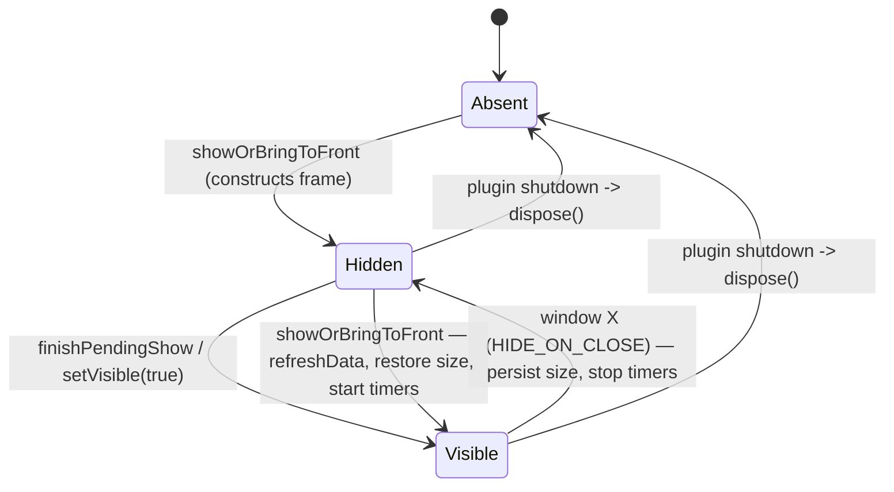

# Collection Album

> **Scope:** the detached collection-browser window — its lifecycle, layout, filter/sort pipeline, variant drill-down, image/repaint strategy, and threading rules.
> **Key packages:** `com.osrstcg.ui.collectionalbum`, plus `com.osrstcg.util.CollectionAlbumWindowSizeUtil`
> **Related:** `docs/` contains only this file at time of writing; source pointers are used instead of sibling doc links.

## Purpose

The collection album is a standalone `JFrame` that shows every card in the loaded
catalog as a 7×3 grid of card faces, with the player's owned copies rendered
normally and everything they don't own dimmed out. It is the only place in the
plugin where you can browse the whole catalog, drill into individual owned
copies of a card, lock/unlock a copy, sell a duplicate, gift a copy to a party
member, or stage cards into a party trade. It is opened from the "Open
collection album" button in the RuneLite sidebar panel
([TcgPanel.java:595](../src/main/java/com/osrstcg/ui/TcgPanel.java#L595)).

The album is deliberately *detached*. RuneLite's sidebar is narrow and lives
inside the client frame; card art at a readable size does not fit there. Being a
separate top-level window also means the album repaints on its own schedule
without dragging the sidebar's layout through a revalidate on every collection
change.

Everything about the album is designed around one constraint: **the album shares
the AWT event queue with the game canvas.** A burst of image decodes or a flood
of `repaint()` calls on the EDT shows up to the player as a stutter while they
are holding middle-mouse to rotate the camera. That constraint explains the
off-EDT filter/sort, the off-EDT card-face rasterization, the deferred first
show, and the debounced image-arrival repaint — all of which are documented
below and none of which are optional decoration.

`CollectionAlbumManager` is the only supported entry point. It is a `@Singleton`
that owns the single window instance, marshals every call onto the Swing EDT,
and is the seam through which services (pack opening, trades, gifts) tell the
album that the collection changed.

## Class reference

| Class | Lines | Responsibility |
|---|---|---|
| [CollectionAlbumWindow](../src/main/java/com/osrstcg/ui/collectionalbum/CollectionAlbumWindow.java) | 2226 | The `JFrame` itself: chrome, filters, paging, model rebuild pipeline, party/sell/trade south bar, variant view switching |
| [CollectionAlbumGridPanel](../src/main/java/com/osrstcg/ui/collectionalbum/CollectionAlbumGridPanel.java) | 526 | Paints the 7×3 browse grid from `AlbumSlot`s; off-EDT face rasterization; hit testing |
| [CollectionAlbumVariantsPanel](../src/main/java/com/osrstcg/ui/collectionalbum/CollectionAlbumVariantsPanel.java) | 425 | Paints the per-copy drill-down grid for one card; its own paging |
| [CollectionAlbumManager](../src/main/java/com/osrstcg/ui/collectionalbum/CollectionAlbumManager.java) | 129 | Window lifecycle (`showOrBringToFront` / `refreshIfVisible` / `dispose`), EDT marshalling |
| [AlbumSlot](../src/main/java/com/osrstcg/ui/collectionalbum/AlbumSlot.java) | 101 | Immutable per-cell view model for the browse grid |
| [AlbumRarityTable](../src/main/java/com/osrstcg/ui/collectionalbum/AlbumRarityTable.java) | 76 | Card name → rarity accent `Color`, and colour → tier label |
| [AlbumSortMode](../src/main/java/com/osrstcg/ui/collectionalbum/AlbumSortMode.java) | 22 | The four sort options and their combo-box labels |
| [AlbumInstanceTooltip](../src/main/java/com/osrstcg/ui/collectionalbum/AlbumInstanceTooltip.java) | 56 | Formats provenance (who pulled it / when / locked) into hover text |
| [CollectionAlbumWindowSizeUtil](../src/main/java/com/osrstcg/util/CollectionAlbumWindowSizeUtil.java) | 43 | Minimum size constants and clamping for the persisted window size |

## Window lifecycle

`CollectionAlbumManager` keeps one `volatile CollectionAlbumWindow window` field
and recreates it lazily whenever it is null or no longer displayable
([CollectionAlbumManager.java:57](../src/main/java/com/osrstcg/ui/collectionalbum/CollectionAlbumManager.java#L57)).
Every public method wraps its body in `SwingUtilities.invokeLater`, so callers
on the RuneLite client thread or on a party websocket thread never have to think
about the EDT.

Opening splits into two paths
([CollectionAlbumManager.java:63](../src/main/java/com/osrstcg/ui/collectionalbum/CollectionAlbumManager.java#L63)):

- **Already showing** — `refreshData()`, `prepareToShow()`, then `setVisible(true)` + `toFront()`.
- **Not showing** — the same refresh, then `requestShowWhenPageReady()` instead of
  `setVisible(true)`. This sets a flag consumed by `finishPendingShow()`
  ([CollectionAlbumWindow.java:587](../src/main/java/com/osrstcg/ui/collectionalbum/CollectionAlbumWindow.java#L587)),
  which only runs after the first model apply has completed — and that apply
  happens *after* the first page's images have been awaited off the EDT
  ([CollectionAlbumWindow.java:1011](../src/main/java/com/osrstcg/ui/collectionalbum/CollectionAlbumWindow.java#L1011)).
  The point is to keep the disk-decode GC burst from overlapping with the first
  frame paint, which would otherwise land on the same AWT queue the game canvas
  uses for camera input.

The frame's close operation is `HIDE_ON_CLOSE`
([CollectionAlbumWindow.java:204](../src/main/java/com/osrstcg/ui/collectionalbum/CollectionAlbumWindow.java#L204)),
so clicking the X hides the window and stops its timers but keeps the instance
(and its face rasters) alive for a fast re-open. Actual disposal only happens
via `CollectionAlbumManager.dispose()` → `window.disposeInternal()`, which is
called from `OsrsTcgPlugin` shutdown
([OsrsTcgPlugin.java:292](../src/main/java/com/osrstcg/OsrsTcgPlugin.java#L292)).
`disposeInternal` removes the image-load listener, persists the size, stops the
timers, and only then calls `dispose()`
([CollectionAlbumWindow.java:833](../src/main/java/com/osrstcg/ui/collectionalbum/CollectionAlbumWindow.java#L833)).
Removing the listener first matters: `WikiImageCacheService` holds a strong
reference to `imageLoadListener`, so a window that skipped `disposeInternal`
would leak for the life of the client.



### Why the window size lives in `TcgState`

The album is not a RuneLite plugin panel, so RuneLite's own window-bounds
persistence does not apply to it. The size is stored on the plugin's own state
object as `albumWindowWidth` / `albumWindowHeight`
([TcgState.java:15](../src/main/java/com/osrstcg/model/TcgState.java#L15)) and
serialized with the rest of the profile
([TcgStateCodec.java:154](../src/main/java/com/osrstcg/persist/TcgStateCodec.java#L154)).
The writer is `TcgStateService.setAlbumWindowSize`, which clamps, no-ops when
nothing changed, and then `save()`s
([TcgStateService.java:471](../src/main/java/com/osrstcg/service/TcgStateService.java#L471)).
The no-op check is what stops a save storm: `persistWindowSize()` is called on
window close, on `setVisible(false)`, and on dispose, so the same dimension
usually arrives two or three times per session.

`CollectionAlbumWindowSizeUtil` supplies the bounds:

```java
MIN_WIDTH  = 1300
MIN_HEIGHT = 810

resolve(w, h):
    if (w <= 0 || h <= 0) return (MIN_WIDTH, MIN_HEIGHT)   // no stored size yet
    return clamp(w, h)

clamp(w, h):
    w = max(MIN_WIDTH,  w)
    h = max(MIN_HEIGHT, h)
    max = GraphicsEnvironment.getLocalGraphicsEnvironment().getMaximumWindowBounds()
    if (max != null) { w = min(w, max.width); h = min(h, max.height) }
```

([CollectionAlbumWindowSizeUtil.java:10](../src/main/java/com/osrstcg/util/CollectionAlbumWindowSizeUtil.java#L10))

The minimum is large because the layout is fixed at 7 columns × 3 rows with no
scrolling — below roughly 1300×810 the computed cell size makes card text
unreadable. `getMaximumWindowBounds()` is the screen area minus taskbars, so a
profile carried to a smaller monitor gets clamped down rather than opening
partly off-screen. Note that clamping happens on **both** the write path
(`setAlbumWindowSize`) and the read path (`resolve`), so a hand-edited profile
with a 20000px width still opens sanely.

Restoring the size is fiddlier than it looks. `applySavedWindowSize()` is called
three times: once at the end of the constructor
([CollectionAlbumWindow.java:568](../src/main/java/com/osrstcg/ui/collectionalbum/CollectionAlbumWindow.java#L568)),
again from `windowOpened` via `invokeLater`, and again from the `setVisible(true)`
override. The comment on `prepareToShow`
([CollectionAlbumWindow.java:571](../src/main/java/com/osrstcg/ui/collectionalbum/CollectionAlbumWindow.java#L571))
explains why: layout during the first component build can undo an early
`setSize`, so the size has to be re-asserted after layout settles.

Symmetrically, the size that gets *saved* is not `getSize()` but
`trackedWindowSize`, recorded by a `ComponentAdapter` on every resize
([CollectionAlbumWindow.java:542](../src/main/java/com/osrstcg/ui/collectionalbum/CollectionAlbumWindow.java#L542)).
`getSize()` is only used as a fallback, because it can report a stale or
zeroed value while the frame is being torn down
([CollectionAlbumWindow.java:171](../src/main/java/com/osrstcg/ui/collectionalbum/CollectionAlbumWindow.java#L171)).

## Layout and the paging model

The frame uses a `BorderLayout(8, 8)`. North and centre are both `CardLayout`
hosts so the album can swap between browse mode and variant mode without
rebuilding anything:

| Region | Component | Cards |
|---|---|---|
| NORTH | `albumNorthHost` | `northBrowse` (collection combo, filter row, page row) / `northVariant` (back button, card title, variant paging) |
| CENTER | `albumCenterHost` | `browse` (`CollectionAlbumGridPanel`) / `variants` (`CollectionAlbumVariantsPanel`) |
| SOUTH | `south` | party member combo + Send / Send a trade offer / Accept trade request, and Offer up for trade / Sell |

**There is no `JScrollPane` anywhere in the album.** Paging is the entire scroll
model. `PAGE_SIZE` is 21
([CollectionAlbumWindow.java:87](../src/main/java/com/osrstcg/ui/collectionalbum/CollectionAlbumWindow.java#L87)),
which must equal `COLS * ROWS` in the grid panel (7 × 3, at
[CollectionAlbumGridPanel.java:30](../src/main/java/com/osrstcg/ui/collectionalbum/CollectionAlbumGridPanel.java#L30)).
The grid's paint loop hard-caps at `COLS * ROWS`
([CollectionAlbumGridPanel.java:438](../src/main/java/com/osrstcg/ui/collectionalbum/CollectionAlbumGridPanel.java#L438)),
so if you raise `PAGE_SIZE` without raising `ROWS`, the extra cards are silently
invisible while still counted in the page label.

Page navigation comes from the Prev/Next buttons
([CollectionAlbumWindow.java:320](../src/main/java/com/osrstcg/ui/collectionalbum/CollectionAlbumWindow.java#L320))
and from the mouse wheel. `onAlbumMouseWheel`
([CollectionAlbumWindow.java:924](../src/main/java/com/osrstcg/ui/collectionalbum/CollectionAlbumWindow.java#L924))
adds `e.getWheelRotation()` to `pageIndex`, clamps, and consumes the event. The
same listener is attached to a deliberately long list of components — the top
panel, the collection row, the collection combo itself, every child of the page
row, the browse wrapper, the grid, and the variants panel
([CollectionAlbumWindow.java:386](../src/main/java/com/osrstcg/ui/collectionalbum/CollectionAlbumWindow.java#L386)) —
because Swing does not bubble wheel events past a component that handles them
(a `JComboBox` would otherwise eat the scroll and change the selected
collection).

Page count and label:

```
pageCount  = max(1, ceil(filteredTotal / 21))
pageIndex  = clamp(pageIndex, 0, pageCount - 1)
label      = "Page {pageIndex+1} / {pageCount}   ({from+1} - {to} of {filteredTotal})"
```

([CollectionAlbumWindow.java:1065](../src/main/java/com/osrstcg/ui/collectionalbum/CollectionAlbumWindow.java#L1065),
[CollectionAlbumWindow.java:1243](../src/main/java/com/osrstcg/ui/collectionalbum/CollectionAlbumWindow.java#L1243))

### Slot sizing

The grid computes cell geometry fresh on every `paintComponent`
([CollectionAlbumGridPanel.java:428](../src/main/java/com/osrstcg/ui/collectionalbum/CollectionAlbumGridPanel.java#L428)):

```
innerW  = width  - insets.left - insets.right
innerH  = height - insets.top  - insets.bottom
cellW   = (innerW - (7 - 1) * 5) / 7        // GAP = 5
cellH   = (innerH - (3 - 1) * 5) / 3
contentH = max(1, cellH - 18)               // QTY_LABEL_RESERVE_PX = 18
scale   = min(cellW / 180.0, contentH / 260.0) * 0.94
cW      = round(180 * scale)                // SharedCardRenderer.DEFAULT_CARD_WIDTH
cH      = round(260 * scale)                // SharedCardRenderer.DEFAULT_CARD_HEIGHT
```

The card is centred horizontally in `cellW` and vertically in `contentH`; the
18px reserved strip below it holds the owned-count line. The `0.94` factor is
breathing room so adjacent foil frames don't visually touch. Because the aspect
ratio is locked to the shared 180×260 card, the album is width-bound on wide
windows and height-bound on tall ones — resizing changes card size continuously,
never the number of cards.

`CollectionAlbumVariantsPanel` repeats these constants and this formula verbatim
([CollectionAlbumVariantsPanel.java:33](../src/main/java/com/osrstcg/ui/collectionalbum/CollectionAlbumVariantsPanel.java#L33),
[CollectionAlbumVariantsPanel.java:368](../src/main/java/com/osrstcg/ui/collectionalbum/CollectionAlbumVariantsPanel.java#L368)).
They are two independent copies — change one and you must change the other.

## `AlbumSlot`: the per-cell view model

`AlbumSlot` is an immutable value object holding everything the grid needs to
paint one cell without touching state again
([AlbumSlot.java:6](../src/main/java/com/osrstcg/ui/collectionalbum/AlbumSlot.java#L6)).
It normalizes on construction: quantities are floored at 0, and empty strings
become `null` so the paint path can use plain null checks.

| Field | Meaning | Painted as |
|---|---|---|
| `card` | The `CardDefinition` for this catalog entry | Frame, title, art, score label |
| `rarityColor` | Accent colour from `AlbumRarityTable` | Frame colour and tier label |
| `ownedAny` | Player owns ≥ 1 copy (foil or not) | Unowned → whole face drawn at 30% alpha |
| `displayFoil` | Player owns ≥ 1 **foil** copy | Foil frame + animated sheen/sparkles |
| `nonFoilQty` / `foilQty` | Per-variant counts | Count line under the card |
| `singleCopyHoverTooltip` | Provenance text, only when exactly one copy | Swing tooltip |
| `lockBadge` | Any owned copy is locked | Padlock icon top-right of the art area |
| `soleInstanceId` | Instance id, only when exactly one copy exists | Enables right-click lock toggle |
| `offeredInTrade` | Some copy is staged in the live party trade | Green `0x3DDC84` border |

**Owned vs unowned.** Unowned cards are not hidden and not replaced with a
silhouette; the same face is rasterized with an
`AlphaComposite.SRC_OVER, 0.3f` composite applied for the whole draw
([CollectionAlbumGridPanel.java:351](../src/main/java/com/osrstcg/ui/collectionalbum/CollectionAlbumGridPanel.java#L351)).
Unowned cells are also inert: `handlePress` bails on `!slot.ownedAny()`
([CollectionAlbumGridPanel.java:177](../src/main/java/com/osrstcg/ui/collectionalbum/CollectionAlbumGridPanel.java#L177))
and `getToolTipText` returns null for them.

**Count badge.** `qtyLabel`
([CollectionAlbumGridPanel.java:499](../src/main/java/com/osrstcg/ui/collectionalbum/CollectionAlbumGridPanel.java#L499))
returns an empty string when total ≤ 1, so a single copy shows no line at all.
Otherwise it renders `"{f}x foil, {n}x normal"`, or just one half when the other
count is zero. Drawn in `FontManager.getRunescapeSmallFont()` at `0xDDDDDD`,
centred under the card.

**Foil indication.** `displayFoil` is card-level, not copy-level: owning one foil
among ten normals makes the *whole album cell* render as foil, and the score
label switches to the foil-adjusted value (`foilScoreLabel = owned && foil` at
[CollectionAlbumGridPanel.java:348](../src/main/java/com/osrstcg/ui/collectionalbum/CollectionAlbumGridPanel.java#L348)).
Per-copy truth lives in the variants view. The animated part of foil is *not*
baked into the raster — `drawCardFace(..., drawFoilOverlays = false)` draws the
static foil frame, and `SharedCardRenderer.drawFoilOverlays` paints sheen and
sparkles on the EDT blit path each frame
([CollectionAlbumGridPanel.java:462](../src/main/java/com/osrstcg/ui/collectionalbum/CollectionAlbumGridPanel.java#L462)).

**Border precedence.** The trade-offered border wins over the selection border —
they are an `if`/`else if`
([CollectionAlbumGridPanel.java:478](../src/main/java/com/osrstcg/ui/collectionalbum/CollectionAlbumGridPanel.java#L478)),
so a selected card that is already offered shows green, not cyan.

## Filtering and sorting

All filters funnel into one pure static method,
`computeFilteredSortedCards(ModelRebuildInputs)`
([CollectionAlbumWindow.java:1072](../src/main/java/com/osrstcg/ui/collectionalbum/CollectionAlbumWindow.java#L1072)).
It is static and takes an immutable snapshot precisely so it can run off the EDT
without reading live Swing or state fields. Order matters — each stage narrows
the working list before the next runs.

1. **Collection tab** (`collectionCombo`). Built by `buildTabFilters`
   ([CollectionAlbumWindow.java:896](../src/main/java/com/osrstcg/ui/collectionalbum/CollectionAlbumWindow.java#L896)):
   an "All" entry that only requires a non-blank card name, plus one entry per
   visible booster that declares category filters, matched with
   `BoosterPackDefinition.cardMatchesRegion`. Boosters with an *empty* filter
   list (universal packs such as Standard) are skipped, because their card set
   is identical to "All" and a duplicate tab would be confusing
   ([CollectionAlbumWindow.java:909](../src/main/java/com/osrstcg/ui/collectionalbum/CollectionAlbumWindow.java#L909)).
   The visible-booster list itself depends on debug logging
   (`packCatalog.getVisibleBoosters(stateService.isDebugLogging())`), so toggling
   debug mode changes the available tabs on the next `refreshData()`.
2. **Rarity** (`rarityCombo`). `"All"` plus the seven tiers in
   `RARITY_TIERS_LOW_TO_HIGH`
   ([CollectionAlbumWindow.java:91](../src/main/java/com/osrstcg/ui/collectionalbum/CollectionAlbumWindow.java#L91)).
   Matching is an exact string compare against
   `rarityTable.tierLabelForCard(card)`.
3. **Search**. Case-insensitive `contains` on the card name only — not
   categories, not tags
   ([CollectionAlbumWindow.java:1096](../src/main/java/com/osrstcg/ui/collectionalbum/CollectionAlbumWindow.java#L1096)).
   The query is lowercased once with `Locale.ROOT` when captured. Typing is
   debounced by a non-repeating 220 ms `javax.swing.Timer` restarted on every
   document event
   ([CollectionAlbumWindow.java:257](../src/main/java/com/osrstcg/ui/collectionalbum/CollectionAlbumWindow.java#L257)).
4. **Foil only** (checkbox). Keeps cards where the owned map has a positive count
   under `CardCollectionKey(name, true)`
   ([CollectionAlbumWindow.java:1395](../src/main/java/com/osrstcg/ui/collectionalbum/CollectionAlbumWindow.java#L1395)).
   It is independent of the ownership radios and is applied *before* them.
5. **Ownership radios** (one `ButtonGroup`, mutually exclusive):
   `All cards` (no filter) / `Obtained only` (name in the collected set) /
   `Duplicates only` (foil + non-foil total > 1) / `Missing only` (name not in
   the collected set). Note the `else if` chain
   ([CollectionAlbumWindow.java:1107](../src/main/java/com/osrstcg/ui/collectionalbum/CollectionAlbumWindow.java#L1107)) —
   only one can ever apply, which the `ButtonGroup` already guarantees.

Every one of these controls resets `pageIndex = 0` before calling
`rebuildModel()`, so changing a filter never strands you on page 9 of a 2-page
result.

### Sort modes

`AlbumSortMode` has four values
([AlbumSortMode.java:3](../src/main/java/com/osrstcg/ui/collectionalbum/AlbumSortMode.java#L3));
`toString()` is overridden to return the label, which is what the `JComboBox`
renders.

| Value | Label | Primary key | Direction | Tiebreak |
|---|---|---|---|---|
| `SCORE_DESC` | Score (high first) | `albumSortScore(owned, card)` (double) | descending | name, case-insensitive ascending |
| `MOST_RECENT` | Most recent | `mostRecentPulledAt(byName, name)` (long, 0 if never) | descending | name ascending |
| `RARITY_DESC` | Rarity (high first) | `tierSortKey(tierLabel)` (int 0–6) | descending | name ascending |
| `NAME_ASC` | Name (A–Z) | name, `String.CASE_INSENSITIVE_ORDER` | ascending | — |

`SCORE_DESC` is not a plain score sort. `albumSortScore`
([CollectionAlbumWindow.java:1352](../src/main/java/com/osrstcg/ui/collectionalbum/CollectionAlbumWindow.java#L1352))
returns `RarityMath.foilAdjustedScoreRounded(card)` — that is `round(score^1.1)`
([RarityMath.java:106](../src/main/java/com/osrstcg/service/RarityMath.java#L106)) —
when the player owns a foil copy, and plain `RarityMath.score(card)` otherwise.
So owning a foil physically moves the card up the list relative to an identical
card you only own normally.

`MOST_RECENT` uses `getLastObtainedMap()`, which is keyed by
`CardCollectionKey(name, foil)`; `mostRecentPulledAtByCardName` collapses the
foil and non-foil timestamps to their `max` per name
([CollectionAlbumWindow.java:1366](../src/main/java/com/osrstcg/ui/collectionalbum/CollectionAlbumWindow.java#L1366)).
Cards you have never obtained get `0` and sink to the bottom, ordered by name.

`tierSortKey` is a hand-written `switch` over the tier *label strings*
([CollectionAlbumWindow.java:1301](../src/main/java/com/osrstcg/ui/collectionalbum/CollectionAlbumWindow.java#L1301)):
Common 0, Uncommon 1, Rare 2, Epic 3, Legendary 4, Mythic 5, Godly 6, with
`default: 0`. Any unrecognized label silently sorts as Common.

One comparator subtlety worth internalising before you edit this block: the
pattern is `Comparator.comparingX(key).reversed().thenComparing(byName)`. The
`reversed()` binds to the primary key comparator only, so the name tiebreak stays
**ascending** while the primary key is descending. If you refactor this into
`Comparator.comparingX(key).thenComparing(byName).reversed()`, names will
silently flip to Z–A.

## `AlbumRarityTable`

Despite the name, this is **not** a summary table and it computes **no
completion percentages** — it is a `Map<String, Color>` lookup from card name to
the rarity accent colour, plus a colour→label helper
([AlbumRarityTable.java:15](../src/main/java/com/osrstcg/ui/collectionalbum/AlbumRarityTable.java#L15)).
There is no rarity-breakdown panel or percent-complete readout anywhere in the
`collectionalbum` package; see [Open questions](#open-questions).

Two construction paths exist:

- `fromColorByCardName(map)` — wraps a precomputed map **without copying**. This
  is what the window actually uses
  ([CollectionAlbumWindow.java:873](../src/main/java/com/osrstcg/ui/collectionalbum/CollectionAlbumWindow.java#L873)),
  fed from `cardDatabase.displayRarityColorsByCardName()`. The colours are
  computed once at catalog load; re-tiering the whole catalog on the EDT every
  time the album opens would be a visible stall. Because there is no defensive
  copy, **the caller must not mutate the map afterwards**
  ([AlbumRarityTable.java:24](../src/main/java/com/osrstcg/ui/collectionalbum/AlbumRarityTable.java#L24)).
- `build(allCards)` — the fallback, which runs
  `RarityMath.displayTierByCardName(allCards)` itself and stores
  `tier.getColor()` per name. Used for the empty initial value at
  [CollectionAlbumWindow.java:114](../src/main/java/com/osrstcg/ui/collectionalbum/CollectionAlbumWindow.java#L114).

`colorForCardName` defaults to `Color.WHITE` for unknown names.

`tierLabelForCard` is the interesting one: it does a **round trip** through the
colour. It maps card name → `Color`, then hands that colour to
`SharedCardRenderer.tierLabelForRarityColor`
([SharedCardRenderer.java:659](../src/main/java/com/osrstcg/ui/SharedCardRenderer.java#L659)),
which matches the RGB against the seven tier constants:

| Tier | RGB | Marginal pack roll chance |
|---|---|---|
| Common | `0xFFFFFF` | 37.34% |
| Uncommon | `0x2ECC71` | 32.00% |
| Rare | `0x3498DB` | 16.00% |
| Epic | `0x9B59B6` | 8.00% |
| Legendary | `0xE74C3C` | 4.00% |
| Mythic | `0xFF6EC7` | 2.00% |
| Godly | `0xF2C94C` | 0.66% |

([RarityMath.java:17](../src/main/java/com/osrstcg/service/RarityMath.java#L17))

The consequence: the album's rarity **filter** and its `RARITY_DESC` **sort**
both depend on exact RGB equality with those seven constants. `Color.WHITE`
happens to equal the Common constant, so unknown cards degrade to "Common"
rather than breaking — but if you ever introduce a new accent colour without
registering it in `tierLabelForRarityColor`, every card using it will filter and
sort as Common with no error anywhere.

## `CollectionAlbumVariantsPanel`: the per-copy drill-down

Left-pressing an owned album cell whose `totalOwnedQty() > 1` does not select it
— it clears the selection and fires the `ownedMultiCopyPressed` callback
([CollectionAlbumGridPanel.java:182](../src/main/java/com/osrstcg/ui/collectionalbum/CollectionAlbumGridPanel.java#L182)),
which lands in `enterAlbumVariantView`
([CollectionAlbumWindow.java:1481](../src/main/java/com/osrstcg/ui/collectionalbum/CollectionAlbumWindow.java#L1481)).
That method pulls the live copies from
`CollectionState.instancesForCardName(name)`, bails if fewer than two remain,
sorts them **foil first, then oldest `pulledAt` first**
([CollectionAlbumWindow.java:1498](../src/main/java/com/osrstcg/ui/collectionalbum/CollectionAlbumWindow.java#L1498)),
and flips both `CardLayout`s to the variant cards.

Each cell in this grid is one `OwnedCardInstance`, so foil is per copy:
`drawCardFace(g2, bounds, card, inst.isFoil(), rarityColor, art, 0L, foil)`
([CollectionAlbumVariantsPanel.java:397](../src/main/java/com/osrstcg/ui/collectionalbum/CollectionAlbumVariantsPanel.java#L397)) —
the last argument reuses `foil` so a foil copy also gets the foil-adjusted score
label. Locked copies get their own padlock
([CollectionAlbumVariantsPanel.java:398](../src/main/java/com/osrstcg/ui/collectionalbum/CollectionAlbumVariantsPanel.java#L398)),
and offered-in-trade / selected borders use the same two colours as the browse
grid with the same precedence.

Paging is self-contained but drives widgets owned by the window. `setPagingControls`
is called once from the window constructor
([CollectionAlbumWindow.java:436](../src/main/java/com/osrstcg/ui/collectionalbum/CollectionAlbumWindow.java#L436))
and guards against double-attaching listeners with `pagingListenersAttached`
([CollectionAlbumVariantsPanel.java:87](../src/main/java/com/osrstcg/ui/collectionalbum/CollectionAlbumVariantsPanel.java#L87)).
The prev/next/label widgets are hidden entirely when there are 21 or fewer copies
([CollectionAlbumVariantsPanel.java:158](../src/main/java/com/osrstcg/ui/collectionalbum/CollectionAlbumVariantsPanel.java#L158)).
`setVariants` also jumps straight to the page containing an incoming selection:
`variantPageIndex = i / PAGE_SIZE`
([CollectionAlbumVariantsPanel.java:118](../src/main/java/com/osrstcg/ui/collectionalbum/CollectionAlbumVariantsPanel.java#L118)).

### Relationship to `CardVariant`

`CardVariant` ([CardVariant.java:6](../src/main/java/com/osrstcg/model/CardVariant.java#L6))
is the **persistence** shape, not a runtime one: it is a mutable field bag inside
a `CardEntry` group, used by the profile save codec and the web-share payload.
Its `foil` / `pulledBy` / `pulledAt` / `locked` fields correspond one-to-one with
`OwnedCardInstance`'s `foil` / `pulledByUsername` / `pulledAtEpochMs` / `locked`,
and its legacy `quantity` / `lockedQuantity` fields are expanded into individual
instances on load. `locked` is profile-save only and is not sent on web share.

The album never touches `CardVariant`. Everything in this package works on
`OwnedCardInstance`, which unlike `CardVariant` is immutable and carries an
`instanceId` — and it is that id, not a name+foil pair, that the album passes to
every mutating operation (`toggleCardInstanceLock`, `removeCardInstance`,
`sendGift`, `offerCard`). That is what makes "sell *this* copy" unambiguous when
you own eight of the same card.

### Instance-level actions from the variant grid

| Gesture | Handler | Effect |
|---|---|---|
| Left click | `selectInstance` → `onVariantInstancePicked` | Sets `sendChosenInstanceId`, `sendPickFromVariantOnly = true` |
| Right click (popup trigger) | `tryLockToggle` → `onVariantCardLockToggle` | `stateService.toggleCardInstanceLock`, then `refreshActiveVariantCopies()` |
| Double click | `handleDoubleClick` → `onVariantDoubleClickOffer` | Picks the instance then `offerInstanceForTrade` (no-op unless a trade is active) |

The lock toggle is bound to `isPopupTrigger()` and is checked in **both**
`mousePressed` and `mouseReleased`
([CollectionAlbumVariantsPanel.java:209](../src/main/java/com/osrstcg/ui/collectionalbum/CollectionAlbumVariantsPanel.java#L209)),
because the popup trigger is press on X11/macOS and release on Windows. Both
handlers guard so only one fires.

On the browse grid the same right-click gesture requires `soleInstanceId != null`
([CollectionAlbumGridPanel.java:140](../src/main/java/com/osrstcg/ui/collectionalbum/CollectionAlbumGridPanel.java#L140)):
you can only lock/unlock from the album directly when exactly one copy exists,
because otherwise the cell doesn't identify a copy.

## `AlbumInstanceTooltip` and provenance

`AlbumInstanceTooltip.format` builds up to three newline-separated lines
([AlbumInstanceTooltip.java:27](../src/main/java/com/osrstcg/ui/collectionalbum/AlbumInstanceTooltip.java#L27)):

```
Pulled by: {formatPulledByForUi(pulledByUsername)}     // omitted when blank
{DateTimeFormatter.ofLocalizedDateTime(SHORT), system zone}   // omitted when <= 0
Locked                                                  // only when locked
```

It returns `null` when nothing would be shown, which Swing treats as "no
tooltip".

**Debug-granted copies.** `OwnedCardInstance.DEBUG_PULL_METADATA_PREFIX` is the
literal `"DEBUG_"`
([OwnedCardInstance.java:16](../src/main/java/com/osrstcg/model/OwnedCardInstance.java#L16)).
It is applied to `pulledByUsername` for cards from `::tcg-give`, free debug
booster pulls, or any pack opened while Overview debug logging is on — see
`OwnedCardInstance.withDebugPullMetadataPrefix` used at
[OsrsTcgPlugin.java:853](../src/main/java/com/osrstcg/OsrsTcgPlugin.java#L853).
Storage keeps the uppercase `DEBUG_` prefix; `formatPulledByForUi` rewrites it to
`Debug_` for display
([OwnedCardInstance.java:80](../src/main/java/com/osrstcg/model/OwnedCardInstance.java#L80)).
So a tooltip reading `Pulled by: Debug_Zezima` means the copy was granted, not
pulled. Note that the prefix is *not* stripped — it is rewritten — so the tooltip
always makes debug origin visible and `CollectionState.withoutDebugProvenanceRows()`
can find these rows later.

**Traded and gifted copies keep the original puller's provenance.** When a gift
arrives, the receiver constructs
`OwnedCardInstance.createNew(card, foil, msg.getPulledByUsername(), msg.getPulledAtEpochMs())`
([CardPartyTransferService.java:387](../src/main/java/com/osrstcg/service/CardPartyTransferService.java#L387)),
and the trade path does the same
([CardPartyTradeService.java:1438](../src/main/java/com/osrstcg/service/CardPartyTradeService.java#L1438)).
`createNew` mints a **fresh** `instanceId` but copies `pulledBy` and `pulledAt`
verbatim. Practical consequences:

- The tooltip on a traded-in card names whoever originally pulled it, not the
  person who sent it. There is no "received from" field.
- `locked` is not carried across — a received copy always arrives unlocked.
- Debug provenance travels with the card, which is why both transfer services
  refuse transfers when the two clients' debug flags disagree
  ([CardPartyTransferService.java:369](../src/main/java/com/osrstcg/service/CardPartyTransferService.java#L369)).

**Where the tooltip appears.** In the variants grid, every cell has one
([CollectionAlbumVariantsPanel.java:324](../src/main/java/com/osrstcg/ui/collectionalbum/CollectionAlbumVariantsPanel.java#L324)).
In the browse grid, only single-copy owned cells do —
`singleCopyAlbumHoverTooltip` returns null unless `nQty + fQty == 1` *and* the
instance row has exactly one entry
([CollectionAlbumWindow.java:1426](../src/main/java/com/osrstcg/ui/collectionalbum/CollectionAlbumWindow.java#L1426)).
For a multi-copy card there is no single answer to "who pulled it", so you have
to drill in.

`AlbumInstanceTooltip.LOCKED_ACTION_HINT` doubles as the disabled-button tooltip
across the south bar via `LOCKED_CARD_ACTION_TOOLTIP`
([CollectionAlbumWindow.java:86](../src/main/java/com/osrstcg/ui/collectionalbum/CollectionAlbumWindow.java#L86)).

## Data flow: a model rebuild

```
EDT: rebuildModel()
  └─ scheduleModelRebuild(userInitiated = true)
       ├─ exitAlbumVariantView(); refreshPartyMemberCombo()
       ├─ captureModelRebuildInputs(collectionIdx)   // snapshot of every filter + state map
       ├─ gen = modelRebuildGen.incrementAndGet()
       └─ ForkJoinPool.commonPool().execute:
            ├─ computeFilteredSortedCards(inputs)    // filter chain + sort, pure
            ├─ pages/page/from/to arithmetic
            ├─ imageCacheService.preloadAndAwait(pageUrls, 8_000 ms)
            └─ SwingUtilities.invokeLater:
                 └─ applyModelRebuild(gen, preservePageIndex, working)
                      ├─ drop if gen != modelRebuildGen.get()      // stale result
                      ├─ filteredSortedCards / filteredTotal / pageCount / pageIndex
                      ├─ refreshCurrentPage(imagesPreloaded = true)
                      │    ├─ build 21 AlbumSlots from owned map + instance index
                      │    ├─ rememberVisibleImageUrls(slots)
                      │    ├─ grid.setSlots(slots, selectionPreserveIndex(slots))
                      │    │    └─ invalidateFaceRasters(); repaint()
                      │    ├─ updatePageControls(from, to)
                      │    └─ updateAlbumRepaintTimers()
                      └─ finishPendingShow()          // first open only
```

`ModelRebuildInputs` ([CollectionAlbumWindow.java:2155](../src/main/java/com/osrstcg/ui/collectionalbum/CollectionAlbumWindow.java#L2155))
is the boundary object. Capturing it on the EDT is what makes the background
stage safe: it reads `sortCombo`, `rarityCombo`, `searchField`, the radios, and
`stateService.getState()` once, while the EDT still owns them.

`modelRebuildGen` is a monotonically increasing `AtomicLong` used as a
last-writer-wins token. Type into the search box quickly and you can have three
rebuilds in flight; only the newest `gen` is allowed to apply. The same token is
re-checked inside the page-level preload bounce
([CollectionAlbumWindow.java:1183](../src/main/java/com/osrstcg/ui/collectionalbum/CollectionAlbumWindow.java#L1183)),
where it is paired with a `pageIndex` snapshot so a slow image load for page 3
cannot overwrite page 5.

## Repaint and refresh strategy

The album has four escalating refresh levels. Picking the wrong one is the most
common way to make this window slow.

| Level | Entry point | Cost | Triggers |
|---|---|---|---|
| Repaint only | `grid.repaint()` | One paint pass; blits cached rasters | Foil animation timer; selection change |
| Re-raster faces | `grid.refreshFacesAfterImageLoad()` | 21 off-EDT rasterizations + repaint | Debounced wiki-image arrival |
| Rebuild page | `refreshCurrentPage()` | Rebuilds 21 `AlbumSlot`s from state | Paging, lock toggle, `refreshPartyTradeUi` |
| Full rebuild | `rebuildModel()` | Re-filters and re-sorts the whole catalog off-EDT | Filter/sort/search change, `refreshData`, external collection mutation |

### Staying in sync with collection mutations

The album does not observe state. Everything that changes the collection must
push, and the push channel is `CollectionAlbumManager`:

| Source | Call site | Album method |
|---|---|---|
| Sidebar refresh after a pack close (and every other panel refresh) | [TcgPanel.java:497](../src/main/java/com/osrstcg/ui/TcgPanel.java#L497) | `refreshIfVisible()` → `rebuildModel()` |
| Received gift | [CardPartyTransferService.java:409](../src/main/java/com/osrstcg/service/CardPartyTransferService.java#L409) | `refreshIfVisible()` |
| Trade completed / cards moved | [CardPartyTradeService.java:1687](../src/main/java/com/osrstcg/service/CardPartyTradeService.java#L1687) | `refreshIfVisible()` |
| Trade UI state change (offers, invites) | [CardPartyTradeService.java:1696](../src/main/java/com/osrstcg/service/CardPartyTradeService.java#L1696) | `refreshPartyTradeUiIfVisible()` → `refreshPartyTradeUi()` |
| Debug `::tcg-give` / add-one-of-each | [OsrsTcgPlugin.java:793](../src/main/java/com/osrstcg/OsrsTcgPlugin.java#L793), [:853](../src/main/java/com/osrstcg/OsrsTcgPlugin.java#L853) | `refreshIfVisible()` |
| Sell / send from inside the album | [CollectionAlbumWindow.java:2020](../src/main/java/com/osrstcg/ui/collectionalbum/CollectionAlbumWindow.java#L2020), [:2089](../src/main/java/com/osrstcg/ui/collectionalbum/CollectionAlbumWindow.java#L2089) | `rebuildModel()` directly, plus `sidebarRefresh.run()` |

Pack opening therefore reaches the album *indirectly*, through the sidebar's
post-pack-close refresh. The album never subscribes to pack events itself.

Both `refreshIfVisible` and `refreshPartyTradeUiIfVisible` no-op when
`!window.isShowing()`, so a hidden album costs nothing.

`refreshPartyTradeChrome`
([CollectionAlbumWindow.java:1782](../src/main/java/com/osrstcg/ui/collectionalbum/CollectionAlbumWindow.java#L1782))
exists specifically so the 2-second party poll timer can update invite/status
chrome **without** rebuilding album slots — otherwise idle album viewing would
repaint the entire grid every two seconds.

### Image arrival

The window registers `imageLoadListener` with `WikiImageCacheService`
([CollectionAlbumWindow.java:521](../src/main/java/com/osrstcg/ui/collectionalbum/CollectionAlbumWindow.java#L521)).
`onWikiImageLoaded`
([CollectionAlbumWindow.java:747](../src/main/java/com/osrstcg/ui/collectionalbum/CollectionAlbumWindow.java#L747))
applies two filters before doing anything:

1. The URL must be in `visibleImageUrls` — a `volatile Set<String>` of the
   normalized URLs currently on screen, rewritten by
   `rememberVisibleImageUrls` / `rememberBrowsePageImageUrls` /
   `rememberVariantImageUrl`. Loads for off-screen pages are ignored entirely.
2. **Every** visible URL must be settled (in memory or known-failed). Until the
   last one arrives, nothing happens.

Only then does it hop to the EDT and `restart()` the 500 ms
`IMAGE_REPAINT_DEBOUNCE_MS` timer
([CollectionAlbumWindow.java:89](../src/main/java/com/osrstcg/ui/collectionalbum/CollectionAlbumWindow.java#L89)),
which finally calls `grid.refreshFacesAfterImageLoad()`. Net effect: at most one
re-raster per page, half a second after the last image settles, regardless of
how many decodes completed.

### Face rasterization

The grid never draws card art on the EDT. `scheduleFaceRasters`
([CollectionAlbumGridPanel.java:273](../src/main/java/com/osrstcg/ui/collectionalbum/CollectionAlbumGridPanel.java#L273))
is called from `paintComponent` once the cell size is known, and submits one
task per slot to `imageCacheService.executeBackground`. Each task builds a
`TYPE_INT_ARGB` `BufferedImage` of exactly `cW × cH`, draws the static face into
it, then hops back to the EDT to install it and request a coalesced repaint.

Three guards keep this from thrashing:

- **Size/generation short-circuit** — if the requested `cW`/`cH` and slot count
  match what is already scheduled for the current `faceRasterGen`, the call
  returns immediately, so ordinary repaints don't re-queue 21 tasks
  ([CollectionAlbumGridPanel.java:280](../src/main/java/com/osrstcg/ui/collectionalbum/CollectionAlbumGridPanel.java#L280)).
- **Generation token** — `faceRasterGen` is bumped by `invalidateFaceRasters()`
  on every `setSlots` and every image-load refresh; in-flight tasks check it both
  before rasterizing and again before installing.
- **Coalesced repaint** — `scheduleCoalescedRepaint` uses an `AtomicBoolean`
  compare-and-set so 21 completing tasks produce one `repaint()`, not 21
  ([CollectionAlbumGridPanel.java:323](../src/main/java/com/osrstcg/ui/collectionalbum/CollectionAlbumGridPanel.java#L323)).

While a raster is missing the cell paints a flat `0x2A2A2A` rounded rect
([CollectionAlbumGridPanel.java:457](../src/main/java/com/osrstcg/ui/collectionalbum/CollectionAlbumGridPanel.java#L457)).

### Foil animation

`foilAnimTimer` runs at `SharedCardRenderer.FOIL_SPARKLE_FRAME_MS`, which is
`1000 / 60` = 16 ms
([SharedCardRenderer.java:41](../src/main/java/com/osrstcg/ui/SharedCardRenderer.java#L41)).
It is started and stopped by `updateAlbumRepaintTimers`
([CollectionAlbumWindow.java:720](../src/main/java/com/osrstcg/ui/collectionalbum/CollectionAlbumWindow.java#L720))
based on whether any *visible* card is foil, and its action re-checks
`hasVisibleFoilCards()` before repainting. A page of non-foil cards costs zero
timer wakeups. A single foil card on the page puts the whole grid on a 60 Hz
repaint — which is affordable only because the paint path is a blit plus cheap
overlays, not a re-render.

## Threading

Four execution contexts touch this code. Getting them wrong here produces
either a frozen client or a silently blank album.

| Context | What runs on it | Notes |
|---|---|---|
| **Swing EDT** | Everything in `CollectionAlbumWindow`, both panels, all `javax.swing.Timer` actions | The default assumption for every method in this package |
| **RuneLite client thread** | Callers in `OsrsTcgPlugin` and the party services | Must go through `CollectionAlbumManager`, which wraps in `invokeLater` |
| **`ForkJoinPool.commonPool()`** | `computeFilteredSortedCards`, `preloadAndAwait`, the sidebar's pack-close snapshot | Never touches Swing state; results applied via `invokeLater` + generation check |
| **`WikiImageCacheService` loader pool** | Face rasterization (`executeBackground`), image download/decode, `imageLoadListener` callbacks | Capped at 4 in-flight loads ([WikiImageCacheService.java:65](../src/main/java/com/osrstcg/service/WikiImageCacheService.java#L65)) |

Defensive re-marshalling appears in three places rather than being assumed:
`scheduleModelRebuild`
([CollectionAlbumWindow.java:985](../src/main/java/com/osrstcg/ui/collectionalbum/CollectionAlbumWindow.java#L985)),
`applyModelRebuild`
([CollectionAlbumWindow.java:1058](../src/main/java/com/osrstcg/ui/collectionalbum/CollectionAlbumWindow.java#L1058)),
and `refreshFromCollectionChange`
([CollectionAlbumWindow.java:950](../src/main/java/com/osrstcg/ui/collectionalbum/CollectionAlbumWindow.java#L950))
all begin with an `isEventDispatchThread()` check and bounce if needed.

`visibleImageUrls` is the only field read from a non-EDT thread, and it is
`volatile` for exactly that reason
([CollectionAlbumWindow.java:158](../src/main/java/com/osrstcg/ui/collectionalbum/CollectionAlbumWindow.java#L158)).
It is only ever *replaced* with a fresh set, never mutated in place — preserve
that if you touch `rememberVisibleImageUrls`.

The maps handed to the background stage are safe to read there because
`CollectionState` is deeply immutable: its instance list and both derived maps
are wrapped in `Collections.unmodifiable*` at construction
([CollectionState.java:32](../src/main/java/com/osrstcg/model/CollectionState.java#L32)),
and mutations produce a whole new `CollectionState`. The snapshot the background
thread holds may go stale, but it can never be observed half-updated — and the
`modelRebuildGen` check plus the follow-up `refreshIfVisible()` from whatever
mutated the collection covers the staleness.

### Image cache interaction

Two lookup methods with different semantics, and the album uses both:

- `getIfPresent(url)` — pure memory-cache peek, never starts a load
  ([WikiImageCacheService.java:253](../src/main/java/com/osrstcg/service/WikiImageCacheService.java#L253)).
  Used by the grid's `rasterizeFace`.
- `getCached(url)` — returns from memory if present, otherwise **kicks off a
  background load** and returns null
  ([WikiImageCacheService.java:281](../src/main/java/com/osrstcg/service/WikiImageCacheService.java#L281)).
  Used by the variants panel's paint path
  ([CollectionAlbumVariantsPanel.java:395](../src/main/java/com/osrstcg/ui/collectionalbum/CollectionAlbumVariantsPanel.java#L395)).

Neither blocks. `preloadAndAwait` *does* block and is only ever called from a
`ForkJoinPool` task — 8000 ms for a model rebuild
([CollectionAlbumWindow.java:1011](../src/main/java/com/osrstcg/ui/collectionalbum/CollectionAlbumWindow.java#L1011)),
6000 ms for a page bounce
([CollectionAlbumWindow.java:1180](../src/main/java/com/osrstcg/ui/collectionalbum/CollectionAlbumWindow.java#L1180)).
A timeout is logged at debug and the page renders with whatever arrived. Calling
it on the EDT would freeze the client for up to eight seconds.

Cached images are downscaled to a 130px maximum edge and the memory cache holds
256 entries
([WikiImageCacheService.java:58](../src/main/java/com/osrstcg/service/WikiImageCacheService.java#L58)),
behind a `Collections.synchronizedMap`. 256 entries covers about twelve album
pages, so paging back and forth through a large filtered set will eventually
re-decode from disk.

## Performance with a large collection

There is **no virtualisation, and none is needed for painting** — the grid always
draws at most 21 cells. The costs are elsewhere, and they scale with catalog and
collection size rather than with what's on screen:

1. **Full-catalog filter + sort per rebuild.** `computeFilteredSortedCards`
   streams the entire catalog, runs up to four `removeIf` passes over an
   `ArrayList` (each O(n)), then sorts. This is off-EDT and generation-guarded,
   so it is the least worrying item — but note it runs on *every* keystroke after
   the 220 ms debounce and on *every* external collection mutation.
2. **`indexInstancesByName` on every page refresh.** `refreshCurrentPage` builds
   a `HashMap<String, List<OwnedCardInstance>>` over **all** owned instances
   ([CollectionAlbumWindow.java:1195](../src/main/java/com/osrstcg/ui/collectionalbum/CollectionAlbumWindow.java#L1195))
   just to look up 21 names — and it runs on the **EDT**. A collection with tens
   of thousands of copies makes every page turn allocate and walk that whole
   list. This is the most likely first bottleneck if the album starts feeling
   sluggish.
3. **`collectedNamesFromOwned` is computed twice per rebuild**, once inside the
   background filter stage and again on the EDT inside `refreshCurrentPage`
   ([CollectionAlbumWindow.java:1194](../src/main/java/com/osrstcg/ui/collectionalbum/CollectionAlbumWindow.java#L1194)).
4. **`cardDefinitionForName` is a linear scan of the whole catalog**
   ([CollectionAlbumWindow.java:1965](../src/main/java/com/osrstcg/ui/collectionalbum/CollectionAlbumWindow.java#L1965)),
   with no index. It is called from `sellCreditsForChosenInstance`, which is
   called from `updateSouthBarButtons`, which fires on every selection change
   *and* on every 2-second party timer tick while the album is open with a card
   selected. `CardDatabase.findByName` exists and is the obvious replacement.
5. **21 ARGB `BufferedImage` allocations per page turn.** Each raster is
   `cW × cH × 4` bytes; on a large window that is roughly 300×430×4 ≈ 500 KB per
   card, so a page turn churns ~10 MB of short-lived heap. The generation guard
   prevents duplicates but not the churn itself.
6. **60 Hz whole-grid repaint whenever any visible card is foil** (see above).

Everything above is per-interaction, not per-frame, except item 6.

## Gotchas & invariants

- **`PAGE_SIZE` must equal `COLS * ROWS`.** The window's `PAGE_SIZE = 21`
  ([CollectionAlbumWindow.java:87](../src/main/java/com/osrstcg/ui/collectionalbum/CollectionAlbumWindow.java#L87))
  and the grid's `7 * 3` are declared independently. The variants panel derives
  its own from `COLS * ROWS`
  ([CollectionAlbumVariantsPanel.java:37](../src/main/java/com/osrstcg/ui/collectionalbum/CollectionAlbumVariantsPanel.java#L37)),
  which is the safer pattern; the window's does not.
- **`refreshFromCollectionChange()` and `needsFullRefilterForCollectionChange()`
  have no callers.** Both are live, correct-looking code
  ([CollectionAlbumWindow.java:948](../src/main/java/com/osrstcg/ui/collectionalbum/CollectionAlbumWindow.java#L948))
  implementing a cheaper "only re-page, don't re-filter" path for external
  mutations — but `CollectionAlbumManager.refreshIfVisible()` calls
  `rebuildModel()` instead. If you were looking for the lightweight path, it is
  written but not wired.
- **`CollectionAlbumManager.collectionRefreshDebounceTimer` is never started or
  assigned.** It is declared and stopped in `dispose()`
  ([CollectionAlbumManager.java:30](../src/main/java/com/osrstcg/ui/collectionalbum/CollectionAlbumManager.java#L30))
  and nothing else. Dead field.
- **`AlbumRarityTable.fromColorByCardName` does not copy.** Mutating
  `CardDatabase.displayRarityColorsByCardName()` after the album is built
  silently changes album colours, filtering, and sorting.
- **Rarity filtering and `RARITY_DESC` depend on exact RGB equality.** A colour
  not registered in `SharedCardRenderer.tierLabelForRarityColor` degrades to
  "Common" with no warning.
- **`.reversed().thenComparing(byName)` ordering is load-bearing.** Moving
  `reversed()` to the end flips the name tiebreak to descending.
- **`lastCardBounds` is assigned in the `finally` of `paintComponent`.** All hit
  testing (`hitTestSlotIndex`, `handlePress`, `getToolTipText`) reads it, so a
  click that arrives before the first paint hits an empty list and no-ops
  silently. Both panels do this.
- **The variants panel's `lastCardBounds` includes empty cells.** Its paint loop
  runs the full `PAGE_SIZE` and adds bounds for every cell before the
  `gi >= allCopies.size()` continue
  ([CollectionAlbumVariantsPanel.java:387](../src/main/java/com/osrstcg/ui/collectionalbum/CollectionAlbumVariantsPanel.java#L387)),
  so index-based lookups must range-check against `allCopies` — which every
  handler does. Do not assume `lastCardBounds.size() == allCopies` size.
- **Dropping below two copies exits the variant view.** Both
  `enterAlbumVariantView` and `refreshActiveVariantCopies` bail at `< 2`
  ([CollectionAlbumWindow.java:1494](../src/main/java/com/osrstcg/ui/collectionalbum/CollectionAlbumWindow.java#L1494),
  [:1641](../src/main/java/com/osrstcg/ui/collectionalbum/CollectionAlbumWindow.java#L1641)).
  Selling your second-to-last copy while drilled in kicks you back to the album
  and triggers a full rebuild.
- **`sendPickFromVariantOnly` is a real state flag, not a hint.** It distinguishes
  "an instance was chosen in the variant grid" from "a grid cell is selected",
  and `updateSouthBarButtons` gates the Send button on one or the other
  ([CollectionAlbumWindow.java:1839](../src/main/java/com/osrstcg/ui/collectionalbum/CollectionAlbumWindow.java#L1839)).
  Forgetting to clear it leaves the Send button live with no visible selection.
- **Lock is enforced in the UI, not the model.** `offerInstanceForTrade`,
  `sellSelectedCard`, and `onSendToPartyClicked` each re-check
  `isLocked()` independently before acting. A new action path must add its own
  check.
- **`suppressCollectionComboEvents` must be reset in a `finally`.** `refreshData`
  repopulates `collectionCombo`, and each `addItem` fires an action event that
  would otherwise recurse into `rebuildModel`
  ([CollectionAlbumWindow.java:875](../src/main/java/com/osrstcg/ui/collectionalbum/CollectionAlbumWindow.java#L875)).
- **`CardDatabase.load()` is idempotent** ([CardDatabase.java:48](../src/main/java/com/osrstcg/data/CardDatabase.java#L48)),
  so `refreshData()` calling it on the EDT is cheap after the first time — but the
  first call does classpath JSON parsing on the EDT.
- **Removing the image-load listener is mandatory before dropping the window.**
  `WikiImageCacheService.addLoadListener` holds a strong reference; only
  `disposeInternal` removes it.

### Working on this class

Practical advice for contributors, in the order it usually matters:

1. **Decide which refresh level you actually need** before writing anything.
   Reach for `repaint()` first, `refreshCurrentPage()` if slot *contents*
   changed, and `rebuildModel()` only if the *set or order* of cards changed.
   Defaulting to `rebuildModel()` works but re-sorts the whole catalog.
2. **Add new filters inside `computeFilteredSortedCards`, not in the paint
   path.** If your filter needs new data, add a field to `ModelRebuildInputs` and
   capture it in `captureModelRebuildInputs` — that keeps the background stage
   free of live Swing/state reads. Wire the new control to
   `pageIndex = 0; rebuildModel();` like every existing one.
3. **Add new per-cell visuals to `AlbumSlot`, not by reaching into state from
   `paintComponent`.** The grid deliberately has no reference to `TcgStateService`.
   Note that `AlbumSlot` has two constructors — the 9-arg one delegates with
   `offeredInTrade = false`
   ([AlbumSlot.java:22](../src/main/java/com/osrstcg/ui/collectionalbum/AlbumSlot.java#L22)) —
   so extend by adding a new overload rather than changing the existing
   signatures.
4. **Anything animated goes in the EDT blit path, not the raster.** Rasters are
   cached across frames; anything baked into them freezes. Follow the
   `drawFoilOverlays` pattern.
5. **Anything slow goes off the EDT with a generation guard.** Copy the
   `modelRebuildGen` / `faceRasterGen` pattern exactly: increment before
   submitting, check before computing, check again before applying.
6. **When changing sizing constants**, change them in *both* grid panels — they
   are duplicated, not shared.
7. **Exercise four cases before you call it done:** window hidden (most methods
   early-return on `!isShowing()`, and forgetting that check burns CPU on a
   closed album), window resized (cell geometry, raster invalidation, and the
   persisted size all key off it), debug logging on *and* off (it changes the
   visible booster list and therefore the collection tabs), and a card with more
   than 21 owned copies (the only way to hit variant paging).

### Open questions

- The task framing referred to "what the rarity summary shows and how completion
  percentages are computed." Nothing in `com.osrstcg.ui.collectionalbum` computes
  or displays a completion percentage, and `AlbumRarityTable` is purely a
  name→colour lookup. Set-completion logic does exist elsewhere
  (`CollectionSetCompletionUtil.newlyCompletedPrimaryCategories`, used at
  [OsrsTcgPlugin.java:787](../src/main/java/com/osrstcg/OsrsTcgPlugin.java#L787),
  and `OverviewMetrics` in the sidebar), but neither is referenced by the album.
  If a rarity/completion summary is intended for the album, it is not implemented
  yet.
- `refreshFromCollectionChange()` has no caller. It is not clear whether it was
  superseded by the unconditional `rebuildModel()` in
  `CollectionAlbumManager.refreshIfVisible()` or whether the wiring was lost;
  the git history was not examined for this doc.
