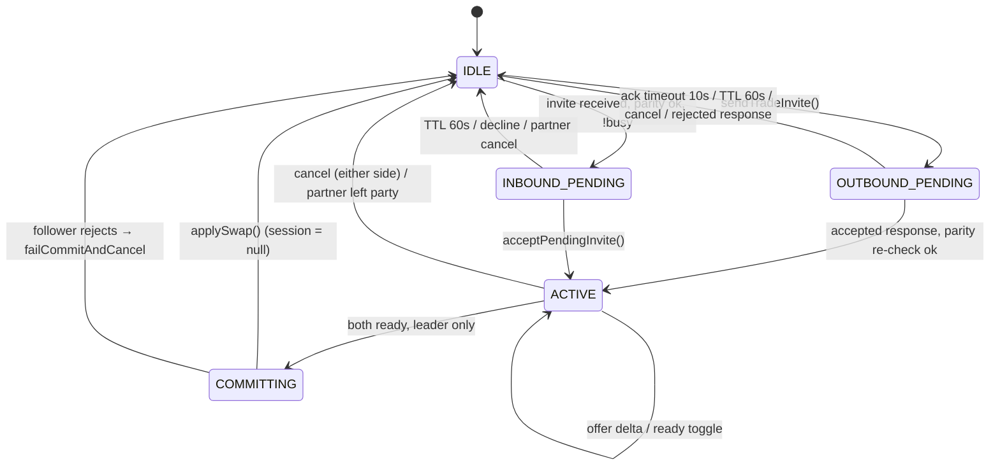

# Party Integration and Card Trading

> **Scope:** every RuneLite-party feature in the plugin — the 12 websocket message types, the two-sided trade protocol and its state machine, the one-way gift path, the trade window, and the announcement/stat-sharing side channels.
> **Key packages:** `com.osrstcg.party`, `com.osrstcg.service`, `com.osrstcg.ui.trade`
> **Related:** [State Model](05-state-model.md)

## Purpose

Everything in this document runs over RuneLite's party system: a small websocket relay
(`party.runelite.net`) that RuneLite clients join with a shared passphrase. The plugin uses it for
four unrelated things — broadcasting pull/set-completion announcements, exchanging `!tcg` stat
lines, gifting a single card one-way, and running a full two-sided card trade.

The trade subsystem is by far the riskiest code in the plugin, because it moves player assets
across a network **with no server-side authority**. The party relay does not know what a card is;
it fans out opaque JSON blobs to every member. Every ownership decision, every validation, and
every "did the other side actually apply this?" question is answered locally, by trusting the
peer's client. Read the [Security and trust model](#security-and-trust-model) section before
changing anything here.

The two transfer paths differ in shape. The **gift** path
([`CardPartyTransferService`](../src/main/java/com/osrstcg/service/CardPartyTransferService.java))
is one-way and receiver-first: the sender does not remove its copy until the recipient reports it
added one. The **trade** path
([`CardPartyTradeService`](../src/main/java/com/osrstcg/service/CardPartyTradeService.java)) is
two-sided, stateful, and ends in a single unacknowledged commit message — the point where the two
sides can diverge.

A cross-cutting rule ties both together: **both clients must have identical reward tuning and
identical Overview debug mode**, or the transfer is refused. That check is
[`RewardTuningState.matchesPartnerTuning`](../src/main/java/com/osrstcg/model/RewardTuningState.java#L77)
plus a boolean debug-flag comparison, and it is re-evaluated at every protocol step rather than
once at the start.

## Class reference

| Class | Lines | Responsibility |
|---|---|---|
| [`CardPartyTradeService`](../src/main/java/com/osrstcg/service/CardPartyTradeService.java) | 1811 | Whole two-sided trade protocol: invite lifecycle, session state, offer deltas, ready flags, commit, timeouts |
| [`CardPartyTransferService`](../src/main/java/com/osrstcg/service/CardPartyTransferService.java) | 522 | One-way card gift: pending-offer bookkeeping, receiver-side validation, sender-side removal on accept |
| [`TcgPartyAnnouncer`](../src/main/java/com/osrstcg/service/TcgPartyAnnouncer.java) | 87 | Fire-and-forget sender for set-completion and `!tcg` stat payloads |
| [`TcgChatStatsShareService`](../src/main/java/com/osrstcg/service/TcgChatStatsShareService.java) | 200 | TTL cache of party members' public stats keyed by sanitized RSN; builds the chat line |
| [`TradeWindow`](../src/main/java/com/osrstcg/ui/trade/TradeWindow.java) | 505 | Swing trade window: two 3×2 offer grids, Accept/Cancel, status line |
| [`TradeWindowManager`](../src/main/java/com/osrstcg/ui/trade/TradeWindowManager.java) | 87 | Lazily creates the window and marshals show/refresh/hide onto the EDT |
| [`TcgTradeOfferCardDto`](../src/main/java/com/osrstcg/party/TcgTradeOfferCardDto.java) | 17 | Wire shape of one offered card copy (not itself a party message) |
| 12 `*PartyMessage` classes in `com.osrstcg.party` | 15–32 each | Lombok `@Data` DTOs extending `PartyMemberMessage` |

## RuneLite party primer

RuneLite's party API has three pieces you need to know. `PartyService` is the session: it knows
whether you are in a party (`isInParty()`), who the local member is (`getLocalMember()`), and how
to look up peers by id (`getMemberById(long)`). `WSClient` owns the websocket and the Gson type
registry. `PartyMemberMessage` is the base class every custom payload extends; it carries a
`memberId` that the outbound path stamps with the sender's id, so on receipt
`msg.getMemberId()` is the **authenticated-by-the-relay-only** identity of the author.

A custom message type must be registered with Gson before it can be deserialized, and unregistered
on teardown. The plugin does both in one block: registration in `startUp` at
[OsrsTcgPlugin.java:228-239](../src/main/java/com/osrstcg/OsrsTcgPlugin.java#L228) and the mirror
`unregisterMessage` calls in `shutDown` at
[OsrsTcgPlugin.java:271-282](../src/main/java/com/osrstcg/OsrsTcgPlugin.java#L271). If you add a
13th message type you must edit both lists — a missing registration means the peer's JSON is
silently dropped, with no exception on either side.

Two properties of the relay shape all the code below:

1. **There is no addressee.** `partyService.send(message)` broadcasts to every member of the
   party, including back to the sender. Nothing in the protocol is private.
2. **Attribution is by `memberId` only.** Every handler must filter. The plugin does this two
   ways: payload-level addressing (`recipientMemberId` / `originalSenderMemberId` fields compared
   against `getLocalMember().getMemberId()`, e.g.
   [CardPartyTradeService.java:954](../src/main/java/com/osrstcg/service/CardPartyTradeService.java#L954))
   and self-echo suppression (`msg.getMemberId() == local.getMemberId()` → return, e.g.
   [CardPartyTradeService.java:984](../src/main/java/com/osrstcg/service/CardPartyTradeService.java#L984)).
   Forgetting the second guard makes a client process its own commit twice.

The relay does not authenticate anything beyond the party passphrase. Any client that knows the
passphrase can send any registered message with any field values.

## Message catalogue

Twelve message classes are registered; `TcgTradeOfferCardDto` is a nested payload only. All extend
`PartyMemberMessage`, so all implicitly carry `memberId`.

| Message | Fields (beyond `memberId`) | Sender → consumer |
|---|---|---|
| [`TcgPullPartyMessage`](../src/main/java/com/osrstcg/party/TcgPullPartyMessage.java) | `cardName`, `newForCollection`, `foil` | Any member on a notable pull → all peers, handled at [OsrsTcgPlugin.java:365](../src/main/java/com/osrstcg/OsrsTcgPlugin.java#L365) |
| [`TcgCollectionSetCompletePartyMessage`](../src/main/java/com/osrstcg/party/TcgCollectionSetCompletePartyMessage.java) | `collectionName` | Member completing a set → all peers, [OsrsTcgPlugin.java:399](../src/main/java/com/osrstcg/OsrsTcgPlugin.java#L399) |
| [`TcgChatStatsPartyMessage`](../src/main/java/com/osrstcg/party/TcgChatStatsPartyMessage.java) | `collectionScore`, `completionPct`, `uniqueOwned`, `uniqueFoilOwned`, `foilCompletionPct`, `totalCardPool`, `openedPacks`, `totalCardsOwned`, `customRates` | Member typing `!tcg` → all peers cache it, [OsrsTcgPlugin.java:428](../src/main/java/com/osrstcg/OsrsTcgPlugin.java#L428) |
| [`TcgCardGiftPartyMessage`](../src/main/java/com/osrstcg/party/TcgCardGiftPartyMessage.java) | `recipientMemberId`, `cardName`, `foil`, `cardInstanceId`, `pulledByUsername`, `pulledAtEpochMs`, 4 tuning fields, `transferId`, `senderDebugLogging` | Gift sender → the addressed recipient only |
| [`TcgCardGiftResponsePartyMessage`](../src/main/java/com/osrstcg/party/TcgCardGiftResponsePartyMessage.java) | `transferId`, `originalSenderMemberId`, `accepted`, `rejectCode` | Gift recipient → original sender |
| [`TcgTradeInvitePartyMessage`](../src/main/java/com/osrstcg/party/TcgTradeInvitePartyMessage.java) | `tradeId`, `recipientMemberId`, 4 tuning fields, `senderDebugLogging` | Inviter (A) → addressed invitee (B) |
| [`TcgTradeInviteAckPartyMessage`](../src/main/java/com/osrstcg/party/TcgTradeInviteAckPartyMessage.java) | `tradeId` | B → A, delivery proof only |
| [`TcgTradeInviteResponsePartyMessage`](../src/main/java/com/osrstcg/party/TcgTradeInviteResponsePartyMessage.java) | `tradeId`, `originalSenderMemberId`, `accepted`, `rejectCode`, 4 tuning fields, `responderDebugLogging` | B → A, accept or decline |
| [`TcgTradeOfferDeltaPartyMessage`](../src/main/java/com/osrstcg/party/TcgTradeOfferDeltaPartyMessage.java) | `tradeId`, `add`, `cardInstanceId`, `cardName`, `foil`, `pulledByUsername`, `pulledAtEpochMs` | Either side → the other, one card added or removed |
| [`TcgTradeReadyPartyMessage`](../src/main/java/com/osrstcg/party/TcgTradeReadyPartyMessage.java) | `tradeId`, `ready` | Either side → the other |
| [`TcgTradeCancelPartyMessage`](../src/main/java/com/osrstcg/party/TcgTradeCancelPartyMessage.java) | `tradeId` | Either side → the other, or self-cleanup after a timeout |
| [`TcgTradeCommitPartyMessage`](../src/main/java/com/osrstcg/party/TcgTradeCommitPartyMessage.java) | `tradeId`, `committerOffers[]`, `partnerOffers[]`, 4 tuning fields, `committerDebugLogging` | Commit leader → follower, exactly once |

The four "tuning fields" are always `foilChancePercent` (int), `killCreditMultiplier`,
`levelUpCreditMultiplier`, `xpCreditMultiplier` (doubles). They are reconstructed on receipt via
[`RewardTuningState.mergeSerialized`](../src/main/java/com/osrstcg/model/RewardTuningState.java#L24),
which substitutes defaults for nulls — so a peer that omits them looks like a default-tuned client
rather than failing to parse.

The `Boolean` debug flags are deliberately boxed. `null` means "peer is running a plugin version
that predates the field", and is rejected with code 3 rather than being coerced to `false`
([CardPartyTradeService.java:1503-1506](../src/main/java/com/osrstcg/service/CardPartyTradeService.java#L1503)).

Reject codes are shared in spirit between the two paths but declared separately:
`REJECT_TUNING_MISMATCH=1`, `REJECT_DEBUG_MISMATCH=2`, `REJECT_SENDER_TOO_OLD=3`,
`REJECT_BAD_PAYLOAD=4`, `REJECT_BUSY=5`
([CardPartyTradeService.java:48-53](../src/main/java/com/osrstcg/service/CardPartyTradeService.java#L48);
the gift service repeats 0–4 at
[CardPartyTransferService.java:38-42](../src/main/java/com/osrstcg/service/CardPartyTransferService.java#L38)
and has no `BUSY`).

## The trade protocol, end to end

The handshake is: **invite → ack → response → offer deltas → ready → commit**, with cancel usable
from any state. Only one side ever sends the commit — the one with the numerically **lower**
party member id, chosen at
[CardPartyTradeService.java:1369](../src/main/java/com/osrstcg/service/CardPartyTradeService.java#L1369)
(`if (local.getMemberId() > session.partnerMemberId) return;`). Call that side the *leader* and the
other the *follower*.

```mermaid
sequenceDiagram
    participant A as Player A (inviter)
    participant S as Party relay
    participant B as Player B (invitee)

    Note over A: sendTradeInvite() — cooldown + busy guards<br/>pendingOutbound created
    A->>S: TcgTradeInvitePartyMessage(tradeId, recipientMemberId=B, tuning, debug)
    S-->>B: (broadcast; A ignores its own echo)
    Note over B: parity check; if busy → response(rejected, 5)<br/>pendingInbound created (TTL 60s)
    B->>S: TcgTradeInviteAckPartyMessage(tradeId)
    S-->>A: pendingOutbound.acked = true (10s deadline)

    Note over B: user clicks "Accept trade request" in album
    B->>S: TcgTradeInviteResponsePartyMessage(accepted=true, tuning, debug)
    S-->>A: A re-checks parity, then creates its session
    Note over B: session created immediately on accept
    Note over A,B: both open TradeWindow

    loop each card added/removed, either side
        A->>S: TcgTradeOfferDeltaPartyMessage(add=true, cardInstanceId, ...)
        S-->>B: append to remoteOffers; clearReadyFlags() on both
    end

    A->>S: TcgTradeReadyPartyMessage(ready=true)
    S-->>B: remoteReady = true
    B->>S: TcgTradeReadyPartyMessage(ready=true)
    S-->>A: remoteReady = true

    Note over A,B: leader = lower memberId (say A)
    Note over A: commitSent = true, tradeId marked processed
    A->>S: TcgTradeCommitPartyMessage(committerOffers, partnerOffers, tuning, debug)
    Note over A: applySwap() runs IMMEDIATELY after send returns —<br/>no wait for B
    S-->>B: dedupe → parity → offersMatch → applySwap()
    Note over B: no confirmation is ever sent back
```

Step by step, with the guard and the abort condition for each:

| Step | Message | Local transition | Timeout / abort |
|---|---|---|---|
| 1. Invite | `TcgTradeInvitePartyMessage` | A: `IDLE → OUTBOUND_PENDING`, `pendingOutbound` set ([L519](../src/main/java/com/osrstcg/service/CardPartyTradeService.java#L519)) | 10 s send cooldown blocks a second invite ([L45](../src/main/java/com/osrstcg/service/CardPartyTradeService.java#L45)); `send()` throwing rolls `pendingOutbound` back to null ([L529-538](../src/main/java/com/osrstcg/service/CardPartyTradeService.java#L529)) |
| 2. Receive invite | — | B: `IDLE → INBOUND_PENDING` ([L1081](../src/main/java/com/osrstcg/service/CardPartyTradeService.java#L1081)) | Parity failure → immediate rejected response + chat line ([L1067-1072](../src/main/java/com/osrstcg/service/CardPartyTradeService.java#L1067)); already busy → rejected with code 5 ([L1076-1080](../src/main/java/com/osrstcg/service/CardPartyTradeService.java#L1076)) |
| 3. Ack | `TcgTradeInviteAckPartyMessage` | A: `pendingOutbound.acked = true` ([L1106](../src/main/java/com/osrstcg/service/CardPartyTradeService.java#L1106)) | No ack within `INVITE_ACK_TIMEOUT_MS` = 10 s → A drops the invite, posts "Failed to send trade request", and broadcasts a cancel ([L876-892](../src/main/java/com/osrstcg/service/CardPartyTradeService.java#L876)) |
| 4. Response | `TcgTradeInviteResponsePartyMessage` | B: `INBOUND_PENDING → ACTIVE` at accept time ([L607](../src/main/java/com/osrstcg/service/CardPartyTradeService.java#L607)). A: `OUTBOUND_PENDING → ACTIVE` on receipt ([L1154](../src/main/java/com/osrstcg/service/CardPartyTradeService.java#L1154)) | B's invite expires after `INVITE_TTL_MS` = 60 s ([L900-906](../src/main/java/com/osrstcg/service/CardPartyTradeService.java#L900)); A's outbound expires on the same TTL and broadcasts a cancel ([L907-915](../src/main/java/com/osrstcg/service/CardPartyTradeService.java#L907)). A re-runs parity against the response and cancels on mismatch ([L1139-1150](../src/main/java/com/osrstcg/service/CardPartyTradeService.java#L1139)) |
| 5. Offer delta | `TcgTradeOfferDeltaPartyMessage` | Sender mutates `localOffers`, receiver mutates `remoteOffers`; **both** call `clearReadyFlags` ([L687](../src/main/java/com/osrstcg/service/CardPartyTradeService.java#L687), [L1206](../src/main/java/com/osrstcg/service/CardPartyTradeService.java#L1206)) | Cap of `MAX_OFFERS_PER_SIDE` = 6 ([L46](../src/main/java/com/osrstcg/service/CardPartyTradeService.java#L46)); a failed send rolls the local list back ([L699-714](../src/main/java/com/osrstcg/service/CardPartyTradeService.java#L699)) |
| 6. Ready | `TcgTradeReadyPartyMessage` | Sets `localReady` / `remoteReady`; if both and `!commitSent`, calls `trySendCommitAsLeader` ([L807-810](../src/main/java/com/osrstcg/service/CardPartyTradeService.java#L807), [L1228-1231](../src/main/java/com/osrstcg/service/CardPartyTradeService.java#L1228)) | Failed send reverts `localReady` ([L796-805](../src/main/java/com/osrstcg/service/CardPartyTradeService.java#L796)) |
| 7. Commit | `TcgTradeCommitPartyMessage` | Leader: `commitSent = true`, then `applySwap` unconditionally after send ([L1388](../src/main/java/com/osrstcg/service/CardPartyTradeService.java#L1388), [L1427](../src/main/java/com/osrstcg/service/CardPartyTradeService.java#L1427)). Follower: dedupe → parity → `offersMatch` → `applySwap` ([L1290-1320](../src/main/java/com/osrstcg/service/CardPartyTradeService.java#L1290)) | Follower mismatch → `failCommitAndCancel`: close session, broadcast cancel, "No cards were transferred" ([L1323-1337](../src/main/java/com/osrstcg/service/CardPartyTradeService.java#L1323)). **There is no timeout on the leader side and no commit acknowledgement.** |
| Any | `TcgTradeCancelPartyMessage` | Closes `pendingInbound` and/or the session, hides the window ([L1234-1268](../src/main/java/com/osrstcg/service/CardPartyTradeService.java#L1234)) | — |

Note the asymmetry in step 4: the acceptor (B) enters `ACTIVE` the instant it sends its accept,
while the inviter (A) only enters `ACTIVE` when the accept arrives. If A's re-check of parity fails,
B sits in an active session until A's cancel arrives.

Also note that a *manual* decline is reported to the sender as `REJECT_BUSY`, not as a distinct
"declined" code — `declinePendingInviteInternal(REJECT_NONE)` substitutes `REJECT_BUSY` on the wire
([L636](../src/main/java/com/osrstcg/service/CardPartyTradeService.java#L636)), which
`parityRejectChatForSender` renders as "X declined the trade request"
([L1791-1794](../src/main/java/com/osrstcg/service/CardPartyTradeService.java#L1791)).

## The trade state machine

There is no `enum` for the state; it is encoded in three fields guarded by a single `lock`
([L64-69](../src/main/java/com/osrstcg/service/CardPartyTradeService.java#L64)): `pendingInbound`,
`pendingOutbound`, and `session`. `isBusyUnlocked()`
([L1531](../src/main/java/com/osrstcg/service/CardPartyTradeService.java#L1531)) collapses all
three into a single "am I occupied" predicate, and that predicate is the top-level guard on both
sending and accepting an invite.



`COMMITTING` is really just `session.commitSent == true`. `TradeSession` has a `closed` flag *and*
the field is nulled — `closeSessionUnlocked` sets `closed = true` before nulling
([L1518-1529](../src/main/java/com/osrstcg/service/CardPartyTradeService.java#L1518)) so any
handler still holding a reference to the old session object sees it as dead.

### Guards, in the order they are evaluated

`offerCard` ([L644](../src/main/java/com/osrstcg/service/CardPartyTradeService.java#L644)) is the
densest: non-empty id → not already pending as a gift → instance exists in the collection → not
locked → session active → under the 6-card cap → not already offered. Only then is the delta sent.
Note the check order: the collection lookup happens outside the `lock`, and the session checks
inside it.

`trySendCommitAsLeader` ([L1339](../src/main/java/com/osrstcg/service/CardPartyTradeService.java#L1339))
re-validates everything under the lock before sending: session live, `!commitSent`, both ready
flags set, local id is the lower one, and a fresh parity evaluation against the tuning captured at
session creation. Parity failure at this point cancels the trade rather than silently proceeding
([L1374-1386](../src/main/java/com/osrstcg/service/CardPartyTradeService.java#L1374)).

### Partner disconnect mid-trade

Handled by polling, not by an event. `onGameTick`
([L866](../src/main/java/com/osrstcg/service/CardPartyTradeService.java#L866)) checks, on every
20th tick (`++tickCounter % 20 != 0` at
[L894](../src/main/java/com/osrstcg/service/CardPartyTradeService.java#L894) — roughly 12 s at
600 ms/tick), whether `partyService.isInParty()` is still true and whether
`getMemberById(session.partnerMemberId)` still resolves. Either failing closes the session with
"Trade cancelled: partner left the party."
([L916-923](../src/main/java/com/osrstcg/service/CardPartyTradeService.java#L916)).

Two consequences: detection is coarse (up to ~12 s of a zombie session), and the disappearing
partner is not notified — no cancel message is broadcast on this path, unlike the invite-expiry
path which does broadcast one ([L933-938](../src/main/java/com/osrstcg/service/CardPartyTradeService.java#L933)).
If the partner rejoins the party they get a new `memberId`, so the old session can never resume.

The ack-timeout check is deliberately outside the `% 20` gate
([L874-885](../src/main/java/com/osrstcg/service/CardPartyTradeService.java#L874)) so the 10 s
deadline is evaluated every tick.

### Duplicate and replayed messages

| Message | Replay behaviour |
|---|---|
| Invite | A second invite while `pendingInbound != null` is rejected with `REJECT_BUSY`; the original invite survives |
| Ack | Idempotent — sets an already-true boolean, guarded by a `tradeId` match ([L1102](../src/main/java/com/osrstcg/service/CardPartyTradeService.java#L1102)) |
| Response | `pendingOutbound` is nulled on the first response ([L1123](../src/main/java/com/osrstcg/service/CardPartyTradeService.java#L1123)), so a replay finds nothing and returns |
| Offer delta `add` | Idempotent — `findOfferIndex >= 0` returns early ([L1184](../src/main/java/com/osrstcg/service/CardPartyTradeService.java#L1184)) |
| Offer delta `remove` | Idempotent — a miss is a no-op ([L1200-1204](../src/main/java/com/osrstcg/service/CardPartyTradeService.java#L1200)) |
| Ready | Idempotent in value (absolute, not a toggle) but **not in effect**: a stale `ready=true` replayed after a delta cleared the flags can re-arm the commit path. There is no sequence number |
| Cancel | Idempotent |
| Commit | Explicitly de-duplicated by `processedCommitTradeIds` ([L1290-1296](../src/main/java/com/osrstcg/service/CardPartyTradeService.java#L1290)); the leader pre-inserts its own `tradeId` before sending ([L1405-1408](../src/main/java/com/osrstcg/service/CardPartyTradeService.java#L1405)) |

The dedupe set is bounded by wholesale clearing at 600 entries
([L925-931](../src/main/java/com/osrstcg/service/CardPartyTradeService.java#L925)) — it is not an
LRU. After a clear, an ancient `tradeId` would pass the dedupe check again, but it still has to
match a live `session.tradeId`, which it cannot. The dedupe is therefore protecting against
double-delivery *within* a session, not against long-range replay.

One sharp edge: the dedupe insert happens **before** the parity and `offersMatch` validation
([L1290](../src/main/java/com/osrstcg/service/CardPartyTradeService.java#L1290) vs
[L1298-1318](../src/main/java/com/osrstcg/service/CardPartyTradeService.java#L1298)). A commit that
is rejected still burns its `tradeId`, so a corrected re-commit under the same id would be ignored.
In practice `failCommitAndCancel` tears the session down anyway.

### Out-of-order delivery

Party messages from a single member travel one websocket and arrive in send order, so the common
case is ordered. Cross-member interleaving is not ordered, and the code relies on ordering in one
place that matters: `offersMatch`
([L1464-1489](../src/main/java/com/osrstcg/service/CardPartyTradeService.java#L1464)) compares the
two lists **index by index**, not as sets. A's `localOffers` order (the order A clicked cards) must
equal B's `remoteOffers` order (the order the deltas arrived). If a `remove` were ever to overtake
its `add`, the remove no-ops, the add lands, and the lists diverge in length or order — the commit
then fails `offersMatch` on the follower and the trade aborts. That is the safe direction of
failure, but only for the follower; see the next section.

## Offer deltas and convergence

Offers are exchanged as deltas — one message per card added or removed — rather than as a full
offer list per change. Two reasons show in the code. First, a delta is the natural unit for the
"any change invalidates readiness" rule: both the sender
([L687](../src/main/java/com/osrstcg/service/CardPartyTradeService.java#L687)) and the receiver
([L1206](../src/main/java/com/osrstcg/service/CardPartyTradeService.java#L1206)) call
`clearReadyFlags`, which zeroes `localReady`, `remoteReady`, **and** `commitSent`
([L1536-1541](../src/main/java/com/osrstcg/service/CardPartyTradeService.java#L1536)). Neither side
can sneak a card in after the other has accepted. Second, a delta makes the local rollback on send
failure trivial — remove the entry you just added, or re-add the one you just removed
([L701-711](../src/main/java/com/osrstcg/service/CardPartyTradeService.java#L701),
[L757-763](../src/main/java/com/osrstcg/service/CardPartyTradeService.java#L757)).

Convergence is therefore not achieved by reconciliation — there is no periodic full-state sync and
no version vector. It is achieved by *verification at the end*: the commit message carries both
complete lists (`committerOffers` and `partnerOffers`), and the follower compares them against its
own two lists before applying anything. Divergence is detected exactly once, at commit time.

A card copy is identified on the wire by `TcgTradeOfferCardDto`
([TcgTradeOfferCardDto.java](../src/main/java/com/osrstcg/party/TcgTradeOfferCardDto.java)):
`cardInstanceId` (the **sender's** local collection row UUID), plus `cardName`, `foil`,
`pulledByUsername`, `pulledAtEpochMs`. The instance id is only meaningful inside the session — it
is the key for delta add/remove matching and for the index-wise `offersMatch` comparison. It is
**not** carried into the receiver's collection: `applySwap` builds a fresh row with
`OwnedCardInstance.createNew(...)`
([L1438-1439](../src/main/java/com/osrstcg/service/CardPartyTradeService.java#L1438)), which mints a
new UUID ([OwnedCardInstance.java:53-56](../src/main/java/com/osrstcg/model/OwnedCardInstance.java#L53)).
Only the provenance pair (`pulledByUsername`, `pulledAtEpochMs`) survives the hop. The `locked`
flag does not survive either — `createNew` delegates to the 5-arg constructor, which passes
`locked = false` ([OwnedCardInstance.java:25-28](../src/main/java/com/osrstcg/model/OwnedCardInstance.java#L25)).
A card that was locked on the sender arrives unlocked.

`offersMatch` normalizes the wire side before comparing: `null` strings become `""` and are
trimmed, and `pulledAtEpochMs` is clamped with `Math.max(0L, …)`
([L1479-1484](../src/main/java/com/osrstcg/service/CardPartyTradeService.java#L1479)) — matching
exactly the normalization applied when the delta was ingested
([L1192-1196](../src/main/java/com/osrstcg/service/CardPartyTradeService.java#L1192)). If you change
one you must change the other, or every commit will fail the mismatch check.

## Commit and the two-phase problem

This is the part to read carefully. **There is no two-phase commit.** There is a one-phase commit
with an optimistic sender and a validating receiver, and no acknowledgement in either direction.

The leader's sequence, in `trySendCommitAsLeader`:

```
1. re-validate under lock (session live, both ready, !commitSent, local id is lower, parity)
2. session.commitSent = true                                    (L1388)
3. snapshot localOffers / remoteOffers                          (L1390-1391)
4. build TcgTradeCommitPartyMessage from the snapshots
5. processedCommitTradeIds.add(tradeId)                         (L1405-1408)
6. partyService.send(m)  -- on failure: undo steps 2 and 5, return   (L1410-1425)
7. applySwap(localCopy, remoteCopy, partnerName)                 (L1427)
```

Step 7 runs as soon as `send()` returns without throwing. `send()` returning only means the message
was handed to the websocket client — not that the relay accepted it, and certainly not that the
follower processed it. `applySwap`
([L1430-1462](../src/main/java/com/osrstcg/service/CardPartyTradeService.java#L1430)) then removes
every offered instance and adds a new instance for every expected one, nulls the session, plays a
sound, and prints "Trade with X complete (N given, M received)."

The follower's sequence, in `handleCommitOnClientThread`, is the mirror but with real validation:
session/tradeId/author match → dedupe → parity → `offersMatch` on **both** lists → `applySwap`.
It sends nothing back.

### What actually happens when the two sides disagree

| Scenario | Leader | Follower | Net effect on the card economy |
|---|---|---|---|
| Happy path | swaps | swaps | Correct |
| Commit message lost after `send()` returns | swaps | never sees it; session stays open until the ~12 s party poll or a manual cancel | Leader's offered cards **destroyed**; follower's offered cards **duplicated** into the leader's collection |
| Follower rejects on parity or `offersMatch` | swaps (already done) | does not swap; broadcasts cancel | Same asymmetry as above |
| Follower's client crashes between receipt and apply | swaps | does not swap | Same asymmetry |
| Follower is malicious and simply ignores the commit | swaps | keeps everything | Follower gains the leader's cards for free |

In the second and third rows, the follower's cancel does reach the leader — but by then
`applySwap` has already set `session = null`
([L1442-1449](../src/main/java/com/osrstcg/service/CardPartyTradeService.java#L1442)), so
`handleCancelOnClientThread` finds no matching session
([L1245](../src/main/java/com/osrstcg/service/CardPartyTradeService.java#L1245)) and does nothing.
The leader is never told the trade failed, is never rolled back, and its chat log says the trade
completed.

**Stated plainly:** the protocol is trust-based. It gives you consistency when both clients are
honest, both are on the same plugin version with the same tuning, and no message is dropped between
the leader's `send()` and the follower's handler. It gives you no atomicity guarantee and no
recovery path when any of those fail. It cannot: the party relay is a dumb fan-out and neither
client can verify the other's collection.

`applySwap` also ignores the return value of `stateService.removeCardInstance`
([L1434](../src/main/java/com/osrstcg/service/CardPartyTradeService.java#L1434)), which returns
`false` when the row is already gone
([TcgStateService.java:756-770](../src/main/java/com/osrstcg/service/TcgStateService.java#L756)).
Nothing in the album prevents selling a card that is currently in your own trade offer —
`sellSelectedCard` checks only "locked" and "is this your only copy"
([CollectionAlbumWindow.java:1980-2024](../src/main/java/com/osrstcg/ui/collectionalbum/CollectionAlbumWindow.java#L1980)) — so
sell-then-commit silently gives the partner a card you no longer own, and the receiving side has no
way to notice. The gift path, by contrast, *does* surface this case with an explicit warning
([CardPartyTransferService.java:449-452](../src/main/java/com/osrstcg/service/CardPartyTransferService.java#L449)).

## The one-way gift path

`CardPartyTransferService` is the simple sibling: a single card, one direction, no session, no
window. It differs from a trade in one structurally important way — **the sender removes its copy
last, not first**. The ordering is:

1. `beginGiftTransfer` ([L221](../src/main/java/com/osrstcg/service/CardPartyTransferService.java#L221))
   re-reads the instance under the `stateService` monitor, re-checks `isLocked`, reserves the id in
   `pendingInstanceIds` ([L257](../src/main/java/com/osrstcg/service/CardPartyTransferService.java#L257) —
   a `Set.add` returning `false` means "already being sent"), records a `PendingOffer` keyed by a
   fresh `transferId`, and broadcasts `TcgCardGiftPartyMessage`. **No card is removed yet.**
2. The recipient validates in this order: non-empty `cardInstanceId` → non-null `senderDebugLogging`
   → debug flags equal → tuning matches
   ([L353-383](../src/main/java/com/osrstcg/service/CardPartyTransferService.java#L353)). It then
   adds the card, marks the `transferId` processed, and sends
   `TcgCardGiftResponsePartyMessage(accepted=true)`.
3. The sender, on an accepted response, removes the reserved instance
   ([L447](../src/main/java/com/osrstcg/service/CardPartyTransferService.java#L447)) and reports.
   On a rejected response it just releases the reservation and prints the reason — the card was
   never at risk.

Failure modes are therefore inverted relative to the trade: a lost *response* costs the recipient
nothing and leaves the sender holding a duplicate (the recipient already has a copy), i.e. gifts
fail toward **duplication**, never toward loss. Timeouts are handled by a TTL sweep on the same
20-tick cadence: `PENDING_TTL_MS` = 90 s
([L36](../src/main/java/com/osrstcg/service/CardPartyTransferService.java#L36),
[L300-309](../src/main/java/com/osrstcg/service/CardPartyTransferService.java#L300)), after which
the reservation is released and "Card send timed out" is printed. Note that a response arriving
after the TTL finds no `PendingOffer` and is dropped
([L433-437](../src/main/java/com/osrstcg/service/CardPartyTransferService.java#L433)) — so a slow
accept duplicates the card outright.

There are two `sendGift` overloads: by `(cardName, foil)`, which picks the oldest unlocked copy
FIFO ([L186-202](../src/main/java/com/osrstcg/service/CardPartyTransferService.java#L186)), and by
explicit `cardInstanceId` ([L138](../src/main/java/com/osrstcg/service/CardPartyTransferService.java#L138)).
The album uses the latter ([CollectionAlbumWindow.java:2078](../src/main/java/com/osrstcg/ui/collectionalbum/CollectionAlbumWindow.java#L2078)).

The two paths cross-guard in one direction only: `offerCard` refuses an instance that is pending as
a gift ([L651-654](../src/main/java/com/osrstcg/service/CardPartyTradeService.java#L651)), but
`beginGiftTransfer` does **not** check whether the instance is in an active trade offer. That hole
is closed only in the UI, which disables the Send button whenever a trade is active
([CollectionAlbumWindow.java:2073](../src/main/java/com/osrstcg/ui/collectionalbum/CollectionAlbumWindow.java#L2073)).

## TradeWindow UI

`TradeWindow` is a fixed-size, non-resizable `JFrame` with a two-column centre — your offers left,
the partner's right — a status line, and Accept/Cancel buttons
([TradeWindow.java:100-123](../src/main/java/com/osrstcg/ui/trade/TradeWindow.java#L100)). Each side
is a custom-painted `OfferPanel` inside a `JScrollPane` sized to exactly a 3×2 grid: `COLS = 3`,
`VISIBLE_ROWS = 2`, `GAP = 8`, `CARD_SCALE = 0.58`
([L53-57](../src/main/java/com/osrstcg/ui/trade/TradeWindow.java#L53)). The viewport reserves
scrollbar width up front so the grid does not reflow when the bar appears
([L302-313](../src/main/java/com/osrstcg/ui/trade/TradeWindow.java#L302)), and the bar itself stays
hidden until more than one full page of 6 cards is offered
([L270-284](../src/main/java/com/osrstcg/ui/trade/TradeWindow.java#L270)) — which, given
`MAX_OFFERS_PER_SIDE = 6`, means it is effectively never shown.

The window is a pure view: it holds no trade state and re-reads everything from
`tradeService.getSessionView()` in `refreshFromService`
([L184](../src/main/java/com/osrstcg/ui/trade/TradeWindow.java#L184)). Remote state is reflected
entirely through the status line and the Accept button
([L205-224](../src/main/java/com/osrstcg/ui/trade/TradeWindow.java#L205)):

| `localReady` | `remoteReady` | Status text | Accept button |
|---|---|---|---|
| false | false | "Offer cards from the album, then click Accept." | enabled, "Accept" |
| false | true | "&lt;partner&gt; has accepted. Click Accept to complete." | enabled, "Accept" |
| true | false | "Waiting for &lt;partner&gt; to accept…" | disabled, "Accepted" |
| true | true | "Both accepted — completing trade…" | disabled, "Accepted" |

Cards are **added** from the album (there is no add control in the trade window — offers come from
`offerInstanceForTrade` at
[CollectionAlbumWindow.java:1582](../src/main/java/com/osrstcg/ui/collectionalbum/CollectionAlbumWindow.java#L1582))
and **removed** by left-clicking your own card in the window
([L385-407](../src/main/java/com/osrstcg/ui/trade/TradeWindow.java#L385)); clicks on the remote
panel are ignored via the `localSide` check. Hovering any card shows the provenance tooltip built
by `AlbumInstanceTooltip.format`
([L417-431](../src/main/java/com/osrstcg/ui/trade/TradeWindow.java#L417)).

The confirmation gates are deliberately blunt. There is **no** final "are you sure" dialog — the
gate is the two-step ready handshake plus the fact that any offer change resets both ready flags.
Accept simply calls `setLocalReady(true)`
([L350-358](../src/main/java/com/osrstcg/ui/trade/TradeWindow.java#L350)), and once both sides are
ready the commit fires with no further interaction. Note that the plugin *does* gate selling your
only copy of a card behind a `JOptionPane` confirm
([CollectionAlbumWindow.java:1996-2008](../src/main/java/com/osrstcg/ui/collectionalbum/CollectionAlbumWindow.java#L1996))
but does not gate trading it away.

Closing the window cancels the trade. `setDefaultCloseOperation(DO_NOTHING_ON_CLOSE)` plus a
`windowClosing` listener routes the X button through `setVisible(false)`
([L129-137](../src/main/java/com/osrstcg/ui/trade/TradeWindow.java#L129)), and `setVisible` is
overridden to call `cancelActiveTrade()` on the way down
([L169-182](../src/main/java/com/osrstcg/ui/trade/TradeWindow.java#L169)). The `suppressCloseCancel`
flag is what lets the service hide the window *without* triggering that cancel, via
`hideWithoutCancel` ([L327-332](../src/main/java/com/osrstcg/ui/trade/TradeWindow.java#L327)) — this
is the path used after a successful commit. **If you add a new hide path, use `hideWithoutCancel`
or you will cancel a trade that already completed.**

`TradeWindowManager` wraps every operation in `SwingUtilities.invokeLater` and lazily reconstructs
the frame if it was disposed ([TradeWindowManager.java:30-42](../src/main/java/com/osrstcg/ui/trade/TradeWindowManager.java#L30)).
Its `refreshIfVisible` doubles as a garbage collector: if the service reports no active trade, it
hides the window ([L44-62](../src/main/java/com/osrstcg/ui/trade/TradeWindowManager.java#L44)).

## TcgPartyAnnouncer

A thin fire-and-forget sender for the two broadcast-only payloads. Every method is guarded by
`partyService.isInParty()` and wraps `send` in a try/catch that only `log.debug`s — announcements
never surface an error to the player.

`announceCollectionSetComplete` ([L27](../src/main/java/com/osrstcg/service/TcgPartyAnnouncer.java#L27))
is gated on `config.partyAnnounceMythicPulls()` ([L83-86](../src/main/java/com/osrstcg/service/TcgPartyAnnouncer.java#L83)),
which defaults to `true` ([OsrsTcgConfig.java:197-207](../src/main/java/com/osrstcg/OsrsTcgConfig.java#L197)).
It is called after a pack open, once per newly completed primary category
([PackOpeningService.java:164-175](../src/main/java/com/osrstcg/service/PackOpeningService.java#L164)).

`broadcastChatCommandStats` ([L53](../src/main/java/com/osrstcg/service/TcgPartyAnnouncer.java#L53))
is **not** gated on that config — the `!tcg` exchange is considered a user-initiated action, not an
announcement.

Pull announcements do not go through this class at all. `TcgPullPartyMessage` is sent directly from
`PullNotificationService.notifyParty`
([PullNotificationService.java:113-129](../src/main/java/com/osrstcg/service/PullNotificationService.java#L113)),
which applies the same config gate. On the receiving side the gate is applied *again* before
printing ([OsrsTcgPlugin.java:365-397](../src/main/java/com/osrstcg/OsrsTcgPlugin.java#L365)) — so
turning the option off suppresses both your outgoing announcements and your incoming ones.

## TcgChatStatsShareService

RuneLite's stock `!layout`-style commands rely on a RuneLite-hosted HTTP API to look up another
player's data. This plugin has no such API, so `!tcg` fakes it over the party channel: when you
type `!tcg`, your client computes its own stats, caches them locally, and broadcasts them; every
party member caches what they receive. Later, when a chat line containing `!tcg` from player X is
rendered, the local cache is consulted for X's stats and the message node is rewritten in place.

The write path is `submitTcgPublicStatsChatCommand`
([OsrsTcgPlugin.java:946-973](../src/main/java/com/osrstcg/OsrsTcgPlugin.java#L946)): compute via
`tcgPublicStatsCalculator.computeLive()`, cache under your own sanitized RSN, then broadcast on the
`scheduledExecutorService` with `chatInput.resume()` in a `finally` — the resume must happen even
if the broadcast throws, or the chat input hangs.

The read path is `lookupTcgPublicStatsChatCommand`
([OsrsTcgPlugin.java:909-943](../src/main/java/com/osrstcg/OsrsTcgPlugin.java#L909)): resolve the
author (for `PRIVATECHATOUT` the author is the local player, otherwise `chatMessage.getName()`),
look up the cache, and if present set `messageNode.setRuneLiteFormatMessage(...)` and
`client.refreshChat()`. A cache miss leaves the raw `!tcg` text untouched.

Inbound party payloads land in `ingestPartyMessage`
([TcgChatStatsShareService.java:74-101](../src/main/java/com/osrstcg/service/TcgChatStatsShareService.java#L74)),
which resolves the author's `PartyMember` to get a display name — a message from an unknown
`memberId`, or from a member with no display name, is dropped. The cache is a
`ConcurrentHashMap` keyed on `Text.sanitize(displayName).trim().toLowerCase(Locale.ROOT)`
([L196-199](../src/main/java/com/osrstcg/service/TcgChatStatsShareService.java#L196)) with a
`CACHE_TTL_MS` of 15 minutes ([L23](../src/main/java/com/osrstcg/service/TcgChatStatsShareService.java#L23)).
Expiry is lazy — checked on read, with `remove(key, e)` so a concurrent refresh is not clobbered
([L66-70](../src/main/java/com/osrstcg/service/TcgChatStatsShareService.java#L66)). There is no
sweep, so the map grows with the number of distinct party members seen per session.

The rendered line is built twice, once with `ChatMessageBuilder` colour codes and once plain
([L113-194](../src/main/java/com/osrstcg/service/TcgChatStatsShareService.java#L113)). If you edit
one you must edit the other; they are not generated from a shared template. A `(custom rates)`
suffix is appended when the sender's `customRates` flag is set — the only signal that a peer's
numbers were produced under non-default tuning.

## Data flow: one complete 1-for-1 trade

1. **A** selects a party member in the album and clicks Send trade offer →
   `onSendTradeOfferClicked` ([CollectionAlbumWindow.java:2117](../src/main/java/com/osrstcg/ui/collectionalbum/CollectionAlbumWindow.java#L2117))
   → `sendTradeInvite` → `pendingOutbound` set, `TcgTradeInvitePartyMessage` broadcast, 10 s
   cooldown armed.
2. **B**'s websocket thread receives it, confirms `recipientMemberId` is B, and hands off to the
   client thread ([L958](../src/main/java/com/osrstcg/service/CardPartyTradeService.java#L958)).
   `handleInviteOnClientThread` runs parity, sets `pendingInbound`, sends the ack, prints a chat
   line, and refreshes the album chrome.
3. **A** receives the ack within 10 s and marks `pendingOutbound.acked`. The album's 2 s poll timer
   ([CollectionAlbumWindow.java:499](../src/main/java/com/osrstcg/ui/collectionalbum/CollectionAlbumWindow.java#L499))
   keeps the invite banner up to date.
4. **B** clicks "Accept trade request from A" → `acceptPendingInvite` re-runs parity, sends
   `TcgTradeInviteResponsePartyMessage(accepted=true)` with B's own tuning, creates the session, and
   opens the trade window.
5. **A** receives the response, re-runs parity against B's reported tuning, creates its session, and
   opens its window.
6. Each side clicks a card in the album → `offerCard` → local list mutated, ready flags cleared,
   `TcgTradeOfferDeltaPartyMessage(add=true)` broadcast → the peer appends to `remoteOffers` and
   clears its own ready flags. Both windows repaint via `notifyUi`.
7. Each side clicks Accept → `setLocalReady(true)` → `TcgTradeReadyPartyMessage(ready=true)`.
8. Whichever side observes *both* flags set calls `trySendCommitAsLeader`; only the lower member id
   proceeds. It marks `commitSent`, snapshots both lists, sends `TcgTradeCommitPartyMessage`, and
   immediately runs `applySwap`.
9. The follower receives the commit, de-duplicates on `tradeId`, re-runs parity, verifies both
   lists index-by-index with `offersMatch`, and runs its own `applySwap`.
10. Both sides: offered rows removed, received rows minted with fresh UUIDs, session nulled,
    transfer sound played, chat summary printed, album refreshed, window hidden via
    `hideWithoutCancel`.

## Threading

Four threads touch this code, and the hand-offs are explicit.

**Websocket thread.** Every `@Subscribe` handler for a party message body runs here (RuneLite's
`WSClient` posts deserialized messages to the EventBus off the client thread). The handlers do the
minimum — null/empty `tradeId` check, `partyService.getLocalMember()` addressing check — and then
hand off with `clientThread.invokeLater(...)`. See the block at
[L946-1049](../src/main/java/com/osrstcg/service/CardPartyTradeService.java#L946); the gift service
does the same at
[L332](../src/main/java/com/osrstcg/service/CardPartyTransferService.java#L332) and
[L428](../src/main/java/com/osrstcg/service/CardPartyTransferService.java#L428). Do not add state
mutation to the `@Subscribe` body — it is not holding `lock` and is not on the client thread.

**Client thread.** All `handle*OnClientThread` methods, plus `onGameTick`
([L866](../src/main/java/com/osrstcg/service/CardPartyTradeService.java#L866)) and the gift TTL
sweep. Because all inbound handlers funnel through `clientThread.invokeLater`, inbound messages are
serialized with respect to each other — a delta cannot interleave with a commit.

**Swing EDT.** Every public entry point the UI calls: `sendTradeInvite`, `acceptPendingInvite`,
`offerCard`, `removeOfferedCard`, `setLocalReady`, `cancelActiveTrade`, `sendGift`. These mutate
session state under `lock` and call `partyService.send` directly from the EDT.

**Scheduled executor.** Only the `!tcg` party broadcast
([OsrsTcgPlugin.java:956-968](../src/main/java/com/osrstcg/OsrsTcgPlugin.java#L956)).

The consequence worth internalizing: **`applySwap` can run on either the EDT or the client thread**
depending on which side of the trade you are. The leader reaches it from
`setLocalReady` → `trySendCommitAsLeader` → `applySwap` on the EDT; the follower reaches it from
`handleCommitOnClientThread` on the client thread. Correctness rests on two locks, not on thread
confinement: the `lock` monitor for session fields, and `TcgStateService`'s own `synchronized`
methods for collection mutation
([TcgStateService.java:599](../src/main/java/com/osrstcg/service/TcgStateService.java#L599),
[TcgStateService.java:756](../src/main/java/com/osrstcg/service/TcgStateService.java#L756)).

Going the other way, `notifyUi` ([L1703](../src/main/java/com/osrstcg/service/CardPartyTradeService.java#L1703))
runs its listener list on the *calling* thread — listeners must be thread-safe — and then delegates
to `TradeWindowManager.refreshIfVisible` and `CollectionAlbumManager.refreshPartyTradeUiIfVisible`,
both of which marshal onto the EDT with `SwingUtilities.invokeLater`. Chat output goes through
`TcgPluginGameMessages.queuePrefixedGameMessage`
([TcgPluginGameMessages.java:189-220](../src/main/java/com/osrstcg/util/TcgPluginGameMessages.java#L189)),
which enqueues a `QueuedMessage` with `ChatMessageManager` rather than touching the client directly,
so it is safe from any thread.

## Security and trust model

Assume a party member running a modified plugin. The relay authenticates nothing beyond the party
passphrase, and neither client can inspect the other's collection.

**What a malicious member can send:**

- Offer deltas for cards they do not own, or have never owned. Nothing validates that
  `cardInstanceId` corresponds to a real row on the sender — the receiver mints a brand-new
  instance from the wire fields at commit
  ([L1438-1439](../src/main/java/com/osrstcg/service/CardPartyTradeService.java#L1438)). This is
  unlimited card creation.
- Arbitrary `cardName` values, including names not in the catalog. `TradeWindow` renders an unknown
  name with a `null` `CardDefinition`
  ([L492-495](../src/main/java/com/osrstcg/ui/trade/TradeWindow.java#L492)) and the row is still
  added to the collection.
- Arbitrary `foil`, `pulledByUsername`, and `pulledAtEpochMs` — provenance is entirely
  self-reported. `pulledAtEpochMs` is clamped to `>= 0` and strings are trimmed, nothing more.
- Tuning and debug values that differ from their real configuration, defeating the parity gate
  entirely. Parity is an *interoperability* check, not a security control.
- A commit they never intend to honour, or silent refusal to apply a commit they received. Both
  produce the asymmetries tabulated above.
- Gifts to any member; there is no accept prompt on the gift path. A hostile member can force
  unlimited unsolicited cards into your collection provided their reported tuning matches yours.
- `TcgChatStatsPartyMessage` with fabricated numbers, which your client will happily render as
  their `!tcg` line.

**What is validated on receipt:**

- Addressing: `recipientMemberId` / `originalSenderMemberId` must equal the local member id; self
  echoes are dropped by `memberId` comparison.
- `tradeId` must be non-empty and must match the live session; the author must be
  `session.partnerMemberId` (e.g. [L1173](../src/main/java/com/osrstcg/service/CardPartyTradeService.java#L1173),
  [L1281](../src/main/java/com/osrstcg/service/CardPartyTradeService.java#L1281)).
- Tuning parity and debug-flag parity, re-evaluated at invite, at accept-response, at commit-send,
  and at commit-receive.
- Commit `tradeId` de-duplication.
- `offersMatch` — the only content validation, and it only proves the two clients agreed on the
  *description* of the trade, not on its legitimacy.
- Cap of 6 offers per side, enforced on both the local add path and the remote delta path
  ([L1188](../src/main/java/com/osrstcg/service/CardPartyTradeService.java#L1188)).

**What is not validated:**

- Ownership. Nothing, anywhere, checks that a peer owns what it is offering.
- Card names against the catalog, on either the trade or gift path.
- Provenance fields.
- That the peer actually applied a commit.
- Message freshness — no nonces, no sequence numbers, no timestamps on the protocol messages.

The practical containment is that RuneLite parties are private by passphrase, so the attack surface
is limited to people you deliberately invited. Treat the trade protocol as a convenience feature
between cooperating players, not as a market mechanism. If a future change makes collections
comparable or competitive across users, this protocol cannot back it.

## Gotchas & invariants

- **Register and unregister in lockstep.** A new message type needs an entry in both
  [OsrsTcgPlugin.java:228](../src/main/java/com/osrstcg/OsrsTcgPlugin.java#L228) and
  [OsrsTcgPlugin.java:271](../src/main/java/com/osrstcg/OsrsTcgPlugin.java#L271). A missing
  `registerMessage` fails silently on the receiving side.
- **Every inbound handler needs a self-echo guard.** `partyService.send` loops the message back to
  the sender. Without `msg.getMemberId() == local.getMemberId()` the sender processes its own
  commit.
- **`offersMatch` is order-sensitive.** It compares index by index
  ([L1471](../src/main/java/com/osrstcg/service/CardPartyTradeService.java#L1471)). If you ever
  sort, dedupe, or re-key either offer list, you must sort both sides identically or every commit
  fails.
- **The two normalizations must stay in sync.** Delta ingestion
  ([L1192-1196](../src/main/java/com/osrstcg/service/CardPartyTradeService.java#L1192)) and
  `offersMatch` ([L1479-1484](../src/main/java/com/osrstcg/service/CardPartyTradeService.java#L1479))
  apply the same trim/null/clamp rules. Change one and commits break.
- **`clearReadyFlags` also clears `commitSent`** ([L1540](../src/main/java/com/osrstcg/service/CardPartyTradeService.java#L1540)).
  That is what allows a re-commit after an offer change; it also means a replayed stale ready
  message can re-arm the commit path.
- **`applySwap` nulls the session before the cancel can arrive**, so post-commit cancels are silently
  ignored. Any rollback design must change this ordering first.
- **Use `hideWithoutCancel`, never `setVisible(false)`, when hiding the trade window from the
  service.** `setVisible` is overridden to cancel an active trade
  ([L169-182](../src/main/java/com/osrstcg/ui/trade/TradeWindow.java#L169)).
- **Received cards arrive unlocked and with a new UUID.** `OwnedCardInstance.createNew` does not
  carry the `locked` flag ([OwnedCardInstance.java:25-28](../src/main/java/com/osrstcg/model/OwnedCardInstance.java#L25)).
- **A card in your trade offer can still be sold** from the album, producing a silent phantom
  transfer. If you add a guard, `sellSelectedCard`
  ([CollectionAlbumWindow.java:1980](../src/main/java/com/osrstcg/ui/collectionalbum/CollectionAlbumWindow.java#L1980))
  is the place, mirroring the existing `isInstancePendingGift` check in `offerCard`.
- **The gift path is service-guarded against trade collisions in only one direction.** `offerCard`
  checks `isInstancePendingGift`; `beginGiftTransfer` does not check for an active trade offer, and
  relies on the album disabling the button.
- **Timeout granularity is ~12 s, not 1 s.** All TTL sweeps except the invite ack ride the
  `% 20` game-tick gate.
- **`processedCommitTradeIds` and `processedGiftTransferIds` are cleared wholesale at 600 entries**
  ([L927](../src/main/java/com/osrstcg/service/CardPartyTradeService.java#L927),
  [CardPartyTransferService.java:312](../src/main/java/com/osrstcg/service/CardPartyTransferService.java#L312)),
  not evicted LRU. Do not treat them as a durable replay defence.
- **A manual invite decline is reported as `REJECT_BUSY`**, so the sender cannot distinguish
  "declined" from "already trading".
- **Chat gates differ between announcement types.** `partyAnnounceMythicPulls` gates pulls and
  set-completions on both send and receive, but does *not* gate `!tcg` stat broadcast.

### Open questions

- The exact thread on which RuneLite's `WSClient` posts party messages to the EventBus is inferred
  from the codebase's uniform use of `clientThread.invokeLater` in every `@Subscribe` handler, not
  read from RuneLite source in this repo. The hand-off pattern is correct regardless; only the
  precise name of the originating thread is unverified here.
- There are no unit tests covering this subsystem (`src/test/java/com/osrstcg/service/` contains no
  trade or party tests), despite `offersMatch`, `evaluateInviteParity`, and
  `tradeOfferViewForTest` being given package-private visibility specifically for testing
  ([L1464](../src/main/java/com/osrstcg/service/CardPartyTradeService.java#L1464),
  [L1491](../src/main/java/com/osrstcg/service/CardPartyTradeService.java#L1491),
  [L1497](../src/main/java/com/osrstcg/service/CardPartyTradeService.java#L1497)). Whether those
  tests were removed or never written is unclear.
