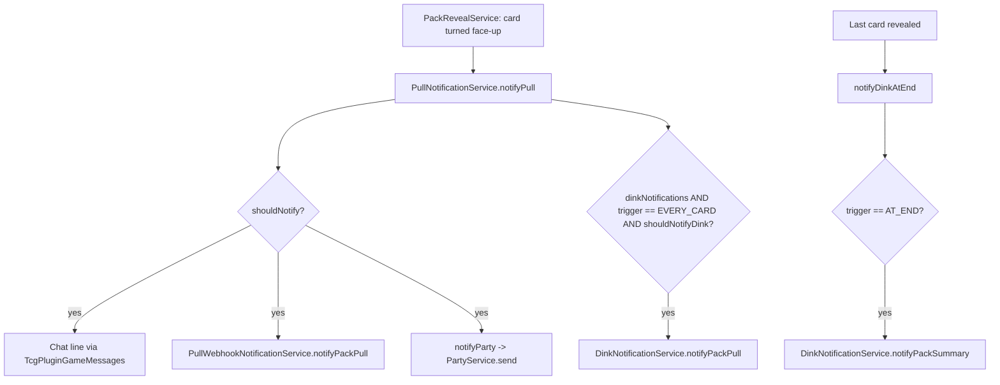

# Notifications

> **Scope:** every outbound alert the plugin produces for a pack pull or a credit gain — in-game chat, party broadcast, Dink/Discord hand-off, and the direct Discord webhook — plus the shared chat-formatting layer.
> **Key packages:** `com.osrstcg.service`, `com.osrstcg.util`, `com.osrstcg.model`
> **Related:** [PullNotificationService.java](../src/main/java/com/osrstcg/service/PullNotificationService.java), [OsrsTcgConfig.java](../src/main/java/com/osrstcg/OsrsTcgConfig.java)

## Purpose

When a card is revealed during a pack opening, the plugin can announce it in up to
four places at once. Each destination is owned by a different class, but all four
are triggered from a single method —
[`PullNotificationService.notifyPull`](../src/main/java/com/osrstcg/service/PullNotificationService.java#L75).
That method is the fan-out point, and understanding it is most of what you need to
know about this area.

The complicated part is not the delivery, it is the *eligibility* logic. There are
two independent predicates: one decides whether a pull is worth a chat line (and,
transitively, a party broadcast and a webhook POST), the other decides whether Dink
should hear about it. They read different config keys, evaluate the same inputs in a
different order, and disagree in at least one common case (duplicate foils). Both are
reproduced in full below.

The two Discord paths deserve a note up front, because they look redundant.
[`DinkNotificationService`](../src/main/java/com/osrstcg/service/DinkNotificationService.java)
does not talk to Discord at all — it posts a RuneLite `PluginMessage` onto the event
bus and lets the third-party [Dink](https://github.com/pajlads/DinkPlugin) plugin
do the HTTP work, which gets you Dink's screenshot support and the user's existing
webhook configuration for free.
[`PullWebhookNotificationService`](../src/main/java/com/osrstcg/service/PullWebhookNotificationService.java)
is the no-dependency fallback: it builds a Discord embed itself and POSTs it with
OkHttp. A user with both configured will get two Discord messages per pull.

The chat layer is shared with the rest of the plugin.
[`TcgPluginGameMessages`](../src/main/java/com/osrstcg/util/TcgPluginGameMessages.java)
owns the `[OSRS TCG]` prefix, the configurable prefix colour, and the
formatted/plain dual-string convention that `ChatMessageManager` requires.

## Class reference

| Class | Lines | Responsibility |
|---|---|---|
| [`PullNotificationService`](../src/main/java/com/osrstcg/service/PullNotificationService.java) | 185 | Fan-out point. Owns the chat channel directly, owns both eligibility predicates, and owns the party broadcast. |
| [`PullWebhookNotificationService`](../src/main/java/com/osrstcg/service/PullWebhookNotificationService.java) | 257 | Builds and async-POSTs a Discord embed to one or more user-supplied webhook URLs. |
| [`DinkNotificationService`](../src/main/java/com/osrstcg/service/DinkNotificationService.java) | 168 | Posts `PluginMessage("dink", "notify", …)` on the event bus. Per-card and whole-pack-summary variants. |
| [`ShopNotificationService`](../src/main/java/com/osrstcg/service/ShopNotificationService.java) | 83 | Unrelated to pulls: edge-triggered chat line when a credit gain first makes a booster affordable. |
| [`TcgPluginGameMessages`](../src/main/java/com/osrstcg/util/TcgPluginGameMessages.java) | 236 | Static chat markup helpers + `ChatMessageManager` queueing. |
| [`PullNotificationMessages`](../src/main/java/com/osrstcg/util/PullNotificationMessages.java) | 49 | Plain-text message templates for the Discord/Dink bodies. |
| [`PullNotifyTier`](../src/main/java/com/osrstcg/model/PullNotifyTier.java) | 38 | Config-facing enum mirroring `RarityMath.Tier`, used as a minimum threshold. |
| [`DinkNotificationTrigger`](../src/main/java/com/osrstcg/model/DinkNotificationTrigger.java) | 20 | `EVERY_CARD` vs `AT_END`. |
| [`TcgPullPartyMessage`](../src/main/java/com/osrstcg/party/TcgPullPartyMessage.java) | 20 | Party websocket DTO: card name, new-flag, foil-flag. |

## The fan-out

`notifyPull(cardName, newForCollection, foil, tier)` is called once per card, at the
moment the card is turned face-up. It evaluates the chat predicate exactly once and
stores the result in a local `standardNotification`
([PullNotificationService.java:82](../src/main/java/com/osrstcg/service/PullNotificationService.java#L82)),
then reuses that single boolean to gate three of the four channels.



The channel ownership and the extra gate each one applies on top of the shared
predicate:

| Channel | Owner | Gate on top of the predicate | Citation |
|---|---|---|---|
| In-game chat | `PullNotificationService` itself | none | [:83-89](../src/main/java/com/osrstcg/service/PullNotificationService.java#L83) |
| Direct Discord webhook | `PullWebhookNotificationService` | `pullWebhookUrl` non-blank (checked inside the callee) | [:99](../src/main/java/com/osrstcg/service/PullNotificationService.java#L99) |
| Party broadcast | `PullNotificationService.notifyParty` | `partyAnnounceMythicPulls` **and** `partyService.isInParty()` | [:113-130](../src/main/java/com/osrstcg/service/PullNotificationService.java#L113) |
| Dink / Discord | `DinkNotificationService` | `dinkNotifications` **and** trigger, **and its own predicate** | [:91-95](../src/main/java/com/osrstcg/service/PullNotificationService.java#L91) |

The important structural fact: **the webhook and the party broadcast are slaved to
the chat predicate.** They have no independent tier or foil settings. If you turn
chat notifications down (say `notifyNewCardsOnly = true`), you silently turn the
webhook down with it. Only the Dink channel has its own rules. This is worth
remembering before you "fix" a bug report about the webhook being too quiet — the
knob the user needs is in the *Pull notifications* config section, not the Dink one.

`notifyPull` also short-circuits on a blank card name before doing anything
([:77-80](../src/main/java/com/osrstcg/service/PullNotificationService.java#L77)),
and finishes with a `log.debug` that calls `isWebhookConfigured()`
([:180-184](../src/main/java/com/osrstcg/service/PullNotificationService.java#L180))
purely for the log line.

## Eligibility: the chat predicate

`shouldNotify(tier, foil, newForCollection)`
([PullNotificationService.java:49-73](../src/main/java/com/osrstcg/service/PullNotificationService.java#L49))
is the predicate for chat, webhook and party. Transcribed faithfully:

```
shouldNotify(tier, foil, new):
    # 1. new-cards-only gate, with a foil escape hatch
    if notifyNewCardsOnly and not new and not (foil and notifyFoils):
        return false

    # 2. foil branch
    if foil:
        if tier == null:
            return notifyFoils
        floor = (notifyTier ?? MYTHIC).toRarityTier()
        return (tier.ordinal() >= floor.ordinal()) or notifyFoils

    # 3. non-foil branch
    if tier == null or not notifyNonFoils:
        return false
    floor = (notifyTier ?? MYTHIC).toRarityTier()
    return tier.ordinal() >= floor.ordinal()
```

Three things about this are easy to misread:

`notifyFoils` is an **override, not a filter**. On the foil branch it is OR'd with
the tier check ([:64](../src/main/java/com/osrstcg/service/PullNotificationService.java#L64)),
and it also appears as an escape hatch inside the new-cards-only gate
([:51](../src/main/java/com/osrstcg/service/PullNotificationService.java#L51)).
With the default `notifyFoils = true`, *every foil pull notifies*, at any rarity,
new or duplicate — the tier and new-only settings become dead for foils. Turning
`notifyFoils` off does not suppress foils; it demotes them to the same tier rule as
non-foils.

`notifyNonFoils` only exists on the non-foil branch
([:66](../src/main/java/com/osrstcg/service/PullNotificationService.java#L66)). It is
a hard kill-switch for normal cards and has no effect on foils.

`tier == null` means "rarity unknown". Foils with an unknown tier fall back to
`notifyFoils` ([:59](../src/main/java/com/osrstcg/service/PullNotificationService.java#L59));
non-foils with an unknown tier are always suppressed.

### Chat truth table under defaults

Config defaults are `notifyTier = MYTHIC`, `notifyNonFoils = true`,
`notifyFoils = true`, `notifyNewCardsOnly = true`
([OsrsTcgConfig.java:150-195](../src/main/java/com/osrstcg/OsrsTcgConfig.java#L150)).

| foil | new | tier | Result | Why |
|---|---|---|---|---|
| yes | yes | COMMON | notify | `notifyFoils` override |
| yes | no | COMMON | notify | foil escape hatch in the new-only gate |
| yes | any | null | notify | `return notifyFoils` |
| no | yes | MYTHIC | notify | `ordinal >= MYTHIC` |
| no | yes | LEGENDARY | silent | below floor |
| no | no | GODLY | silent | new-only gate, no foil escape |
| no | any | null | silent | unknown tier on the non-foil branch |

## Eligibility: the Dink predicate

`shouldNotifyDink(tier, foil, newForCollection)`
([PullNotificationService.java:153-172](../src/main/java/com/osrstcg/service/PullNotificationService.java#L153))
is a separate method reading a separate set of config keys:

```
shouldNotifyDink(tier, foil, new):
    # 1. new-cards-only gate — NO foil escape hatch
    if not new and dinkOnlyNotifyNew:
        return false

    # 2. unconditional foil override
    if foil and dinkAlwaysNotifyFoils:
        return true

    # 3. tier floor, chosen by new-vs-duplicate
    if tier == null:
        return false
    floor = ((new ? dinkNewCardNotifyTier : dinkDuplicateNotifyTier) ?? MYTHIC).toRarityTier()
    return tier.ordinal() >= floor.ordinal()
```

Dink defaults: `dinkNotifications = false` (the whole channel is opt-in),
`dinkNotificationTrigger = EVERY_CARD`, `dinkNewCardNotifyTier = MYTHIC`,
`dinkAlwaysNotifyFoils = true`, `dinkOnlyNotifyNew = true`,
`dinkDuplicateNotifyTier = MYTHIC`
([OsrsTcgConfig.java:229-298](../src/main/java/com/osrstcg/OsrsTcgConfig.java#L229)).

### Where the two predicates diverge

| Behaviour | Chat / webhook / party | Dink |
|---|---|---|
| Duplicate **foil**, "only new" on | **Notifies.** The foil escape hatch is *inside* the new-only condition ([:51](../src/main/java/com/osrstcg/service/PullNotificationService.java#L51)). | **Silent.** The new-only gate returns before the foil override is reached ([:155-162](../src/main/java/com/osrstcg/service/PullNotificationService.java#L155)). |
| Separate threshold for duplicates | No — one `notifyTier` for everything. | Yes — `dinkDuplicateNotifyTier` applies when `new == false`. |
| Suppress non-foils entirely | Yes, `notifyNonFoils = false`. | No equivalent key. |
| Foil with unknown tier | Follows `notifyFoils`. | `true` if `dinkAlwaysNotifyFoils`, otherwise `false`. |
| Foil override semantics | OR'd with the tier check (`tierOk \|\| notifyFoils`). | Early `return true`, short-circuiting the tier check. |

That first row is the one that generates bug reports. A user with both channels on
and both "only new" boxes ticked sees duplicate foils in chat but not in Discord.
This is a genuine asymmetry in the source, not a config artefact.

## Tier ordering and "this rarity and higher"

Both predicates express the threshold identically, as an `ordinal()` comparison
against a floor derived from the configured `PullNotifyTier`
([:63](../src/main/java/com/osrstcg/service/PullNotificationService.java#L63),
[:72](../src/main/java/com/osrstcg/service/PullNotificationService.java#L72),
[:171](../src/main/java/com/osrstcg/service/PullNotificationService.java#L171)):

```java
RarityMath.Tier floor = minimum == null ? RarityMath.Tier.MYTHIC : minimum.toRarityTier();
return tier.ordinal() >= floor.ordinal();
```

`PullNotifyTier` is a 1:1 mirror of `RarityMath.Tier` and exists only so the config
UI has an enum of its own; `toRarityTier()` does the mapping
([PullNotifyTier.java:8-14](../src/main/java/com/osrstcg/model/PullNotifyTier.java#L8),
[:23-26](../src/main/java/com/osrstcg/model/PullNotifyTier.java#L23)). The `toString()`
override returns `tier.getLabel()`, which is what RuneLite renders in the dropdown
([:33-37](../src/main/java/com/osrstcg/model/PullNotifyTier.java#L33)).

The ordering comes entirely from **declaration order** in `RarityMath.Tier`
([RarityMath.java:14-23](../src/main/java/com/osrstcg/service/RarityMath.java#L14)):

| Ordinal | Tier | Colour | Target share |
|---|---|---|---|
| 0 | `COMMON` | `0xFFFFFF` | 37.34% |
| 1 | `UNCOMMON` | `0x2ECC71` | 32.0% |
| 2 | `RARE` | `0x3498DB` | 16.0% |
| 3 | `EPIC` | `0x9B59B6` | 8.0% |
| 4 | `LEGENDARY` | `0xE74C3C` | 4.0% |
| 5 | `MYTHIC` | `0xFF6EC7` | 2.0% |
| 6 | `GODLY` | `0xF2C94C` | 0.66% |

So `notifyTier = LEGENDARY` means ordinal 4, matching `LEGENDARY`, `MYTHIC` and
`GODLY`. Two consequences worth internalising before you touch either enum:

- **Reordering or inserting a constant in `RarityMath.Tier` silently changes every
  user's threshold.** There is no explicit rank field; `ordinal()` *is* the rank.
- **Renaming a `PullNotifyTier` constant breaks saved config.** RuneLite persists
  enums by `name()`, so a rename resolves to `null` on load. Every call site defends
  against that by falling back to `MYTHIC`, which is why the `minimum == null ?
  MYTHIC : …` pattern appears three times — that is the null-config fallback, not
  dead code.

## `DinkNotificationTrigger`: per-card vs whole-pack

`DinkNotificationTrigger` has two values, `EVERY_CARD` and `AT_END`
([DinkNotificationTrigger.java:5-6](../src/main/java/com/osrstcg/model/DinkNotificationTrigger.java#L5)).
`PullNotificationService.dinkTrigger()` reads the config and defaults `null` to
`EVERY_CARD` ([:174-178](../src/main/java/com/osrstcg/service/PullNotificationService.java#L174)).

**`EVERY_CARD`** fires from inside `notifyPull`: one `PluginMessage` per eligible
card, at reveal time
([:91-95](../src/main/java/com/osrstcg/service/PullNotificationService.java#L91)).
A five-card pack where everything is eligible produces five Discord messages.

**`AT_END`** makes `notifyPull` skip the Dink block entirely (the trigger check
fails) and instead relies on `notifyDinkAtEnd(cards)`
([:132-151](../src/main/java/com/osrstcg/service/PullNotificationService.java#L132)),
which is handed the *entire* reveal list. It filters every card through
`shouldNotifyDink` — note the extra null-safety on `card.getPull().getCardName()`
([:142-146](../src/main/java/com/osrstcg/service/PullNotificationService.java#L142)) —
collects the survivors into `DinkNotificationService.PackPull` records, and makes a
single `notifyPackSummary` call.

Batching happens in `notifyPackSummary`
([DinkNotificationService.java:107-154](../src/main/java/com/osrstcg/service/DinkNotificationService.java#L107)):
it partitions the pulls into `newCards` and `duplicates`, appending `" (foil)"` to
the display name as it goes
([:121-122](../src/main/java/com/osrstcg/service/DinkNotificationService.java#L121)),
then renders both lists as Markdown bullets. The thumbnail is taken from
`pulls.get(0)` ([:129](../src/main/java/com/osrstcg/service/DinkNotificationService.java#L129)) —
the first *eligible* card, and since the reveal order is shuffled
([PackRevealService.java:262](../src/main/java/com/osrstcg/service/PackRevealService.java#L262))
that is effectively an arbitrary card, not the best one in the pack.

### The once-per-pack guard

`notifyDinkAtEnd` is reachable from three different code paths, so
`PackRevealService` wraps it in a latch
([PackRevealService.java:693-701](../src/main/java/com/osrstcg/service/PackRevealService.java#L693)):

```java
private void notifyDinkAtEndOnce()
{
    if (dinkEndNotificationsSent) { return; }
    dinkEndNotificationsSent = true;
    pullNotificationService.notifyDinkAtEnd(cards);
}
```

The three callers are the click that reveals the final card
([:318-323](../src/main/java/com/osrstcg/service/PackRevealService.java#L318)),
`forceRevealAllAndWaitClose` used by right-click / keyboard skip
([:398](../src/main/java/com/osrstcg/service/PackRevealService.java#L398)), and the
`tick()` state machine when it notices every slot is face-up
([:416-421](../src/main/java/com/osrstcg/service/PackRevealService.java#L416)).
Without the latch, a skip immediately followed by a tick would double-post.
`notifyPackSummary` itself is also defensive — it early-returns on an empty list
([DinkNotificationService.java:109-112](../src/main/java/com/osrstcg/service/DinkNotificationService.java#L109),
[:124-127](../src/main/java/com/osrstcg/service/DinkNotificationService.java#L124)) —
which matters because `notifyDinkAtEnd` calls it unconditionally at
[:150](../src/main/java/com/osrstcg/service/PullNotificationService.java#L150), even
when nothing survived the filter.

Note that `forceRevealAllAndWaitClose` first calls
`announcePartyMythicPullsForPreviouslyUnrevealedSlots`
([:391](../src/main/java/com/osrstcg/service/PackRevealService.java#L391),
[:679-691](../src/main/java/com/osrstcg/service/PackRevealService.java#L679)), which
runs `notifyPull` for every not-yet-revealed slot. So skipping a pack still produces
the full per-card chat/webhook/party fan-out — it is only the Dink `AT_END` summary
that is collapsed.

## The Dink hand-off

Dink is a **separate, independently installed plugin**. This codebase has no compile
or runtime dependency on it and never imports anything from it. The entire integration
is a single RuneLite `PluginMessage` posted on the shared event bus
([DinkNotificationService.java:99](../src/main/java/com/osrstcg/service/DinkNotificationService.java#L99),
[:148](../src/main/java/com/osrstcg/service/DinkNotificationService.java#L148)):

```java
eventBus.post(new PluginMessage(DINK_NAMESPACE, DINK_NOTIFY, data));
```

with `DINK_NAMESPACE = "dink"` and `DINK_NOTIFY = "notify"`
([:40-41](../src/main/java/com/osrstcg/service/DinkNotificationService.java#L40)).
Dink subscribes to that namespace/name pair and reads the `data` map. The contract is
therefore a *map schema*, not a Java interface — nothing will fail to compile if Dink
changes its keys.

Keys sent for a single-card notification
([:76-95](../src/main/java/com/osrstcg/service/DinkNotificationService.java#L76)):

| Key | Value |
|---|---|
| `sourcePlugin` | `"OSRS TCG"` |
| `text` | message body + `"\n\n"` + the public stats line |
| `title` | `"OSRS TCG"` |
| `imageRequested` | `true` — asks Dink to attach a game screenshot |
| `thumbnail` | wiki image URL, omitted when blank |
| `metadata` | `{cardName, foil, newForCollection, rarityTier, imageUrl?}` |

The pack-summary variant swaps the metadata for
`{notificationType: "packSummary", newCards: [...], duplicates: [...]}`
([:140-144](../src/main/java/com/osrstcg/service/DinkNotificationService.java#L140)).

Two prerequisites on the Dink side, recorded in the class javadoc
([:17-19](../src/main/java/com/osrstcg/service/DinkNotificationService.java#L17)):
Dink must be installed, and the user must enable
*External Plugin Requests → Enable External Plugin Notifications*.

**When Dink is not installed, nothing happens and nothing complains.** `EventBus.post`
with no subscriber is a no-op — there is no acknowledgement, no return value, and no
way for this plugin to detect delivery. The `try`/`catch` around the post only logs at
`debug` ([:101-104](../src/main/java/com/osrstcg/service/DinkNotificationService.java#L101))
and exists to stop a misbehaving subscriber from propagating an exception back into the
reveal path. If you are debugging "Dink notifications don't work", the plugin side is
almost never the problem; check Dink's own settings first.

The message body uses `%USERNAME%` as the player placeholder
([PullNotificationMessages.java:22](../src/main/java/com/osrstcg/util/PullNotificationMessages.java#L22),
[:27](../src/main/java/com/osrstcg/util/PullNotificationMessages.java#L27)) — a Dink
template variable that Dink substitutes. Do not resolve it locally; that is deliberate.

## `PullWebhookNotificationService`

This is the direct path, used when the user pastes a Discord webhook URL into
`pullWebhookUrl` (default `""`, which disables the channel
— [OsrsTcgConfig.java:210-219](../src/main/java/com/osrstcg/OsrsTcgConfig.java#L210)).

### URL parsing — multiple webhooks

`pullWebhookUrl` is treated as a **newline-separated list**, split on the `\R`
regex (any Unicode line terminator) at
[:166](../src/main/java/com/osrstcg/service/PullWebhookNotificationService.java#L166).
Blank lines are skipped; lines that fail `HttpUrl.parse` are logged and dropped
individually rather than aborting the batch
([:163-182](../src/main/java/com/osrstcg/service/PullWebhookNotificationService.java#L163)).
The payload is serialised once and the same string is enqueued to every URL
([:109-112](../src/main/java/com/osrstcg/service/PullWebhookNotificationService.java#L109)).

### Payload shape

`buildPayload` assembles a `LinkedHashMap` — deliberately ordered, so the emitted
JSON is stable and diffable — containing exactly one embed
([:193-214](../src/main/java/com/osrstcg/service/PullWebhookNotificationService.java#L193)).
`footer` and `image` are omitted entirely when their source string is empty. A real
message for a new foil Mythic pull looks like this:

```json
{
  "embeds": [
    {
      "title": "OSRS TCG",
      "description": "Zezima just added Twisted bow (foil) to their collection!",
      "color": 16740039,
      "footer": {
        "text": "Collection score: 1,234 (12.3%), Unique cards: 123 / 1,000 ..."
      },
      "image": {
        "url": "https://oldschool.runescape.wiki/images/Twisted_bow.png"
      }
    }
  ]
}
```

The `color` integer is packed from the tier's AWT colour
([:216-220](../src/main/java/com/osrstcg/service/PullWebhookNotificationService.java#L216)):

```java
(color.getRed() << 16) | (color.getGreen() << 8) | color.getBlue()
```

An unknown tier falls back to `Color.WHITE`, i.e. `16777215`. `MYTHIC`'s `0xFF6EC7`
is the `16740039` above; `GODLY`'s `0xF2C94C` is `15911244`.

The three variable pieces are resolved just before serialisation
([:92-97](../src/main/java/com/osrstcg/service/PullWebhookNotificationService.java#L92)):

- `description` — `PullNotificationMessages.collectionMessage(...)`, with the real
  player name (not `%USERNAME%`, since there is no Dink to substitute it).
  `resolvePlayerName` runs `Text.sanitize` to strip icon codes and falls back to
  `"Unknown player"` when logged out
  ([:222-229](../src/main/java/com/osrstcg/service/PullWebhookNotificationService.java#L222)).
- `footer.text` — `tcgChatStatsShareService.buildPlainLine(tcgPublicStatsCalculator.computeLive())`,
  the same collection-score line used by the chat share command, in its uncoloured
  form ([TcgChatStatsShareService.java:108-111](../src/main/java/com/osrstcg/service/TcgChatStatsShareService.java#L108)).
- `image.url` — the card's wiki image passed through
  `WikiImageCacheService.publicImageUrl`, which rewrites thumbnail paths to a direct
  full-size file URL so Discord can fetch it
  ([WikiImageCacheService.java:231-250](../src/main/java/com/osrstcg/service/WikiImageCacheService.java#L231)).
  Resolves to `""` (and the key is omitted) for unknown cards.

### HTTP client and threading

`OkHttpClient` and `Gson` are both **injected**, not constructed
([:48-67](../src/main/java/com/osrstcg/service/PullWebhookNotificationService.java#L48)),
so the plugin shares RuneLite's configured client — its connection pool, proxy
settings and user agent — rather than spinning up its own.

Delivery uses `newCall(request).enqueue(callback)`
([:127](../src/main/java/com/osrstcg/service/PullWebhookNotificationService.java#L127)),
which is OkHttp's **asynchronous** form: the request is handed to OkHttp's internal
dispatcher thread pool and `enqueue` returns immediately. This is the load-bearing
detail for this whole area. `notifyPull` is invoked from a `synchronized`
`PackRevealService` method on the input/render path, so a blocking `execute()` here
would stall the game client for the duration of a round trip to Discord — and would
do it while holding the reveal monitor. **Do not "simplify" `enqueue` to `execute`.**

Everything before the enqueue does run on the caller's thread: JSON serialisation,
`computeLive()`, and the card-database lookup. That whole block is wrapped in a
`try`/`catch (Exception)` that logs a warning
([:114-117](../src/main/java/com/osrstcg/service/PullWebhookNotificationService.java#L114)),
so a failure there degrades to a missing Discord message rather than a broken reveal.

### Failure handling, retry and rate limiting

The `Callback` handles both outcomes but takes no corrective action
([:127-160](../src/main/java/com/osrstcg/service/PullWebhookNotificationService.java#L127)):

| Outcome | Behaviour |
|---|---|
| Transport failure (`onFailure`) | `log.warn` with the masked URL and exception string. Dropped. |
| 2xx (`onResponse`) | `log.info` with the status code. |
| Non-2xx | `log.warn` with status and the response body, truncated to 300 chars by `truncateForLog` ([:248-256](../src/main/java/com/osrstcg/service/PullWebhookNotificationService.java#L248)). Dropped. |

**There is no retry, no backoff, and no client-side rate limiting.** A 429 from
Discord is logged like any other rejection and the message is lost. This matters
because `EVERY_CARD`-style behaviour is the default on the webhook path too — the
webhook has no batching mode at all, so opening a large pack where many cards clear
the predicate fires one POST per card, back to back, and Discord's per-webhook limit
is easy to hit. The response body is always consumed via try-with-resources
([:138](../src/main/java/com/osrstcg/service/PullWebhookNotificationService.java#L138))
so connections are returned to the pool even on the error paths.

### Log hygiene

`maskWebhookUrl` reduces a URL to `scheme://host + encodedPath()`
([:184-191](../src/main/java/com/osrstcg/service/PullWebhookNotificationService.java#L184)).
Be aware of what that actually hides: it strips the query and fragment but **keeps the
path**, and a Discord webhook's secret token lives in the path
(`/api/webhooks/{id}/{token}`). The "masked" form is not safe to paste into a bug
report. See *Gotchas* below.

## `PullNotificationMessages`

A small final class of pure string builders
([PullNotificationMessages.java](../src/main/java/com/osrstcg/util/PullNotificationMessages.java)),
used only by the two Discord paths. Chat uses `TcgPluginGameMessages` instead,
because chat needs colour markup.

| Method | Output |
|---|---|
| `collectionMessage(who, card, new, foil)` | `"{who} just added {duplicate }{card}{ (foil)} to their collection!"` |
| `dinkCollectionMessage(card, new, foil)` | The same, with `who` hard-coded to `"%USERNAME%"` |
| `dinkPackSummaryMessage(newCards, duplicates)` | `"%USERNAME% opened a booster pack!\n\n**New cards**\n…\n\n**Duplicates**\n…"` |

**There is no randomisation anywhere in this class.** Every template is a fixed
format string; the only variation is the `"duplicate "` prefix when
`newForCollection` is false and the `" (foil)"` suffix
([:15-17](../src/main/java/com/osrstcg/util/PullNotificationMessages.java#L15)). If
you are looking for a pool of flavour messages to extend, it does not exist yet.

`markdownCardList` renders `"- None"` for an empty or null list rather than an empty
string ([:32-48](../src/main/java/com/osrstcg/util/PullNotificationMessages.java#L32)),
which is why a summary embed always shows both headings even when one side is empty.
Null/blank `playerName` degrades to `"Unknown player"`
([:13](../src/main/java/com/osrstcg/util/PullNotificationMessages.java#L13)).

Both Dink and webhook bodies get the stats line appended — Dink does it in
`messageWithStatsLine` with a `"\n\n"` separator
([DinkNotificationService.java:156-159](../src/main/java/com/osrstcg/service/DinkNotificationService.java#L156)),
the webhook puts it in the embed footer instead.

## `TcgPluginGameMessages`: the chat layer

Every chat line the plugin emits goes through this final utility class. It solves
three problems: the prefix, the colour, and RuneLite's dual-string message format.

### The prefix and its colour

`prefixBuilder()` produces `[` + `OSRS TCG` + `] ` where only the label is coloured
([:31-39](../src/main/java/com/osrstcg/util/TcgPluginGameMessages.java#L31)); the
brackets use `ChatColorType.NORMAL` so they inherit the user's chat colour. The colour
lives in a **static mutable field** `PREFIX_COLOR`, initialised to
`DEFAULT_PREFIX_COLOR = new Color(0xC4, 0x94, 0x1A)`
([:18-20](../src/main/java/com/osrstcg/util/TcgPluginGameMessages.java#L18)) and
updated through `setPrefixColor`, which null-guards back to the default
([:41-44](../src/main/java/com/osrstcg/util/TcgPluginGameMessages.java#L41)).

It is written from exactly two places in `OsrsTcgPlugin`: once at `startUp`
([OsrsTcgPlugin.java:248](../src/main/java/com/osrstcg/OsrsTcgPlugin.java#L248)) and
again from `onConfigChanged` when the key is `chatPrefixColor`
([:359-362](../src/main/java/com/osrstcg/OsrsTcgPlugin.java#L359)). The config default
is the same `0xC4941A`
([OsrsTcgConfig.java:119-128](../src/main/java/com/osrstcg/OsrsTcgConfig.java#L119)).
The push-on-change design means the formatting helpers stay static and dependency-free
— they never need a `Config` reference — at the cost of a piece of global mutable
state. See *Gotchas*.

### Message families

The class exposes matched `format…`/`plain…` pairs for each situation, all built on
`prefixBuilder()` and `announcedCardLabel(cardName, foil)`, which trims the name,
substitutes `"Unknown card"` for blanks, and appends `" (foil)"`
([:64-72](../src/main/java/com/osrstcg/util/TcgPluginGameMessages.java#L64)):

| Pair | Used for |
|---|---|
| `…YouAddedCollection` | Your own pull ([PullNotificationService.java:86-87](../src/main/java/com/osrstcg/service/PullNotificationService.java#L86)) |
| `…SomeoneAddedCollection` | An inbound party broadcast ([OsrsTcgPlugin.java:392-395](../src/main/java/com/osrstcg/OsrsTcgPlugin.java#L392)) |
| `…YouPulled` / `…SomeonePulled` | Pull-only phrasing |
| `…SomeoneSentYou` / `…YouSentCard` | Card transfers |

Only the card name is rarity-coloured; the surrounding words are `ChatColorType.NORMAL`
([:139](../src/main/java/com/osrstcg/util/TcgPluginGameMessages.java#L139)). The colour
comes from `cardDatabase.chatRarityColorForCardName(...)` at the call site.

### The formatted-vs-plain dual message

`queueFormattedGameMessage` is the only place the plugin touches `ChatMessageManager`
([:189-208](../src/main/java/com/osrstcg/util/TcgPluginGameMessages.java#L189)):

```java
chatMessageManager.queue(QueuedMessage.builder()
    .type(ChatMessageType.GAMEMESSAGE)
    .runeLiteFormattedMessage(formatted)
    .value(plain)
    .build());
```

Both strings are required because they serve different consumers.
`runeLiteFormattedMessage` is the `ChatMessageBuilder` output — it still contains
RuneLite's colour *tokens* (`ChatColorType.NORMAL`/`HIGHLIGHT`), which are resolved
against the user's chat-colour preferences at render time. `value` is the flat text
with the prefix spelled out literally as `"[OSRS TCG] "` (see
[:145-149](../src/main/java/com/osrstcg/util/TcgPluginGameMessages.java#L145)) and no
markup at all. Keeping both means the message degrades to something readable if the
formatted form is not applied, and gives any consumer reading the raw message value a
clean string. The practical rule when adding a message: **always add the `plain…`
twin**, and keep the two texts in sync — nothing enforces it.

`queuePrefixedGameMessage` is the convenience wrapper for messages with no rarity
colouring; it derives both forms from one body string
([:213-220](../src/main/java/com/osrstcg/util/TcgPluginGameMessages.java#L213)) and is
what `ShopNotificationService` uses. Note the queueing is fire-and-forget: the method
null-guards `chatMessageManager` and both strings, and returns `void`.

## `ShopNotificationService`

Unrelated to pulls, but it shares the chat layer. It turns credit gains into "you can
now afford X" lines, and its whole design is one edge-trigger condition
([ShopNotificationService.java:38-69](../src/main/java/com/osrstcg/service/ShopNotificationService.java#L38)).

`onCreditsIncreased(creditsBefore, creditsAfter)` is called from
`TcgStateService.addCredits` **after** the state has been mutated and saved
([TcgStateService.java:541-544](../src/main/java/com/osrstcg/service/TcgStateService.java#L541)),
passing both the old and new balances. It returns immediately unless
`shopNotifications` is on (default `true`,
[OsrsTcgConfig.java:46-55](../src/main/java/com/osrstcg/OsrsTcgConfig.java#L46)) and
the balance actually rose.

Visible boosters are sorted by price, then by name case-insensitively as a tiebreak
([:47-50](../src/main/java/com/osrstcg/service/ShopNotificationService.java#L47)), so
when a single large gain crosses several thresholds at once the messages arrive
cheapest-first. Each booster is then tested with:

```java
if (price <= 0 || creditsBefore >= price || creditsAfter < price) { continue; }
```

Read positively, a message fires only when `0 < price`, `creditsBefore < price` and
`creditsAfter >= price` — a strict **crossing** of the threshold
([:60](../src/main/java/com/osrstcg/service/ShopNotificationService.java#L60)).

**The dedupe is the edge condition itself; there is no notified-set and no persisted
state.** Because `creditsBefore >= price` short-circuits, staying above a pack's price
across many subsequent gains produces exactly one message — the first crossing. Spend
back down below the price and the next gain that crosses it will notify again, which
is intended: the message is about affordability changing, not about the pack. The
corollary is that the trigger is only as reliable as `addCredits` being the sole
mutation path for credits; a balance changed some other way will not re-arm or fire it.

`packDisplayName` falls back name → id → `"a pack"`
([:71-82](../src/main/java/com/osrstcg/service/ShopNotificationService.java#L71)), so a
malformed catalogue entry still produces a sentence rather than an NPE.

## Data flow

A single click that reveals a card, end to end:

1. `PackRevealInputListener.mousePressed` receives BUTTON1 and calls
   `revealService.handleClick(...)`
   ([PackRevealInputListener.java:82-86](../src/main/java/com/osrstcg/overlay/PackRevealInputListener.java#L82)).
2. `PackRevealService.handleClick` (`synchronized`) identifies the clicked slot, marks
   it revealed, plays audio, and calls
   `pullNotificationService.notifyPull(cardNameForParty(clicked), clicked.isNew(), isFoilPull(clicked), clicked.getTier())`
   ([PackRevealService.java:316-317](../src/main/java/com/osrstcg/service/PackRevealService.java#L316)).
   `isNew` was computed at pack-open time by diffing against the pre-owned key set
   ([:258](../src/main/java/com/osrstcg/service/PackRevealService.java#L258)).
3. `notifyPull` trims the name, evaluates `shouldNotify` once into
   `standardNotification`.
4. If true: build formatted + plain strings and queue them on `ChatMessageManager`.
5. Independently: if `dinkNotifications && trigger == EVERY_CARD && shouldNotifyDink`,
   `DinkNotificationService.notifyPackPull` builds the data map and posts a
   `PluginMessage`.
6. If `standardNotification`: `PullWebhookNotificationService.notifyPackPull` builds
   the embed and enqueues one async POST per configured URL; then `notifyParty` sends a
   `TcgPullPartyMessage` if `partyAnnounceMythicPulls` is on and the player is in a party.
7. Remote clients receive the party message in `OsrsTcgPlugin.onTcgPullPartyMessage`,
   which drops it if it came from the local member, resolves the sender's display name
   (falling back to `"A party member"`) and queues a `…SomeoneAddedCollection` chat line
   ([OsrsTcgPlugin.java:365-397](../src/main/java/com/osrstcg/OsrsTcgPlugin.java#L365)).
8. When the last card flips, `notifyDinkAtEndOnce()` runs; under `AT_END` this emits the
   batched summary.

## Threading

This area is entered from three different threads, which is why the network path is
async and the chat path is a queue.

| Entry point | Thread | Notes |
|---|---|---|
| `notifyPull` via `handleClick` / `revealAllCards` / `advanceFromKeyboard` | RuneLite input dispatch (`MouseManager` / `KeyManager` listeners, [PackRevealInputListener.java:15](../src/main/java/com/osrstcg/overlay/PackRevealInputListener.java#L15)) | Runs inside a `synchronized` `PackRevealService` method. |
| `notifyDinkAtEnd` via `tick()` | Render path — `tick()` is called from `capturePaintFrame()` ([PackRevealService.java:442-444](../src/main/java/com/osrstcg/service/PackRevealService.java#L442)), which the overlay calls while painting | Also holds the `PackRevealService` monitor. |
| `ShopNotificationService.onCreditsIncreased` | Whichever thread called `TcgStateService.addCredits` — client thread via `CreditAwardService`, or the Swing EDT via `TcgPanel` / `CollectionAlbumWindow` | Runs inside `synchronized addCredits`. |
| `okhttp` `Callback.onFailure` / `onResponse` | OkHttp dispatcher pool | Log only — touches no plugin state, no UI. |

Consequences you must respect when editing:

- **No blocking network I/O on any of these paths.** The webhook uses `enqueue`
  ([PullWebhookNotificationService.java:127](../src/main/java/com/osrstcg/service/PullWebhookNotificationService.java#L127))
  precisely so the client thread is never parked on a socket. `EventBus.post` for Dink
  is synchronous but cheap — Dink does its own HTTP off-thread.
- **The `PackRevealService` monitor is held across the entire fan-out.** Anything slow
  added to `notifyPull` blocks reveal clicks, the render snapshot, and each other.
  `computeLive()` and the card-database lookups already run here; treat that as the
  budget ceiling, not an invitation.
- **`ChatMessageManager.queue` is a queue, not a direct write.** The plugin never calls
  `client.addChatMessage` from these services, which is what makes the Swing-EDT-reachable
  `ShopNotificationService` path safe.

## Gotchas & invariants

- **The webhook and party channels have no settings of their own.** They ride on
  `shouldNotify`. Adding a webhook-specific tier knob means adding a third predicate,
  not editing the existing one.
- **`notifyFoils` reads like a filter and behaves like an override.** Setting it to
  `true` (the default) makes `notifyTier` and `notifyNewCardsOnly` irrelevant for foils.
  Unifying the chat and Dink predicates is likewise a user-visible behaviour change,
  not a refactor — see the divergence table.
- **`RarityMath.Tier` ordinal order is load-bearing.** Both predicates compare
  `ordinal()`. Reordering the enum silently reinterprets every saved threshold, and
  renaming a `PullNotifyTier` constant makes stored config deserialise to `null` — which
  is why the `null → MYTHIC` fallback appears at
  [:62](../src/main/java/com/osrstcg/service/PullNotificationService.java#L62),
  [:71](../src/main/java/com/osrstcg/service/PullNotificationService.java#L71) and
  [:170](../src/main/java/com/osrstcg/service/PullNotificationService.java#L170).
- **`dinkEndNotificationsSent` must be reset per reveal session.** It is the only thing
  preventing a duplicate `AT_END` summary when a skip and a tick race
  ([PackRevealService.java:693-701](../src/main/java/com/osrstcg/service/PackRevealService.java#L693)).
- **`maskWebhookUrl` does not mask the secret.** It keeps `encodedPath()`
  ([PullWebhookNotificationService.java:190](../src/main/java/com/osrstcg/service/PullWebhookNotificationService.java#L190)),
  and a Discord webhook token is part of the path. Log output from this class should be
  treated as containing credentials.
- **No retry, no backoff, no rate limit on the webhook; Dink failures are undetectable.**
  A dropped POST leaves only a log line, and a missing Dink subscriber produces no error
  at all (the `catch` logs at `debug`).
- **`PREFIX_COLOR` is public static mutable and non-volatile**
  ([TcgPluginGameMessages.java:20](../src/main/java/com/osrstcg/util/TcgPluginGameMessages.java#L20)).
  It is written from the client thread in `onConfigChanged` and read from every thread
  that formats a message. In practice a stale colour for one message is harmless, but do
  not add anything to this class that depends on cross-thread visibility.
- **Formatted and plain strings are hand-mirrored.** Nothing checks that
  `formatPrefixedYouAddedCollection` and `plainPrefixedYouAddedCollection` say the same
  thing. Two existing drifts: `formatPrefixedNotEnoughCredits` emits a double space,
  because `prefixBuilder()` already ends with `"] "` and the body starts with another
  space ([:222-229](../src/main/java/com/osrstcg/util/TcgPluginGameMessages.java#L222));
  and the `…SomeoneSentYou` pair renders `" !"` with a leading space
  ([:160](../src/main/java/com/osrstcg/util/TcgPluginGameMessages.java#L160),
  [:166](../src/main/java/com/osrstcg/util/TcgPluginGameMessages.java#L166)).
- **Chat says "your collection", Discord says "their collection".** Deliberate — the
  chat line addresses the player, the Discord/Dink line describes them to a channel.
  Compare
  [TcgPluginGameMessages.java:141](../src/main/java/com/osrstcg/util/TcgPluginGameMessages.java#L141)
  with
  [PullNotificationMessages.java:17](../src/main/java/com/osrstcg/util/PullNotificationMessages.java#L17).
- **The `AT_END` summary thumbnail is arbitrary.** `pulls.get(0)` after a shuffle
  ([DinkNotificationService.java:129](../src/main/java/com/osrstcg/service/DinkNotificationService.java#L129))
  — not the rarest card, which is what people expect.
- **Skipping a pack still emits per-card notifications.**
  `announcePartyMythicPullsForPreviouslyUnrevealedSlots` replays `notifyPull` for every
  unrevealed slot ([PackRevealService.java:679-691](../src/main/java/com/osrstcg/service/PackRevealService.java#L679));
  only the Dink `AT_END` path collapses into one message.

### Open questions

- The exact thread on which RuneLite drains `ChatMessageManager`'s queue is a RuneLite
  implementation detail not visible in this repository. The plugin's contract is only
  that it enqueues rather than writing directly, so no call site here assumes a
  particular drain thread.
- Dink's own handling of the `data` map — which keys are required, how `imageRequested`
  interacts with `thumbnail`, and what it does with unknown `metadata` keys — lives in
  the Dink plugin and could not be verified from this codebase. The key set here is
  whatever Dink accepted at the time it was written.
