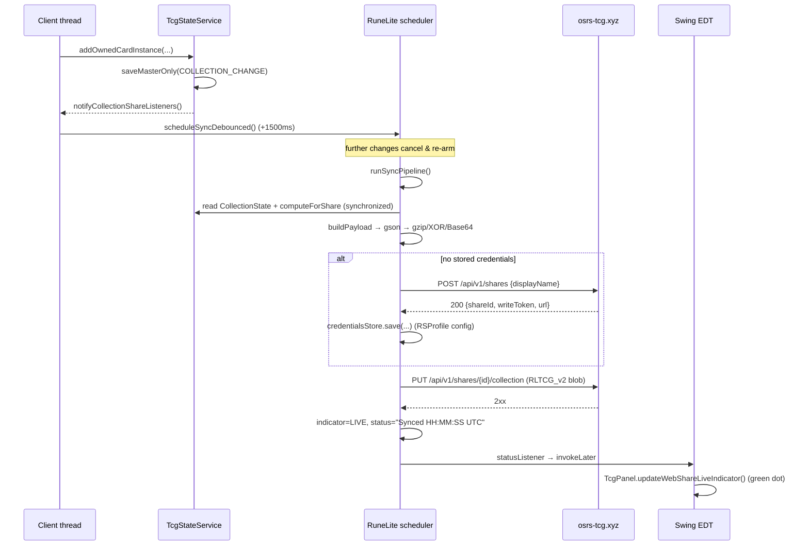

# External Services & Network Egress

> **Scope:** every outbound network request the plugin can make at runtime — the
> osrs-tcg.xyz collection share, the OSRS Wiki image cache, and user-configured
> Discord webhooks — plus the exact bytes that leave the machine and the config
> keys that gate them.
> **Key packages:** `com.osrstcg.service`, `com.osrstcg.persist`
> **Related:** the notifications doc (Dink + Discord webhook payload shapes and
> tier gating) and the pack-reveal doc (how `WikiImageCacheService` feeds the
> reveal/album renderers). See the *Open questions* section for a note on those
> filenames.

## Purpose

Three subsystems in this plugin talk to the internet. `CollectionShareService`
mirrors the player's collection to `osrs-tcg.xyz` so it can be browsed as a
public web album; `WikiImageCacheService` fetches card art from
`oldschool.runescape.wiki` and caches it on disk; `PullWebhookNotificationService`
POSTs Discord embeds to whatever webhook URL the user pastes into config. A
fourth service, `DinkNotificationService`, *looks* like network code but is not —
it posts a RuneLite `PluginMessage` and lets the Dink plugin do the egress.

Two of the three are opt-in and produce zero traffic out of the box. The web
album requires both a boolean toggle and a non-empty API key
([OsrsTcgConfig.java:321](../src/main/java/com/osrstcg/OsrsTcgConfig.java#L321),
[:334](../src/main/java/com/osrstcg/OsrsTcgConfig.java#L334)); the Discord
webhook requires a URL
([OsrsTcgConfig.java:216](../src/main/java/com/osrstcg/OsrsTcgConfig.java#L216)).
The wiki image fetch is the only one with no config gate at all — opening the
album or a pack reveal will hit the wiki.

This document also covers `OwnedCardNamesApiService`, which is *not* network
code but is the plugin's other "external interface": a read-only in-client API
that sibling RuneLite plugins can query over the event bus.

The privacy-relevant surface is concentrated in one place:
`CollectionShareSnapshotBuilder` decides exactly which fields of the collection
are serialised for upload. If you change that class you change what the plugin
publishes about its user. Read the [Upload payload](#upload-payload) section
before touching it.

## Class reference

| Class | Lines | Responsibility |
|---|---|---|
| [`CollectionShareService`](../src/main/java/com/osrstcg/service/CollectionShareService.java) | ~826 | Creates a share, PUTs encoded collection snapshots, owns retry/backoff and the sidebar indicator state |
| [`CollectionShareSnapshotBuilder`](../src/main/java/com/osrstcg/service/CollectionShareSnapshotBuilder.java) | ~74 | Builds the share-safe JSON map (schema v2) that gets uploaded |
| [`CollectionShareCredentialsStore`](../src/main/java/com/osrstcg/persist/CollectionShareCredentialsStore.java) | ~65 | RSProfile-scoped storage for `shareId` + `writeToken` |
| [`TcgStateStorageEncoding`](../src/main/java/com/osrstcg/persist/TcgStateStorageEncoding.java) | ~96 | gzip + XOR + Base64 blob format, shared with local saves |
| [`WikiImageCacheService`](../src/main/java/com/osrstcg/service/WikiImageCacheService.java) | ~763 | Wiki image HTTP client, disk cache, LRU memory cache, concurrency limiter |
| [`PullWebhookNotificationService`](../src/main/java/com/osrstcg/service/PullWebhookNotificationService.java) | ~257 | Async Discord embed POSTs to user-supplied webhook URLs |
| [`DinkNotificationService`](../src/main/java/com/osrstcg/service/DinkNotificationService.java) | ~200 | Posts `PluginMessage("dink", "notify", …)`; no sockets of its own |
| [`OwnedCardNamesApiService`](../src/main/java/com/osrstcg/service/OwnedCardNamesApiService.java) | ~142 | In-client `PluginMessage` API exposing distinct owned card names |

## Egress table

Every remote host the plugin can contact at runtime. "Gate" is the config key
that must be non-default for the request to happen at all.

| Host | Trigger | Method + path | Data that leaves the client | Gate |
|---|---|---|---|---|
| `osrs-tcg.xyz` | First sync after enabling, when no credentials are stored ([CollectionShareService.java:500](../src/main/java/com/osrstcg/service/CollectionShareService.java#L500)) | `POST /api/v1/shares` | JSON `{"displayName":"<sanitised RSN>"}` | `webShareEnabled` + `webShareApiKey` |
| `osrs-tcg.xyz` | Every sync pass: login, profile switch, collection change (debounced), 4.5-min keepalive, config change | `PUT /api/v1/shares/{shareId}/collection` | `RLTCG_v2:`-encoded blob of the full snapshot (see [Upload payload](#upload-payload)); headers carry the API key, the write token, and implicitly the client IP | `webShareEnabled` + `webShareApiKey` |
| `oldschool.runescape.wiki` | Album/pack-reveal/trade-window paint or preload for any card whose art is not in the memory or disk cache ([WikiImageCacheService.java:382](../src/main/java/com/osrstcg/service/WikiImageCacheService.java#L382)) | `GET /images/...` or `GET /images/thumb/...` | Only the requested image path and a `User-Agent` of `osrs-tcg (https://github.com/Azderi/osrs-tcg)`. No account identifiers. The set of URLs requested does reveal which cards you own/are opening | none — always on |
| User-supplied webhook host (in practice `discord.com` / `discordapp.com`) | A pull that passes the notification tier filter ([PullNotificationService.java:99](../src/main/java/com/osrstcg/service/PullNotificationService.java#L99)) | `POST <configured URL>` | Discord embed JSON: card name, foil/new flags, sanitised player name, a live stats line, and a wiki image URL ([PullWebhookNotificationService.java:193](../src/main/java/com/osrstcg/service/PullWebhookNotificationService.java#L193)) | `pullWebhookUrl` (empty by default) |
| *(none — via Dink)* | Same pull events, when Dink notifications are enabled | `PluginMessage("dink","notify")` on the RuneLite event bus | Handed to the Dink plugin; **this plugin opens no socket**. Dink's own webhook config decides the destination | `dinkNotifications` |

`repo.runelite.net` and `repo1.maven.org` appear in
[build.gradle:7](../build.gradle#L7) — those are build-time dependency
resolution, not runtime egress.

There is also a party/websocket surface (RuneLite's `PartyService` and
`WSClient`, registered in
[OsrsTcgPlugin.java:228](../src/main/java/com/osrstcg/OsrsTcgPlugin.java#L228))
used for card gifting and trading. That traffic goes to whatever party server
RuneLite itself is configured for and is out of scope here.

## CollectionShareService

### Lifecycle

`start()` is called once from the plugin's `startUp()`
([OsrsTcgPlugin.java:245](../src/main/java/com/osrstcg/OsrsTcgPlugin.java#L245)),
immediately after the status listener is wired
([:244](../src/main/java/com/osrstcg/OsrsTcgPlugin.java#L244)). It is guarded by
an `AtomicBoolean` CAS so a double `startUp` is a no-op
([CollectionShareService.java:122](../src/main/java/com/osrstcg/service/CollectionShareService.java#L122)).
It then does three things:

1. Loads the catalog version from the `/VERSION` classpath resource
   ([:126](../src/main/java/com/osrstcg/service/CollectionShareService.java#L126),
   [:765](../src/main/java/com/osrstcg/service/CollectionShareService.java#L765)).
   No `VERSION` file exists in `src/main/resources`, so in the current tree this
   always falls back to the literal `"1.0.0"`.
2. Registers `onCollectionChanged` as a collection-change listener on
   `TcgStateService`
   ([:127](../src/main/java/com/osrstcg/service/CollectionShareService.java#L127)).
3. Schedules the keepalive at a fixed rate of `KEEPALIVE_PERIOD_MS` = 4 min 30 s
   ([:50](../src/main/java/com/osrstcg/service/CollectionShareService.java#L50)),
   with the same value as the initial delay — so the first keepalive tick is
   4.5 minutes after `startUp`.

Then it picks an initial indicator state. Disabled → `HIDDEN` + status
`"Disabled"`. Enabled but no key → `HIDDEN` + `"API key required"`. Enabled with a
key → `ERROR` (red dot) + `"Enabled — waiting to sync"` and an immediate sync
([:133-148](../src/main/java/com/osrstcg/service/CollectionShareService.java#L133)).
Note that the dot starts red and only turns green after a successful PUT.

`stop()` reverses registration and cancels both the debounce and keepalive
futures ([:151](../src/main/java/com/osrstcg/service/CollectionShareService.java#L151)).
It does **not** reset `syncInFlight`, `consecutiveFailures`, or `rejectedApiKey`;
those survive a plugin restart within the same client session.

### Event entry points

| Method | Called from | Effect |
|---|---|---|
| `onLoginOrProfileReady()` [:213](../src/main/java/com/osrstcg/service/CollectionShareService.java#L213) | `GameState.LOGGED_IN` ([OsrsTcgPlugin.java:342](../src/main/java/com/osrstcg/OsrsTcgPlugin.java#L342)) and `RuneScapeProfileChanged` ([:444](../src/main/java/com/osrstcg/OsrsTcgPlugin.java#L444)) | Resets the failure counter and fires an immediate sync, then re-checks at +750 ms, +2000 ms and +5000 ms |
| `onLoggedOut()` [:245](../src/main/java/com/osrstcg/service/CollectionShareService.java#L245) | `GameState.LOGIN_SCREEN` ([OsrsTcgPlugin.java:334](../src/main/java/com/osrstcg/OsrsTcgPlugin.java#L334)) | Sets `ERROR` + `"Waiting for login"`. No request. Only runs while sharing is enabled |
| `onConfigChanged()` [:173](../src/main/java/com/osrstcg/service/CollectionShareService.java#L173) | `ConfigChanged` for `webShareEnabled` or `webShareApiKey` only ([OsrsTcgPlugin.java:354](../src/main/java/com/osrstcg/OsrsTcgPlugin.java#L354)) | Clears an API-key rejection if the key text actually changed, then re-derives the indicator state and syncs immediately |
| `onCollectionChanged()` [:256](../src/main/java/com/osrstcg/service/CollectionShareService.java#L256) | `TcgStateService.notifyCollectionShareListeners()` — fired from ~14 mutation sites (pack open, gift receive, trade commit, `resetAll`, instance removal, …) | Schedules a debounced sync |
| `keepaliveTick()` [:308](../src/main/java/com/osrstcg/service/CollectionShareService.java#L308) | The 4.5-min scheduled task | Immediate sync, but only if a local player name is resolvable |

The triple retry after login exists because `LOGGED_IN` frequently fires before
`client.getLocalPlayer().getName()` is populated, and the display name *is* the
share key — see the comment at
[:219](../src/main/java/com/osrstcg/service/CollectionShareService.java#L219).
`retrySyncAfterLogin` bails early if the name is still null or if the indicator
has already gone `LIVE`
([:227-242](../src/main/java/com/osrstcg/service/CollectionShareService.java#L227)),
so at most one of the four attempts does real work.

### Cadence

This is a push model with a debounce, not a poll. Two knobs:

```
DEBOUNCE_MS         = 1500      // collection-change coalescing window
KEEPALIVE_PERIOD_MS = 4*60*1000 + 30*1000   // 270000 ms = 4.5 min
```
([:49-50](../src/main/java/com/osrstcg/service/CollectionShareService.java#L49))

`scheduleSyncDebounced()` cancels any pending future and re-schedules at
+1500 ms, so opening a 5-card pack produces one upload rather than five
([:387](../src/main/java/com/osrstcg/service/CollectionShareService.java#L387)).
`scheduleSyncImmediate()` uses the same single-slot `debounceFuture` with a 0 ms
delay ([:399](../src/main/java/com/osrstcg/service/CollectionShareService.java#L399)) —
meaning an immediate sync **cancels a pending debounced one**. Both are guarded
by `debounceLock`.

The keepalive re-PUTs an unchanged snapshot every 4.5 minutes. The server side
presumably expires shares that stop reporting; the client comment doesn't say,
but the sub-5-minute period is the observable contract.

### HTTP contract

The service builds its own `OkHttpClient` from RuneLite's injected one with
explicit timeouts — 15 s connect, 30 s read, 30 s write
([:105-109](../src/main/java/com/osrstcg/service/CollectionShareService.java#L105)).
Both calls are synchronous `execute()` on the scheduler thread.

**Create share** — [:575](../src/main/java/com/osrstcg/service/CollectionShareService.java#L575)

```
POST https://osrs-tcg.xyz/api/v1/shares
Accept: application/json
Content-Type: application/json; charset=utf-8

{"displayName":"Zezima"}
```

Response is parsed as a loose `Map` and must contain non-empty `shareId` and
`writeToken`; `url` is optional and falls back to a locally derived public URL
([:610-621](../src/main/java/com/osrstcg/service/CollectionShareService.java#L610)).
Note this request carries **no API key** — only the PUT is authenticated.

```
200 {"shareId":"…","writeToken":"…","url":"https://osrs-tcg.xyz/Zezima"}
409 → status "Display name already shared by another player" (not retried as an exception)
```

**Upload collection** — [:630](../src/main/java/com/osrstcg/service/CollectionShareService.java#L630)

```
PUT https://osrs-tcg.xyz/api/v1/shares/{shareId}/collection
X-Api-Key: <config.webShareApiKey(), trimmed>
Authorization: Bearer <writeToken from RSProfile config>
Accept: application/json
Content-Type: text/plain; charset=utf-8

RLTCG_v2:H4sIAAAA…
```

Response handling in `ensureCredentialsAndPut()`
([:473](../src/main/java/com/osrstcg/service/CollectionShareService.java#L473)):

| Code | Behaviour |
|---|---|
| 2xx | Reset failure counter, clear `rejectedApiKey`, cache the public URL, indicator → `LIVE`, status `"Synced HH:MM:SS UTC"` [:550](../src/main/java/com/osrstcg/service/CollectionShareService.java#L550) |
| 401 | `markApiKeyRejected()` — records the exact key string and refuses to sync until it changes [:519](../src/main/java/com/osrstcg/service/CollectionShareService.java#L519) |
| 404 | Treated as "share was deleted server-side": clears credentials, re-creates the share, retries the PUT once [:525](../src/main/java/com/osrstcg/service/CollectionShareService.java#L525) |
| 409 | `"Display name already shared by another player"` [:563](../src/main/java/com/osrstcg/service/CollectionShareService.java#L563) |
| other | `"Upload failed (HTTP nnn)"` [:569](../src/main/java/com/osrstcg/service/CollectionShareService.java#L569) |

Public URL construction is client-side and percent-encodes everything except
`[A-Za-z0-9_-]`, mapping space to `%20`
([:694-722](../src/main/java/com/osrstcg/service/CollectionShareService.java#L694)) —
so `Zezima` becomes `https://osrs-tcg.xyz/Zezima` and `Lynx Titan` becomes
`https://osrs-tcg.xyz/Lynx%20Titan`.

### Status listener and the sidebar indicator

`setStatusListener(Runnable)` is a single-slot hook
([:303](../src/main/java/com/osrstcg/service/CollectionShareService.java#L303)).
The plugin installs one that marshals to the EDT:

```java
collectionShareService.setStatusListener(
    () -> SwingUtilities.invokeLater(tcgPanel::updateWebShareLiveIndicator));
```
([OsrsTcgPlugin.java:244](../src/main/java/com/osrstcg/OsrsTcgPlugin.java#L244))

Every `setStatus(...)` call invokes the listener, wrapped in a try/catch so a
broken UI cannot break syncing
([:724-739](../src/main/java/com/osrstcg/service/CollectionShareService.java#L724)).
`setIndicatorState(...)` on its own does **not** notify — in practice every state
change is immediately followed by a `setStatus`, which is what makes the dot
repaint.

`getIndicatorState()` short-circuits to `HIDDEN` whenever `webShareEnabled()` is
false, regardless of the stored value
([:293](../src/main/java/com/osrstcg/service/CollectionShareService.java#L293)),
so disabling the feature hides the dot instantly without waiting for a callback.

`TcgPanel.updateWebShareLiveIndicator()`
([TcgPanel.java:788](../src/main/java/com/osrstcg/ui/TcgPanel.java#L788)) maps the
enum to colour and tooltip: `LIVE` → green dot, tooltip
`"Web album live — click to open <url>"`; `ERROR` → red dot, tooltip
`"Web album: <statusText>"`; `HIDDEN` → invisible. Clicking the dot opens
`getPublicUrl()` in the browser
([TcgPanel.java:778](../src/main/java/com/osrstcg/ui/TcgPanel.java#L778)).

## Upload payload

`CollectionShareSnapshotBuilder.buildPayload` is the complete list of what gets
published. It is a `LinkedHashMap`, so field order in the JSON is exactly the
insertion order below
([CollectionShareSnapshotBuilder.java:58](../src/main/java/com/osrstcg/service/CollectionShareSnapshotBuilder.java#L58)).

| Field | Source | Notes |
|---|---|---|
| `schemaVersion` | constant `2` [:19](../src/main/java/com/osrstcg/service/CollectionShareSnapshotBuilder.java#L19) | |
| `catalogVersion` | `/VERSION` resource, else `"1.0.0"`; empty → `"unknown"` | |
| `displayName` | `Text.sanitize(localPlayer.getName()).trim()` [CollectionShareService.java:679](../src/main/java/com/osrstcg/service/CollectionShareService.java#L679) | The player's OSRS display name — the share is public under it |
| `updatedAt` | `Instant.now().toString()` | ISO-8601 UTC |
| `stats` | `TcgPublicStatsCalculator.computeForShare(collection)` | 9 numeric/boolean fields, listed below |
| `cardEntries` | `CardEntrySerializer.buildShareEntries(collection)` | The collection itself |

`stats` is built by `statsObject()`
([:30](../src/main/java/com/osrstcg/service/CollectionShareSnapshotBuilder.java#L30))
and always emits all nine keys, zero-filled if `stats` is null:
`collectionScore`, `completionPct`, `uniqueOwned`, `uniqueFoilOwned`,
`foilCompletionPct`, `totalCardPool`, `openedPacks`, `totalCardsOwned`,
`customRates`. `customRates` is `!rewardTuning.isDefault()` — it tells the server
the player has modified drop rates, which is how the site can flag non-standard
collections
([TcgPublicStatsCalculator.java:65](../src/main/java/com/osrstcg/service/TcgPublicStatsCalculator.java#L65)).

### What is deliberately excluded

`buildShareEntries` differs from the profile-save serialiser in exactly two ways
([CardEntrySerializer.java:22](../src/main/java/com/osrstcg/model/CardEntrySerializer.java#L22)):

- `includeLocked = false` — the per-card lock flag is never uploaded
  ([:124](../src/main/java/com/osrstcg/model/CardEntrySerializer.java#L124)).
- `filterDebugProvenance = true` — instances whose `pulledBy` starts with
  `DEBUG_` are dropped
  ([:89](../src/main/java/com/osrstcg/model/CardEntrySerializer.java#L89)). Those
  are cards from `::tcg-give`, free debug boosters, or any pack opened while
  debug logging was on
  ([OwnedCardInstance.java:12](../src/main/java/com/osrstcg/model/OwnedCardInstance.java#L12)).

`computeForShare` applies the same `withoutDebugProvenanceRows()` filter before
computing stats, so the numbers agree with the uploaded card list
([TcgPublicStatsCalculator.java:53](../src/main/java/com/osrstcg/service/TcgPublicStatsCalculator.java#L53)).

Also absent from the payload entirely: credits balance, economy state, reward
tuning values, skill baselines, `instanceId` UUIDs, pack-opening history, and
anything from `TcgState` outside `CollectionState` + the nine stats.

### Annotated example

Gson omits null fields by default, and `CardVariant` uses boxed types precisely
so that defaults disappear from the wire
([CardVariant.java:8](../src/main/java/com/osrstcg/model/CardVariant.java#L8)).
A realistic pre-encoding JSON looks like:

```jsonc
{
  "schemaVersion": 2,
  "catalogVersion": "1.0.0",          // "/VERSION" resource; currently always this
  "displayName": "Zezima",            // sanitised RSN — public album key
  "updatedAt": "2026-07-25T13:04:22.517Z",
  "stats": {
    "collectionScore": 184203,
    "completionPct": 12.44,
    "uniqueOwned": 431,
    "uniqueFoilOwned": 19,
    "foilCompletionPct": 0.55,
    "totalCardPool": 3465,
    "openedPacks": 612,               // lifetime packs opened
    "totalCardsOwned": 2874,
    "customRates": false              // true if reward tuning was modified
  },
  "cardEntries": [
    {
      "cardName": "Abyssal whip",
      "variants": [
        // normal copy, pulled by the local player
        { "pulledBy": "Zezima",  "pulledAt": 1753441200000 },
        // second normal copy received from another player via party trade/gift —
        // provenance carries THAT player's display name
        { "pulledBy": "Bob",     "pulledAt": 1753098000000 },
        // foil copy; "foil" is present only when true
        { "foil": true, "pulledBy": "Zezima", "pulledAt": 1753527600000 }
      ]
    },
    {
      "cardName": "Bandos chestplate",
      // pulledBy/pulledAt omitted when empty/zero (e.g. migrated legacy rows)
      "variants": [ {} ]
    }
  ]
}
```

Ordering is deterministic: entries are grouped by card name
(case-insensitive), and variants within an entry sort by `foil`, then
`pulledAt`, then `pulledBy`
([CardEntrySerializer.java:100](../src/main/java/com/osrstcg/model/CardEntrySerializer.java#L100),
[:133](../src/main/java/com/osrstcg/model/CardEntrySerializer.java#L133)).
That matters here: a stable serialisation means the keepalive PUT is
byte-identical when nothing changed, so a server-side dedupe is possible.

The `locked`, `quantity` and `lockedQuantity` fields on `CardVariant` exist for
profile persistence and legacy save migration only and are never populated on
this path.

## The encoding step

Commit `44a9dd6` ("encode collection before uploading") changed the PUT body
from raw JSON to the same obfuscated blob format the plugin uses for local
saves. The diff replaced
`RequestBody.create(JSON, gson.toJson(payload))` with
`RequestBody.create(ENCODED_BLOB, encoded)` and introduced the
`text/plain; charset=utf-8` media type
([CollectionShareService.java:46](../src/main/java/com/osrstcg/service/CollectionShareService.java#L46),
[:653-665](../src/main/java/com/osrstcg/service/CollectionShareService.java#L653)).

The transform is `TcgStateStorageEncoding.encode`
([TcgStateStorageEncoding.java:31](../src/main/java/com/osrstcg/persist/TcgStateStorageEncoding.java#L31)):

```
utf8      = json.getBytes(UTF_8)
compressed = gzip(utf8)
xor        = compressed[i] ^ XOR_SALT[i % 15]     // salt = "RLTCG|osrs-tcg!"
body       = "RLTCG_v2:" + Base64.getEncoder().encodeToString(xor)
```

The 15-byte salt is a hard-coded ASCII literal
([:21-25](../src/main/java/com/osrstcg/persist/TcgStateStorageEncoding.java#L21)).
Be precise about what this buys you:

- **It is compression, and it is obfuscation. It is not encryption.** The salt
  ships in the plugin jar and the XOR is trivially reversible. Anyone with the
  source (which is public) can decode a captured body.
- The real benefit is size: collection snapshots are highly repetitive JSON
  (thousands of `"pulledBy":"Zezima"` repeats) and gzip cuts them dramatically,
  which matters for a payload re-sent every 4.5 minutes.
- The secondary benefit is format reuse — the server ingests the same blob shape
  the plugin already writes to `tcg.save`, so one decoder serves both.

If encoding fails, `encode` returns `""` and the service throws
`IOException("Failed to encode collection share payload")`
([:654](../src/main/java/com/osrstcg/service/CollectionShareService.java#L654)),
which is caught by `runSyncPipeline` and counted as a failure.

**Do not treat the encoding as a privacy control.** Everything in the
[Upload payload](#upload-payload) section is effectively plaintext on the wire.

## Credentials storage

`CollectionShareCredentialsStore` keeps the pair returned by `POST /shares` in
RuneLite's **RSProfile-scoped** configuration under group `osrstcg`, keys
`webShareId` and `webShareWriteToken`
([CollectionShareCredentialsStore.java:13-15](../src/main/java/com/osrstcg/persist/CollectionShareCredentialsStore.java#L13)).

| Property | Value |
|---|---|
| Storage | `ConfigManager.setRSProfileConfiguration(...)` — per RuneScape account profile, not global |
| Form | Plaintext string. No hashing, no encryption, no obfuscation |
| Exposed as a `@ConfigItem`? | **No** — deliberately, so the write token never renders in the plugin settings panel (see the class javadoc) |
| Blank handling | Getters trim and map blank → `null` ([:56](../src/main/java/com/osrstcg/persist/CollectionShareCredentialsStore.java#L56)) |
| Write guard | `save()` silently no-ops if either value is null/empty ([:42](../src/main/java/com/osrstcg/persist/CollectionShareCredentialsStore.java#L42)) |
| Cleared when | HTTP 404 on PUT ([CollectionShareService.java:529](../src/main/java/com/osrstcg/service/CollectionShareService.java#L529)) — never on disable or logout |

Security properties, stated plainly: the write token is a bearer credential
sitting in `settings.properties` (and synced to RuneLite's config service if the
user is logged into a RuneLite account) in the clear. It is not a `@ConfigItem`,
so it is hidden from the settings UI, but it is not protected from anything with
filesystem or config-service access. It is *not* cleared when the user disables
sharing — re-enabling reuses the same share.

The **API key** is separate and lives in ordinary config as
`webShareApiKey`, declared with `secret = true`
([OsrsTcgConfig.java:332](../src/main/java/com/osrstcg/OsrsTcgConfig.java#L332))
so RuneLite masks it in the UI. The service reads it fresh on every request via
`configuredApiKey()` and only ever trims it
([CollectionShareService.java:343](../src/main/java/com/osrstcg/service/CollectionShareService.java#L343)).
Because the profile store is RSProfile-scoped and the API key is not, one API
key covers every character while each character gets its own share.

## Failure handling, retry and backoff

There is no per-request retry — a failed PUT is simply a failed sync pass, and
the next trigger (collection change or the 4.5-min keepalive) tries again.
The pacing comes from a failure counter:

```
MAX_CONSECUTIVE_FAILURES_BEFORE_BACKOFF = 3
BACKOFF_COOLDOWN_MS                     = 120_000   // 2 min
FAILURE_COOLDOWN_MS                     = 30_000
```
([:51-53](../src/main/java/com/osrstcg/service/CollectionShareService.java#L51))

`shouldSkipDueToBackoff()` returns false while fewer than 3 consecutive failures
have occurred; from the third onward it suppresses syncs until 2 minutes have
elapsed since `lastFailureAtMs`
([:461](../src/main/java/com/osrstcg/service/CollectionShareService.java#L461)).
Because the ternary on
[:469](../src/main/java/com/osrstcg/service/CollectionShareService.java#L469)
re-tests the same condition that already caused an early return,
`FAILURE_COOLDOWN_MS` is unreachable — the cooldown is always
`BACKOFF_COOLDOWN_MS`. Worth knowing before you "fix" the constant.

Concurrency is handled with two flags. `syncInFlight` is a CAS gate; if a pass
is already running, `syncQueued` is set and a fresh debounced pass is scheduled
from the `finally` block once the current one finishes
([:428-458](../src/main/java/com/osrstcg/service/CollectionShareService.java#L428)).

A 401 is handled differently from every other error: `markApiKeyRejected()`
stores the offending key string in `rejectedApiKey`, cancels pending work, and
`canAttemptSync()` then returns false for as long as config still holds that
exact string
([:353](../src/main/java/com/osrstcg/service/CollectionShareService.java#L353),
[:373](../src/main/java/com/osrstcg/service/CollectionShareService.java#L373)).
Editing the key to anything different clears the block via
`clearApiKeyRejectionIfKeyChanged()` on the next `ConfigChanged`
([:359](../src/main/java/com/osrstcg/service/CollectionShareService.java#L359)).
This stops a bad key from hammering the API every 4.5 minutes forever.

### What the user sees

Failures are surfaced through the status string, which becomes the red dot's
tooltip. There is no popup and no chat message unless debug is on.

| Situation | Status text |
|---|---|
| Sharing off | `Disabled` (dot hidden) |
| No key configured | `API key required` (dot hidden) |
| Enabled, first pass pending | `Enabled — waiting to sync` / `Enabled — syncing…` |
| Logged out / name not resolvable | `Waiting for login` |
| 401 | `Invalid API key — change it in plugin settings to resume` [:54](../src/main/java/com/osrstcg/service/CollectionShareService.java#L54) |
| 409, either endpoint | `Display name already shared by another player` |
| Other HTTP error | `Upload failed (HTTP 503)` |
| Exception (timeout, DNS, TLS) | `Sync failed: <first 80 chars of message>` [:448](../src/main/java/com/osrstcg/service/CollectionShareService.java#L448) |
| ≥3 failures, inside cooldown | `Paused after errors — retrying soon` |
| Success | `Synced 13:04:22 UTC` |

If `debugMessages` is enabled
([OsrsTcgConfig.java:137](../src/main/java/com/osrstcg/OsrsTcgConfig.java#L137),
default false) the same strings are also logged at INFO and queued as prefixed
game chat messages via `debugWebAlbum`
([:755](../src/main/java/com/osrstcg/service/CollectionShareService.java#L755)).
Response bodies are truncated to 200 characters before logging
([:795](../src/main/java/com/osrstcg/service/CollectionShareService.java#L795));
the API key and write token are never logged.

## OwnedCardNamesApiService

This is the plugin's interop surface for *other RuneLite plugins* — no sockets
involved. It publishes the set of distinct card names the player owns so a
sibling plugin can, for example, highlight items you still need.

The protocol is four string constants and one payload key
([OwnedCardNamesApiService.java:30-34](../src/main/java/com/osrstcg/service/OwnedCardNamesApiService.java#L30)):

```java
NAMESPACE       = "osrstcg"
QUERY           = "query-owned-names"    // consumer → plugin
REPLY           = "owned-names"          // plugin → consumer (response to QUERY)
CHANGED         = "owned-names-changed"  // plugin → consumer (push)
KEY_OWNED_NAMES = "ownedNames"           // Map key holding List<String>
```

Consumers must copy these literals rather than importing the class: plugins
loaded from the RuneLite Hub live in separate classloaders, so a shared type
reference would not resolve (class javadoc,
[:22](../src/main/java/com/osrstcg/service/OwnedCardNamesApiService.java#L22)).

Lifecycle mirrors `CollectionShareService`: `start()`/`stop()` are called from
the plugin's `startUp`/`shutDown`
([OsrsTcgPlugin.java:246](../src/main/java/com/osrstcg/OsrsTcgPlugin.java#L246),
[:298](../src/main/java/com/osrstcg/OsrsTcgPlugin.java#L298)), CAS-guarded, and
they register/unregister both the event bus subscription and the
collection-change listener
([:48-66](../src/main/java/com/osrstcg/service/OwnedCardNamesApiService.java#L48)).
Every handler re-checks `started` before doing work, so a message delivered
during teardown is dropped.

The payload is the same in both directions: a `Map` with one key,
`ownedNames`, holding a case-insensitively sorted list of distinct trimmed card
names with foil and normal copies folded together
([:102-129](../src/main/java/com/osrstcg/service/OwnedCardNamesApiService.java#L102)).
Quantities, foil status, provenance and lock state are not exposed.

## WikiImageCacheService

### URL handling

The service does **not** build URLs from card names. Card art URLs come
pre-baked in `Card.json` as full MediaWiki thumb URLs, e.g.

```
https://oldschool.runescape.wiki/images/thumb/10th_birthday_cape_detail.png/130px-10th_birthday_cape_detail.png
```

What the service does is normalise that string and derive *fallback candidates*
when it 404s. `normalizeUrl`
([WikiImageCacheService.java:737](../src/main/java/com/osrstcg/service/WikiImageCacheService.java#L737))
passes absolute `http(s)://` URLs through unchanged, prefixes `https:` onto
protocol-relative `//` URLs, and prefixes `https://oldschool.runescape.wiki`
onto anything path-like. The normalised string is the cache key everywhere.

`buildCandidateUrls`
([:583](../src/main/java/com/osrstcg/service/WikiImageCacheService.java#L583))
produces an ordered list, tried in sequence until one decodes:

1. The normalised URL as given (the 130px thumb — preferred, smallest).
2. If it is a `/images/thumb/<file>/…` URL, the extracted `<file>` drives:
   potion/mix dose thumb fallbacks, then the full-size `/images/<file>`, then
   potion/mix dose full-size fallbacks.
3. Otherwise, if the last path segment is a filename (and not itself a
   `\d+px-…` thumb segment), try the 130px thumb form then the direct form.

The dose fallbacks exist because the wiki stores many potions only under a
dose-specific name: `Antifire_potion_detail.png` doesn't exist but
`Antifire_potion(4)_detail.png` does, and `…_mix_detail.png` maps to
`…_mix(2)_detail.png`
([:628](../src/main/java/com/osrstcg/service/WikiImageCacheService.java#L628),
[:648](../src/main/java/com/osrstcg/service/WikiImageCacheService.java#L648)).
Both URL builders percent-encode `(` and `)` as `%28`/`%29`
([:624](../src/main/java/com/osrstcg/service/WikiImageCacheService.java#L624),
[:689](../src/main/java/com/osrstcg/service/WikiImageCacheService.java#L689)) —
required, or the wiki's CDN rejects the path.

`publicImageUrl(rawUrl)`
([:232](../src/main/java/com/osrstcg/service/WikiImageCacheService.java#L232))
is a separate, non-fetching helper: it converts a thumb URL to the full-size
`/images/<file>` form for embedding in Discord/Dink notifications, where a 130px
thumbnail would look poor.

### Politeness

One header is set, and it is deliberate
([:55](../src/main/java/com/osrstcg/service/WikiImageCacheService.java#L55)):

```
User-Agent: osrs-tcg (https://github.com/Azderi/osrs-tcg)
```

The comment above it explains the choice: spoofed browser UAs like
`Mozilla/5.0 (osrstcg)` get challenged by Cloudflare, whereas a descriptive
client string identifying the project is accepted on `/images/`. Do not
"improve" this into a browser UA.

Concurrency is capped at 4 in two independent places — a `Semaphore` acquired
around each load and a fixed thread pool of the same size
([:65](../src/main/java/com/osrstcg/service/WikiImageCacheService.java#L65),
[:75-78](../src/main/java/com/osrstcg/service/WikiImageCacheService.java#L75)).
That doubles as rate limiting toward the wiki and as heap protection: opening a
full album page would otherwise kick off dozens of simultaneous PNG decodes.

Unlike `CollectionShareService`, this service uses RuneLite's shared
`OkHttpClient` unmodified — it sets no timeouts of its own.

### Disk cache

```
<RUNELITE_DIR>/OSRS-TCG/images-v2/<sha256hex(normalizedUrl)>.png
```
([:451-460](../src/main/java/com/osrstcg/service/WikiImageCacheService.java#L451))

`RUNELITE_DIR` is `~/.runelite` on a default install. The filename is the
lowercase hex SHA-256 of the normalised URL
([:563](../src/main/java/com/osrstcg/service/WikiImageCacheService.java#L563)),
which sidesteps every filesystem restriction on the wiki's `%27`/`%28`-laden
filenames. Everything is re-encoded to PNG regardless of source format.

Writes go to `<name>.png.tmp` and are then moved with `ATOMIC_MOVE`, falling
back to a plain replace-existing move on filesystems that refuse it
([:519-561](../src/main/java/com/osrstcg/service/WikiImageCacheService.java#L519)).
A failed write deletes the temp file and is logged at debug only — a disk-cache
failure never fails the image load.

**Cache invalidation: there is none based on time or content.** No TTL, no
`ETag`, no `If-Modified-Since`. Once a file exists it is used forever. Entries
are removed only when unreadable: no `ImageReader` for the stream, or
`reader.read` returning null, both of which `deleteIfExists` the file and return
null so the network path re-fetches
([:479](../src/main/java/com/osrstcg/service/WikiImageCacheService.java#L479),
[:501](../src/main/java/com/osrstcg/service/WikiImageCacheService.java#L501)).
The `images-v2` directory name is the versioning mechanism — bumping it is how
you invalidate the whole cache after a rendering change.

### Memory cache

An access-ordered `LinkedHashMap` wrapped in `synchronizedMap`, capped at 256
entries with LRU eviction; evicted entries stay on disk
([:57-58](../src/main/java/com/osrstcg/service/WikiImageCacheService.java#L57),
[:79-87](../src/main/java/com/osrstcg/service/WikiImageCacheService.java#L79)).

Heap images are downscaled so the longest edge is at most
`MAX_MEMORY_IMAGE_EDGE_PX = 130`
([:63](../src/main/java/com/osrstcg/service/WikiImageCacheService.java#L63)):

```
scale = 130 / max(width, height)      // only when max edge > 130
w = max(1, round(width  * scale))
h = max(1, round(height * scale))     // bilinear, TYPE_INT_ARGB
```
([:423-449](../src/main/java/com/osrstcg/service/WikiImageCacheService.java#L423))

The disk copy keeps full resolution. Reads from disk additionally use
`ImageReadParam` source subsampling, doubling the factor while
`maxEdge / subsample > 260` and capping at 32
([:490-498](../src/main/java/com/osrstcg/service/WikiImageCacheService.java#L490)),
so a 2000px wiki detail PNG is decoded at 1/8 scale rather than being fully
materialised and then thrown away. Note the deliberate detour in `loadImage`: on
a successful network fetch the image is written to disk and then **re-read from
disk** so the heap copy comes from the subsampled path, rather than keeping the
full-resolution network decode alive
([:398-406](../src/main/java/com/osrstcg/service/WikiImageCacheService.java#L398)).

### Failure fallbacks

`failedUrls` is a concurrent set of normalised URLs that produced nothing after
all candidates were tried
([:90](../src/main/java/com/osrstcg/service/WikiImageCacheService.java#L90)).
It is a negative cache with process lifetime: `ensureLoad` refuses to start a
load for a URL in the set
([:310-316](../src/main/java/com/osrstcg/service/WikiImageCacheService.java#L310)),
so a card whose art 404s costs exactly one round of requests per client session.
A later success removes the URL from the set
([:336](../src/main/java/com/osrstcg/service/WikiImageCacheService.java#L336)).

Callers get null and are expected to draw a placeholder. `getCached(url)` is the
paint-path entry point: memory-cache read, and if that misses and the URL is not
known-failed it kicks off a background load and returns null immediately
([:281](../src/main/java/com/osrstcg/service/WikiImageCacheService.java#L281)).
`getIfPresent(url)` is the stricter variant that never starts a load
([:253](../src/main/java/com/osrstcg/service/WikiImageCacheService.java#L253)).
`preloadAndAwait(urls, timeoutMs)` blocks on the pending futures with a timeout
and logs at debug when it expires — used off the EDT before applying an album
page so cards appear filled rather than popping in
([:155](../src/main/java/com/osrstcg/service/WikiImageCacheService.java#L155)).

Listeners registered via `addLoadListener` fire on the loader thread after each
URL settles — cached *or* failed — and are wrapped in try/catch
([:349](../src/main/java/com/osrstcg/service/WikiImageCacheService.java#L349)).
They are how the UI knows to repaint.

## Data flow

The full path from a pack opening to a live web album:



Step by step:

1. A collection mutation runs inside a `synchronized` `TcgStateService` method
   on the caller's thread and ends with `notifyCollectionShareListeners()`
   ([TcgStateService.java:404](../src/main/java/com/osrstcg/service/TcgStateService.java#L404)).
2. `CollectionShareService.onCollectionChanged` checks `canAttemptSync()` —
   enabled, key present, key not rejected — and only schedules
   ([:256](../src/main/java/com/osrstcg/service/CollectionShareService.java#L256)).
   No I/O on the caller's thread.
3. 1500 ms later `runSyncPipeline` runs on the scheduler, re-validates config,
   takes the in-flight gate, and checks backoff
   ([:411](../src/main/java/com/osrstcg/service/CollectionShareService.java#L411)).
4. `putCollection` reads the collection and computes stats inside
   `synchronized (stateService)` so the two are consistent, then leaves the lock
   before serialising
   ([:638-645](../src/main/java/com/osrstcg/service/CollectionShareService.java#L638)).
5. Payload → JSON → `TcgStateStorageEncoding.encode` → PUT.
6. Result maps to indicator state; `setStatus` bounces the repaint onto the EDT.

## Threading

Every network call in this plugin is off the client thread. Which executor does
the work differs per service:

| Service | Executor | Blocking? |
|---|---|---|
| `CollectionShareService` | RuneLite's injected shared `ScheduledExecutorService` ([:102](../src/main/java/com/osrstcg/service/CollectionShareService.java#L102)) | Yes — synchronous `execute()` with 15 s connect / 30 s read / 30 s write timeouts. Keep the work short; this pool is shared with the rest of the client |
| `WikiImageCacheService` | Its own fixed pool of 4 daemon threads named `osrs-tcg-wiki-image-N` ([:66-78](../src/main/java/com/osrstcg/service/WikiImageCacheService.java#L66)) | Yes — HTTP + `ImageIO` decode. The javadoc calls out that a dedicated pool exists so blocking work does not stall the common `ForkJoinPool` ([:76](../src/main/java/com/osrstcg/service/WikiImageCacheService.java#L76)) |
| `PullWebhookNotificationService` | OkHttp's own dispatcher, via `enqueue` ([:127](../src/main/java/com/osrstcg/service/PullWebhookNotificationService.java#L127)) | No — fire and forget with a `Callback` that only logs |
| `DinkNotificationService` | Caller's thread | No network |
| `OwnedCardNamesApiService` | Caller's thread (event bus / state mutation) | No network |

Thread-crossing rules to respect:

- `CollectionShareService`'s public entry points (`onLoginOrProfileReady`,
  `onLoggedOut`, `onConfigChanged`, `onCollectionChanged`) are all invoked from
  the client thread. Every one of them only reads `AtomicBoolean`s and schedules
  — none touches the network inline. Preserve that.
- All mutable state in `CollectionShareService` is `Atomic*` or guarded by
  `debounceLock`; the class has no synchronized methods of its own.
- The status listener callback runs on the scheduler thread. The plugin's
  installed listener immediately hops to the EDT
  ([OsrsTcgPlugin.java:244](../src/main/java/com/osrstcg/OsrsTcgPlugin.java#L244)) —
  if you install a different listener you own that hop.
- `WikiImageCacheService` load listeners run on the loader thread, not the EDT
  ([:92-95](../src/main/java/com/osrstcg/service/WikiImageCacheService.java#L92)).
  Keep them cheap and marshal before touching Swing.
- `getCached` is explicitly safe on overlay paint paths: memory read only, never
  disk, never network, never a cache write on the calling thread
  ([:276-280](../src/main/java/com/osrstcg/service/WikiImageCacheService.java#L276)).

## Privacy and data handling

Stated plainly, for review purposes.

**Off by default.** With stock config the plugin sends nothing to `osrs-tcg.xyz`
and nothing to Discord. `webShareEnabled` defaults to `false`
([OsrsTcgConfig.java:321](../src/main/java/com/osrstcg/OsrsTcgConfig.java#L321)),
`webShareApiKey` to `""`
([:334](../src/main/java/com/osrstcg/OsrsTcgConfig.java#L334)) — and *both* are
required, so flipping the toggle alone still produces no traffic. `pullWebhookUrl`
defaults to `""` ([:216](../src/main/java/com/osrstcg/OsrsTcgConfig.java#L216)).

**Always on.** Wiki image fetches have no config gate. Anyone who opens the
collection album or a pack reveal will make `GET` requests to
`oldschool.runescape.wiki`. These carry no account identifier — just the image
path and the plugin's User-Agent — but the *pattern* of requested images
correlates with which cards the user owns or is opening, and the wiki (and any
network observer) sees the client IP.

**When the web album is enabled, this leaves the machine on every sync:** the
player's sanitised OSRS display name; the complete list of owned card names; for
each owned copy its foil flag, its pull timestamp, and the display name of
whoever pulled it (which for traded/gifted cards is *another player's* name,
carried over from the party transfer —
[CardPartyTransferService.java:387](../src/main/java/com/osrstcg/service/CardPartyTransferService.java#L387)); and nine aggregate stats
including lifetime packs opened and whether drop rates were customised. Plus the
API key and write token in headers, plus — unavoidably — the client's IP address.

Debug-provenance cards and lock flags are excluded, and no credits, economy,
skill or reward-tuning data is sent. The `RLTCG_v2:` encoding is compression and
obfuscation only and provides no confidentiality (see
[The encoding step](#the-encoding-step)).

**The config warning** shown when the user ticks the box is
`WEB_SHARE_ENABLED_WARNING`
([OsrsTcgConfig.java:307](../src/main/java/com/osrstcg/OsrsTcgConfig.java#L307)):

> Enabling this uploads your OSRS TCG collection, collection statistics and
> IP address to a third-party server not controlled or verified by RuneLite
> developers.
>
> Your collection will be publicly viewable under your display name and
> will remain visible for a period even after you disable this feature.

Two things follow from the second paragraph. **Retention:** disabling the toggle
stops the client from pushing, but the already-uploaded album stays live
server-side for an unspecified period; the plugin issues no `DELETE` and there is
no delete endpoint anywhere in the client code. **Identifiability:** the album is
public at a URL derived directly from the display name
(`https://osrs-tcg.xyz/<encoded name>`), so it is trivially linkable to the
account by anyone who knows the RSN.

Disabling also leaves `webShareId` and `webShareWriteToken` in the RSProfile
config — they are only cleared on an HTTP 404
([CollectionShareService.java:529](../src/main/java/com/osrstcg/service/CollectionShareService.java#L529)).

## Gotchas & invariants

- **`FAILURE_COOLDOWN_MS` is dead.** `shouldSkipDueToBackoff` already returned
  false for `failures < 3`, so the ternary at
  [:469](../src/main/java/com/osrstcg/service/CollectionShareService.java#L469)
  can only pick `BACKOFF_COOLDOWN_MS`.
- **Immediate beats debounced.** `scheduleSyncImmediate` cancels a pending
  debounced future because both use the single `debounceFuture` slot
  ([:399](../src/main/java/com/osrstcg/service/CollectionShareService.java#L399)).
  A keepalive tick landing 200 ms after a pack open will pre-empt the coalescing
  window.
- **`setIndicatorState` does not repaint.** Only `setStatus` invokes the
  listener. If you add a state transition without a following `setStatus`, the
  sidebar dot will not update until the next status change.
- **`getIndicatorState()` lies about stored state on purpose.** It returns
  `HIDDEN` whenever `webShareEnabled()` is false regardless of the field
  ([:293](../src/main/java/com/osrstcg/service/CollectionShareService.java#L293)).
  Read the field directly only if you genuinely want the pre-gate value.
- **`POST /shares` is unauthenticated.** Only the PUT carries `X-Api-Key`, so a
  bad key is not discovered until after a share has already been created and
  credentials persisted
  ([:584](../src/main/java/com/osrstcg/service/CollectionShareService.java#L584)).
- **The 404 recreate path can loop once per pass** — create, PUT, and if that
  PUT 401s the key is rejected and everything stops
  ([:525-548](../src/main/java/com/osrstcg/service/CollectionShareService.java#L525)).
- **Display name is the identity.** No name (login screen, or `LOGGED_IN` before
  the player object populates) means no sync, and the code deliberately does not
  count that as a failure so backoff is not poisoned by normal logout
  ([:487-498](../src/main/java/com/osrstcg/service/CollectionShareService.java#L487)).
- **`stop()` leaves counters set.** `syncInFlight` is never reset on stop; if a
  request is mid-flight when the plugin unloads, the flag stays true until that
  call's `finally` runs.
- **Gson null-omission is load-bearing.** `CardVariant` uses `Boolean`/`Long`/
  `Integer` boxes so absent fields vanish from the JSON. Changing them to
  primitives would silently bloat every upload and change the wire schema
  ([CardVariant.java:6](../src/main/java/com/osrstcg/model/CardVariant.java#L6)).
- **The wiki disk cache never expires.** Corrected card art on the wiki will not
  appear for existing users unless the `images-v2` directory name is bumped
  ([:454](../src/main/java/com/osrstcg/service/WikiImageCacheService.java#L454)).
- **`failedUrls` has no TTL.** A transient wiki outage during album open
  blacklists those URLs for the remainder of the client session; only a restart
  or a successful load clears them.
- **Cache population order matters.** In `ensureLoad`'s `whenComplete`, the
  memory cache is written *before* the in-flight future is removed, so a paint
  thread can never observe "not cached and not loading" for a URL that actually
  succeeded ([:331-346](../src/main/java/com/osrstcg/service/WikiImageCacheService.java#L331)).
- **Do not change the wiki User-Agent to a browser string** — the comment at
  [:51](../src/main/java/com/osrstcg/service/WikiImageCacheService.java#L51)
  records that spoofed UAs get Cloudflare-challenged.
- **`OwnedCardNamesApiService` constants are copied, not imported.** Renaming
  any of `NAMESPACE`, `QUERY`, `REPLY`, `CHANGED`, `KEY_OWNED_NAMES` is a
  breaking change for consumers you cannot see from this repo
  ([:22](../src/main/java/com/osrstcg/service/OwnedCardNamesApiService.java#L22)).

### Open questions

- **`/VERSION` resource.** `loadCatalogVersion()` reads a classpath resource
  named `/VERSION`
  ([CollectionShareService.java:765](../src/main/java/com/osrstcg/service/CollectionShareService.java#L765)),
  but no such file exists under `src/main/resources` and `build.gradle` has no
  task that generates one. Every upload therefore reports
  `"catalogVersion": "1.0.0"` while the plugin version is `0.17.4`
  ([runelite-plugin.properties](../runelite-plugin.properties)). Whether this is
  an unimplemented plan or dead code could not be determined from the source.
- **Server-side share expiry.** The 4.5-minute keepalive and the config
  warning's "will remain visible for a period" both imply a server TTL, but the
  actual retention window is not observable from the client. There is no
  `DELETE` endpoint in the client code.
- **Sibling doc filenames.** The notifications and pack-reveal documents were
  not present in `docs/` when this file was written, so they are referenced by
  topic rather than by link. Add the links once the numbered filenames are
  fixed.
